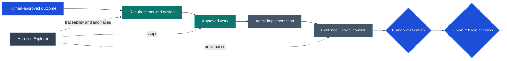
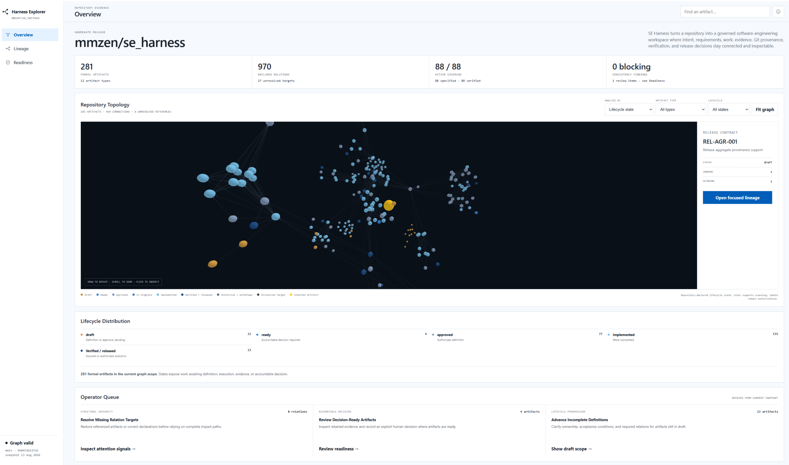
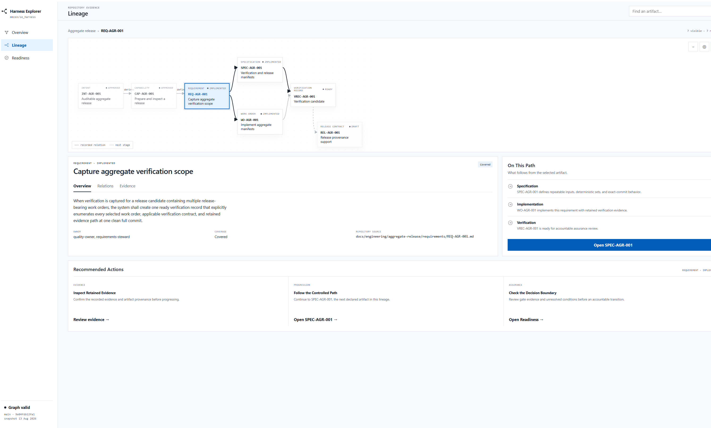
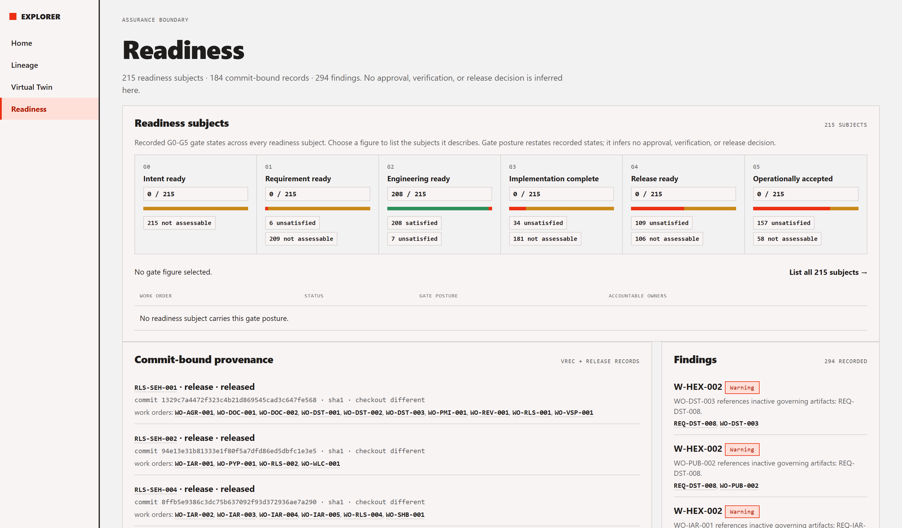

# SE Harness

<!-- Target expertise: 6/10. This score describes the knowledge expected from the reader, not the document's complexity or quality. -->

SE Harness turns a new or existing repository into a governed software-engineering workspace for humans and coding agents. It keeps intent, requirements, design, authorized work, evidence, exact Git provenance, verification, and release decisions connected and inspectable beside the code.

The practical promise is simple: every material change can explain **why it exists, what was approved, what changed, how it was checked, which exact commit was assessed, and who made the verification and release decisions**. Automation assists; accountable humans retain authority.

SE Harness requires Python 3.11 or later, uses no runtime dependency outside the standard library, and installs repository-local validation and Harness Explorer tooling without requiring an external service.

[PyPI](https://pypi.org/project/se-harness/) | [Repository](https://github.com/mmzen/se_harness) | [Issues](https://github.com/mmzen/se_harness/issues) | [Releases](https://github.com/mmzen/se_harness/releases)

## Who it is for

<!-- Target expertise: 5/10. -->

SE Harness is for teams where explaining why a change should be trusted matters as much as producing it:

- teams adopting coding agents, where review and accountability—not code production—are becoming the bottleneck;
- teams working on audited, safety-sensitive, security-sensitive, or high-impact systems that need durable traceability and evidence;
- organizations seeking consistent engineering governance across repositories while preserving local policies;
- maintainers of long-lived projects, including small teams and solo developers, where the future reviewer may be you in eighteen months.

It is less suitable for throwaway code or rapid experiments whose purpose is to discover the requirements, unless the associated risk justifies the additional discipline.

Its strongest assurance comes from genuine role separation: implementation, verification, and release are decided by different accountable people. A solo owner still gains explicit intent, bounded scope, retained evidence, and durable history—but not independent assurance.

SE Harness structures evidence and decisions; it does not by itself certify regulatory compliance.

## Install or upgrade

SE Harness requires Python 3.11 or later. Install the released package in a dedicated virtual environment:

```powershell
python -m venv .venv
# Activate the environment using the command for your platform.
python -m pip install --upgrade pip
python -m pip install se-harness
harnessctl --version
```

For a reproducible installation, select the exact release:

```powershell
python -m pip install "se-harness==0.3.0"
```

Updating the package does **not** update harness-managed content already installed in a repository. Existing installations use a separate read-only plan followed by an explicitly authorized transactional apply. See [installation and safe upgrades](docs/notes/harness-installation-and-upgrades.md) for Windows, Linux, and macOS activation, launcher paths, and the complete upgrade procedure.

## Start using it

Choose `init` for an absent or empty repository, or `adopt` for an existing repository:

```powershell
harnessctl init C:\path\to\new-repository --project-name my-project
harnessctl adopt C:\path\to\existing-repository --project-name my-project
```

Then inspect the installed harness and its engineering information:

```powershell
harnessctl doctor C:\path\to\repository
harnessctl validate C:\path\to\repository
harnessctl inspect C:\path\to\repository
harnessctl dashboard C:\path\to\repository
```

`doctor` checks installed-harness integrity. `validate` checks the formal artifact graph. `inspect` summarizes current lifecycle attention, existing consistency findings, and bounded non-authoritative next-step suggestions in the terminal without acting as a gate. `dashboard` generates the read-only Harness Explorer at `target/harness-dashboard/index.html`.

Adoption preserves ordinary repository files and records bounded observations in `docs/engineering/ADOPTION_REPORT.md`; it does not invent or approve product intent. After either path, accountable owners curate `docs/engineering/REPOSITORY_CONTEXT.md` and approve the first formal engineering chain.

## What this looks like in practice

Suppose you ask your coding agent:

> Add per-customer API rate limiting. Preserve existing clients, return `429` with `Retry-After`, and prepare the engineering material for review before implementation.

The agent drafts the requirements, design and verification approach, identifies significant decisions, and proposes a bounded work order. It waits for approval before changing code.

> Approved. Implement the work order.

The agent checks the approved scope, implements only that scope, performs repository checks, retains evidence, and prepares material tied to the exact candidate commit. An assurance owner judges the evidence; a release owner makes a later, separate decision.



When Mermaid is not rendered, the labels, decision shapes, dotted Explorer observations, and surrounding prose preserve the same authority and provenance story. Color is supplementary.

### Harness Explorer in action

The generated dashboard makes the repository's connected engineering evidence practical to review:

**Overview — see the artifact graph, lifecycle distribution, and current operator queue.**



**Lineage — follow a focused path from intent through definition, authorized work, and verification.**



**Readiness — inspect the current assurance boundary and the evidence behind the next human decision.**



These are derived, read-only views: they expose traceability, evidence, and anomalies without approving work, verifying a commit, or authorizing a release.

## What you get

- repository-native intent, requirements, specification, architecture, ADR, verification, work, evidence, and release lineage;
- one managed instruction route for coding agents, with room for stricter repository-owned guidance;
- deterministic integrity, preflight, graph-validation, CI, and provenance controls;
- retained evidence and verification/release records bound to a clean exact candidate commit;
- safe adoption and hash-based upgrades that preserve repository customization;
- terminal inspection and Harness Explorer views answering: why work exists, whether its definition is connected, where anomalies exist, which revision is covered, and what readiness observations are available.

The dashboard is derived evidence. It never approves work, verifies a commit, or releases software.

## Who does what

| Participant | Responsibility |
| --- | --- |
| Human owners | Approve intent and scope; decide significant architecture; judge evidence; authorize verification, release, publication, deployment, and operation. |
| Coding agent | Draft artifacts; run preflight; implement approved work; execute repository checks; retain evidence; prepare ready verification and release records. |
| Repository policy and hosting controls | Define commands, Git strategy, required checks, permissions, deployment, and operating constraints under accountable ownership. |

Harness commands may prepare observations or `ready` proposals. They never commit, push, approve, verify, release, tag, publish, or deploy on their own.

## Known limitations

- Managed `QUALITY_GATES.md` and Harness Explorer currently reuse G0-G5 for different groupings. Managed policy owns gate meaning; Explorer remains a navigation and anomaly view.
- Typed architecture policy says routine requirements must not receive fabricated architecture coverage, while the validator still requires a non-empty work-order `architecture` relation. For a purely routine change, stop and seek a governed decision rather than inventing an artifact.

These are documented product tensions, not corrections made by documentation. The [conceptual model](docs/notes/harness-uml-model.md) and [operational phasing](docs/notes/harness-operational-phasing.md) provide context.

## Learn more

Start with the [overview](docs/notes/harness-overview.md), then use the [learning-notes index](docs/notes/README.md) for the conceptual model, operational timing, illustrative Git mapping, practical examples, safe upgrades, and complete command reference.

The notes explain the system; they grant no authority. In an installed repository, `ENGINEERING_HARNESS.md` routes to the authoritative managed workflow, decision rights, quality gates, and traceability policy. Repository facts and product artifacts remain owner-controlled.

## Developing SE Harness

The PyPI path above is for released use. A source checkout is candidate development evidence, not an independently released governor. Contributors should read [Developing and self-hosting SE Harness](docs/notes/developing-se-harness.md) for source setup, tests, repository structure, the three assurance planes, and release boundaries.
