# SE Harness

SE Harness turns a repository into a governed software-engineering workspace for humans and coding agents. It installs one complete, repository-native system for intent, requirements, architecture, authorized work, verification evidence, commit provenance, release decisions, validation, and visualization.

The objective is practical: make every material change explainable from intent to evidence and an exact Git commit, while keeping approval and release authority with accountable humans.

SE Harness is specification-driven, supports Python 3.11 or later, and gives each installed repository local validation and dashboard scripts that do not require an external service.

[PyPI](https://pypi.org/project/se-harness/) | [Repository](https://github.com/mmzen/se_harness) | [Issues](https://github.com/mmzen/se_harness/issues) | [Releases](https://github.com/mmzen/se_harness/releases)

## Install from PyPI

SE Harness requires Python 3.11 or later. Install the released package in a dedicated virtual environment so the interpreter, package, and `harnessctl` launcher have one explicit owner.

### Windows PowerShell

```powershell
python -m venv .venv
.\.venv\Scripts\Activate.ps1
python -m pip install --upgrade pip
python -m pip install se-harness
harnessctl --version
```

For a reproducible installation, select the exact released version:

```powershell
python -m pip install "se-harness==0.2.2"
```

The launcher is stored at `.venv\Scripts\harnessctl.exe`. Activation adds that directory to command discovery for the current shell; it does not move or duplicate the launcher. Without activation, invoke it directly:

```powershell
.\.venv\Scripts\harnessctl.exe --version
```

### Linux and macOS

```bash
python -m venv .venv
source .venv/bin/activate
python -m pip install --upgrade pip
python -m pip install se-harness
harnessctl --version
```

The launcher is `.venv/bin/harnessctl` and can be invoked directly without activation:

```bash
.venv/bin/harnessctl --version
```

On every platform, commands can alternatively be scoped to the selected interpreter:

```powershell
python -m se_harness --version
```

## Quick start

Initialize an absent or empty repository, or safely adopt an existing one:

```powershell
harnessctl init C:\path\to\new-repository --project-name my-project
harnessctl adopt C:\path\to\existing-repository --project-name my-project
```

Then inspect the installed harness and generate its local Explorer:

```powershell
harnessctl doctor C:\path\to\repository
harnessctl dashboard C:\path\to\repository
```

Adoption preserves ordinary repository files and writes `docs/engineering/ADOPTION_REPORT.md`. That report contains bounded observations, not approved intent, requirements, architecture, or release authority.

After either command, curate `docs/engineering/REPOSITORY_CONTEXT.md`. Installation does not approve product facts or work: accountable humans must confirm the context and author and approve the first formal engineering chain.

Create a product domain and let the coding agent place new drafts consistently:

```powershell
harnessctl scaffold-domain C:\path\to\repository --domain simulation --title "Simulation"
harnessctl create-artifact C:\path\to\repository --domain simulation --type requirement --id REQ-MOK-001
```

The second command creates an incomplete `draft` at `docs/engineering/simulation/requirements/REQ-MOK-001.md`; it does not invent owners, relations, approval, or product authority. Existing valid flat layouts remain usable and receive nonblocking canonical-path guidance rather than automatic migration.

## What this looks like in practice

Suppose you ask your coding agent:

> Add per-customer API rate limiting. Preserve existing clients, return `429` with `Retry-After`, and prepare everything I need to review before implementation.

The agent translates that outcome into requirements, design constraints, verification criteria, and a proposed bounded work order. It exposes missing decisions and waits for you to approve the scope before changing code.

> Approved. Implement the work order.

The agent runs preflight, implements only the approved scope, executes the repository checks, retains evidence, commits a clean candidate, and prepares a verification record tied to that exact commit.

> I reviewed the evidence and accept the change. Prepare the pull request.

After your human assurance review, the agent records the decision in a separate governance commit and opens the pull request. Pull-request CI checks its declared work order and engineering chain. Release remains a separate human decision.

The coding agent normally runs `doctor`, `preflight`, `validate`, `dashboard`, and `capture-verification` behind the scenes. You retain authority over intent, scope, assurance, and release.

The representative engineering graph makes those boundaries visible:

```mermaid
flowchart LR
    USER["Your approved outcome"] --> INT["Intent"]
    INT --> CAP["Capability"]
    CAP --> REQ["Requirement"]

    REQ --> SPEC["Specification"]
    REQ --> ARCH["Architecture"]
    REQ --> ADR{"Architecture decision"}
    REQ --> VER["Verification contract"]

    SPEC --> WO["Approved work order"]
    ARCH --> WO
    ADR --> WO
    VER --> WO

    WO --> CHANGE["Agent implementation"]
    CHANGE --> EVIDENCE["Tests and evidence"]
    EVIDENCE --> COMMIT["Exact candidate commit"]

    WO --> READY["Ready verification record"]
    VER --> READY
    EVIDENCE --> READY
    COMMIT --> READY

    READY --> ASSURANCE{"Human assurance decision"}
    ASSURANCE --> VREC["Verified record"]
    VREC --> RELEASE{"Human release decision"}
    RELEASE --> RLS["Released revision"]

    EXPLORER["Harness Explorer"] -. "traceability and anomalies" .-> REQ
    EXPLORER -. "scope and evidence" .-> WO
    EXPLORER -. "commit provenance" .-> VREC

    classDef human fill:#1D4ED8,stroke:#93C5FD,color:#FFFFFF,stroke-width:2px
    classDef intent fill:#6D28D9,stroke:#C4B5FD,color:#FFFFFF
    classDef design fill:#0F766E,stroke:#5EEAD4,color:#FFFFFF
    classDef work fill:#B45309,stroke:#FCD34D,color:#FFFFFF
    classDef execution fill:#475569,stroke:#CBD5E1,color:#FFFFFF
    classDef evidence fill:#15803D,stroke:#86EFAC,color:#FFFFFF
    classDef provenance fill:#4338CA,stroke:#A5B4FC,color:#FFFFFF
    classDef verified fill:#047857,stroke:#6EE7B7,color:#FFFFFF
    classDef release fill:#BE185D,stroke:#F9A8D4,color:#FFFFFF
    classDef explorer fill:#334155,stroke:#E2E8F0,color:#FFFFFF

    class USER,ASSURANCE,RELEASE human
    class INT,CAP,REQ intent
    class SPEC,ARCH,ADR design
    class WO work
    class CHANGE execution
    class VER,EVIDENCE evidence
    class COMMIT,READY provenance
    class VREC verified
    class RLS release
    class EXPLORER explorer
```



When Mermaid is not rendered, the labels, shapes, and prose still describe the same authority and provenance chain. The diagram is explanatory; the repository's validated formal artifacts remain authoritative.

The result is more than code that passes tests: every material change has an approved purpose, controlled scope, retained evidence, exact commit provenance, visible anomalies, and a separately authorized path to release.

## What it provides

Every installation receives the same standard harness:

- formal Markdown artifacts for intent, capabilities, requirements, specifications, architecture, decisions, verification, work orders, releases, and operations;
- one canonical managed route from `AGENTS.md` through `ENGINEERING_HARNESS.md`, with a thin `CLAUDE.md` adapter and room for repository-owned instructions;
- an explicit work-order lifecycle of `approved -> in_progress -> implemented`, separate from commit-bound verification and release decisions;
- deterministic validation and Harness Explorer views for traceability, readiness, findings, and anomalies;
- aggregate VREC and RLS provenance binding exact work, evidence, and a clean candidate commit;
- explicit retention of abandoned ready verification records as `superseded` through accountable decisions;
- safe adoption and hash-based upgrades that preserve repository customizations;
- a GitHub Actions workflow separating the exact configured released baseline from candidate behavior and binding pull requests to one explicit work order;
- protected OIDC publication that promotes exact GitHub release assets to PyPI without rebuilding them and retains PyPI attestations.

There is exactly one standard installation. Minimal, offline, and selectable installation profiles are deliberately unsupported.

## Agent instructions and repository context

`AGENTS.md` is the universal repository entry. The harness owns only its short bounded `se-harness` gate; repositories own all content outside that block and may add nested `AGENTS.md` or `AGENTS.override.md` files for component-specific rules. The managed gate points only to `ENGINEERING_HARNESS.md`, which is the single fully managed contract and stage-aware router.

`CLAUDE.md` is a thin compatibility adapter containing `@AGENTS.md` inside the same kind of bounded block. Repository-specific Claude Code instructions may be kept outside the block. This avoids maintaining a second copy of shared rules.

`docs/engineering/REPOSITORY_CONTEXT.md` is seeded once and immediately becomes repository-owned. Confirm the exact setup, build, test, lint, entry points, generated paths, sensitive paths, and specialized review constraints there. It informs execution but cannot replace approved intent, requirements, architecture decisions, or a work order.

`docs/engineering/README.md` is also an owner-owned seed. Use it only to index local artifact domains and repository-specific engineering documentation. Managed workflow, decision rights, quality gates, and traceability remain focused files linked directly by `ENGINEERING_HARNESS.md`.

During upgrade, shared managed fragments are hash-checked; customized content is preserved. Repository-owned seeds are neither content-hashed nor overwritten. If a required seed is intentionally removed, upgrade does not silently recreate it, while `doctor` reports the missing file for explicit resolution.

## Five-minute operating workflow

1. Run `init` for a new repository or `adopt` for an existing one.
2. Author the intent, capability, requirements, specifications, architecture, decisions, verification contract, and work order in `docs/engineering/`.
3. Obtain explicit human approval for the governing artifacts and work order.
4. Run `harnessctl preflight . --work-order WO-...` and read its complete manifest.
5. Implement only the approved work order and retain evidence keyed to its ID.
6. Run the required tests and checks, then commit the clean candidate source and evidence.
7. Prepare a commit-bound verification record, obtain human assurance review, and retain the record in a later governance commit.
8. If release is separately authorized, prepare a release record for the same candidate commit. Tagging, release transition, pushing, and publication remain separate human-controlled actions.

Typical operating commands:

```powershell
harnessctl doctor C:\path\to\repository
harnessctl preflight C:\path\to\repository --work-order WO-001
harnessctl preflight C:\path\to\repository --work-order WO-001 --phase review
harnessctl validate C:\path\to\repository
harnessctl dashboard C:\path\to\repository
```

Start preflight accepts `approved` or `in_progress` work. Review preflight additionally accepts `implemented`, `verified`, or `released` so pull-request checks do not require dishonest lifecycle status. Preflight checks installed integrity, named context fields, the formal graph, and the selected complete chain, then reports exact files and repository commands without executing or modifying them.

Harness Explorer is generated at:

```text
target/harness-dashboard/index.html
```

## Engineering artifact model

The formal graph separates reusable engineering policy from individual verification and release decisions:

```text
INT -> CAP -> REQ
               |-> SPEC
               |-> ARCH <- ADR
               |-> VER
               `-> WO

WO + VER + evidence + candidate commit C -> VREC
REL gates WO
RLS includes VREC and releases WO at the same commit C
OPS assures REL
```

| Artifact | ID prefix | Purpose |
| --- | --- | --- |
| Intent | `INT-` | Defines the approved outcome and problem. |
| Capability | `CAP-` | Describes what stakeholders must be able to do. |
| Requirement | `REQ-` | States verifiable system obligations. |
| Specification | `SPEC-` | Defines behavior and implementation contracts. |
| Architecture | `ARCH-` | Constrains structure and technical boundaries. |
| Architecture decision | `ADR-` | Records an accountable architectural decision. |
| Verification contract | `VER-` | Defines how requirements must be verified. |
| Work order | `WO-` | Authorizes a bounded implementation. |
| Verification record | `VREC-` | Binds work, evidence, and verification policy to an exact clean commit. |
| Release contract | `REL-` | Defines reusable release conditions. |
| Release record | `RLS-` | Records one release decision for the verified candidate commit. |
| Operating contract | `OPS-` | Defines operational assurance expectations. |

Source files and tests are not automatically formal artifact nodes. A work order authorizes their change, retained evidence demonstrates the checks performed, and a verification record binds that evidence to the exact candidate commit.

## What Harness Explorer answers

Harness Explorer is a derived, read-only view. It never approves work or releases. It is designed to answer five practical questions:

1. **Why does this work exist?** Trace a work order or requirement back through capability to approved intent.
2. **Is the engineering chain complete?** Identify active requirements without specification or verification coverage and relations with missing or incorrect targets.
3. **Where are the inconsistencies or anomalies?** Surface validation errors, missing work-order evidence, lifecycle inconsistencies, potentially stale ready verification records, unsafe evidence paths, duplicate release versions, commit mismatches, and unavailable commits.
4. **What exact revision was verified or released?** Show declared candidate commits, related evidence and work orders, local commit availability, and comparison with the observed checkout.
5. **How ready is the work?** Show gates G0 through G5 as `satisfied`, `unsatisfied`, or `not_assessable` from intent readiness through operational acceptance.

The readiness gates are:

- G0: Intent ready
- G1: Requirement ready
- G2: Engineering ready
- G3: Implementation complete
- G4: Release ready
- G5: Operationally accepted

Missing human judgment or external evidence remains `not_assessable`; it is never silently converted into success.

## Commit-bound verification and release lineage

The authoritative lineage is:

```text
Intent -> Capability -> Requirement -> Work order(s)
       -> Aggregate verification record at final candidate commit C
       -> Aggregate release record for the same candidate commit C
       -> Operating assurance
```

First commit the completed candidate source and retained evidence. The worktree must be clean. Then prepare a verification record:

```powershell
harnessctl capture-verification C:\path\to\repository `
  --id VREC-001 `
  --work-order WO-001 `
  --verification VER-001 `
  --evidence docs/engineering/DOMAIN/evidence/WO-001-verification.md
```

The command derives the full SHA-1 or SHA-256 `HEAD`, checks the graph and evidence path, captures the dashboard snapshot hash, and writes only a `ready` `VREC-*`. When every selected work order belongs to one domain, the record defaults to that domain's `verification-records/`; cross-domain or ambiguous work uses the repository-wide aggregate directory. `--domain` selects an explicit safe domain and `--output` has highest placement precedence. None of these paths grants authority. The command does not approve, commit, tag, release, push, or publish.

For a final candidate containing multiple release-bearing work orders, repeat the scope options. The selected verification contracts must equal the union declared by the work orders, and evidence must be retained for each work order:

```powershell
harnessctl capture-verification C:\path\to\repository `
  --id VREC-SEH-001 `
  --work-order WO-DST-001 `
  --work-order WO-REV-001 `
  --verification VER-DST-001 `
  --verification VER-REV-001 `
  --evidence docs/engineering/distribution/evidence/WO-DST-001-verification.md `
  --evidence docs/engineering/provenance/evidence/WO-REV-001-verification.md
```

An accountable human reviews the evidence and decides whether to transition the record to `verified`. The record is retained in a later governance commit because a file cannot contain the hash of the commit that contains itself.

If a later verified or released VREC fully covers the work of an older `ready` VREC, an accountable assurance owner may retire the older attempt as `superseded`. The governance edit must preserve its captured candidate and evidence metadata, record `superseded_at` and `supersession_authorized_by`, and add exactly one typed `superseded_by` relation. The successor must be distinct, already verified or released, and cover every work order from the old record. Superseded records remain visible history but cannot qualify release preparation. Harness Explorer may flag possible stale-ready records, but that derived warning never chooses or applies a successor.

After verification and separate release authorization, prepare a release record:

```powershell
harnessctl prepare-release C:\path\to\repository `
  --id RLS-001 `
  --release-contract REL-001 `
  --verification-record VREC-001 `
  --work-order WO-001 `
  --version 1.0.0 `
  --authorized-by release-owner
```

The resulting `ready` `RLS-*` copies candidate commit C from the verification record. It follows the same domain, aggregate-root, explicit `--domain`, and highest-precedence `--output` placement rules. It does not point to the later governance commit and does not create or verify a Git tag.

An aggregate release repeats `--work-order` and, when needed, `--verification-record`. Its released-work set must exactly equal the union covered by the included verification records, every work order must be gated by the release contract, and all included records must name the same candidate commit:

```powershell
harnessctl prepare-release C:\path\to\repository `
  --id RLS-SEH-001 `
  --release-contract REL-SEH-001 `
  --verification-record VREC-SEH-001 `
  --work-order WO-DST-001 `
  --work-order WO-REV-001 `
  --version 1.0.0 `
  --authorized-by release-owner `
  --tag v1.0.0
```

Only release-bearing implementation work belongs in `releases_work`. Publication, approval, verification-transition, and other governance-only work orders remain auditable on the governing branch but are not automatically shipped in the wheel.

Explorer compares each declared candidate commit with the observed checkout:

- `exact`: the checkout is the declared candidate;
- `different`: the checkout has moved, commonly because a later governance commit retains the record;
- `not_assessable`: the checkout or declared revision cannot be evaluated locally.

A `different` state is review information, not automatic proof of failure. Commit consistency between verified and released records remains a blocking invariant.

## Command reference

| Command | Behavior |
| --- | --- |
| `init` | Installs the standard harness into an absent or empty repository. |
| `adopt` | Installs into an existing repository and generates a non-authoritative adoption report. |
| `validate` | Validates the formal artifact graph and preserves the validator exit status. |
| `dashboard` | Generates the deterministic Harness Explorer and preserves generator status. |
| `doctor` | Checks runtime compatibility, configuration, lock integrity, required files, and managed-file drift. |
| `preflight` | Performs read-only start or review readiness checks for one explicit work order and prints its governing manifest. |
| `upgrade` | Plans a managed-file upgrade without writing by default. |
| `upgrade --apply` | Transactionally applies additions, integrations, safe ownership migrations, and updates only when no customization or conflict exists. |
| `scaffold-domain` | Safely creates the canonical type directories and an absent repository-owned domain index; supports `--dry-run`. |
| `create-artifact` | Exclusively creates one incomplete `draft` from the canonical template and type mapping; supports `--dry-run`. |
| `capture-verification` | Prepares a `ready` single or aggregate verification record at one final candidate commit, defaulting single-domain work to that domain. |
| `prepare-release` | Prepares a `ready` single or aggregate release record using that same candidate commit and domain-aware placement. |

Use `harnessctl <command> --help` for all arguments.

## Safety and authority boundaries

- Installation resolves and plans every destination before writing.
- Ordinary destination conflicts stop initialization or adoption without known partial writes.
- Existing `AGENTS.md`, `CLAUDE.md`, and `.gitignore` receive bounded managed blocks rather than wholesale replacement.
- Repository context is seeded only when absent and then remains repository-owned.
- `.engineering-harness.lock` records explicit schema-2 canonical UTF-8 text hashes and management modes for tool-owned content.
- Upgrade changes only missing or unmodified managed content; any customization or conflict blocks the entire apply so the repository and lock remain unchanged.
- Symlink traversal, repository escape, unsafe evidence paths, absent Git `HEAD`, dirty verification state, duplicate output, and inconsistent provenance fail closed.
- Adoption inventories observable repository signals but never manufactures approved product authority.
- Automation may prepare `ready` records but never grants verification or release authority.
- The harness does not create commits, tags, pushes, releases, deployments, or publications.
- The harness structures engineering evidence but does not itself declare regulatory compliance.

## Installed repository layout

```text
.engineering-harness.toml            harness configuration and schema
.engineering-harness.lock            managed-content hashes and modes
AGENTS.md                             bounded agent operating contract
CLAUDE.md                             thin import of the shared AGENTS contract
ENGINEERING_HARNESS.md                repository engineering entry point
.github/
  PULL_REQUEST_TEMPLATE.md             owner-editable structured work-order declaration
.github/workflows/
  engineering-harness.yml            released-baseline and candidate CI checks
docs/engineering/
  README.md                            repository-owned artifact-domain index
  REPOSITORY_CONTEXT.md               repository-owned commands and constraints
  DECISION_RIGHTS.md                  human and automation authority
  QUALITY_GATES.md                    G0-G5 gate definitions
  TRACEABILITY.md                     relation and evidence model
  WORKFLOW.md                         operating sequence
  templates/                          formal artifact templates
  <domain>/                           repository-owned product/governance domain
    intent/ capabilities/ requirements/
    specifications/ architecture/adr/ verification/
    work-orders/ evidence/ verification-records/
    release/ releases/ operations/ acceptance/
scripts/
  artifact_layout_registry.py        portable canonical-layout registry
  validate_engineering_artifacts.py   deterministic validator
  generate_harness_dashboard.py      deterministic Explorer generator
  select_harness_work_order.py       strict GitHub event field parser
  harness_explorer/                   self-contained Explorer view
target/harness-dashboard/             generated read-only dashboard
```

Target repositories own their product artifacts and customizations after installation. The distribution repository supplies versioned managed content; it does not become authoritative for target product intent.

## Safe upgrades

Updating the Python package and updating an initialized or adopted repository are separate operations. Upgrading the Python package does not modify an initialized or adopted repository; it only changes the CLI and canonical distribution available inside the selected environment.

Use this sequence:

```powershell
python -m pip install --upgrade se-harness
harnessctl upgrade C:\path\to\repository
harnessctl upgrade C:\path\to\repository --apply
harnessctl doctor C:\path\to\repository
```

The first `harnessctl upgrade` is a read-only plan. `--apply` is an explicit transactional repository mutation and stops without partial writes when managed content is customized, missing, conflicting, or ambiguous. `doctor` then checks the resulting installed integrity.

Schema-2 locks use SHA-256 over `utf8-text-lf-v1`, so LF, CRLF, and CR checkout representations compare equally while every other content distinction remains significant. Schema-1 raw-byte locks remain readable and migrate only when an exact legacy match or canonical equality to the rendered desired template proves the operation safe. A managed file may become an owner seed only when its old bytes still match the prior lock.

## Release integrity

The [PyPI project](https://pypi.org/project/se-harness/) is the normal released installation source. Corresponding immutable artifacts and checksum manifests are retained under [GitHub Releases](https://github.com/mmzen/se_harness/releases).

Production publication is a separate release-owner decision. The protected OIDC workflow selects one final GitHub release, verifies the exact wheel and source-distribution hashes, and promotes those files to PyPI without rebuilding them or storing a long-lived PyPI credential. PyPI attestations connect each published file to the repository, workflow, and protected environment. Availability on either service remains distribution evidence, not approval of a target repository's product artifacts.

The metadata of an existing PyPI version is immutable. README and project-metadata improvements become visible on PyPI only in a later separately verified release.

## Pull-request enforcement and bootstrap

The installed pull-request template declares exactly one standalone `Harness-Work-Order: WO-...` field. CI parses it as untrusted data, rejects zero, multiple, malformed, or injection-shaped values, and runs review preflight. Reviewers still decide whether the diff semantically stays within that work order.

The required workflow has two assurance lanes:

- the independent lane installs the exact configured released baseline with its retained SHA-256 and runs the validator packaged by that release; `.github/workflows/engineering-harness.yml` is the observation of the current pin;
- the candidate lane exercises the declared harness version, strict work-order selection, review preflight, current validator, and Harness Explorer.

The harness repository necessarily has a one-release bootstrap lag: unreleased checker behavior is candidate verification, not independent proof. After publication, a separate governed pin update promotes that behavior into the external baseline. Required status checks, CODEOWNERS review, and branch protection remain accountable repository-host settings; installation does not claim to configure them automatically.

Install or adopt target repositories from an actual released distribution. A source checkout can exercise the candidate lane for harness development, but an unreleased version is intentionally not treated as an externally available target-repository checker.

## Distribution development

The PyPI path above is for released use. A source checkout is an unreleased development input and is not independently released proof. From a trusted checkout, install locally with:

```powershell
python -m pip install .
```

For editable development:

```powershell
python -m pip install -e .
```

Repository structure:

```text
se_harness/                              CLI and safe installation control plane
templates/repository/standard/           canonical standard installation
scripts/                                 self-validation and Explorer generation
tests/                                   deterministic installer and provenance tests
docs/engineering/harness-distribution/   distribution governance and evidence
docs/engineering/revision-provenance/    commit-lineage governance and evidence
```

Run the development checks from this repository:

```powershell
python scripts/validate_engineering_artifacts.py --root .
python -m unittest discover -s tests -p "test_*.py"
python -m se_harness --help
```

The validator, Explorer generator, and view at the repository root are byte-identical to their canonical managed-template copies. This allows the distribution repository to validate and visualize itself using the same machinery installed elsewhere. Development checks do not substitute for the verified release and publication sequence.
