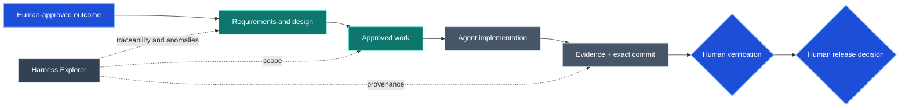

# SE Harness

<!-- Target expertise: 6/10. This score describes the knowledge expected from the reader, not the document's complexity or quality. -->

SE Harness turns a new or existing repository into a governed software-engineering workspace for humans and coding agents. It keeps intent, requirements, design, authorized work, evidence, exact Git provenance, verification, and release decisions connected and inspectable beside the code.

The practical promise is simple: every material change can explain **why it exists, what was approved, what changed, how it was checked, which exact commit was assessed, and who made the verification and release decisions**. Automation assists; accountable humans retain authority.

SE Harness requires Python 3.11 or later, uses no runtime dependency outside the standard library, and installs repository-local validation and Harness Explorer tooling without requiring an external service.

[Live Explorer demonstration](https://mmzen.github.io/se_harness/) | [PyPI](https://pypi.org/project/se-harness/) | [Repository](https://github.com/mmzen/se_harness) | [Issues](https://github.com/mmzen/se_harness/issues) | [Releases](https://github.com/mmzen/se_harness/releases)

## Who it is for

<!-- Target expertise: 5/10. -->

SE Harness is for teams where explaining why a change should be trusted matters as much as producing it:

- teams adopting coding agents, where review and accountability—not code production—are becoming the bottleneck;
- teams working on audited, safety-sensitive, security-sensitive, or high-impact systems that need durable traceability and evidence;
- organizations seeking consistent engineering governance across repositories while preserving local policies;
- maintainers of long-lived projects, including small teams and solo developers, where the future reviewer may be you in eighteen months.

It is less suitable for throwaway code or rapid experiments whose purpose is to discover the requirements, unless the associated risk justifies the additional discipline.

Its strongest assurance comes from genuine role separation: implementation, verification, and release are decided by different accountable people. A solo owner still gains explicit intent, bounded scope, retained evidence, and durable history—but not independent assurance.

SE Harness structures evidence and decisions; it does not by itself certify regulatory compliance.

## Install or upgrade

SE Harness requires Python 3.11 or later. Install the released package in a dedicated virtual environment:

```powershell
python -m venv .venv
# Activate the environment using the command for your platform.
python -m pip install --upgrade pip
python -m pip install se-harness
harnessctl --version
```

For a reproducible installation, select the exact release:

```powershell
python -m pip install "se-harness==0.7.0"
```

Updating the package does **not** update harness-managed content already installed in a repository. Existing installations use a separate read-only plan followed by an explicitly authorized transactional apply. Installed-root mutations must run from an external released-evaluator environment matching the repository lock; candidate source and ambiguous or contaminated installs fail before writing. See [installation and safe upgrades](docs/notes/harness-installation-and-upgrades.md) for Windows, Linux, and macOS activation, launcher paths, exact-wheel upgrades, and the complete procedure.

### Test an unreleased commit

Successful candidate CI retains short-lived integration packages for exact
`main` and pull-request commits. These wheels have unique commit-addressed
versions, verified checksums, and Linux/Windows installation evidence. They are
non-promotable test inputs—not releases or governing evaluators. See
[testing a current commit with an integration package](docs/notes/integration-packages.md)
for safe download, verification, isolated installation, disposable testing,
expiration, and cleanup.

## Start using it

Choose `init` for an absent or empty repository, or `adopt` for an existing repository:

```powershell
harnessctl init C:\path\to\new-repository --project-name my-project
harnessctl adopt C:\path\to\existing-repository --project-name my-project
```

Then inspect the installed harness and its engineering information:

```powershell
harnessctl doctor C:\path\to\repository
harnessctl validate C:\path\to\repository
harnessctl focus C:\path\to\repository --artifact WO-...
harnessctl check C:\path\to\repository --artifact WO-... --checkpoint start
harnessctl transition C:\path\to\repository --set VREC-...=verified --decision VREC-...=assurance-owner
harnessctl inspect C:\path\to\repository
harnessctl dashboard C:\path\to\repository
```

`doctor` checks installed-harness integrity. `validate` checks the formal artifact graph. `focus` projects one selected WO, VREC, or RLS scope. `check` evaluates the selected scope, typed procedure, and executable gates and returns one concise canonical next step. `transition` plans explicit lifecycle changes by default; add `--apply` only after the accountable decision. `inspect` is explicitly repository-wide, summarizes current lifecycle attention, and never serves as selected restitution. `dashboard` generates the read-only Harness Explorer in `target/harness-dashboard/`. Serve that directory over HTTP—for example, `python -m http.server 8000 --directory target/harness-dashboard`—and open `http://localhost:8000/`; the progressive bundle intentionally does not run from `file://`.

From the first release containing this Phase 4 surface, a standard repository installation includes `harness-orient` at `.agents/skills/harness-orient/` for [read-only agent orientation](docs/notes/harness-orient.md) without changing the repository, plus the explicit-only `harness-draft-change`, `harness-execute-work-order`, and `harness-prepare-assurance` skills. Codex discovers those canonical cores directly. Claude Code discovers same-named thin adapters under `.claude/skills/`, then loads the canonical `.agents` core. The adapters do not copy the workflow or grant tools, permissions, or engineering authority. The writing skills complement `harnessctl` as non-authoritative [Phase 4 evaluator clients](docs/notes/agentic-execution-phase4-skills.md): they require the exact workflow-v4 capability, prohibit direct governed-target writes, apply the installed artifact-authoring policy when drafting, and stop before Git, assurance, credentials, network, delivery, release, or external action. A released evaluator without that capability causes a zero-effect stop. See also the retained [Phase 3 MVP contract](docs/notes/agentic-execution-skills-mvp.md) and [repository host adapters](docs/notes/agentic-execution-host-adapters.md).

Adoption preserves ordinary repository files and records bounded observations in `docs/engineering/ADOPTION_REPORT.md`; it does not invent or approve product intent. After either path, accountable owners record their build, test, verification, ownership, and boundary facts in the owner-controlled region of `AGENTS.md` and approve the first formal engineering chain. The harness does not scaffold, track, or gate that region.

On GitHub, installation adds one dedicated managed `.github/workflows/engineering-harness.yml` beside any existing workflows. GitHub discovers and runs each workflow independently; repository owners separately decide whether the stable SE Harness check is required by branch protection or a ruleset.

## What this looks like in practice

Suppose you ask your coding agent:

> Add per-customer API rate limiting. Preserve existing clients, return `429` with `Retry-After`, and prepare the engineering material for review before implementation.

The agent drafts the requirements, design and verification approach, identifies significant decisions, and proposes a bounded work order. It waits for approval before changing code.

> **Completed:** drafted the rate-limit packet and bounded `WO-RATE-001`.
>
> **Current lifecycle state:** the packet is `draft`; implementation is not authorized.
>
> **Recommended next step:** review the packet and approve it or request revisions.
>
> **Human decision or approval required:** the named product, technical, assurance, and engineering owners decide the artifacts they own.
>
> **Command or suggested response:** `Approve WO-RATE-001 and its governing artifacts for implementation.`

> Approved. Implement the work order.

The work order declares exact files and component-prefix paths. The agent implements only that scope in an isolated proposal workspace; the exact released evaluator builds and applies the admitted change bundle, performs the delegated lifecycle operations, retains evidence and receipts, and stops before Git. After a separately authorized exact candidate commit, assurance material binds that commit and returns the canonical restitution block without unrelated findings.
An assurance owner judges the evidence; a release owner makes a later, separate
decision.

If a required check failed, the handoff would identify the diagnostic and safe retry, report `WO-RATE-001` as still `in_progress`, and say the formal state is unchanged. It would recommend remediation or escalation rather than imply completion.

After an assurance owner verifies `VREC-RATE-001`, a later handoff may include **Alternative next steps:** request authorization to open or update the pull request, or—only with separate release-preparation authority—prepare a release record. The recommendation still names one preferred path and does not perform either action.



When Mermaid is not rendered, the labels, decision shapes, dotted Explorer observations, and surrounding prose preserve the same authority and provenance story. Color is supplementary.

### Harness Explorer in action

The generated dashboard makes the repository's connected engineering evidence practical to review:

Explore the [live release-bound demonstration](https://mmzen.github.io/se_harness/) generated from the governance of SE Harness itself. It is a derived, read-only promotional view; repository artifacts and accountable human decisions remain authoritative.

**Overview — see the artifact graph, lifecycle distribution, and current operator queue.**


**Lineage — follow a focused path from intent through definition, authorized work, and verification.**


**Readiness — inspect the current assurance boundary and the evidence behind the next human decision.**


These are derived, read-only views: they expose traceability, evidence, and anomalies without approving work, verifying a commit, or authorizing a release.

## What you get

- repository-native intent, requirements, specification, architecture, ADR, verification, work, evidence, and release lineage;
- one managed instruction route for coding agents, with room for stricter repository-owned guidance;
- one portable read-only orientation skill and three explicit-only, single-agent Phase 4 evaluator-client skills that prohibit direct target writes and stop at accountable decision points;
- one machine-readable workflow contract for lifecycle transitions and canonical next actions;
- deterministic integrity, preflight, graph-validation, CI, and provenance controls;
- retained evidence and verification/release records bound to a clean exact candidate commit;
- safe adoption and hash-based upgrades that preserve repository customization;
- terminal inspection and Harness Explorer views answering: why work exists, whether its definition is connected, where anomalies exist, which revision is covered, and what readiness observations are available.

The dashboard is derived evidence. It never approves work, verifies a commit, or releases software.

## Who does what

| Participant | Responsibility |
| --- | --- |
| Human owners | Approve intent and scope; decide significant architecture; judge evidence; authorize verification, release, publication, deployment, and operation. |
| Coding agent | Draft artifacts; run preflight; implement approved work; execute repository checks; retain evidence; prepare ready verification and release records. |
| Repository policy and hosting controls | Define commands, Git strategy, required checks, permissions, deployment, and operating constraints under accountable ownership. |

Harness commands may prepare observations or `ready` proposals. They never commit, push, approve, verify, release, tag, publish, or deploy on their own.

## Known limitations

Normative gates use the exact `QG-*` IDs defined by managed
`QUALITY_GATES.md`. Harness Explorer's G0-G5 labels are derived readiness
groupings for navigation; they are not gate results and do not change selected
scope. The [operational phasing](docs/notes/harness-operational-phasing.md)
explains the distinction.

## Learn more

Start with the [overview](docs/notes/harness-overview.md), then use the [learning-notes index](docs/notes/README.md) for the conceptual model, operational timing, illustrative Git mapping, practical examples, safe upgrades, and complete command reference.

The notes explain the system; they grant no authority. In an installed repository, `ENGINEERING_HARNESS.md` routes to the authoritative managed workflow, decision rights, quality gates, and traceability policy. Repository facts and product artifacts remain owner-controlled.

## Developing SE Harness

The PyPI path above is for released use. A source checkout and integration package are candidate development evidence, not the repository's released evaluator. Contributors should read [Developing SE Harness](docs/notes/developing-se-harness.md) for source setup, tests, repository structure, evaluator/candidate evidence separation, and release boundaries.
