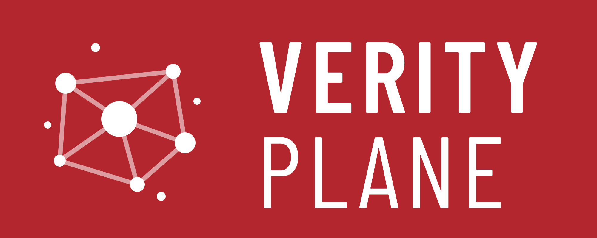
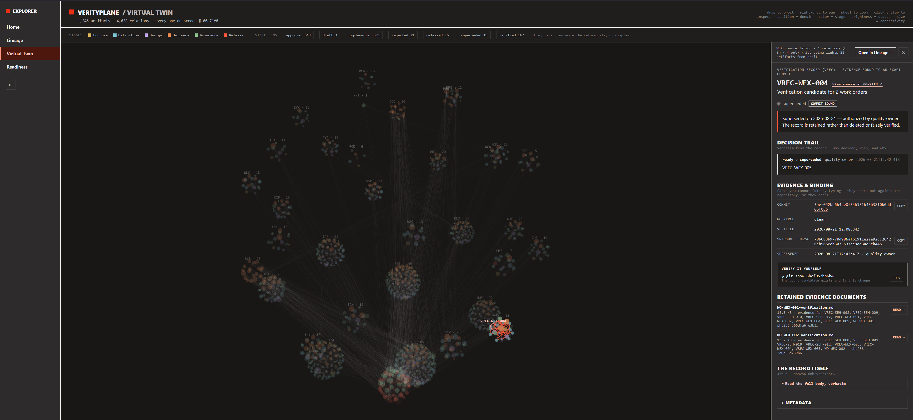

<p align="left">
  
</p>

## SE Harness / Verity Plane

<h4 align="center"><em>Delegate the work. Keep the authority.</em></h4>

Verity Plane is an **open source harness for building software with AI coding agents under governed authority**. Define what agents may change, require independent verification of their work, and keep the decision to ship in human hands.

The harness connects intent, requirements, design, code, and evidence. You can inspect why a change exists, what was authorized, and what was verified, from the decision to build to the decision to ship.

**Agents operate within bounded authority. Verification stays independent. Decisions stay human.**

[Live demo](https://mmzen.github.io/se_harness/) · [Get started](#get-started) · [Documentation](docs/notes/README.md) · [PyPI](https://pypi.org/project/se-harness/)

## How it works today

1. **Define the change.** Record the desired outcome, requirements, design, and verification approach.
2. **Approve the work.** A human approves a work order: a bounded plan for what may change.
3. **Implement and check.** An agent works within that scope and retains evidence from the required checks.
4. **Verify, then release.** An assurance owner judges the evidence for the exact candidate commit. A release owner makes a separate release decision.

Independent assurance requires separation between implementation and verification. Automated checks support the human decisions.

## A Virtual Twin of your Software

Requirements and specifications often start as the blueprint, then drift as software evolves. Code becomes the de facto source of truth for what the system does and how it is built.

Verity Plane's vision reverses that relationship: **the Virtual Twin is the source of truth and becomes the authoritative model of the intended software. Code is its implementation.** The Twin connects intent, requirements, behavior, architecture, and evidence in one graph.

We are building toward a clear contract: **change the Twin, and the code must follow.** Agents implement approved changes to the model; code is accepted only when independent verification provides evidence that it conforms. That evidence becomes part of the Twin, connecting the intended system to its verified implementation.

## See the whole change

Verity Plane Explorer lets you follow a change through its requirements, work, evidence, and decisions. Verity Plane uses it to document its own development.

**Lineage**

[](https://mmzen.github.io/se_harness/)

**Virtual Twin**

[](https://www.verityplane.ai/?view=graph)

[Explore the live demo →](https://mmzen.github.io/se_harness/)

## Get started

Requires **Python 3.11+**. Runs on Windows, Linux, and macOS, with no Python runtime dependencies outside the standard library. No hosted service is required.

For a new installation, create a tool environment **outside your repository** and install the released package:

```sh
# Linux / macOS
python3 -m venv se-harness-env
source se-harness-env/bin/activate
python -m pip install se-harness
```

```powershell
# Windows PowerShell
python -m venv se-harness-env
.\se-harness-env\Scripts\Activate.ps1
python -m pip install se-harness
```

Then initialize a new project and check the installation:

```sh
harnessctl init my-project --project-name my-project
harnessctl doctor my-project
```

For an existing project, use `harnessctl adopt path/to/repository --project-name my-project` instead of `init`.

`doctor` checks the installed harness. Next, record your project's commands and owners, then prepare its requirements, design, verification plan, and work order for approval. Follow the [getting-started guide](docs/notes/getting-started.md).

**Already using SE Harness?** Use the released version pinned by that repository. Updating the Python package leaves its managed files unchanged; follow the separate [repository upgrade procedure](docs/notes/harness-installation-and-upgrades.md).

## Go further

- [Understand the model](docs/notes/harness-overview.md)
- [Follow a complete example](docs/notes/harness-lineage-example.md)
- [Look up a command](docs/notes/harnessctl-reference.md)
- [Develop and contribute](docs/notes/developing-se-harness.md)

[Report an issue](https://github.com/mmzen/se_harness/issues) · [Releases](https://github.com/mmzen/se_harness/releases) · [License](LICENSE)
