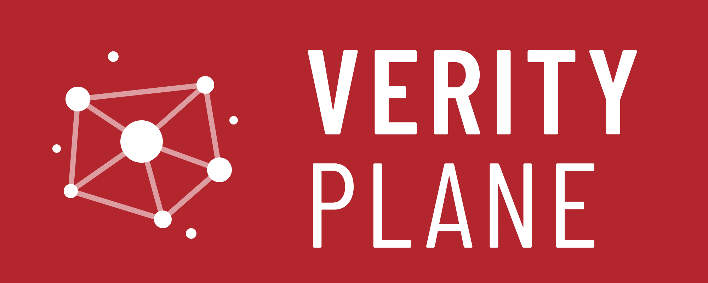
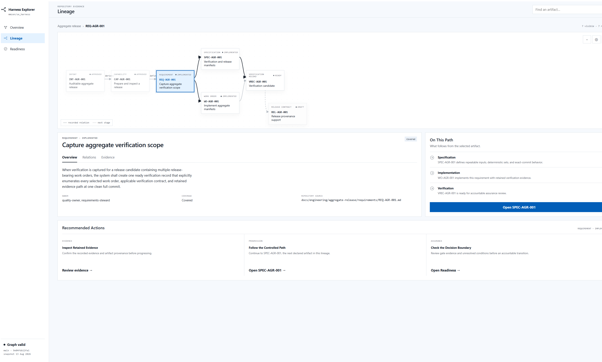
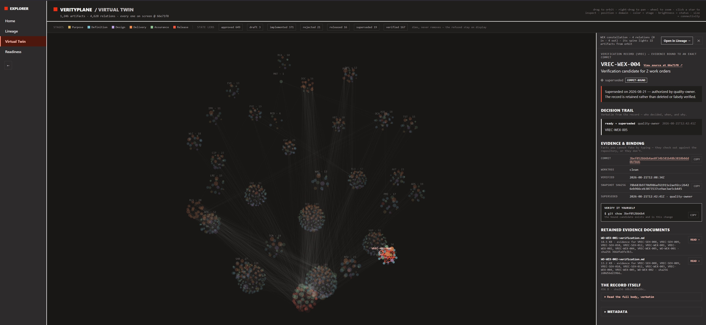

<p align="left">
  
</p>

## SE Harness / Verity Plane

<h4 align="center"><em>Delegate the work. Keep the authority.</em></h4>

SE Harness is an **open source harness for AI coding agents**. It connects intent, requirements, design, code, and evidence through engineering records stored in your repository.

The **`harnessctl` checker** checks the installed policy, traceability, and approved work scope. The **Verity Plane plugin** gives Codex and Claude Code skills to set up the harness, understand a project, carry out approved changes, and prepare evidence.

**Agents operate within bounded authority. Verification stays independent. Decisions stay human.**

[Get started](#get-started) · [Live demo](https://mmzen.github.io/se_harness/) · [Documentation](docs/notes/README.md) · [PyPI](https://pypi.org/project/se-harness/)

## Get started

Requires **Python 3.11+**. The checker runs on Windows, Linux, and macOS using the Python standard library. No hosted service is required for the checker.

### With Codex or Claude Code

Install from the project's published Git marketplace using your host's CLI:

**Codex**

```sh
codex plugin marketplace add mmzen/se_harness --ref plugin-marketplace
codex plugin add verity-plane@se-harness
```

**Claude Code**

```sh
claude plugin marketplace add mmzen/se_harness@plugin-marketplace
claude plugin install verity-plane@se-harness
```

Start a new task or session, then invoke **verity-plane:setup** with your project path and a persistent data directory outside it.

Observed public delivery (2026-10-03): Plugin **0.2.5** bundles released **SE Harness 0.22.0**. Codex CLI fresh installation, update from 0.2.4 and offline setup passed. [Public evidence](docs/engineering/release-0-22-0/evidence/WO-RLS-036/README.md) records exact identities and limits.

Claude Code installation/update and native session tests, and Codex Windows desktop tests, were not run for this release and remain unverified under DEC-RLS-005/006. Both distributed packages were byte-checked.

Startup/compaction hooks deliver the selected repository's instructions; they do not enforce every tool action. See [installation and update guidance](docs/notes/plugin-installation-guide.md). Setup installs the bundled wheel **offline** into a private environment. It does not download the harness from PyPI. Plugin installation alone does not initialize or upgrade a project. Python must include `venv` and `ensurepip`.

See the [plugin setup guide](https://github.com/mmzen/se_harness/tree/plugin-marketplace#prepare-the-checker-for-a-project).


### Published 0.22.0 / plugin 0.2.5

The [release package](docs/engineering/release-0-22-0/README.md) brings clearer
approval and verification requests, a PR before verification, and complete-release
preparation and recovery. Evaluator 0.22.0 and plugin 0.2.5 are public.

The single-approval release route still requires separate adoption and reviewed
provider configuration. This repository remains governed by 0.21.0. Documentation
integration and final release-marker closeout remain in progress.

## Fewer repository files

Instructions and templates live in the evaluator wheel; initialization writes
configuration and lock files. Activation restores the checkout after compaction.
See [migration](docs/notes/harness-installation-and-upgrades.md#minimal-installation-0210).
The published package retains its pre-publication README.

## How it works today

1. **Define the change.** Record the desired outcome, requirements, design, and verification approach.
2. **Approve the work.** A human approves a work order: a bounded plan for what may change.
3. **Implement and check.** An agent works within that scope and retains evidence from the required checks.
4. **Verify, then release.** An assurance owner judges the evidence for the exact candidate commit. A release owner makes a separate release decision.

Independent assurance requires separation between implementation and verification. Automated checks support the human decisions.

## A Virtual Twin of your Software

Our vision is an **authoritative model of the intended software** connecting requirements, behavior, architecture, and evidence. **Code is its implementation.**

We are building toward a contract where agents implement approved changes to that model and independent verification provides evidence of conformity. Automatic propagation from model to code remains a vision.

## See the whole change

Verity Plane Explorer shows the connections between requirements, work, evidence, and decisions. This repository uses it to document its own development.

**Lineage**

[](https://mmzen.github.io/se_harness/)

**Virtual Twin**

[](https://www.verityplane.ai/?view=graph)

## Go further

- [Start with the checker](docs/notes/getting-started.md)
- [Install or upgrade a project](docs/notes/harness-installation-and-upgrades.md)
- [Understand the model](docs/notes/harness-overview.md)
- [Follow a complete example](docs/notes/harness-lineage-example.md)
- [Look up a command](docs/notes/harnessctl-reference.md)
- [Develop and contribute](docs/notes/developing-se-harness.md)
- [Future complete-release procedure](docs/notes/release-delivery-completion.md#one-approval-for-the-complete-release)

[Report an issue](https://github.com/mmzen/se_harness/issues) · [Releases](https://github.com/mmzen/se_harness/releases) · [License](LICENSE)
