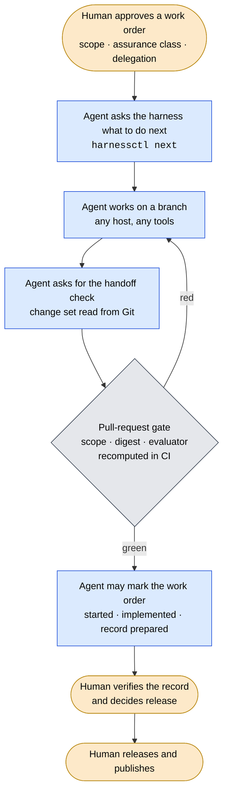
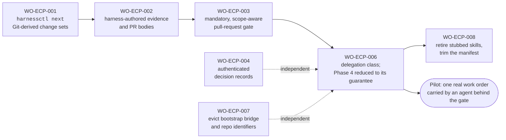

# Agentic Execution

<!-- Target expertise: 4/10. The score describes the knowledge expected from the reader, not the quality or complexity of the document. -->

> Repository-owned index. Formal artifact authority comes from TOML metadata,
> typed relations, lifecycle state, and accountable decisions — not this
> directory or this index.

This domain answers one question: **how can an AI agent do routine engineering
work in a governed repository, while the people who are accountable keep every
decision that matters?**

## 1. The objective

SE Harness already makes engineering work traceable: every change is done
under an approved *work order*, checked against declared scope, verified by a
person, and released by a person. The objective of this domain is that an
agent can carry a work order from **approved** to **ready for verification**
without a human typing each command — and that it cannot go one step further
than that.

The picture we are aiming for:

Orange boxes are human decisions. Blue boxes are what the agent does. The grey
diamond is the one place authority is enforced: the pull-request gate, run by
CI on the actual diff, not by anything the agent asserts about itself.

Step by step:

1. **Human approves a work order.** A person writes down what is to be done,
   which files may change (the *scope*), how strictly it must be verified
   afterwards, and whether an agent may carry it (the *delegation*). Nothing
   below can start until this is recorded on the work order.
2. **Agent asks the harness what to do next.** One command,
   `harnessctl next`, answers: which work order is selected and in what
   state, which artifacts govern it, what the scope is, what to read, and the
   exact next command. The agent does not have to remember any of this or
   work it out from the repository.
3. **Agent works on a branch.** Ordinary engineering: edit, test, iterate,
   with whatever editor, model or tools the host provides. The branch is the
   agent's sandbox; nothing it does there touches `main`.
4. **Agent asks for the handoff check.** When it believes the work is done,
   the agent asks the harness to evaluate it. The harness reads the list of
   changed files *from Git* (the difference between the branch and its base)
   and checks that every one of them is inside the declared scope, and that
   the evidence for the work is present and bound to the exact state of the
   governing artifacts. The agent triggers the check; it does not describe
   its own change set.
5. **Pull-request gate.** The agent opens a pull request and CI recomputes
   the same check on the real diff — scope, evidence digest, and that the
   released evaluator (not the candidate) did the checking. Red means the
   agent goes back to step 3; green means the work is inside its lines.
   Today this recomputation runs only when the pull request declares a
   restitution digest; `WO-ECP-003` makes it run on every pull request.
6. **Agent may advance the work order.** Only now, and only if the work
   order carries a delegation, may the agent record the *started*,
   *implemented* and *record prepared* transitions itself. Each is written as
   a decision record naming the gate result it relied on. Without a
   delegation, a person records them.
7. **Human verifies the record.** A person reads the retained evidence and
   decides whether the verification record is *verified*. This is never
   delegated; the agent prepared the record, it cannot accept it.
8. **Human releases and publishes.** Release contracts, the release
   decision, tags and package publication stay with people, exactly as they
   are today.

Three rules make this safe, and they are the whole of what Phase 4 must
guarantee:

1. **Delegation is written on the work order.** A work order may carry a
   `[delegation]` table with one class. Only then may an agent apply the
   start, completion and record-preparation transitions — and only while the
   gate for its branch is green. No delegation, no transition. Verification,
   release and publication are never delegated.
2. **A multi-file write cannot half-land.** When the harness itself writes
   several files (evidence, records, managed files) it does so through one
   journaled apply with rollback. If something breaks mid-way, the repository
   is either untouched or the journal stops in a *human-recovery-stop* state
   that a person clears.
3. **The harness holds the state, not the agent.** Which artifact is
   selected, what is in scope, what the next command is, what the evidence
   binds — all of that is answered by the harness on demand. The agent carries
   no token, no envelope, no session state that could be copied, replayed or
   forged.

Everything else the domain once built — an autonomy envelope with nonces and
lifetimes, an effect broker that rebuilt each change as a bundle, contract
catalogs with several schema generations — defended against threats that do
not exist when the token never leaves the process that minted it. Those parts
are being removed; the three rules stay.

## 2. Where the implementation stands

**Decided.** `ADR-AEX-008` (approved 2026-08-28, issue #211) records the
owner's disposition: *Phase 4 is product, reduced to its guarantee.* The three
rules above are the guarantee. The execution-control-plane definitions that
state them are approved: `REQ-ECP-011` (delegation class unlocks transitions
behind the gate), `REQ-ECP-017` (journaled multi-file writes),
`REQ-ECP-018` (no envelope apparatus in the product) and `SPEC-ECP-006`.

**Shipped and in use today**

| Piece | State |
| --- | --- |
| Work orders, scope, handoff check, verification records, release records | in use; this is the harness every release of SE Harness runs under |
| `harness-orient` and `harness-operator-brief` (read-only skills) | shipped in every consumer install; they stay |
| Journaled apply with rollback and `human-recovery-stop` | implemented in `se_harness/effect_broker.py`; kept, to be lifted out of the broker |
| `resolve_delegation` narrowing (a delegation can only shrink) | implemented in `se_harness/delegated_authority.py`; kept |

**Built but inert — being removed**

| Piece | Why it goes |
| --- | --- |
| `delegated-workflow` subcommand and the `[agentic_delegation]` table | never activated in any target; replaced by the `[delegation]` class enforced at the gate |
| Autonomy envelope (nonce ledger, lifetime, revocation, retry ordinal, two-capture stability) | defends a token that never crosses a trust boundary |
| Effect broker and change bundles (`delegated_workflow.py`, most of `effect_broker.py`, `change_bundle.py`, `repository_state.py`, `runtime_state.py`) | Git's branch and the PR gate do this job; the journaled apply is the part worth keeping |
| `agent_contract.py` / `agent_contract.json`, `skill_contract.py` | zero product callers, three frozen schema generations |
| `harness-draft-change`, `harness-execute-work-order`, `harness-prepare-assurance` (the three writing skills) | they wrap the removed subcommand and inject a stub client while saying they invoke the evaluator |

In numbers, at `main` `eae9332`: the Phase 1–4 chain is 8,766 of 20,937
package lines and 52 formal artifacts in this directory, with **no**
`[agentic_delegation]` table anywhere but the template. The five audit
sub-items that lived inside it (issues #215–#219) are closed as superseded by
the decision.

**What is still true regardless of the removals.** Human decisions are typed
as role strings (`--decision WO=assurance-owner`) and are not yet identity
checked; scope is enforced by the handoff check when it is run, not yet
mandatorily by the pull-request gate on every diff. Both are on the plan
below, and until they land, "the agent cannot go further than allowed" is a
process claim, not an enforced one.

**Removed (2026-08-29, `WO-ECP-006`).** The "built but inert" rows above
left the product: the eight Phase 4 modules and two contract catalogs, the
`delegated-workflow` command, the `[agentic_delegation]` table and its
validator, and the three writing skills. The journaled apply survives as
`se_harness/journaled_apply.py` with its fault matrix; `resolve_delegation`
narrowing is in Git history and returns with the `[delegation]` class
(`REQ-ECP-011`). Amendment records sit on `ADR-AEX-006`, `ADR-AEX-007` and
`ARCH-AEX-002`; the formal supersession of the `AEX` artifacts with an `ECP`
successor is the requirements steward's and technical owner's act, taken by
name when the successor rules are implemented.

**Delegated (2026-08-29, `WO-ECP-018`).** The delegation class is implemented:
`[delegation] class = "execution"` on a work order, the `delegated-executor`
role for the three mechanical rights behind the green required check, the
class read at the pull request's base, and `check` telling the actor when
the decision is its own (`docs/notes/delegation-class.md`).

## 3. The plan

The work is scheduled in the `execution-control-plane` domain
([`../execution-control-plane/`](../execution-control-plane/README.md)), whose
definitions are approved and whose work orders are drafted. In order:

| Step | Work order | What it delivers | Why it is in this position |
| --- | --- | --- | --- |
| 1 | `WO-ECP-001` | `harnessctl next` (one call that returns the selected artifact, its scope, the reading set and the exact next command) and change sets read from Git | removes the largest piece of state an agent has to carry |
| 2 | `WO-ECP-002` | the harness writes and rebinds evidence packets and PR bodies itself | agents stop hand-authoring evidence that a digest then checks |
| 3 | `WO-ECP-003` | the pull-request gate becomes mandatory and checks the real diff against scope | the one change that turns scope from honour-based into enforced |
| 4 | `WO-ECP-006` | the `[delegation]` class on work orders; transitions unlocked only behind the green gate; broker and envelope removed; journaled apply retained | the objective of this domain, built on steps 1–3 |
| — | `WO-ECP-004` | decisions bound to an identity (commit signature or CI actor) and checked against `DECISION_RIGHTS.md` | independent; makes "humans retain authority" enforced rather than documented |
| — | `WO-ECP-007` | consumer-only product surface (already partly done by `WO-ECP-010`, `WO-ECP-011`, `WO-REB-028`, `WO-REB-030`) | independent; removes the second execution model agents must recognise and ignore |
| 5 | `WO-ECP-008` | the three writing skills retired, the managed manifest trimmed, the handoff snapshot scoped to the governing chain | cleans up after step 4 |
| 6 | pilot | one real work order in this repository carried by an agent from approved to ready-for-verification, behind the gate | the first activation; success means the objective is reached, not that Phase 5 begins |

Each work order is approved, started, completed and verified separately, by
the accountable owners, under the same harness it improves. Multi-agent and
child delegation ("Phase 5") stay outside harness machinery: a host's
subagents are execution detail, and the combined branch is what the gate
validates.

## Retained history

The Phase 1–4 packets (`INT-AEX-001`, `CAP-AEX-001`, `REQ-AEX-001` to
`REQ-AEX-012`, `SPEC-AEX-001` to `SPEC-AEX-008`, `ARCH-AEX-001`,
`ARCH-AEX-002`, `ADR-AEX-001` to `ADR-AEX-007`, `VER-AEX-001` to
`VER-AEX-004`, `WO-AEX-001` to `WO-AEX-008` and their verification records)
are retained as the record of how the design was built and verified.
`ARCH-AEX-002` is amended by date as superseded by `ARCH-ECP-001`; the
definitions `WO-ECP-006` retires will be amended by date under it, as
`REQ-REB-016` and `REQ-REB-026` were. The notes under
[`docs/notes/`](../../notes/) prefixed `agentic-execution-` are
non-authoritative background; the 2026-08
[review](../../notes/agentic-execution-review-2026-08.md) and
[complexity audit](../../notes/complexity-audit-2026-08.md) are the two that
led to the decision.
