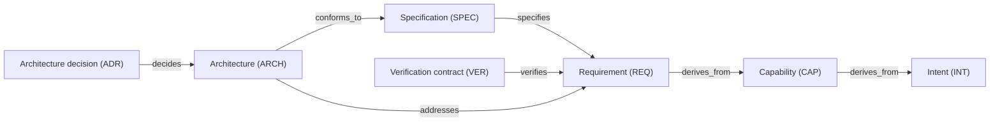

# Definition links

## Links between definitions

An arrow points from the artifact that records the link to the artifact it
references. These links describe meaning and coverage, not execution order.

| Source → target | Relation | Meaning and coverage |
| --- | --- | --- |
| Capability (CAP) → Intent (INT) | `derives_from` | Each active capability (CAP) names one or more active intents (INT). |
| Requirement (REQ) → Capability (CAP) | `derives_from` | Each active requirement (REQ) names one or more active capabilities (CAP). |
| Specification (SPEC) → Requirement (REQ) | `specifies` | Each requirement (REQ) selected by a work order (WO) needs one or more selected active specifications (SPEC). |
| Architecture (ARCH) → Requirement (REQ) | `addresses` | The architecture (ARCH) names every requirement (REQ) that materially drives its structure. |
| Architecture (ARCH) → Specification (SPEC) | `conforms_to` | For each addressed requirement (REQ), the selected architecture (ARCH) names at least one selected specification (SPEC) covering it. |
| Architecture decision (ADR) → Architecture (ARCH) | `decides` | Each selected architecture (ARCH) that requires a design decision has at least one selected active architecture decision (ADR). |
| Verification contract (VER) → Requirement (REQ) | `verifies` | Each selected requirement (REQ) has one or more selected active verification contracts (VER). |

## Declared links

Only links declared in formal TOML metadata establish
traceability. Every link MUST use one of the relation names and source/target
type pairs in this file, [Work and evidence](WORK_AND_EVIDENCE.md#links-from-work-orders-wo), and [Decisions and risks](RISKS_AND_DECISIONS.md#links-for-decisions-and-risks). Run `harnessctl validate REPO --json` to check those links.
Treat a reported undeclared pair as a validation failure; correct the link before the affected action.

## Architecture applicability

Include an architecture (ARCH) only when it
directly addresses a selected requirement (REQ) and is active. For every
addressed requirement (REQ), at least one specification (SPEC) named by
`conforms_to` MUST specify that requirement (REQ). Routine work MUST NOT
receive invented links to architectures (ARCH) or architecture decisions (ADR).

## Architecture decisions

Each architecture (ARCH) MUST declare
`decision_assessment.outcome` as `adr_required` or
`no_significant_decision`. The first requires a selected active architecture
decision (ADR). The second requires an accepted explanation and no active
decision trigger. One architecture decision (ADR) may cover several related
architectures (ARCH).
