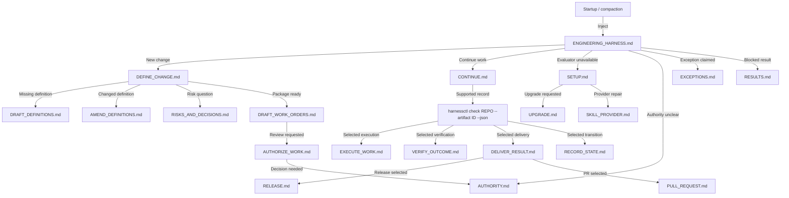

# Proposed split for progressive instruction discovery

Source: the latest `ENGINEERING_HARNESS.md`, SHA-256
`9811b1770fa81e20f19890cb45de6d991aa463cf60a4338b39251d9d4c978a28`.

This is a proposed layout, not an applied split. The source has 58 Markdown
headings, 31 bold main-process steps, and approximately 21,900 words counted
by whitespace. The proposed file names below are repository destinations.

## Recommendation

Inject only `ENGINEERING_HARNESS.md` at startup and compaction. It contains the
always-applicable policy and a small reading router. It does not contain full
procedures, model tables, or maintenance instructions.

Each procedure names its own required reading, exact commands, expected
outputs, stop conditions, and next reading trigger. The agent opens the
procedure needed for its current action and only the references that action
needs. A link is not, by itself, an instruction to read its target.

The directory can contain many small files. The startup file should expose
only a few entry choices. The agent should not have to browse the directory
or choose among all files on every task.

## 1. The injected entry: ENGINEERING_HARNESS.md

Target: approximately **1,000–1,300 words**, to be measured after drafting.
This is a writing budget, not a token guarantee or a reason to omit a required
rule. The current RFC introduction, Goals, nine invariants, and applicability
section together contain about 835 words, excluding headings.

Keep or place here:

1. The document's applicability: installed release versus proposed policy.
2. The RFC introduction and Goals.
3. The nine global invariants, preserving their agreed meaning and IDs.
4. The distinction between read-only analysis, artifact preparation, and
   authorized implementation.
5. The brief Human/Agent distinction and the human-reserved approval,
   verification-acceptance, and release decisions. Full rights stay in
   `AUTHORITY.md`.
6. The command convention: `harnessctl` means the selected released evaluator,
   invoked through its absolute Python path with `-I -m se_harness`.
   `SETUP.md` supplies the discovery and repair procedure when that executable
   is not known or usable.
7. The shared transient-material convention: working notes stay in the
   conversation or temporary storage outside the repository; required
   artifacts and evidence remain durable at their prescribed locations.
8. The reading router and compaction rules below.

Short policy reminders at decision points are permitted. Detailed rules must
have one canonical owner; they should not be copied into every procedure.

### Startup reading router

All paths in this table are below `docs/engineering/harness/`.

| Current need | Read first | What this reading must establish |
| --- | --- | --- |
| Understand or discuss something without a lifecycle action | Only the source sections needed to answer the question | No lifecycle procedure is required solely to explain the document. |
| Prepare a newly requested change | `DEFINE_CHANGE.md` | Confirm the outcome and limits, select existing artifacts, then identify the next drafting action. |
| Continue selected work, including after compaction | `CONTINUE.md` | Obtain current context for the exact selected record and follow the procedure returned by the evaluator. |
| Resolve who can decide or apply a decision | `AUTHORITY.md` | Identify the actual accountable human or agent, the right, and its recorded authority. |
| Handle a failed check, refusal, or uncertain result | `RESULTS.md` | Report actual effects and blockers; stop only the affected action and follow the returned correction. |
| Determine whether an owner-defined exception applies | `EXCEPTIONS.md` | Establish supported capability and applicability; do not infer an exception from repository prose. |
| Prepare or repair an unavailable or mismatched evaluator | `SETUP.md` | Obtain the selected executable and validate its identity. |

Upgrade and provider-change procedures are reached from `SETUP.md` only when
that operation is requested or is the selected remedy. Setup failure alone
does not authorize an upgrade.

This router selects **reading**, not lifecycle states, legal transitions,
approval, or execution authority.

### Proposed startup reading instruction

> Use the table to select the first file for the current task. Read that
> file's entry conditions and the step you will perform. Follow its required
> references before the action they govern. Do not load all linked files or
> all later stages in advance. After a governed operation, use the current
> evaluator result to select the next procedure. Read `RESULTS.md` before
> reporting a lifecycle result or handling a blocker. If an instruction or
> required input is missing, report it; do not invent the missing rule.

`COMMUNICATION.md` is a cross-cutting prerequisite before the first eligible
English explanation in a fresh context, including an ordinary answer. Reuse
its contents while they remain in context. This small baseline read must be
counted in the context budget; moving an always-applicable policy to a file
does not make it optional. It is not necessary to reread it after every tool
call.

### After compaction

The injected file is a router, not a replacement for the current procedure.

1. Recover the selected repository, artifact IDs, current objective, known
   authorization, and pending action from the conversation summary.
2. If this is governed work, read `CONTINUE.md` and obtain fresh evaluator
   context using the supported operation for that artifact type. A prior
   summary does not establish current lifecycle state.
3. Read the selected procedure and its applicable prerequisites again when
   their content is no longer in context. Do not treat a remembered filename
   as retained instructions.
4. Resume the unapplied step. Inspect an uncertain write or external action
   before retrying; do not replay a completed operation.

The continuation summary should retain pointers and decisions: selected IDs,
procedure file and heading, pending inputs, actual results, and evidence
locations. It need not copy all instructions or unrelated history. It stays
in the conversation or a temporary location outside the repository, following
the agreed transient-material rule.

## 2. Action files

Directory: `docs/engineering/harness/`.

| File | Contents moved from the latest draft | Read trigger |
| --- | --- | --- |
| `CONTINUE.md` | Continue selected work, including the existing returned-procedure index | Existing selected work; resumption after compaction. |
| `DEFINE_CHANGE.md` | Define overview and steps 1–3: outcome, limits, artifact selection | A new change needs definition or selection of its existing records. |
| `DRAFT_DEFINITIONS.md` | Define steps 4 and 6; Prepare a release or operating contract | A missing definition or verification/REL/OPS contract must be drafted. Read the applicable subsection. |
| `AMEND_DEFINITIONS.md` | Define step 5 and the linked-revision limitation | An existing definition needs changed meaning. |
| `RISKS_AND_DECISIONS.md` | Define steps 7–8; risk/decision model and coverage rules | A risk or unresolved formal question must be recorded, or a paired record must be understood. |
| `DRAFT_WORK_ORDERS.md` | Define step 9 | Definitions and scope are ready to be assembled into proposed work orders. |
| `AUTHORIZE_WORK.md` | Authorize overview and its five steps | A proposed package requires review, blocker disposition, and a human decision. |
| `EXECUTE_WORK.md` | Execute overview and its five steps | The evaluator selects work start or implementation under matching existing authority. |
| `VERIFY_OUTCOME.md` | Verify overview and its five steps; Refresh verification after an unchanged rebase | Verification preparation or a human verification decision is selected. Read the refresh subsection only for that recovery case. |
| `DELIVER_RESULT.md` | Delivery overview, selection, external-action authority, execution, and readback | A delivery path must be selected or its exact external action performed. |
| `RELEASE.md` | Release-specific preparation and delivery steps 3–4 | The selected delivery path requires an RLS or a decision on an existing RLS. |
| `PULL_REQUEST.md` | Check a governed pull request; integration-specific body preparation | Preparing or checking the exact governed PR. |
| `RECORD_STATE.md` | Complete a selected definition; Record work-order verification or release | The exact separate definition/WO state change has been selected. |
| `RESULTS.md` | Report a lifecycle result; If a procedure is blocked; the remaining short gate definition where useful | Reporting governed results, correcting a refusal, or recovering an uncertain operation. |

The five main process overviews stay with their entry procedures. A process
overview links to subsequent actions but does not require reading all of them.
`DRAFT_DEFINITIONS.md` must make any moved step dependencies explicit; the
old numbers 4 and 6 are source locations, not a new execution sequence.

The existing `PROC-*` index belongs in `CONTINUE.md`. Its destinations become
exact file-and-heading links, using the evaluator's returned procedure and
typed step. A map from procedure ID to instructions must not become a new map
from artifact state to a guessed next action.

### Why split definition more than execution?

The current Define procedure contains approximately 4,100 words. Its main
parts are independently useful:

| Current content | Approximate current words | Proposed destination |
| --- | ---: | --- |
| Outcome, limits, artifact selection: steps 1–3 | 908 | `DEFINE_CHANGE.md` |
| Draft definitions and verification contracts: steps 4 and 6 | 978 | `DRAFT_DEFINITIONS.md` |
| Amendment proposal and current limitation: step 5 | 450 | `AMEND_DEFINITIONS.md` |
| Risks and unresolved decisions: steps 7–8 | 820 | `RISKS_AND_DECISIONS.md` |
| Work-order preparation: step 9 | 772 | `DRAFT_WORK_ORDERS.md` |

These counts exclude the shared Define introduction. Model material and
supporting procedures moved into a destination add to its eventual size.
They are allocation measurements, not predicted context-token counts.

The existing Authorize, Execute, and Verify procedures are approximately
1,600, 1,200, and 1,400 words respectively, before supporting additions. Keep
each together initially, with distinct headings for its five steps. Further
splitting is justified only if a file remains too costly for its real reading
trigger. Do not create one tiny file for every command.

## 3. References read by condition

Also below `docs/engineering/harness/`.

| File | Canonical contents | Read when |
| --- | --- | --- |
| `AUTHORITY.md` | Actors, decision rights, delegation, separation, and authority from work approval | Obtaining or applying a decision, resolving ownership/delegation, or interpreting a historical execution grant. |
| `ARTIFACTS.md` | Artifact introduction, type catalogue, and locations | Choosing an artifact type, understanding a record, or authoring a type not already understood in the current context. |
| `DEFINITION_LINKS.md` | Definition relations, declared-link rule, definition coverage, architecture applicability, and ADR assessment | Creating or changing those links, selecting definitions, or responding to a related finding. |
| `WORK_AND_EVIDENCE.md` | Work-order and verification/release/operation relations; assurance classification; candidate, successor, release, and operating coverage rules | Preparing the relevant work order or record, or evaluating its required coverage inputs. |
| `COMMUNICATION.md` | Communication policy | Before the first eligible English explanation in a fresh context, including formal prose, ordinary answers, and lifecycle reports. |
| `EXCEPTIONS.md` | Owner-exception applicability and supported evaluation procedure, when available | A change claims an owner-configured exemption from definitions or work orders. |

`RISKS_AND_DECISIONS.md` deliberately combines its model and procedure. This
avoids requiring a separate risk reference for one small authoring action.

References with several topics must have descriptive, addressable headings.
A procedure names the required heading, not just “read the model.” For example:

- `DRAFT_WORK_ORDERS.md` requires `WORK_AND_EVIDENCE.md` → “Work-order links”
  and “Assurance classification” before completing those fields.
- `VERIFY_OUTCOME.md` requires “Verification coverage” before preparing a
  VREC; “Successor coverage” is needed only for supersession.
- `RELEASE.md` requires “Release coverage” before selecting preparation inputs.

The empty current exception section is not an executable procedure. Its
proposed file must clearly state the selected release's availability and
the current governed fallback. This proposal does not invent an exception
configuration or command.

Keep `docs/engineering/ARTIFACT_AUTHORING.md` at its existing path. Authoring
procedures identify the exact type checklist and any applicable shared
authoring section. They must not require the whole file for every artifact.

The draft now includes Communication while its migration text still refers
to a retained external communication policy. Resolve its canonical ownership
before implementing the split: do not install two independently normative
copies. The proposed owner here is `COMMUNICATION.md`.

## 4. Setup and migration

| Proposed path | Contents | Read trigger |
| --- | --- | --- |
| `docs/engineering/harness/SETUP.md` | Prepare or repair the released evaluator | Evaluator unavailable, unknown, or identity-mismatched. |
| `docs/engineering/harness/UPGRADE.md` | Upgrade the installed harness | An exact harness upgrade is requested and authorized. |
| `docs/engineering/harness/SKILL_PROVIDER.md` | Select or restore the skill provider | Provider selection or native-discovery repair is requested. |
| `docs/engineering/harness/migration/REFERENCE_MAP.md` | Versioned prior-rule mapping | Maintaining or reviewing the instruction migration. |
| `docs/engineering/harness/migration/IMPLEMENTATION_PLAN.md` | Implementation dependencies | Implementing or assessing the migration, not ordinary governed work. |

This yields **26 proposed instruction files**, including the injected entry.
The existing artifact-authoring guide and executable contracts are not counted
as new files. Only the entry is injected; the startup router does not list all
26 files as required reading.

## 5. Required structure inside each action file

Use the same short opening in each file:

```markdown
# Descriptive action name

## Read this when
The exact task condition or evaluator-returned procedure that selects this file.

## Before this action
Required inputs and exact file/heading references, each with its condition.
Do not list optional background as mandatory reading.

## Procedure
### 1. Descriptive step name
Inputs → Output → Actions → Harness command(s) → Completion → Later use.

## Read next when
Result or task condition → exact file and heading.
For a lifecycle action, use the evaluator's returned next procedure and step.
```

Promote the current 31 bold step names to Markdown headings. Use stable,
descriptive anchors and convert prose references such as “step 4,” “above,”
and “the procedure below” into unambiguous links after relocation.

Do not require an agent to follow an index through several more indexes.
The expected path is entry → current procedure → any exact required reference.
Later task actions are discovered when their inputs or evaluator result make
them relevant.

## 6. Discovery graph

In the graph, short filenames refer to `docs/engineering/harness/`, except
the root `ENGINEERING_HARNESS.md`. Edge labels describe reading triggers;
they do not grant authority or compute lifecycle legality.



For definition and risk records, `CONTINUE.md` retains the current release's
different inspection/transition procedure. The generic `check` node applies
only to types the command supports; it is not a new universal check command.
The graph shows common routes. The complete existing returned-procedure index
must still map every supported procedure and typed step to its exact reading
destination.

### Typical reading sets

| Task | Reading selected for that task |
| --- | --- |
| Resume implementation | Injected entry → `CONTINUE.md` → returned `EXECUTE_WORK.md` step → selected WO and applicable governing artifacts. Add `RESULTS.md` when reporting. |
| Draft a new requirement | Injected entry → `DEFINE_CHANGE.md` → `DRAFT_DEFINITIONS.md`; consult the relevant artifact type, definition links, and requirement checklist. |
| Apply a recorded verification decision | Injected entry → `CONTINUE.md` → `VERIFY_OUTCOME.md` decision step → relevant authority and record/evidence inputs. No need to read definition drafting or release preparation. |
| Prepare or check a PR | Injected entry → selected delivery route → `PULL_REQUEST.md` → selected work orders, complete diff inputs, and applicable repository instructions. |
| Repair the evaluator | Injected entry → `SETUP.md`; upgrade or provider files only if their distinct trigger applies. |

These examples describe the additional harness reading. They do not remove
required reading of governing artifacts, selected contracts, or applicable
repository-owner instructions.

## 7. Machine contracts and discovery manifests

`WORKFLOW.json` and `QUALITY_GATES.json` remain evaluator inputs. Normal
procedures consume the result of `harnessctl`; they do not direct the agent
to derive lifecycle decisions by reading those JSON files. Direct inspection
is reserved for work on the evaluator or a specific diagnostic investigation.

The split must also update the released reading manifests and plugin routes.
Moving Markdown alone will not reduce context if a returned manifest still
instructs the agent to read all policy files or retired guides. Define which
returned items are human instructions, selected formal artifacts, and machine
inputs as part of that migration. Do not tell agents to silently ignore
currently required manifest entries as a workaround.

If a result does not identify sufficient instructions or inputs for its next
step, report that discovery gap. Do not replace missing evaluator behavior
with a second lifecycle algorithm in the startup file.

## 8. Checks before adopting this layout

- Assign every current section and rule a canonical destination. Preserve
  explicit dispositions for removed implementation-only material.
- Keep the exact command examples and authority meanings unless separately
  approved changes require them.
- Give all 31 main steps descriptive headings and resolve every file/heading
  link, including the three existing stale Lifecycle meaning links.
- Test each current returned `PROC-*` and typed step against the exact new
  instruction destination.
- Test startup, compaction, a new request, selected work in progress, a
  blocker, an uncertain write, and a setup failure. Each must expose the
  needed action and prerequisites without requiring the whole collection.
- Measure words in the injected file and in representative reading sets.
  Count selected references as well as procedure text. Do not claim a context
  reduction from file size alone.
- Resolve draft availability, exception support, authority provenance, and
  protected-content ambiguity as explicit content work. Splitting files does
  not resolve those issues by itself.

## 9. Coverage of the current sections

| Current section or family | Proposed owner |
| --- | --- |
| Title, RFC, Goals, nine invariants, Scope of these rules | `ENGINEERING_HARNESS.md` |
| Shared policy container | Entry applicability and explicit links; no separate generic container file |
| Repository-owned exceptions | `EXCEPTIONS.md` |
| Communication and all three subsections | `COMMUNICATION.md` |
| Gates | Relevant result-use explanation in `RESULTS.md` |
| Actors, roles, rights, delegation, authority from work approval | `AUTHORITY.md`; minimal always-applicable distinction in entry |
| Processes and Procedures introduction | Entry routing and `CONTINUE.md` |
| Artifact data model, Artifact types, Artifact locations | `ARTIFACTS.md` |
| Links between definitions | `DEFINITION_LINKS.md` |
| Links from work orders; links for verification, release, operation | `WORK_AND_EVIDENCE.md` |
| Links for decisions and risks | `RISKS_AND_DECISIONS.md` |
| Coverage: declared links, complete definition scope, architecture applicability and decisions | `DEFINITION_LINKS.md` |
| Coverage: assurance classification, verification, replacement, release, operation | `WORK_AND_EVIDENCE.md` |
| Coverage: blocking decisions, deviations, raised risks | `RISKS_AND_DECISIONS.md` |
| Define overview and Procedure | The five definition action files identified above |
| Authorize overview and Procedure | `AUTHORIZE_WORK.md` |
| Execute overview and Procedure | `EXECUTE_WORK.md` |
| Verify overview and Procedure | `VERIFY_OUTCOME.md` |
| Deliver overview and Procedure | `DELIVER_RESULT.md`, `RELEASE.md`, `PULL_REQUEST.md` by branch |
| Supporting procedures container | Conditional links from entry/action files; no mandatory bulk reading |
| Continue selected work | `CONTINUE.md` |
| Prepare/repair evaluator; Upgrade; Select/restore provider | `SETUP.md`, `UPGRADE.md`, `SKILL_PROVIDER.md` respectively |
| Prepare a release or operating contract | `DRAFT_DEFINITIONS.md` |
| Complete a definition; Record WO verification or release | `RECORD_STATE.md` |
| Refresh verification after an unchanged rebase | `VERIFY_OUTCOME.md` → refresh subsection |
| Check a governed pull request | `PULL_REQUEST.md` |
| Report a lifecycle result; If a procedure is blocked | `RESULTS.md` |
| Rule reference mapping | `migration/REFERENCE_MAP.md` |
| Implementation dependencies | `migration/IMPLEMENTATION_PLAN.md` |
