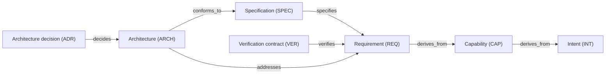

# Engineering Harness for se_harness

This repository uses SE Harness 0.18.0.

The keywords **MUST**, **MUST NOT**, **REQUIRED**, **SHALL**, **SHALL NOT**,
**SHOULD**, **SHOULD NOT**, **RECOMMENDED**, **NOT RECOMMENDED**, **MAY**, and
**OPTIONAL** in this document are to be interpreted as described in BCP 14
(RFC 2119 and RFC 8174) when, and only when, they appear in all capitals.

## Goals

This harness makes engineering authority explicit, limits execution to approved
scope, binds assurance and release claims to exact evidence, and gives every
actor the same deterministic next step. These goals are informative; the rules
below and the installed evaluator's machine policy are normative.

## Policy / Global invariants

### HRN-001 — Formal authority

Formal artifacts under `docs/engineering/` are the authoritative
records of product intent, requirements, architecture decisions, work authority,
verification contracts, risks, assurance decisions, and release decisions. Code,
tests, commits, tickets, dashboards, and conversation text are evidence or
observations; they MUST NOT substitute for formal authority.

### HRN-002 — Change control

Formal artifacts MAY be drafted, reviewed, and validated before a work order
is approved. This preparation MUST NOT authorize implementation.

Accepted formal artifacts MUST define the change before implementation starts.
One or more approved work orders MUST authorize implementation. A valid
repository-owned exception MAY remove the requirement for formal definitions,
work orders, or both. It MUST NOT change lifecycle rules or waive required gates.

Any required work orders MUST pass the required validation checks before
implementation starts. The result MUST be verified against the accepted
definitions that apply. All required verification checks remain required.

### HRN-003 — Lifecycle authority

Artifacts and the work itself MUST follow a strict lifecycle.
`harnessctl` MUST be the only source of truth for lifecycle states, allowed
state changes and the next action. Actors MUST use its results when reporting
or taking lifecycle actions. Agent text, prompts, Skills, dashboards, and
repository notes MUST NOT work out their own answers or change those results.

### HRN-004 — Bounded scope

An actor MUST select one clearly defined set of artifacts before
acting. This set defines the scope. Findings from unrelated work orders MUST
NOT be presented as findings about the selected scope. An issue outside the
scope MAY be reported only as an observation that has not been assessed, with
its artifact ID. It MUST NOT block the selected work unless a recorded
dependency or gate connects it to that work.

### HRN-005 — Explicit decisions

Each decision MUST identify the accountable human or agent and the authority
used. Being a human or an agent does not by itself authorize an action.

Preparing, inspecting, validating, or collecting evidence MUST NOT
count as an authorized decision. A state change requires the exact artifact,
the intended state, and the accountable actor. The required gates MUST pass,
and an explicit state transition MUST be applied.

### HRN-006 — Targeted transitions

A state transition MUST change only the artifacts explicitly
selected by the accountable actor. The states of related artifacts MUST NOT
change just because they are linked.

### HRN-007 — Repository ownership

`AGENTS.md` MUST belong entirely to the repository owner and contain
no harness instructions. Repository-specific facts and commands belong in
that file. The harness MUST NOT generate, track, or require that owner content.

### HRN-008 — Rule precedence

Repository instructions MAY add stricter rules. They MUST NOT grant authority
for product, engineering, assurance, release, or external actions. They MUST
NOT remove, weaken, or contradict the harness rules.

Repository owners MAY define exceptions through the supported exception
capability below. This changes only the obligations the capability permits
them to configure: whether formal definitions and work orders are required.
Lifecycle rules and required gates remain fixed. Repository prose alone MUST
NOT waive a harness rule.

### HRN-009 — Required checks

Managed-file integrity checks, artifact graph checks, scope checks, and required
gates MUST all pass before the affected action can proceed. Warnings MUST NOT
count as approval or acceptance of a risk.

## Shared policy

### Scope of these rules

The bounded-scope, lifecycle-reporting, and stop rules apply when a human or
agent performs or reports a governed lifecycle action. Reading, analysis, and
answering questions need no work order when they change no lifecycle state,
exercise no decision right, and present no finding as a formal verdict.

Preparing a proposed artifact package does not require an approved work
order. A human or agent MAY create and edit drafts, record risks and open
questions, review the proposed content, and validate the package. These
actions MUST follow the authoring procedure and required checks. They MUST
NOT change an accepted definition, approve a work order, or start
implementation. Decisions and lifecycle transitions follow their separate
authority rules.

Before a lifecycle action, select the exact artifacts and read the governing
files returned by the evaluator. A checkpoint-free `check` reports lifecycle
context. It does not evaluate checkpoint gates or authorize work.

### Repository-owned exceptions

voluntarily empty at this stage.

### Communication

#### Purpose and claim

This policy controls eligible English prose written by agents for operators and
technical artifacts. It uses selected clarity principles based on ASD-STE100.
It is not ASD-STE100 compliance, certification, approval, or endorsement.

An agent MUST NOT download, search for, bundle, reproduce, parse, or attempt to
strictly implement ASD-STE100 or a controlled dictionary. The installed policy
is complete for its declared purpose.

#### Eligible prose

Eligible prose is agent-authored English explanation that is not protected
content (see next section). For eligible prose, the agent SHOULD:

- use one stable term for one concept;
- define an uncommon project term before relying on it;
- identify the responsible actor when responsibility matters;
- state conditions, actions, and results directly;
- prefer active voice when it identifies responsibility;
- keep each sentence focused on one principal action;
- avoid ambiguous pronouns, decorative synonyms, hidden negation, vague
  references, and unnecessary introductions; and
- use a list or table when it clarifies parallel conditions, mappings, or
  ordered steps.

Sentence length is a review signal. It is not a conformance threshold and does
not justify removing necessary technical detail.

#### Protected content

Exact protected content MUST remain byte-identical. It includes:

- code and inline code;
- commands, paths, identifiers, hashes, version strings, URLs, schemas, and
  field names;
- JSON, TOML, YAML, XML, and other machine-readable data;
- logs, diagnostics, evidence, evaluator output, and canonical restitution
  blocks;
- quotations; and
- operator-supplied text that is presented as supplied text.

Protected content MUST NOT be automatically paraphrased. It includes BCP 14 obligations, 
requirement statements, lifecycle and decision meanings, safety or legal qualifications, 
acceptance thresholds, formulas, and established terminology.

### Gates

A gate is a named check used to determine whether an action meets its required conditions. It contains one or more predicates. A predicate is one exact condition, such as “the work order is approved” or “all declared changed paths are within the permitted scope.”

`harnessctl` evaluates the applicable predicates when a checkpoint is requested, a transition is previewed or applied, or a preparation command runs its required checks. A gate result is not an accountable decision.

## Actors and decision rights

An actor is either a human or an agent. A human is a person. An agent is an
automated system that performs work under granted authority.

### Roles and accountabilities

| Profile | Accountable for                                                                                                                                                                      |
|---------|--------------------------------------------------------------------------------------------------------------------------------------------------------------------------------------|
| Human   | Making decisions on product intent, requirements, design, work scope, verification, release and external actions; authorizing work and changes to its scope.                         |
| Agent   | Preparing artifacts and decision proposals; starting, carrying out and checking authorized work; retaining evidence; preparing verification records; reporting results and blockers. |

Agents have no independent authority to approve scope, accept assurance,
release software, or perform external actions.

Both humans and agents MUST follow the applicable checks, evidence requirements,
and decision rules.

### Decision rights

A profile describes who performs an action. A decision right describes which
action that person or agent is authorized to perform. Being a Human does not
grant every right in this table. Being an Agent grants none by itself.

Use the artifact's recorded ownership and any existing explicit delegation to
identify the accountable human. Resolve a team name or ownership label to the
human making this decision. A proposed `owners` value, an example actor name,
or authorship of a draft MUST NOT assign decision authority.

Approval, verification acceptance, and release decisions MUST be made by an
authorized human. An agent MAY prepare the material and apply that human's
recorded decision when authorized to do so. Applying the decision does not
make the agent its author. The selected IDs, reviewed content, target states,
and reason MUST still match the decision at apply time.

The following stable IDs name rights and operations, not additional profiles.
All applicable gates remain required.

XXX ambiguous where does this come from XXX

| Right ID                   | Accountable profile and authority                                                                                                  | Required input                                                                                                    | Result                                                                                               |
|----------------------------|------------------------------------------------------------------------------------------------------------------------------------|-------------------------------------------------------------------------------------------------------------------|------------------------------------------------------------------------------------------------------|
| `DR-DEFINITION-DECIDE`     | Human authorized to decide the selected definition.                                                                                | Complete definition, exact proposed state, and required checks.                                                   | Decision on that definition only.                                                                    |
| `DR-WO-SELECT`             | Human authorized to approve the work scope.                                                                                        | Complete governing chain, bounded work order, and assurance classification.                                       | Approval or rejection of the selected work order.                                                    |
| `DR-WO-START`              | Human or Agent executing the selected work under its recorded approval.                                                            | Unchanged approved scope and passing start checks.                                                                | The selected work order becomes `in_progress`.                                                       |
| `DR-WO-COMPLETE`           | Human or Agent executing the selected work under its recorded approval.                                                            | Completed scope, passing handoff checks, and retained evidence.                                                   | The selected work order becomes `implemented`.                                                       |
| `DR-VREC-PREPARE`          | Human or Agent under the approval of every selected work order.                                                                    | Exact candidate, selected work and verification contracts, retained evidence, and passing preparation checks.     | One `ready` verification record; no acceptance decision.                                             |
| `DR-VREC-DECIDE`           | Human authorized to accept verification for the selected candidate.                                                                | Ready record, assessed evidence, and the exact verify, reject, or supersede decision.                             | Decision on that verification record only.                                                           |
| `DR-DELIVERY-SELECT`       | Human authorized for the chosen integration or release-preparation path.                                                           | Exact candidate, destination, and coverage required by that path.                                                 | One path-specific instruction.                                                                       |
| `DR-RLS-PREPARE`           | Human authorizes the release inputs; a Human or Agent may carry out the preparation.                                               | Exact release contract, candidate, included work, verification coverage, version, and passing preparation checks. | One `ready` release record; no release decision.                                                     |
| `DR-RLS-DECIDE`            | Human authorized to make the release decision.                                                                                     | Ready release record, assessed contract obligations, and the exact release or reject decision.                    | Decision on that release record only.                                                                |
| `DR-EXTERNAL-ACTION`       | Human authorized for the exact external action. A Human or Agent may execute the authorized operation.                             | Action, immutable target, destination, prerequisites, and recovery conditions.                                    | Authorization limited to that operation; the subsequent tool result records its actual effects.      |
| `DR-RELATED-RECORD-SELECT` | Human or Agent; no decision authority is needed for inspection.                                                                    | Exact existing artifact ID.                                                                                       | Read-only selection.                                                                                 |
| `DR-REMEDIATION-SCOPE`     | Human authorized to change the affected definition or work scope.                                                                  | Failed criterion and proposed bounded correction.                                                                 | Explicit authority for the revised scope.                                                            |
| `DR-DECISION-DISPOSE`      | Human accountable for the artifact blocked by the decision; for a deviation, the human accountable for the affected specification. | Open or deferred decision, selected option or disposition, exact reason, and any required revisit trigger.        | Recorded disposition and any declared paired-risk effect. Other blocked artifacts keep their states. |

For a lifecycle decision, the `--decision` value identifies its actual
decision-maker. When an agent applies a human decision, that value is the
human who made it. For start and completion under approved execution, it is
the actual Human or Agent executor. Supplying either identity does not grant
authority. Preparation `--owner` values identify the preparation actor, not
a future assurance or release decision-maker.

Silence, elapsed time, a commit, a pull request, tool execution, or a passing
check MUST NOT count as a human decision. A rejection MUST include a non-empty
reason. Supersession MUST name exactly one eligible successor. The decision
and its resulting state MUST remain specific to the selected artifact.

### Delegation and separation

A human decision right may be delegated only to another human who is permitted
to hold it. The delegation MUST name the right, its scope, the granting human,
and the receiving human. It MUST be recorded before the delegated decision.
The receiving human MUST decide under their own identity.

An instruction for an agent to apply a recorded human decision delegates the
execution of that command. It does not delegate the decision itself. The
agent MUST NOT supply a new answer, broaden the targets, or claim the human
made a decision that was not given.

Repository policy MAY require different people for conflicting decisions on
the same candidate. When it does, the same human MUST NOT hold both decisions
for that candidate. A human MUST NOT approve their own architecture decision
assessment unless they explicitly hold approval authority for that artifact
and the separation rules permit it. Drafting an assessment grants no such
right.

When the accountable human or required authority is absent or ambiguous, stop
the affected decision. State the exact right and artifact needing an owner.
Do not substitute an available human or agent merely to fill the field.

### Authority from work approval

Work-order approval authorizes execution of its approved scope: start,
implementation, local edits and commits, required checks, evidence capture,
completion recording, and required verification-record preparation. A Human
and an Agent MUST use the same local approval, scope, and evidence checks.
Continue these operations without asking for the same permission again while
their scope and conditions still match. Record execution under the actual
executor's identity.

Approval leaves the work order `approved` until its start transition is
applied. Selecting and scheduling work remain explicit. New approvals need
no separate execution delegation table or second start approval. A preliminary
merge and live CI are not local execution requirements; CI still applies at
integration and publication.

The grant does not include changed scope, acceptance of the result, release,
merge, publication, or other external action. Reuse an existing explicit
authorization for such an action only when its exact target and conditions
still match.

Historical approvals keep their original meaning. Earlier explicit execution
grants remain usable under the same scope checks. An older approval without
such a grant needs an authorized amendment for the remaining execution.
Current metadata or an actor label MUST NOT manufacture that historical grant.
If the installed release cannot record the required authorization, stop the
remaining execution and report the missing historical grant and the lack of
a supported amendment operation. Do not insert invented grant fields or
rewrite the old approval.

<!-- Migration requirement: the released machine contract still contains
legacy owner labels. Preserve its decision-right IDs and actual human
identities. Update machine labels and their consumers in the governed release
migration; this two-profile table does not silently rewrite installed JSON. -->

## Processes and Procedures

This section explains how humans and agents carry out a change, from defining
it to verifying and delivering the result. The process sets out the sequence
of work. Each procedure describes when to start, what inputs are needed,
which steps to follow, what result to produce, and what to do if blocked.
`harnessctl` determines the applicable lifecycle steps, required checks, and
next action.

The process has five steps: define, authorize, execute, verify, and deliver.
Use the current `harnessctl` result to find where the selected work belongs.
Continue from that point; do not repeat completed steps or request the same
authorization again when it still applies. Use “Continue selected work” below
for the entry procedure and returned-procedure index. If the evaluator is
unavailable or mismatched, start with “Prepare or repair the released evaluator.”

### Artifact data model

A formal artifact is a record with a stable ID, a type, a lifecycle state,
content, and links to other artifacts. These records explain why a change is
needed, what it must do, who may carry it out, and how its result is checked.

Artifacts use TOML metadata between `+++` markers. Links are recorded in the
`[relations]` table using artifact IDs. A filename, a shared directory, or a
mention in prose does not create a formal link.

The tables below describe artifact types and permitted links. They are not a
manually maintained list of the repository's actual artifacts. `harnessctl`
reads those artifacts and checks their links and lifecycle states.

#### Artifact types

“Required” means the selected work needs coverage of that type. It does not
mean every change must create a new file. Reuse an existing active artifact
when its accepted meaning and scope still cover the work. Create a conditional
artifact only when its condition applies.

For an existing selected work order (WO), get its current state and next
action with:

```text
harnessctl check REPO --artifact WO-ID --json
```

Before implementation, check whether that work order (WO) and its linked
definitions are eligible to start:

```text
harnessctl preflight REPO --work-order WO-ID --phase start --json
```

The first command reports lifecycle context without evaluating checkpoint
gates. The second evaluates start readiness, including the states and coverage
of the selected definitions. Neither command approves or starts work.
Here, `REPO` is the absolute repository path and `WO-ID` is the actual ID of
the selected work order (WO). Use the repository's selected released evaluator.

| Type                  | ID prefix | Purpose                                                                                                                                                                      | When needed                                                                                                                                              |
|-----------------------|-----------|------------------------------------------------------------------------------------------------------------------------------------------------------------------------------|----------------------------------------------------------------------------------------------------------------------------------------------------------|
| `intent`              | `INT-`    | States the problem, intended outcome, and limits of responsibility.                                                                                                          | The work needs an accepted purpose. Reuse an intent (INT) when that purpose still applies.                                                               |
| `capability`          | `CAP-`    | Describes an ability that a human or agent should have.                                                                                                                      | Requirements (REQ) need a link to the capability (CAP) they support.                                                                                     |
| `requirement`         | `REQ-`    | States required behavior or a constraint, with a condition for acceptance.                                                                                                   | The change creates or changes an obligation. Reuse a requirement (REQ) only if its meaning stays unchanged.                                              |
| `specification`       | `SPEC-`   | Defines the detailed behavior, interfaces, constraints, and rejection conditions.                                                                                            | Each requirement (REQ) selected for implementation needs specification (SPEC) coverage.                                                                  |
| `architecture`        | `ARCH-`   | Defines system structure and boundaries needed to meet significant requirements (REQ).                                                                                       | An active architecture (ARCH) directly addresses a requirement (REQ) selected by the work order (WO).                                                    |
| `adr`                 | `ADR-`    | Records an architecture decision (ADR), the alternatives, and their consequences.                                                                                            | An applicable architecture (ARCH) declares that a significant decision is required.                                                                      |
| `verification`        | `VER-`    | Defines how requirements (REQ) will be checked and what counts as a pass.                                                                                                    | Each selected requirement (REQ) needs verification coverage. This is the verification contract (VER), not a test result.                                 |
| `work_order`          | `WO-`     | Defines the bounded work to execute and its governing artifacts. Approval grants work authority.                                                                             | Before execution. One work order (WO) may cover several requirements (REQ). Completed scope does not authorize later work.                               |
| `verification_record` | `VREC-`   | Binds work orders (WO), verification contracts (VER), evidence, and one exact candidate commit for assessment.                                                               | When verification tied to a commit is required. One record may cover several work orders (WO) at the same commit.                                        |
| `release_contract`    | `REL-`    | Defines permitted release scope, gates, rollback conditions, and authority limits.                                                                                           | When a release record (RLS) is proposed.                                                                                                                 |
| `release_record`      | `RLS-`    | Records preparation and the later release decision for verified work at one exact commit.                                                                                    | When a formal release is proposed. Preparing the record does not release the work.                                                                       |
| `decision`            | `DEC-`    | Records a question, options, recommendation, decision maker, affected artifacts, and the eventual answer. It can also record a deviation from one specification (SPEC) rule. | A question blocks a transition, affects more than one artifact, or must remain recorded after approval; or work cannot meet a specification (SPEC) rule. |
| `risk`                | `RISK-`   | Records a threat, an owner, and a next action. Scoring and categories are optional.                                                                                          | A concern needs follow-up. A separate decision (DEC) is used when the concern must block work.                                                           |
| `operating_contract`  | `OPS-`    | Defines continuing service, support, monitoring, or operational assurance obligations.                                                                                       | Ongoing operational commitments apply. Omitting the record does not prove those commitments have been met.                                               |

Code, tests, acceptance scenarios, evidence files, commits, dashboards, tickets,
and conversations are not additional formal artifact types. They may support
or be referenced by formal artifacts but do not grant authority by themselves.

#### Artifact locations

New formal artifacts use these directories below
`docs/engineering/DOMAIN/`. `DOMAIN` is the selected domain name. These paths
describe storage, not authority; the artifact ID, metadata, and typed links
remain authoritative. Use the supported authoring command to obtain the actual
path. Do not move existing records merely to match this table.

| Artifact | TYPE | Directory |
| --- | --- | --- |
| Intent (INT) | `intent` | `intent/` |
| Capability (CAP) | `capability` | `capabilities/` |
| Requirement (REQ) | `requirement` | `requirements/` |
| Specification (SPEC) | `specification` | `specifications/` |
| Architecture (ARCH) | `architecture` | `architecture/` |
| Architecture decision (ADR) | `adr` | `architecture/adr/` |
| Verification contract (VER) | `verification` | `verification/` |
| Work order (WO) | `work_order` | `work-orders/` |
| Verification record (VREC) | `verification_record` | `verification-records/` |
| Release contract (REL) | `release_contract` | `release/` |
| Release record (RLS) | `release_record` | `releases/` |
| Operating contract (OPS) | `operating_contract` | `operations/` |
| Decision (DEC) | `decision` | `decisions/` |
| Risk (RISK) | `risk` | `risks/` |

The same domain has `evidence/` for retained work-order evidence and
`acceptance/` for acceptance scenarios. These are supporting files, not new
formal artifact types. Legacy flat artifact locations remain readable and
MUST NOT be moved by an upgrade without separate authority.

Templates under `docs/engineering/templates/` are authoring assets. They are
excluded from active-artifact validation and grant no authority. Use
`capture-verification` and `prepare-release` for commit-bound VREC and RLS
instances; an edited template is not a substitute for their derived evidence.

#### Links between definitions

An arrow points from the artifact that records the link to the artifact it
references. These links describe meaning and coverage, not execution order.



| Source → target | Relation | Meaning and coverage |
| --- | --- | --- |
| Capability (CAP) → Intent (INT) | `derives_from` | Each active capability (CAP) names one or more active intents (INT). |
| Requirement (REQ) → Capability (CAP) | `derives_from` | Each active requirement (REQ) names one or more active capabilities (CAP). |
| Specification (SPEC) → Requirement (REQ) | `specifies` | Each requirement (REQ) selected by a work order (WO) needs one or more selected active specifications (SPEC). |
| Architecture (ARCH) → Requirement (REQ) | `addresses` | The architecture (ARCH) names every requirement (REQ) that materially drives its structure. |
| Architecture (ARCH) → Specification (SPEC) | `conforms_to` | For each addressed requirement (REQ), the selected architecture (ARCH) names at least one selected specification (SPEC) covering it. |
| Architecture decision (ADR) → Architecture (ARCH) | `decides` | Each selected architecture (ARCH) that requires a design decision has at least one selected active architecture decision (ADR). |
| Verification contract (VER) → Requirement (REQ) | `verifies` | Each selected requirement (REQ) has one or more selected active verification contracts (VER). |

#### Links from work orders (WO)

A work order (WO) selects the definitions and verification contracts (VER) that govern
its execution. Links to requirements (REQ) alone are not enough.

| Source → target | Relation | Meaning and coverage |
| --- | --- | --- |
| Work order (WO) → Requirement (REQ) | `implements` | Names every requirement (REQ) in the authorized work scope. |
| Work order (WO) → Specification (SPEC) | `specifications` | Names the specifications (SPEC) governing those requirements (REQ). |
| Work order (WO) → Architecture (ARCH) or Architecture decision (ADR) | `architecture` | Names every applicable architecture (ARCH) and every required architecture decision (ADR). |
| Work order (WO) → Verification contract (VER) | `verification` | Names the verification contracts (VER) for the work. |

For example, a work order (WO) can declare these links in its metadata. The IDs
below are examples, not records created by this document.

```toml
[relations]
implements = ["REQ-EXAMPLE-001"]
specifications = ["SPEC-EXAMPLE-001"]
verification = ["VER-EXAMPLE-001"]
```

The referenced requirement (REQ) must also link back to a capability (CAP) and intent (INT).
Add architecture (ARCH) links when architecture (ARCH) applies; do not invent them just to
fill a field.

#### Links for verification, release, and operation

| Source → target | Relation | Meaning and coverage |
| --- | --- | --- |
| Verification record (VREC) → Work order (WO) | `verifies_work_order` | Names one or more work orders (WO) assessed at one exact candidate commit. |
| Verification record (VREC) → Verification contract (VER) | `conforms_to` | Names every verification contract (VER) required by those work orders (WO). |
| Verification record (VREC) → Verification record (VREC) | `superseded_by` | A superseded record names exactly one distinct eligible successor. |
| Release contract (REL) → Work order (WO) | `gates` | Names every work order (WO) the release contract (REL) permits the release to include. |
| Release record (RLS) → Release contract (REL) | `satisfies` | Names exactly one applicable release contract (REL). |
| Release record (RLS) → Verification record (VREC) | `includes_verification` | Names one or more eligible verification records (VREC) at the release's candidate commit. |
| Release record (RLS) → Work order (WO) | `releases_work` | Names exactly the combined set of work orders (WO) covered by the included verification records (VREC). |
| Operating contract (OPS) → Requirement (REQ) | `assures` | Names every requirement (REQ) covered by a continuing operational assurance claim. |

A verification contract (VER) defines what to check. A verification record
(VREC) binds the evidence and work to an exact result for a later decision.
Likewise, a release contract (REL) defines the permitted release, while a
release record (RLS) binds a particular release candidate and its decision.

#### Links for decisions and risks

| Source → target | Relation | Meaning and coverage |
| --- | --- | --- |
| Decision (DEC) → any artifact type | `concerns` | Names every artifact the question is about. |
| Decision (DEC) → Requirement (REQ), Specification (SPEC), Verification contract (VER), Architecture (ARCH), Architecture decision (ADR), or Work order (WO) | `blocks` | Names artifacts whose transitions the decision (DEC) blocks. Each must also appear in `concerns`. |
| Decision (DEC) → Requirement (REQ), Specification (SPEC), Verification contract (VER), Architecture (ARCH), Architecture decision (ADR), or Work order (WO) | `produces` | A decision (DEC) in `decided` names artifacts its answer created or amended, when applicable. |
| Risk (RISK) → any artifact type | `threatens` | Names the artifacts the risk (RISK) could damage. |
| Risk (RISK) → Work order (WO) | `mitigated_by` | Names the work orders (WO) reducing a risk (RISK) in `mitigating` or `mitigated`. The decision operation writes this link. |
| Risk (RISK) → Architecture decision (ADR) or Decision (DEC) | `avoided_by` | Names the single architecture decision (ADR) or decision (DEC) that removes a risk (RISK) in `avoided`. The decision operation writes this link. |

A decision (DEC) records a question that needs an answer or a proposed deviation.
An architecture decision (ADR) records a settled design choice. They serve different purposes.

A risk (RISK) does not block work by itself. When a blocking decision (DEC)
is requested, that decision (DEC) concerns the risk (RISK). The `blocks` set
of the decision (DEC) matches the `threatens` set of the risk (RISK).

#### Coverage and consistency rules

**Declared links.** Only links declared in formal TOML metadata establish
traceability. Every link MUST use one of the relation names and source/target
type pairs above. Run `harnessctl validate REPO --json` to check those links.
The validator MUST reject undeclared pairs.

**Complete work scope.** Every requirement (REQ) selected by a work order (WO)
MUST link back to active capabilities (CAP) and intents (INT). It MUST also
have selected active specifications (SPEC) and verification contracts (VER).
Reuse existing artifacts where their scope applies.

**Architecture applicability.** Include an architecture (ARCH) only when it
directly addresses a selected requirement (REQ) and is active. For every
addressed requirement (REQ), at least one specification (SPEC) named by
`conforms_to` MUST specify that requirement (REQ). Routine work MUST NOT
receive invented links to architectures (ARCH) or architecture decisions (ADR).

**Architecture decisions.** Each architecture (ARCH) MUST declare
`decision_assessment.outcome` as `adr_required` or
`no_significant_decision`. The first requires a selected active architecture
decision (ADR). The second requires an accepted explanation and no active
decision trigger. One architecture decision (ADR) may cover several related
architectures (ARCH).

**Verification tied to a commit.** Each work order (WO) in `approved` or
`in_progress` MUST set `assurance.commit_bound_verification` to `required`
or `not_required`.

Use `required` when later decisions depend on the correctness of changes to
code, required checks, CI configuration, harness policy, artifact definitions,
or their links. These are examples of “changed trusted state”: information or
behavior that others will rely on when accepting, releasing, or operating the
result.

For example, a work order (WO) changes the code that validates artifact links.
A later release decision relies on that validation being correct. The work
order (WO) therefore needs verification tied to its exact candidate commit.

Use `not_required` only when the work solely records or transports a
verification, release, supersession, publication, or deployment decision
that an authorized human has already made. It does not make a new decision
or change the definitions, implementation, or evidence behind that decision.

For example, a work order (WO) commits an already authorized release decision
in a release record (RLS), with no change to the released code, scope, or
supporting evidence. The work records the decision; it does not reassess the
release.

A work order (WO) that combines both kinds of work MUST be split or classified
`required`. `not_required` removes the obligation to prepare a new
verification record (VREC) for that work; it does not remove required checks
or the links to verification contracts (VER).

**Verification records.** A verification record (VREC) MUST bind one or more
work orders (WO), all their declared verification contracts (VER), retained
evidence, and one exact clean candidate commit. Preparing a verification
record (VREC) does not change its state to `verified`.

**Replacement verification.** A verification record (VREC) in `superseded`
keeps its original commit, evidence, work orders (WO), and verification
contracts (VER) unchanged. Its successor MUST be a different verification record (VREC) in
`verified` or `released`, covering every original work order (WO).
A verification record (VREC) in `superseded` MUST NOT qualify a release.

**Release coverage.** A release record (RLS) MUST bind one release contract
(REL), one exact candidate commit, and eligible verification records (VREC)
at that same commit. Its released-work set MUST equal the combined set of
work orders (WO) covered by those verification records (VREC). Governance
work is included only when the release record (RLS) explicitly includes
verification records (VREC) that provide eligible coverage for that work.
A related record or dashboard cannot add work to a release.

This model describes the readable record structure. The selected 0.18.0
`prepare-release` procedure is narrower: it requires one final verification
record covering the complete released-work set. When earlier records cover
separate parts, prepare and verify a record for the exact combined candidate
through “Verify the outcome” before using that release procedure. Do not
assemble or edit a release record by hand to bypass the preparation checks.

**Blocking decisions.** A decision (DEC) in `open` blocks every transition
of the artifacts in its `blocks` relation. A decision (DEC) in `deferred`
blocks transitions outside its recorded permitted scope.

For example, a decision (DEC) names work order (WO) `WO-EXAMPLE-001` in both
`concerns` and `blocks`. It is deferred with the scope
`WO-EXAMPLE-001:approved-in_progress`. This deferral
allows the work order (WO) to move from `approved` to `in_progress` if all
other checks pass. It still blocks moving that work order (WO) from
`in_progress` to `implemented`. The deferral also records when the decision
(DEC) must be revisited. Deferral does not itself start the work.

An accepted deviation is a decision (DEC) with `kind = "deviation"`,
`status = "decided"`, and `disposition.option = "accept"`.
It records permission to depart from one identified specification (SPEC)
rule; “accepted” is not a separate lifecycle state for the decision (DEC).

That deviation remains applicable to the affected specification (SPEC),
work orders (WO), and their verification records (VREC) and release records
(RLS) until a later decision (DEC) against the same rule reaches
`status = "decided"` with `disposition.option` set to `amend` or
`supersede`. The disposition is written through `harnessctl decide`, not
by editing the metadata by hand.

**Raised risks.** A risk (RISK) in `raised` may have no paired decision
(DEC). Recording that risk alone does not block work. Use
`raise-risk --with-decision` when creating a risk that needs a paired blocking
decision.

A raised risk MUST NOT have more than one paired decision in `open` or
`deferred`. When that decision exists, it names the risk in `concerns`, and
its `blocks` set MUST equal the risk's `threatens` set. Disposing the paired
decision applies its recorded effect to the risk in the same operation.
The blocked artifacts change state only through their own transitions.

**Operational coverage.** An active operating contract (OPS) assurance claim
requires an active requirement (REQ) and at least one completed work order
(WO) implementing it. When verified provenance is required, at least one such
work order (WO) MUST be covered by a verification record (VREC) in
`verified` or `released`. Those links alone neither approve the operating
contract (OPS) nor prove continuing conformance.

This model defines artifact types, links, and coverage. Lifecycle transitions
and applicable gates remain determined by `harnessctl`. The Actors and
decision rights section defines accountability; the procedures below explain
how to create and use the records.

### 1. Define the change

**When:** A new change is requested, or existing definitions need to change.

**Inputs:** The requested outcome and any relevant existing formal artifacts.

**Output:** Proposed definitions and work orders (WO), validation results,
and unresolved decisions or amendment proposals for review.

**Steps:**

1. Describe the intended outcome.
2. Define the limits of the change.
3. Identify the existing artifacts that apply to the change.
4. Draft any missing definitions.
5. Propose any needed amendments to existing definitions.
6. Define how the result will be verified.
7. Record risks (RISK) affecting the change.
8. Record unresolved decisions (DEC).
9. Prepare work orders (WO) linking the definitions, scope, planned work,
   and verification requirements.

#### Procedure

This procedure prepares the proposed artifact package. It MAY be performed
before a work order is approved. Its outputs provide inputs to Authorize the
work; they do not permit implementation. Accepted definitions remain unchanged
while amendments are proposed through step 5.

Use the repository's selected released evaluator. In the commands below,
`harnessctl` means that evaluator, invoked through its absolute Python path
with `-I -m se_harness`. Replace `REPO` with the absolute repository path.
`DOMAIN`, `TYPE`, artifact IDs, and quoted example text are inputs to replace.
Use the same evaluator and repository throughout the procedure.

In this procedure, “proposal” means the transient working material used to
define the change. It may remain in the conversation or in a temporary
location outside the repository, at the agent's discretion. It has no formal
artifact ID or lifecycle state and SHALL NOT be persisted in the repository.
No filename or storage format is prescribed. Formal artifacts are reused,
created, or proposed for amendment in steps 3–9.

**1. Describe the intended outcome.**

**Inputs:** The change request and any clarifications already provided by
the requester.

**Output:**

- **Formal artifacts:** None created or modified.
- **Transient working material:** The confirmed intended-outcome statement and the
  requester's confirmation. This material is needed only for the current
  change-definition context. The agent SHALL retain it in the conversation
  or, at its discretion, in a temporary location outside the repository.
  It SHALL NOT be persisted in the repository. The agent chooses whether a
  temporary file is needed and, if so, its filename and format.

**Actions:**

1. Read the change request and existing clarifications.
2. Draft one statement describing the observable result for the intended
   human, agent, or system. Include the conditions under which it is needed.
3. Present the statement to the requester.
4. Ask the requester to resolve any missing information or competing
   interpretations that would change the outcome.
5. Revise the statement using the feedback. Repeat the exchange until the
   requester confirms the wording. Reuse an existing confirmation of the
   same wording.
6. Retain the confirmed statement and the confirmation as transient working
   material.

**Harness command:** None.

**Completion:** One intended-outcome statement is confirmed by the requester
and available for the following steps. This confirmation does not approve a
formal artifact or authorize implementation.

**Later use:** The statement guides scope definition in step 2 and artifact
selection in step 3. It supplies the outcome for a missing intent (INT) drafted
in step 4 or an amendment proposed in step 5. Any lasting definition belongs
in those formal artifacts.

**2. Define the limits of the change.**

**Inputs:** The confirmed outcome from step 1 and the constraints supplied
by the requester.

**Output:**

- **Formal artifacts:** None created or modified.
- **Transient working material:** The confirmed scope statement and requester
  clarification. Retain these under the same conditions as step 1.

**Actions:**

1. List the behaviors, components, and interfaces included in the change.
2. List the adjacent behaviors, components, and interfaces excluded from it.
3. List the conditions the result must respect, such as compatibility or a
   named operating environment.
4. Use component names where exact file paths are not yet known.
5. Present these boundaries to the requester. Identify any unresolved boundary.
6. Revise the scope until the requester confirms it. Reuse an existing
   confirmation when the boundaries are unchanged.
7. Retain the confirmed scope as transient working material.

**Harness command:** None.

**Completion:** One scope statement defines what is included, what is
excluded, and which constraints apply. No unresolved boundary affects the
definitions to be drafted next.

**Later use:** The scope selects artifacts in step 3, limits definition work
in steps 4–6, and supplies the work order (WO) boundaries in step 9.

**3. Identify the existing artifacts that apply to the change.**

**Inputs:** The confirmed outcome, scope limits, any artifact IDs supplied
in the request, and the existing formal records. Use
`docs/engineering/README.md` when locating a domain.

**Output:**

- **Formal artifacts:** None created or modified.
- **Transient working material:** A list of selected artifacts (the artifact
  inventory), a list of missing definitions, and the evaluator results.
  These are needed only for the current change-definition context. The agent
  SHALL retain them in the conversation or, at its discretion, in a temporary
  location outside the repository. They SHALL NOT be persisted in the
  repository. The agent chooses whether a temporary file is needed and, if
  so, its filename and format.

**Actions:**

1. Run the repository inspection command below.
2. If the request selects a work order (WO), run the selected-work command
   below. Read that work order (WO) and every file in the returned
   `context.reading_manifest`.
3. Otherwise, locate the artifacts named in the request. If none are named,
   use `docs/engineering/README.md` to locate the domain covering the function
   or component in the scope. Read its intents (INT), capabilities (CAP),
   and requirements (REQ). Record a missing domain if none covers the change.
4. Select the requirements (REQ) whose behavior the change would modify or
   reuse. Trace each one back to its capabilities (CAP) and intents (INT).
5. Read the specifications (SPEC), applicable architectures (ARCH), architecture
   decisions (ADR), verification contracts (VER), and work orders (WO) linked
   to those selected requirements (REQ). Use the declared relations listed
   in Artifact data model. Keep unrelated work outside the selected scope.
6. Read decisions (DEC) and risks (RISK) that name the selected artifacts.
7. For each selected artifact, retain its name and code, such as Requirement
   (REQ), its ID, file path, current lifecycle state, and why it applies to the
   change. Keep this list as transient working material; do not create a
   repository inventory file.
8. Assign one treatment to each entry: `reuse`, `amend`, or `reference only`.
   Use `reuse` only when its existing meaning covers the change unchanged.
9. List missing definitions by type and purpose. Identify their intended domain.

**Harness commands:**

Repository inspection, used in action 1:

```text
harnessctl inspect REPO --json
```

Selected-work inspection, used in action 2. Replace `WO-ID` with the actual
work order (WO) ID:

```text
harnessctl check REPO --artifact WO-ID --json
```

Both commands are read-only. `inspect` does not select the change scope.
The checkpoint-free `check` reports lifecycle context without evaluating
checkpoint gates. Preserve its reported blockers and next action.

**Completion:** One inventory identifies the existing artifacts to reuse,
amend, or consult and the definitions that are missing. Ambiguous artifact
identities are resolved before dependent drafting.

**Later use:** The inventory controls creation in step 4, amendments in step 5,
and the verification, risk, decision, and work-order work in steps 6–9.

**4. Draft any missing definitions.**

**Inputs:** The confirmed outcome, scope limits, and missing-definition list
from step 3.

**Output:**

- **Formal artifacts:** New drafts of the missing intents (INT), capabilities
  (CAP), requirements (REQ), specifications (SPEC), applicable architectures
  (ARCH), and required architecture decisions (ADR). None if no definitions
  are missing.
- **Domain files and directories:** The structure reported by
  `scaffold-domain`, created only if the selected domain is missing.
- **Transient working material:** The inventory updated with generated IDs
  and file paths. Retain it under the same conditions as step 1.

**Actions:**

1. Read `Design simplicity` in `docs/engineering/ARTIFACT_AUTHORING.md`.
2. Select the domain for each missing definition from the inventory. For a
   missing domain, preview its creation with the domain commands below.
3. Inspect the proposed domain paths. Resolve any reported conflict before
   running the domain creation command.
4. Select the first missing artifact type from the table below. Skip types
   already covered by unchanged existing artifacts.
5. Run the artifact preview command. Inspect its type, destination path, and
   `allocated_id`.
6. Run the artifact creation command with that exact ID. If a conflict occurs,
   repeat the preview; do not overwrite an existing record.
7. Open the returned file. Complete its title, owners, dates, content, and
   declared links. Replace all template placeholders.
8. Apply `### Checklist` under the matching `## TYPE` heading in
   `docs/engineering/ARTIFACT_AUTHORING.md`.
9. Read the completed draft. Record its ID and path in the inventory.
10. Repeat actions 4–9 for each remaining missing definition.

| Order | Artifact | TYPE | Content | Declared links |
| --- | --- | --- | --- | --- |
| 1 | Intent (INT) | `intent` | Problem, intended outcome, affected users, and scope limits. | None required here. |
| 2 | Capability (CAP) | `capability` | The ability needed to achieve the outcome. | `derives_from` → intent (INT). |
| 3 | Requirement (REQ) | `requirement` | Observable behavior, conditions, and acceptance criteria. | `derives_from` → capability (CAP). |
| 4 | Specification (SPEC) | `specification` | Detailed behavior, constraints, failure behavior, and checkable examples. | `specifies` → requirement (REQ). |
| 5 | Architecture (ARCH), when applicable | `architecture` | Components, boundaries, and the architecture decision assessment. | `addresses` → requirement (REQ); `conforms_to` → specification (SPEC). |
| 6 | Architecture decision (ADR), when required | `adr` | Context, alternatives, chosen design, and consequences. | `decides` → architecture (ARCH). |

Record an unresolved design choice for step 8. Do not present a recommendation
as an agreed architecture decision (ADR). Prepare verification contracts (VER)
in step 6.

**Harness commands:**

For a missing domain, use the first command in action 2 and the second only
after reviewing the preview in action 3:

```text
harnessctl scaffold-domain REPO --domain DOMAIN --dry-run --json
harnessctl scaffold-domain REPO --domain DOMAIN --json
```

For each missing artifact, use this **creation sequence** in actions 5–6.
Replace `TYPE` with the table value. Replace `ARTIFACT-ID` in the second
command with the first command's `allocated_id`:

```text
harnessctl create-artifact REPO --domain DOMAIN --type TYPE --dry-run --json
harnessctl create-artifact REPO --domain DOMAIN --type TYPE --id ARTIFACT-ID --json
```

The preview writes nothing and does not reserve an ID. Creation writes one
incomplete template and returns its path. Content completion is a separate
editing action. The JSON output does not contain the authoring checklist.

**Completion:** Each missing definition has a completed draft with an ID and
path. Unresolved choices are identified. If no definitions are missing,
record `None needed` in the transient inventory.

**Later use:** These definitions supply the verification contracts (VER) in
step 6 and the governing links in work orders (WO) in step 9. Their acceptance
is handled in the authorization process.

**5. Propose any needed amendments to existing definitions.**

**Inputs:** The artifacts marked `amend` in step 3 and the confirmed outcome
and scope.

**Output:**

- **Formal artifacts:** Updated content in existing definition drafts where
  amendments are needed. Artifact IDs and lifecycle metadata are preserved.
  No accepted definition is modified.
- **Transient working material:** The amendment proposals and their effects
  on linked artifacts, or `None needed`. Retain these under the same
  conditions as step 1.

**Actions:**

1. Read each definition marked `amend`.
2. Identify the exact section or rule requiring a change.
3. Write its proposed replacement text.
4. Record the artifact ID, path, current state, existing text, proposed text,
   and reason for the change in the amendment proposal.
5. List the linked artifacts whose meaning or checks would be affected.
6. If the definition is in `draft`, apply the content edit. Apply its type's
   checklist in `docs/engineering/ARTIFACT_AUTHORING.md`.
7. If the definition is accepted, keep the replacement in transient working
   material for review. Identify the exact accepted version by its artifact
   ID, recorded state, and SHA-256 digest of its complete file bytes. Describe
   the proposed linked revision. Do not change the accepted record or its state.
8. Retain unresolved questions for step 8.

**Harness command:** None for proposing replacement text or editing draft
content. No accepted-definition transition is performed here.

**Completion:** Each definition needing amendment has an explicit proposed
change and impact description. Existing drafts reflect the proposed edits.
Accepted definitions remain unchanged. If none need amendment, record
`None needed` in the transient working material.

**Later use:** The proposals inform verification planning in step 6 and the
review of work orders (WO) in step 9. Dependent work cannot treat proposed
replacement text as accepted authority.

**Accepted-definition amendment boundary:** An amendment MUST create a linked
revision and preserve the accepted version. The new revision MUST identify
the exact accepted version it replaces. Its proposed changes and effects on
linked work MUST be reviewed before approval. It MUST NOT govern work before
the required human decision and supported activation have been recorded.
Earlier work and evidence keep their original definition references.

The selected 0.18.0 release has no supported command and relation for creating
and activating this linked definition revision. Keep the proposal transient
and report that precise missing capability. Stop dependent authorization or
execution until a released procedure can record the revision link, its human
decision, and its effect on selected work. Do not edit the accepted file, add
an invented relation, or treat an unrelated new draft as its replacement.

<!-- Implementation needed: define the revision identity, link, approval and
activation contract in the evaluator. The chosen policy is preservation of
the accepted version, not an in-place amendment or a hand-edited state. -->

**6. Define how the result will be verified.**

**Inputs:** The selected requirements (REQ), specifications (SPEC), proposed
amendments, and existing verification contracts (VER).

**Output:**

- **Formal artifacts:** New or updated verification contracts (VER) in
  `draft` where coverage is missing. None created or modified where existing
  contracts provide unchanged coverage. Accepted contracts remain unchanged.
- **Transient working material:** The selection of reused verification
  contracts (VER), any amendment proposals prepared through step 5, coverage
  gaps, and unresolved questions. Retain these under the same conditions
  as step 1.

**Actions:**

1. Read each selected requirement's (REQ) acceptance criteria and linked
   specifications (SPEC).
2. Compare those criteria with the existing verification contracts (VER).
3. Select unchanged contracts that cover the proposed behavior.
4. For each coverage gap, create a verification contract (VER) with the
   commands below, or use step 5 to propose an amendment to an existing one.
5. Complete `Requirement-to-evidence matrix`. For each requirement (REQ),
   record its ID, method, case or evidence, and pass condition. Use `test`,
   `analysis`, `inspection`, or `demonstration` as the method.
6. Specify the inputs, platform, evaluator, and command or manual actions for
   each check. Derive expected results from the requirement (REQ) and
   specification (SPEC), not from candidate output.
7. Set `[relations].verifies` to the covered requirement (REQ) IDs.
8. Complete `Independence`, `Evidence retention`, and applicable assessment
   sections in each new or edited draft.
9. Apply `## verification` → `### Checklist` in
   `docs/engineering/ARTIFACT_AUTHORING.md`.
10. Retain questions about missing criteria or methods for step 8.

**Harness commands:**

For each new verification contract (VER), run the creation sequence from
step 4 with these arguments. Inspect the preview before creation; replace
`VER-ID` with its `allocated_id`:

```text
harnessctl create-artifact REPO --domain DOMAIN --type verification --dry-run --json
harnessctl create-artifact REPO --domain DOMAIN --type verification --id VER-ID --json
```

No harness command writes the verification method or pass criteria. The human
or agent completes that content. No verification record (VREC) is created here.

**Completion:** Every selected requirement (REQ) has a defined verification
method and pass condition, or an explicit unresolved question. Each proposed
check identifies how to perform it and where its evidence will be retained.

**Later use:** Step 9 links these contracts to work orders (WO). The execution
and verification processes later perform the checks and assess the evidence.

**7. Record risks (RISK) affecting the change.**

**Inputs:** The outcome, scope, selected definitions, verification coverage,
and existing risks (RISK) found in step 3.

**Output:**

- **Formal artifacts:** New risks (RISK) in `raised` for threats not already
  covered. A paired decision (DEC) in `open` for each risk created with
  `--with-decision`. None created where existing records cover the threats.
- **Transient working material:** The selection of reused risks (RISK),
  review notes, generated IDs and paths, and links awaiting new work order
  (WO) IDs. If no risks are identified, retain that result with the reviewed
  scope. Retain this material under the same conditions as step 1.

**Actions:**

1. Identify what could go wrong within the selected change scope.
2. Check whether an existing risk (RISK) already records each threat and its
   follow-up. Reference that record instead of creating a duplicate.
3. For each new risk (RISK), describe the threat and why it matters.
4. Identify its follow-up owner.
5. Specify the owner's next action.
6. Identify the formal artifacts threatened by it.
7. Determine whether an unresolved decision must block those artifacts.
8. Preview the risk (RISK) with the command below. Inspect the proposed
   content, affected IDs, and destination paths.
9. Run the same command with the same arguments, removing only `--dry-run`.
10. Read every written file reported by the command. Retain its ID and path
    for the review handoff.

**Harness command:**

Replace the quoted text and `OWNER` with the risk description and identified
owner. Repeat `--threatens ARTIFACT-ID` for each threatened artifact. Omit that
option if no affected formal artifact exists yet:

```text
harnessctl raise-risk REPO --domain DOMAIN --title "Risk title" --description "What could go wrong and why it matters" --action "Next follow-up action" --owner OWNER --threatens ARTIFACT-ID --dry-run --json
```

Add `--with-decision` only if action 7 identifies a decision (DEC) that must
block the named artifacts. Use the same option in both preview and creation.
A risk (RISK) alone does not block work.

**Completion:** Identified risks (RISK) have formal records with an owner and
next action. If none were identified, retain `None identified` with the
reviewed scope as transient working material.

**Later use:** Review any paired decision (DEC) in step 8. Step 9 uses the
risks (RISK) to define work and stop conditions and adds links that depend on
new work order (WO) IDs.

**8. Record unresolved decisions (DEC).**

**Inputs:** Unresolved questions from steps 1–7 and existing decisions (DEC),
including any paired records created in step 7.

**Output:**

- **Formal artifacts:** New or completed decisions (DEC) in `open` for
  unresolved questions requiring a record. None if existing records are
  sufficient or no formal question remains. Resolved decisions (DEC) and
  earlier dispositions remain unchanged.
- **Transient working material:** Clarifications, selected decision (DEC) IDs,
  and links awaiting new work order (WO) IDs. Retain these under the same
  conditions as step 1.

**Actions:**

1. Collect unresolved questions affecting the selected scope.
2. Check whether each question already has a decision (DEC). Reuse that record
   rather than creating a duplicate.
3. For a new question, determine whether it blocks an artifact transition,
   concerns more than one artifact, or must remain recorded after approval.
4. If none of those conditions applies, resolve the clarification with the
   requester. Use the answer to complete the affected draft. Retain the
   question, answer, and affected artifact ID as transient working material
   for the later approval transition. That transition MUST preserve the
   answer in its `reason`; the working notes remain transient.
5. Otherwise, create a decision (DEC) with the commands below.
6. Complete `kind`, `question`, `raised_by`, and `owners` in each new record.
7. Define at least two `[[options]]` with distinct IDs and labels.
8. Set `recommendation` to one option ID. Explain the recommendation and the
   consequences of each option in the body.
9. Set `[relations].concerns` to every artifact the question is about.
10. Set `[relations].blocks` to the artifacts whose transitions must wait for
    the answer. Include every blocked ID in `concerns`. Use only existing IDs.
11. For `kind = "deviation"`, set `against` to an existing `SPEC-ID#RULE-ID`.
    Record the fact preventing compliance in `observed`. Choose options from
    `amend`, `supersede`, `accept`, and `stop`; include `stop`.
12. Apply `## decision` → `### Checklist` in
    `docs/engineering/ARTIFACT_AUTHORING.md`, including for paired records
    created in step 7. Leave `[disposition]` unwritten.

**Harness commands:**

For each missing decision (DEC), run the creation sequence from step 4.
Inspect the preview before creation; replace `DEC-ID` with its `allocated_id`:

```text
harnessctl create-artifact REPO --domain DOMAIN --type decision --dry-run --json
harnessctl create-artifact REPO --domain DOMAIN --type decision --id DEC-ID --json
```

Recording a question does not answer it. Do not run `harnessctl decide` as
part of this step.

**Completion:** Each unresolved question requiring a formal record has a
decision (DEC), with options, a recommendation, and the affected artifacts.
If no questions remain, retain `None` as transient working material.

**Later use:** Step 9 links newly created work orders (WO) where needed and
presents unresolved decisions (DEC) for review. The authorization process
handles decisions that block approval.

**9. Prepare work orders (WO) linking the definitions, scope, planned work,
and verification requirements.**

**Inputs:** The outcome, scope, artifact inventory, definition drafts,
amendment proposals, verification contracts (VER), risks (RISK), and
unresolved decisions (DEC).

**Output:**

- **Formal artifacts:** New or completed work orders (WO) in `draft`.
  Applicable risks (RISK) and open decisions (DEC) updated with the actual
  work order (WO) links. Lifecycle states and dispositions are preserved.
  Approved work orders (WO) remain unchanged; proposed scope changes require
  review.
- **Transient working material:** The review handoff and evaluator results.
  Retain these under the same conditions as step 1.

**Actions:**

1. Divide the planned work into bounded units that can each be authorized and
   verified. Assign each unit its governing definitions and scope.
2. Select an existing work order (WO) in `draft` for a unit only if its scope
   matches. Otherwise, create a new work order (WO) with the commands below.
3. Complete each draft using the field table below.
4. Check that every selected requirement (REQ) has the specification (SPEC)
   and verification contract (VER) coverage defined in Artifact data model.
5. Apply `## work_order` → `### Checklist` in
   `docs/engineering/ARTIFACT_AUTHORING.md`.
6. Add the new work order (WO) IDs to applicable `threatens` relations in risks
   (RISK) and `concerns` or `blocks` relations in open decisions (DEC). Keep
   every blocked ID in `concerns`. Preserve any required pairing between the
   risk (RISK) and decision (DEC).
7. If the planned change needs a missing release or operating contract,
   use “Prepare a release or operating contract” below now that the work
   order IDs exist. Include its draft in the proposed package.
8. Run the validation command below.
9. Correct findings within the proposed drafts. Rerun validation after edits.
   Report unrelated findings separately. Retain findings that need a decision
   or an accepted-definition amendment as unresolved dependencies.
10. Run the selected-work check below for each proposed work order (WO).
11. Present the outcome, scope, artifact IDs and paths, validation results,
    unresolved decisions (DEC), and unapplied amendments. Include the
    evaluator's reported next action for each selected work order (WO).

| Field or section | Content |
| --- | --- |
| `Objective` | The outcome this work order (WO) will deliver. |
| `In scope` / `Out of scope` | The boundaries from step 2 assigned to this work order (WO). |
| `Constraints` | The conditions from step 2 that apply to this work. |
| `Expected change surface` | The planned changes by file or component. |
| `[execution_scope].paths` | Exact repository-relative files or component directories ending in `/`. Use forward slashes; no wildcards, absolute paths, or `..`. |
| `Authorized decision envelope` | What the implementer may decide and what requires another accountable decision. |
| `Required verification` / `Evidence to record` | The checks and retained outputs defined in step 6. |
| `Stop and escalate conditions` | The conditions that require pausing this work. |
| `Completion report format` | The required report of completed behavior, checks, limitations, and next accountable decision. |
| `[assurance]` | `commit_bound_verification`, its `rationale`, and `decided_by`. Apply the classification rules in Artifact data model. Record the human who confirmed the classification; an agent may propose it and record that human's decision. |
| `[relations]` | `implements` → requirements (REQ); `specifications` → specifications (SPEC); `verification` → verification contracts (VER); `architecture` → applicable architectures (ARCH) and required architecture decisions (ADR). |

If the assurance classification has not been confirmed, present it as a
proposal in the review handoff. Report the missing decision. Do not fill
`decided_by` with the draft author's name or an example identity to satisfy
validation. The human may confirm the classification while reviewing the
work order; record that decision before previewing approval.

**Harness commands:**

For each new work order (WO), run the creation sequence from step 4.
Inspect the preview before creation; replace `WO-ID` with its `allocated_id`:

```text
harnessctl create-artifact REPO --domain DOMAIN --type work_order --dry-run --json
harnessctl create-artifact REPO --domain DOMAIN --type work_order --id WO-ID --json
```

Validate the formal artifacts after completing the drafts and links:

```text
harnessctl validate REPO --json
```

Inspect each proposed work order (WO) using its actual ID:

```text
harnessctl check REPO --artifact WO-ID --json
```

Validation does not approve the change. The checkpoint-free `check` reports
lifecycle context without evaluating checkpoint gates.

**Completion:** Draft work orders (WO) are presented for review with their
governing artifacts and evaluator results. Every unresolved dependency is
identified. Preparation does not approve or start execution.

**Later use:** The authorization process reviews this artifact package,
resolves approval blockers, and applies permitted lifecycle transitions.
Only the formal artifacts carry lasting definitions and work authority;
transient working material is not persisted in the repository.

### 2. Authorize the work

**When:** The proposed definitions and work orders (WO) are ready for review.

**Inputs:** The proposed artifacts, their validation results, and unresolved
decisions (DEC) or amendment proposals.

**Output:** Explicit decisions on the selected definitions and work orders
(WO), recorded through permitted transitions. Work orders (WO) may become
`approved`; approval does not start execution.

**Steps:**

1. Assess the proposed artifact package.
2. Resolve approval blockers.
3. Obtain the human's decision.
4. Apply the selected transitions.
5. Confirm the authorization result.

#### Procedure

The command and retention conventions below apply to this and the remaining
processes. `harnessctl` means the repository-selected released evaluator,
invoked through its absolute Python path with `-I -m se_harness`. `REPO` is the
absolute repository path. Replace every uppercase placeholder with an actual
input. `ACTOR` identifies the accountable human or agent exercising the stated
authority; supplying an actor name does not grant that authority. Keep each
`ID=value` assignment as one command argument.

Transient working material is needed only for the current process context.
The agent SHALL retain it in the conversation or, at its discretion, in a
temporary location outside the repository. It SHALL NOT be persisted in the
repository. The agent chooses whether a temporary file is needed and its
filename and format. This rule applies to working notes, not to formal
artifacts or retained evidence required by a verification contract (VER), work
order (WO), or release contract (REL). Those records use their specified
repository or external evidence locations.

**1. Assess the proposed artifact package.**

**Inputs:** The selected work order (WO) IDs, proposed definitions, validation
results, and existing decision records (DEC).

**Output:**

- **Formal artifacts:** None created or modified.
- **Transient working material:** A review list identifying the selected
  artifacts, their states, applicable checks, and reported blockers.

**Actions:**

1. Run validation for the repository.
2. Inspect each selected work order (WO) with the command below.
3. Read the work order (WO) and its returned reading manifest.
4. Review the governing definitions against the relevant checklists in
   `docs/engineering/ARTIFACT_AUTHORING.md`.
5. Check that the proposed work has defined scope, verification coverage,
   assurance classification, and accountable humans for the required decisions.
6. List the blockers affecting the selected package. Keep unrelated findings
   separate.

**Harness commands:**

```text
harnessctl validate REPO --json
harnessctl check REPO --artifact WO-ID --json
harnessctl check REPO --artifact WO-ID --checkpoint transition --target approved --json
```

Read the result of each required check. A `pass` satisfies that check only;
it does not approve the artifacts or authorize implementation. If a required
check returns `fail` or `not_assessable`, report its identifier and stated
reason, then follow “If a procedure is blocked.” Do not proceed with the
affected approval.

The last command evaluates work-order approval gates. A checkpoint-free
`check` only reports lifecycle context. Definition artifacts cannot be selected
with `check`; their transition gates are evaluated by the previews in step 4.

Before proposing a definition for approval, resolve its template placeholders.
If it contains an `Open decisions` section, confirm that no unresolved decision
remains before setting that section to `None`. Do not remove an unresolved
question merely to make validation pass.

**Completion:** The selected package has an explicit list of review findings
and approval blockers. No approval is inferred from these checks.

**Later use:** Step 2 resolves the blockers. Step 3 presents the package for a
human decision.

**2. Resolve approval blockers.**

**Inputs:** The findings from step 1 and the affected draft artifacts or
pending decisions (DEC).

**Output:**

- **Formal artifacts:** Corrected drafts within the proposed scope. Where an
  actual human decision is supplied, the selected decision (DEC) receives its
  disposition. A paired risk (RISK) may change through that same operation.
- **Transient working material:** The resolution of each finding and any
  remaining dependency requiring an amendment or another human decision.

**Actions:**

1. Correct incomplete or inconsistent draft content within the requested scope.
2. Return an accepted-definition change to the amendment procedure in
   “Define the change.” Do not edit accepted authority to clear a check.
3. For a blocking decision (DEC), inspect its current question and options.
4. Obtain the accountable human's exact answer if it has not already been given.
5. Preview that disposition with the command below.
6. Apply the same command with `--apply` only if its inputs match the actual
   decision and the preview passes.
7. Read back the decision (DEC) and any paired risk (RISK).
8. Rerun the checks affected by the corrections. Preserve unresolved blockers.

**Harness commands:**

```text
harnessctl check REPO --artifact DEC-ID --json
harnessctl decide REPO --artifact DEC-ID --option OPTION-ID --decision ACTOR --reason "Exact decision reason" --json
```

Use a declared option ID. Add `--revisit "Trigger"` for acceptance of a
deviation. A risk-mitigation option also requires `--mitigated-by WO-ID` for
each selected mitigating work order (WO). For a risk-avoidance option, use
`--avoided-by ARTIFACT-ID` when naming a separate architecture decision (ADR)
or decision (DEC). Review the returned operation before applying it.

For an explicitly authorized deferral, use this preview instead:

```text
harnessctl decide REPO --artifact DEC-ID --defer --scope ARTIFACT-ID:FROM-TO --revisit "Trigger" --decision ACTOR --reason "Exact decision reason" --json
```

Repeat `--scope` for each permitted transition. For an explicitly authorized
withdrawal, replace the option or deferral arguments with `--withdraw`.
Apply a passing preview by repeating the exact command with `--apply`.
Then inspect the decision (DEC) again and rerun validation:

```text
harnessctl check REPO --artifact DEC-ID --json
harnessctl validate REPO --json
```

If proposing a departure from a `SHOULD` rule, record the rule ID, reason,
impact, accountable human or agent, and compensating evidence. Present these
with the affected review finding. Recording the departure does not authorize
an action or waive a required check.

**Completion:** Each blocker is resolved or assigned an explicit outstanding
decision. A deferral clears only its recorded transition scope.

**Later use:** Step 3 receives the corrected package. Unresolved blockers
remain visible and prevent the affected approval.

**3. Obtain the human's decision.**

**Inputs:** The reviewed package, current findings, and any decision already
supplied for the same artifact contents and target states.

**Output:**

- **Formal artifacts:** Pending assurance fields in selected draft work orders
  completed from the human's confirmed classification. No lifecycle state
  changes in this step.
- **Transient working material:** The human's approval, rejection, or request
  for revision, bound to exact artifact IDs, reviewed contents, and authority.

**Actions:**

1. Present the selected artifacts and proposed state for each one.
2. Present the scope, verification obligations, proposed assurance classification,
   its rationale, and unresolved findings.
3. Identify the human accountable for each requested decision.
4. Retain a SHA-256 digest of each reviewed definition's complete file bytes.
5. Obtain an explicit approval, rejection, or request for revision. Work-order
   approval must include confirmation of the assurance classification. Record that
   confirmation in the work order's `[assurance]` fields before the approval
   preview. A rejection needs a reason. Reuse an existing decision while its
   reviewed inputs match.
6. If revision is requested, return the affected drafts to step 2. Do not
   interpret a request for revision as a terminal rejection.

**Harness command:** None. A command result cannot supply the human decision.

**Completion:** Each selected artifact has an explicit human decision or
remains pending. Pending artifacts are not included in an approval transaction.

**Later use:** Step 4 applies only the transitions named by these decisions.

**4. Apply the selected transitions.**

**Inputs:** The exact artifact IDs, target states, accountable human identities,
reviewed file digests, decisions from step 3, and clarification answers from
“Define the change” that must be retained in the transition reason.

**Output:**

- **Formal artifacts:** Only explicitly selected definitions and work orders
  (WO) receive the applied state and lifecycle-history entries.
- **Transient working material:** The preview and apply results, including
  any refused transition.

**Actions:**

1. Confirm that the reviewed artifact contents still match the human decision.
2. Select only the named transitions. Approve governing definitions before
   dependent work, or use one explicitly selected packet for mutually
   dependent definitions when the evaluator permits it.
3. Preview the transition command below.
4. Compare every selected ID, target state, actor, and reported effect with
   the human decision. Resolve failed gates before proceeding.
5. Recheck reviewed definition digests immediately before applying.
6. Repeat the passing command with `--apply`. Do not add related artifacts
   that the human did not select.

**Harness commands:**

```text
harnessctl transition REPO --set ARTIFACT-ID=TARGET --decision ARTIFACT-ID=ACTOR --json
harnessctl transition REPO --set ARTIFACT-ID=TARGET --decision ARTIFACT-ID=ACTOR --apply --json
```

For each clarification below the formal-decision threshold, add
`--reason "ARTIFACT-ID=Question and confirmed answer"` to both the preview
and apply command. Use the actual question and answer. When one artifact
has several such answers, combine them into one reason value for that ID.
Keep each complete `ID=TEXT` value as one argument. Confirm the saved reason
in the resulting lifecycle entry before discarding the working notes.

For approval, `TARGET` is `approved`. For rejection, use `rejected` and add
`--reason "ARTIFACT-ID=Rejection reason"` to both commands. Rejection is
terminal. For a packet, repeat `--set` and `--decision` for every explicitly
selected artifact. Preview and apply must contain the same assignments.

**Completion:** The evaluator reports the actual applied transitions, or the
specific refusal. A successful preview alone changes nothing.

**Later use:** Step 5 confirms the resulting authority and readiness.

**5. Confirm the authorization result.**

**Inputs:** The applied transition result and selected artifact files.

**Output:**

- **Formal artifacts:** None changed by readback.
- **Transient working material:** The authorization handoff, stating actual
  states, execution readiness, remaining blockers, and the evaluator's next step.

**Actions:**

1. Read the selected artifact states and new lifecycle-history entries.
2. Inspect each selected work order (WO) with `check`.
3. For an approved work order (WO), run start preflight to assess readiness.
4. Report the approved scope and any remaining start blockers. Report rejected
   or pending work separately.

**Harness commands:**

```text
harnessctl check REPO --artifact WO-ID --json
harnessctl preflight REPO --work-order WO-ID --phase start --json
```

Use the preflight command only for work proposed to start. It changes no state.
Read definition states from the files and transition result; do not call
`check` with definition IDs.

**Completion:** Actual authorization and start readiness are known. An approved
work order (WO) remains `approved` until the start transition is applied.

**Later use:** “Execute the work” uses the recorded approval. It does not
request the same execution authority again while the scope and conditions match.

### 3. Execute the work

**When:** A selected work order (WO) is approved and ready to start, or its
authorized execution is already in progress.

**Inputs:** The selected work orders (WO), governing artifacts, approved scope,
verification contracts (VER), and required reading manifest.

**Output:** Implemented work within the approved scope, retained evidence,
and work orders (WO) with completion recorded when the required checks pass.

**Steps:**

1. Establish the execution context.
2. Start the selected work.
3. Implement the approved scope.
4. Retain the implementation evidence.
5. Record implementation completion.

#### Procedure

Use the command and retention conventions defined under “Authorize the work.”
Apply this procedure to each explicitly selected work order (WO).

**1. Establish the execution context.**

**Inputs:** The selected work order (WO) ID and its recorded approval.

**Output:**

- **Formal artifacts:** None changed.
- **Transient working material:** The current execution scope, reading list,
  applicable procedure, and trusted Git base for the complete change set.

**Actions:**

1. Inspect the selected work order (WO).
2. Read every file in `context.reading_manifest`.
3. Read the approved behavior, permitted paths, decision limits, stop
   conditions, verification contracts (VER), and required repository checks.
4. Identify the complete change baseline required by the selected procedure.
   Retain its full commit ID as `BASE`. Do not choose a newer base merely to
   exclude earlier changes from the checks.
5. Compare the planned work with the recorded approval. Return changed scope
   to definition and authorization before executing it.

**Harness command:**

```text
harnessctl check REPO --artifact WO-ID --json
```

**Completion:** The executor has an explicit approved scope and the inputs
required by the selected procedure. Missing baseline or scope information
is reported before dependent work.

**Later use:** Steps 2–5 use this scope, baseline, and verification plan.

**2. Start the selected work.**

**Inputs:** The approved work order (WO), actual executor identity, and
current execution context.

**Output:**

- **Formal artifacts:** The selected work order (WO) becomes `in_progress`
  with a lifecycle-history entry when start succeeds.
- **Transient working material:** Start-check and transition results.

**Actions:**

1. If the work order (WO) is already `in_progress`, inspect the recorded start
   and resume unapplied work. Do not replay the start transition.
2. Otherwise, run start preflight under the existing approval.
3. Preview the transition to `in_progress` using the actual executor identity.
4. Apply the same transition only when preflight and the preview pass.
5. Inspect the resulting state.

**Harness commands:**

```text
harnessctl preflight REPO --work-order WO-ID --phase start --json
harnessctl transition REPO --set WO-ID=in_progress --decision WO-ID=ACTOR --json
harnessctl transition REPO --set WO-ID=in_progress --decision WO-ID=ACTOR --apply --json
harnessctl check REPO --artifact WO-ID --json
```

**Completion:** The selected work order (WO) is `in_progress`, or its start
is blocked with an explicit reason. Existing approval covers a permitted
start; no duplicate human start decision is required.

**Later use:** Step 3 performs the authorized implementation.

**3. Implement the approved scope.**

**Inputs:** The work order (WO) in `in_progress`, approved definitions,
permitted paths, and baseline from step 1.

**Output:**

- **Repository files:** The code, tests, documentation, or configuration
  changes authorized by the work order (WO).
- **Formal artifacts:** No lifecycle transition in this step. Artifact content
  changes require the authority and procedure applicable to those records.
- **Transient working material:** Implementation notes and unresolved findings.

**Actions:**

1. Inspect the files and behavior to be changed.
2. Compare the complete actual and planned path set with the approved scope.
3. Run the scope check below with every actual and planned path.
4. Make the changes allowed by the work order (WO).
5. Run local checks as needed to guide the implementation. Keep failures
   available for the evidence record.
6. Review the diff against the accepted definitions. Apply
   `Review of implemented changes` in `docs/engineering/ARTIFACT_AUTHORING.md`.
7. Resolve in-scope defects. Stop affected work when a finding requires changed
   requirements, paths, or authority.

**Harness commands:**

Repeat `--changed-path PATH` for the complete set, including planned new files:

```text
harnessctl check REPO --artifact WO-ID --checkpoint scope --changed-path PATH --changes-complete --json
```

This declaration is checked evidence, not independent proof of completeness.
When the selected procedure requires a `pre-action` check, use its returned
command with the complete change-set inputs. For Git-derived actual changes:

```text
harnessctl check REPO --artifact WO-ID --checkpoint pre-action --from-git BASE --json
```

Use the repository's editing, build, and test tools for implementation.
`harnessctl` does not implement the change.

**Completion:** The approved behavior is implemented within scope, or the
remaining work and blocker are explicit. No completion state is inferred yet.

**Later use:** Step 4 checks the result and retains its evidence.

**4. Retain the implementation evidence.**

**Inputs:** The implemented changes, verification contracts (VER), required
repository checks, and work-order evidence locations.

**Output:**

- **Retained evidence files:** Actual check results, review findings, their
  resolution, and Git-derived handoff evidence at authorized evidence paths.
- **Formal artifacts:** Evidence references may be added where the work order
  (WO) requires them. No lifecycle state changes here.
- **Transient working material:** A summary of remaining evidence gaps.

**Actions:**

1. Run every required check using its specified inputs and environment.
2. Retain the command arguments, working directory, runtime identity, exit
   status, output, and relevant file paths or digests.
3. Preserve failed results alongside later corrections and successful reruns.
4. Retain the material diff-review findings and their resolution.
5. Confirm that all required evidence files exist at the locations named by
   the work order (WO) or verification contract (VER).
6. Run review preflight.
7. Run the Git-derived handoff check with the trusted `BASE` from step 1.
8. Inspect its written evidence and reported findings. Correct in-scope gaps
   and rerun affected checks.

**Harness commands:**

```text
harnessctl preflight REPO --work-order WO-ID --phase review --json
harnessctl check REPO --artifact WO-ID --checkpoint handoff --from-git BASE --json
```

For ordinary files listed in the work order’s `evidence_paths`, confirm that
each file exists inside the repository and contains the required evidence.
These files do not need a machine header. Use the supported evidence command
for generated packets; do not edit their evaluator-owned binding fields.

The Git-derived handoff command writes retained evidence. Confirm its output
paths are covered by the approved preparation scope. If the evaluator calls
for creating or rebinding the handoff evidence packet, use:

```text
harnessctl evidence REPO --artifact WO-ID --checkpoint handoff --json
```

This command also writes a file. It does not run tests or make an unsupported
claim true. Rerun the required handoff check after correcting the evidence gap.

**Completion:** Required implementation checks pass and the actual evidence
is retained, or the exact missing or failed checks remain visible.

**Later use:** Step 5 requires passing handoff results. Verification later
assesses these retained files; they are not disposable planning notes.

**5. Record implementation completion.**

**Inputs:** Completed work, passing handoff checks, retained evidence, and
the unchanged approved execution scope.

**Output:**

- **Formal artifacts:** The selected work order (WO) becomes `implemented`
  with the actual executor recorded in its lifecycle history.
- **Transient working material:** The completion report and current next step.

**Actions:**

1. Confirm that the work and required evidence are complete.
2. Preview the completion transition using the executor's own identity.
3. Apply the same transition when the preview passes.
4. Inspect the resulting work order (WO).
5. Report the completed behavior, checks, limitations, and evaluator's next
   action. Preserve failures if completion was refused.

Use the passing handoff result from the preceding step. A passing completion
preview does not replace the handoff check. If the implementation, governing
artifacts, or required evidence changed after handoff, rerun the affected
checks before applying completion. If `harnessctl` refuses the retained
handoff evidence, follow its reported corrective step.

**Harness commands:**

```text
harnessctl transition REPO --set WO-ID=implemented --decision WO-ID=ACTOR --json
harnessctl transition REPO --set WO-ID=implemented --decision WO-ID=ACTOR --apply --json
harnessctl check REPO --artifact WO-ID --json
```

**Completion:** The work order (WO) is `implemented`, or its completion is
blocked. Completion does not verify, release, or deliver the result.

**Later use:** Work requiring commit-bound verification proceeds to
“Verify the outcome.” An implemented work order (WO) classified `not_required`
needs no new verification record (VREC); follow its actual next action and
any separately authorized delivery instruction.

### 4. Verify the outcome

**When:** Implemented work and its evidence are ready for assessment, or an
existing verification record (VREC) awaits a decision.

**Inputs:** The exact candidate, selected work orders (WO), accepted
definitions, verification contracts (VER), and retained evidence.

**Output:** Required verification records (VREC) prepared and decided for the
exact candidate, or explicit findings that prevent verification.

**Steps:**

1. Establish the verification scope.
2. Assess the verification evidence.
3. Prepare the verification record.
4. Obtain the human's verification decision.
5. Record the verification decision.

#### Procedure

Use the command and retention conventions defined under “Authorize the work.”
This process does not create a new verification record (VREC) merely because
work is complete. Follow the work order's (WO) assurance classification and
the evaluator's selected procedure.

**1. Establish the verification scope.**

**Inputs:** The implemented work orders (WO), candidate commit, verification
contracts (VER), and any existing verification records (VREC).

**Output:**

- **Formal artifacts:** None changed.
- **Transient working material:** The selected work-order (WO) set, full
  candidate commit ID, contract IDs, evidence paths, and applicable procedure.

**Actions:**

1. Inspect the selected work order (WO) or existing verification record (VREC).
2. Read its governing definitions, verification contracts (VER), and evidence.
3. Confirm the exact set of work orders (WO) being assessed.
4. Confirm the complete set of verification contracts (VER) declared by them.
5. Identify the full candidate commit and the retained evidence files.
6. Check whether the selected procedure requires a new verification record
   (VREC), an existing-record decision, or no new record.
7. If no new record is required, report that result and follow the returned
   next step. Do not claim a verification decision that has not occurred.

**Harness commands:**

Use the command matching the selected record:

```text
harnessctl check REPO --artifact WO-ID --json
harnessctl check REPO --artifact VREC-ID --json
```

**Completion:** The exact candidate and verification scope are selected, and
the need for a new record is known.

**Later use:** Steps 2–5 use these exact inputs. Changed candidate or evidence
inputs require reassessment before reusing a decision.

**2. Assess the verification evidence.**

**Inputs:** The selected candidate, accepted definitions, verification
contracts (VER), and retained implementation evidence.

**Output:**

- **Retained evidence files:** A requirement-by-requirement assessment with
  actual check results and unresolved gaps at the specified evidence locations.
- **Formal artifacts:** No verification decision or lifecycle transition.
- **Transient working material:** Review notes not required as retained evidence.

**Actions:**

1. Compare the candidate's observed behavior with each acceptance criterion.
2. Map every required check to its actual evidence file and pass condition.
3. Confirm that the evidence applies to the selected candidate and environment.
4. Run missing checks using the verification contract's (VER) commands or
   manual procedure. Retain their actual results.
5. Record each criterion as passed, failed, or not assessed, with its reason.
6. Retain material findings and their resolution with the verification evidence.
7. For a defect requiring implementation changes, identify a work order that
   covers the correction and is eligible for execution. Follow the recovery
   rules under “If a procedure is blocked.” A completed work order does not
   become executable again because verification found a defect.
8. After the authorized correction, establish the new candidate identity and
   reassess the affected criteria against evidence for that candidate.

**Harness command:** None for the substantive assessment. Use the check
commands and manual assessments defined in the verification contracts (VER).
Harness validation alone does not prove the required behavior.

**Completion:** Every required criterion has evidence or a visible gap.
Failures and missing checks are not reported as passes.

**Later use:** Step 3 binds the retained evidence to a verification record
(VREC). Step 4 uses it for the human's assessment.

**3. Prepare the verification record.**

**Inputs:** The exact candidate, selected work orders (WO), their verification
contracts (VER), retained evidence, and existing preparation authority.

**Output:**

- **Formal artifacts:** One new verification record (VREC) in `ready` when
  capture is required and succeeds. Related work-order (WO) states do not change.
- **Retained files:** The generated evaluator evidence and candidate snapshot
  or export required by the capture procedure.
- **Transient working material:** The capture result and inspected output paths.

**Actions:**

1. If a suitable verification record (VREC) already exists, inspect it and
   continue to step 4. Do not duplicate an interrupted successful capture.
2. Confirm preparation authority under every selected work order's (WO)
   approval. Reuse it while the scope and inputs match.
3. Select an unused `VREC-ID` after checking the repository's local Git refs.
4. Confirm the domain and actual record and evidence destinations. Keep all
   generated writes within the authorized preparation scope.
5. Establish a clean committed candidate using authorized local Git actions.
   Retain its full commit ID. Do not discard unrelated changes to obtain it.
6. Run the capture command with each selected work order (WO), every declared
   verification contract (VER), and each retained evidence file.
7. Read the generated record and evaluator evidence. Confirm the candidate
   commit, selected IDs, evidence digests, and `ready` state.
8. Retain generated records and evidence in a later authorized governance
   commit. Preserve the earlier candidate commit that the record assesses.

**Harness commands:**

```text
harnessctl capture-verification REPO --id VREC-ID --work-order WO-ID --verification VER-ID --evidence EVIDENCE-PATH --owner ACTOR --domain DOMAIN --json
harnessctl check REPO --artifact VREC-ID --json
```

Use the actual preparation actor for `--owner`. Preparation does not record
a future verification or release decision. Preserve the generated record and
its bound evidence without changing the recorded evidence bytes.

Repeat `--work-order`, `--verification`, and `--evidence` for every selected
input. `EVIDENCE-PATH` is a repository-relative file, not a directory or an
index whose links will be followed automatically. Capture writes immediately
after its checks; it has no `--dry-run` or `--apply` option.

If an unchanged rebase leaves an earlier ready record bound to the old
candidate, use “Refresh verification after an unchanged rebase” below.
A verified source or changed relevant inputs cannot use that shortcut.

If preserving local edits requires the supported committed-candidate route,
use `--candidate-commit COMMIT` with `--test-command EXECUTABLE ARGUMENTS`.
Put `--test-command` last. That route tests the named commit in a temporary
checkout; use its actual results and returned record, not results from the
uncommitted edits.

**Completion:** A ready verification record (VREC) binds the selected candidate
and evidence, or capture reports a specific refusal. Preparation is not verification.

**Later use:** Step 4 presents the exact record and evidence for the human decision.

**4. Obtain the human's verification decision.**

**Inputs:** The ready verification record (VREC), candidate commit, evidence
digests, assessment results, and accountable human's verification authority.

**Output:**

- **Formal artifacts:** None changed by the discussion or read-only gate check.
- **Transient working material:** The human's exact verification, rejection,
  or supersession decision and reason where required.

**Actions:**

1. Present the record, full candidate commit, evidence, and unresolved findings.
2. For verification or rejection, evaluate the proposed target with the
   command below. Supersession gates are evaluated with the selected successor
   in step 5's transition preview.
3. Obtain the accountable human's decision on that exact verification record
   (VREC). Preserve the required independence from implementation.
4. Reuse a previous decision only while its record, candidate, evidence digests,
   authority, and current gates still match.
5. For rejection, retain the reason. For supersession, identify the exact
   eligible successor verification record (VREC).

**Harness command:**

```text
harnessctl check REPO --artifact VREC-ID --checkpoint transition --target TARGET --json
```

Use `verified` or `rejected` for `TARGET`. The evaluator determines whether
that edge is legal. Supersession needs the successor input accepted by
`transition --reason`, which this check command does not accept.
A passed check is not the human decision.

**Completion:** The exact verification decision is known, or the record remains
pending. No implementation actor infers acceptance from their own passing tests.

**Later use:** Step 5 records only the selected decision.

**5. Record the verification decision.**

**Inputs:** The exact human decision, ready verification record (VREC), and
unchanged candidate and evidence inputs.

**Output:**

- **Formal artifacts:** Only the selected verification record (VREC) receives
  its permitted state and lifecycle-history entry.
- **Retained files:** The updated record is retained through authorized Git
  actions. Historical candidate and evidence facts are preserved.
- **Transient working material:** The observed decision result and next action.

**Actions:**

1. Recheck that the selected inputs still match the human decision.
2. Preview the exact transition.
3. Apply the same command when its gates pass and effects match the decision.
4. Inspect the verification record (VREC) and resulting workflow context.
5. Report its actual state, any blocker, and the evaluator's next action.

**Harness commands:**

```text
harnessctl transition REPO --set VREC-ID=TARGET --decision VREC-ID=ACTOR --json
harnessctl transition REPO --set VREC-ID=TARGET --decision VREC-ID=ACTOR --apply --json
harnessctl check REPO --artifact VREC-ID --json
```

For supersession, select a successor verification record that is already
`verified` or `released` and preserves the old record’s work-order coverage.
Use the transition preview to assess that selection.

For `rejected`, add `--reason "VREC-ID=Rejection reason"` to preview and apply.
For `superseded`, add `--reason "VREC-ID=SUCCESSOR-VREC-ID"` to both. Preserve
the old record; do not rewrite its candidate or evidence to match a new result.

**Completion:** The selected verification record (VREC) has the recorded
decision. Referenced work orders (WO) and release records (RLS) remain unchanged.

**Later use:** Eligible verified coverage supports the selected delivery path.
A rejection or supersession follows the evaluator's remediation or selection
procedure; it does not authorize new implementation scope.

### 5. Deliver the result

**When:** Integration, release, publication, deployment, or another delivery
action is requested.

**Inputs:** The selected candidate, intended destination, delivery procedure,
existing action authority, and verified coverage when required by the selected
path and applicable gates.

**Output:** The exact requested delivery is completed and evidenced, or a
specific blocker or failure is reported. A release decision alone performs
no external action.

**Steps:**

1. Select the delivery action.
2. Prepare the delivery package.
3. Obtain the release decision, when required.
4. Record the release decision, when required.
5. Confirm authority for the external action.
6. Perform the authorized delivery.
7. Confirm the delivery result.

#### Procedure

Use the command and retention conventions defined under “Authorize the work.”
Steps 3–4 apply only when the selected path requires a release record (RLS).
Repository integration does not by itself require creating that record.

**1. Select the delivery action.**

**Inputs:** The requested delivery, selected work or verification record,
candidate identity, and intended destination.

**Output:**

- **Formal artifacts:** None changed.
- **Transient working material:** One named action, its exact candidate or
  release identity, destination, selected procedure, and required authority.

**Actions:**

1. Inspect the selected work order (WO), verification record (VREC), or release
   record (RLS) with the command below.
2. Name the action: for example, create a pull request, merge, prepare a
   release, tag, publish, or deploy.
3. Identify the full candidate commit or immutable release identity.
4. Identify the exact target repository and ref, registry, or deployment environment.
5. Read the repository's instructions for that delivery action.
6. Select the matching procedure or a complete alternative declared by the
   evaluator. Resolve an ambiguous destination with the requester.

**Harness command:**

```text
harnessctl check REPO --artifact ARTIFACT-ID --json
```

Use a work order (WO), verification record (VREC), or release record (RLS)
as `ARTIFACT-ID`. Selection changes no lifecycle state.

**Completion:** One delivery action and target are explicit. Selecting a path
does not authorize or perform its external action.

**Later use:** Steps 2–7 prepare, authorize, perform, and confirm that action.

**2. Prepare the delivery package.**

**Inputs:** The selected path, existing preparation authority, exact candidate,
and the release contract (REL) and eligible verified coverage required by that
path. Release-record preparation requires both.

**Output:**

- **Release path:** One release record (RLS) in `ready` and its generated
  evaluator evidence, when preparation is required and succeeds.
- **Integration path:** A proposed pull-request body or other delivery inputs
  required by the repository procedure. No release record (RLS) is created.
- **Retained files:** Required build or delivery evidence at the authorized
  locations. Builds occur only when separately covered by the selected scope.
- **Transient working material:** Preparation notes, proposed external content,
  and inspected write destinations.

**Actions:**

1. Confirm authority for the exact preparation operation. Obtain a missing
   human decision before writing; reuse matching authority already supplied.
2. Inspect existing records and outputs before creating replacements.
3. For integration, prepare the content and check results required by the
   repository procedure. Use `pr-body` below when preparing a work-order PR.
4. For release, select an active release contract (REL), version, domain,
   and unused release record (RLS) ID. Check local Git refs and existing
   version reservations before choosing the ID and version.
5. Select the final eligible verification record (VREC) for the candidate.
   Its work-order (WO) set must exactly cover the work being released.
6. Confirm all intended output paths and the clean working-tree condition
   required by release preparation.
7. Run the release preparation command. Inspect its written record, evidence,
   candidate identity, and `ready` state.
8. Retain the new release record (RLS) and evidence in an authorized governance
   commit after the candidate they describe.

**Harness commands:**

Use “Check a governed pull request” below for the complete declaration,
combined-scope, and live-body procedure.

For a work-order pull request, generate its body without creating the PR:

```text
harnessctl pr-body REPO --artifact WO-ID --json
```

For release preparation:

```text
harnessctl prepare-release REPO --id RLS-ID --release-contract REL-ID --verification-record VREC-ID --work-order WO-ID --version VERSION --owner ACTOR --domain DOMAIN --json
harnessctl check REPO --artifact RLS-ID --json
```

Use the actual preparation actor for `--owner`. Preparation does not record
a future verification or release decision. Preserve the generated record and
its bound evidence without changing the recorded evidence bytes.

Repeat `--work-order` for every released work order (WO). The selected 0.18.0
evaluator requires one final verification record (VREC) covering the complete
release. Earlier records remain supporting evidence. If that coverage is
missing, return to verification instead of inventing or relabelling it.

Add `--tag TAG` only for an explicitly selected tag value; this records the
value and does not create a Git tag. `prepare-release` writes after its checks;
it has no `--dry-run` or `--apply` option.

**Completion:** The required delivery inputs are prepared, or a precise
preparation blocker is known. Preparation performs no merge, publication,
deployment, or release decision.

**Later use:** A ready release record (RLS) proceeds to step 3. Other prepared
delivery paths proceed to step 5.

**3. Obtain the release decision, when required.**

**Inputs:** The ready release record (RLS), release contract (REL), candidate,
verified coverage, version, and accountable human's release authority.

**Output:**

- **Formal artifacts:** None changed by review or the gate check.
- **Transient working material:** The human's exact release or rejection
  decision, including the reason for rejection.

**Actions:**

1. Present the candidate, included work, verification coverage, version,
   constraints, rollback conditions, and required release evidence.
2. Run the transition gate check for the intended target state.
3. Obtain the accountable human's decision on the selected release record
   (RLS). Reuse a matching decision already supplied.
4. Retain a rejection reason when applicable.

**Harness command:**

```text
harnessctl check REPO --artifact RLS-ID --checkpoint transition --target TARGET --json
```

Use `released` or `rejected` for `TARGET`, according to the proposed decision.
The evaluator determines legality. A passed check does not supply approval.

**Completion:** The release decision is explicit, or remains pending.

**Later use:** Step 4 records that decision. It does not extend to publication
or deployment unless the exact external action is separately authorized.

**4. Record the release decision, when required.**

**Inputs:** The human's exact decision and unchanged release inputs.

**Output:**

- **Formal artifacts:** Only the selected release record (RLS) receives the
  permitted state and lifecycle-history entry.
- **Retained files:** The updated release record (RLS), retained through
  authorized Git actions.
- **Transient working material:** The applied result and current next action.

**Actions:**

1. Compare the current release inputs with the human's reviewed inputs.
2. Preview the selected transition.
3. Apply the same command when its gates pass and effects match the decision.
4. Inspect the release record (RLS) and report the actual resulting state.

**Harness commands:**

```text
harnessctl transition REPO --set RLS-ID=TARGET --decision RLS-ID=ACTOR --json
harnessctl transition REPO --set RLS-ID=TARGET --decision RLS-ID=ACTOR --apply --json
harnessctl check REPO --artifact RLS-ID --json
```

For rejection, add `--reason "RLS-ID=Rejection reason"` to both transition
commands. Related verification records (VREC) and work orders (WO) are not
transitioned automatically.

**Completion:** The release decision is recorded or explicitly refused.
No Git tag, publication, or deployment has been performed by this transition.

**Later use:** A released record may support step 5's external-action checks.
Rejection follows the evaluator's remediation procedure.

**5. Confirm authority for the external action.**

**Inputs:** The exact action, immutable candidate or release identity,
destination, current gates, and any existing human authorization.

**Output:**

- **Formal artifacts:** None changed by the authority review.
- **Transient working material:** The matching authorization and current gate
  results, or the exact missing authority or control.
- **Retained evidence:** Any control or approval evidence required by the
  repository's delivery procedure remains at its specified location.

**Actions:**

1. Match the supplied authorization to the action, identity, and destination.
2. Obtain the exact missing human decision if no matching authorization exists.
3. Run the selected procedure's pre-action check with the command below.
4. Check required CI, repository protection, and destination controls using
   the delivery procedure's tools.
5. Check any additional controls required by the selected tool or provider.
   Verity Plane's current `change` skill requires demonstrated independent
   enforcement for the exact external action and destination. An actor label
   or claimed control does not prove that the actual invocation is covered.
6. Stop the external mutation if authority, a required gate, or a required
   control is missing. Reuse valid existing authorization without a duplicate request.

**Harness command:**

```text
harnessctl check REPO --artifact ARTIFACT-ID --checkpoint pre-action --procedure PROCEDURE-ID --json
```

Use only the procedure selected by the evaluator or one of its declared
alternatives, such as `PROC-REPOSITORY-INTEGRATION` or `PROC-EXTERNAL-ACTION`
when offered. Include any further change-set inputs required by that procedure.
This check does not authenticate a human decision or prove external controls.

The Verity Plane requirement comes from the installed `change` skill's
`references/authority.md`. It applies when that skill is used; it is not a
new lifecycle gate defined by this document. Read the selected provider's
current requirements and report a missing control against that source.

**Completion:** The exact external action has matching authority and passing
required checks, or a specific blocker prevents it.

**Later use:** Step 6 acts only while those inputs and conditions remain valid.

**6. Perform the authorized delivery.**

**Inputs:** The prepared delivery package, exact target, and current authority
and gate results from step 5.

**Output:**

- **External state:** Only the authorized repository, registry, tag, or
  deployment change, if the action succeeds.
- **Retained evidence:** The delivery tool's actual response and operation
  identity at the location required by the delivery procedure.
- **Transient working material:** Execution notes that are not required evidence.

**Actions:**

1. Recheck that the candidate, action, and destination still match the authority.
2. Invoke the repository's specified delivery tool for that exact operation.
3. Retain the returned operation ID, URL, version, commit, or other result identifier.
4. If the response is uncertain, inspect the destination before retrying.
   Continue only effects known not to have occurred.

**Harness command:** None performs the external delivery. Use the project's
specified Git, hosting, package-registry, or deployment tools. No generic
harness merge, publish, or deploy command is implied.

**Completion:** The authorized operation has an observed tool result, or its
outcome is explicitly uncertain. Tool success alone does not replace destination checks.

**Later use:** Step 7 confirms what actually happened at the target.

**7. Confirm the delivery result.**

**Inputs:** The delivery invocation, returned identifiers, target system,
and verification requirements for the delivery action.

**Output:**

- **Retained evidence:** The observed destination state and required delivery
  receipts or checks at the locations specified by the delivery procedure.
- **Formal artifacts:** No additional lifecycle transition is inferred from
  successful delivery. Change a record only through its own authorized procedure.
- **Transient working material:** The final report of completed effects,
  missing effects, failures, and the evaluator's current next action.

**Actions:**

1. Inspect the destination using its read-only tools.
2. Compare the observed commit, version, content identity, or deployment
   identity with the authorized target.
3. Run the delivery procedure's required post-action checks.
4. Retain the actual results, including partial effects or failures.
5. Inspect the selected formal record with `harnessctl`.
6. Report what completed, what did not, the evidence location, and the current
   next action. Do not infer production health from publication alone.

**Harness command:**

```text
harnessctl check REPO --artifact ARTIFACT-ID --json
```

Use destination-specific tools for the remote inspection. `harnessctl check`
reports formal lifecycle context; it does not inspect the remote target.

**Completion:** The delivery result is confirmed against the target, or its
specific failure or uncertainty is reported with observed effects preserved.

**Later use:** Retained delivery evidence supports subsequent release or
operating obligations. Further work requires its own applicable scope and authority.

### Supporting procedures

These procedures cover paths outside the usual five-step sequence. Use the
same command placeholders and retention rules as the main procedures.
`harnessctl` is the selected released evaluator invoked through its absolute
Python path with `-I -m se_harness`.

#### Continue selected work

**Inputs:** An exact existing artifact ID, its current record, any existing
authority, and the latest evaluator result when one is available.

**Output:**

- **Formal artifacts:** None created or changed by selecting the continuation.
- **Transient working material:** The current result and the matching procedure
  location in this document. No new decision or scope is inferred.

**Actions:**

1. Read the selected artifact's type and current state. Do not treat a prior
   conversation summary as current state.
2. For a work order, verification record, release record, or decision, obtain
   its current result with `check`.
3. For a definition, use its recorded state and the explicitly requested human
   decision. A permitted transition preview evaluates that decision. The
   selected release does not accept definition IDs in `check`.
4. For a risk, read its record and any paired decision. Use “Record risks” for
   creation and “Resolve approval blockers” for a requested decision disposition.
   Do not infer a work-order stop from an unpaired risk alone.
5. Read the result's selected procedure and its exact next typed step. Use the
   index below to find the accompanying human instructions.
6. Resume the unapplied step under existing authority. Completed operations and
   terminal records are not invitations to replay earlier transitions.
7. If a returned command is unsupported by the exact selected release, report
   that contract/version mismatch. Do not repair it by inventing another next
   action, changing record state, or running candidate source.

**Harness command:**

```text
harnessctl check REPO --artifact ARTIFACT-ID --json
```

Use only the supported types named in action 2. The following is an index of
the released procedure IDs, not an independent rule for selecting one:

| Returned procedure ID | Instructions in this document |
| --- | --- |
| `PROC-WO-START` | Execute the work → Start the selected work. |
| `PROC-WO-IMPLEMENT` | Execute the work → Retain the implementation evidence, then Record implementation completion. |
| `PROC-WO-PREPARE-VREC` | Verify the outcome → Prepare the verification record. |
| `PROC-FOCUS-SELECTED` | Continue selected work with the exact selected ID; preserve a terminal record as history. |
| `PROC-FOCUS-RELATED` | Continue selected work with the exact related ID named by the result. |
| `PROC-VREC-DECIDE` | Verify the outcome → Obtain the human's verification decision. |
| `PROC-VREC-REJECT` | Verify the outcome → Record the verification decision, using the human's rejection and reason. |
| `PROC-VREC-SUPERSEDE` | Verify the outcome → Record the verification decision, naming the exact eligible successor. |
| `PROC-DELIVERY-SELECT` | Deliver the result → Select the delivery action. |
| `PROC-REPOSITORY-INTEGRATION` | Deliver the result → Confirm authority for the external action; use Check a governed pull request where applicable. |
| `PROC-PREPARE-RELEASE` | Deliver the result → Prepare the delivery package. |
| `PROC-RLS-DECIDE` | Deliver the result → Obtain the release decision, when required. |
| `PROC-RLS-REJECT` | Deliver the result → Record the release decision, using the human's rejection and reason. |
| `PROC-EXTERNAL-ACTION` | Deliver the result → Confirm authority for the external action, then Perform the authorized delivery. |
| `PROC-REMEDIATE` | If a procedure is blocked. |
| `PROC-DEFINITION-COMPLETE` | Complete a selected definition. |
| `PROC-DEFINITION-WORK` | Select an explicitly requested related work order, then Continue selected work. |
| `PROC-DEC-DISPOSE` | Authorize the work → Resolve approval blockers. |

The returned typed step determines where to enter each referenced procedure.
Do not restart the whole procedure when earlier steps are already complete.
Preserve any exact decision request or command supplied by the evaluator.

**Completion:** One current next step or one exact blocker is reported for the
selected scope. Completed and historical records remain unchanged.

**Later use:** Perform the selected step with its inputs and authority, then
report its actual result under “Report a lifecycle result.”

#### Prepare or repair the released evaluator

**Inputs:** The absolute repository path, its installed configuration and
lock, an available Python 3.11 or later with `venv` and `ensurepip`, and the
selected released wheel.

**Output:**

- **Environment files:** A reusable private evaluator environment outside
  the repository, with the selected wheel installed.
- **Repository files and artifacts:** None changed by environment preparation,
  `identity`, or `doctor`.
- **Transient working material:** The absolute evaluator Python path, selected
  version and digests, and actual identity and doctor results.

**Actions:**

1. Read `[harness].tool_version` in `.engineering-harness.toml`. Compare it
   with `tool_version` and `evaluator.version` in `.engineering-harness.lock`.
   Read `evaluator.payload_sha256` and, when present,
   `evaluator.archive_sha256` for the identity checks below. Report any
   mismatch before continuing with an ordinary repository mutation. Do not
   edit these values to make them agree.
2. Obtain the matching released wheel. If the lock records an archive digest,
   compare the wheel's SHA-256 with it before installation. Do not substitute a
   development build with the same version label.
3. Select a reusable environment outside the repository. With Verity Plane,
   use `DATA_ROOT/verity-plane/evaluator`, where `DATA_ROOT` is the host's
   persistent plugin data directory. Do not create a new environment for each
   retry.
4. Create or repair that environment with the available Python. Install the
   selected wheel without index lookup or dependencies, replacing the prior
   installed copy. Verity Plane's helper performs these actions and runs doctor
   with the command shown below. Without the plugin, perform the same environment
   actions using Python's standard environment and package tools.
5. Resolve the environment's absolute Python executable: `Scripts/python.exe`
   on Windows or `bin/python` on Unix. Use it with `-I -m se_harness` from a
   working directory outside the checkout.
6. Inspect runtime identity with the locked version, payload digest, and
   environment root. Include the locked archive digest when one exists.
7. Run doctor and inspect every failure. Environment setup success is not a
   passing repository check.
8. On interruption, reuse the same environment and selected wheel. When
   switching repositories, install the newly selected wheel rather than assuming
   the previously used version applies.

**Harness commands:**

In these commands `ENV` is the absolute environment directory, `VERSION` is
the locked version, and `PAYLOAD-SHA256` is `evaluator.payload_sha256`:

```text
harnessctl identity --role released-evaluator --expected-version VERSION --expected-root ENV --checkout-root REPO --evaluator-payload-sha256 PAYLOAD-SHA256 --require-isolated-python --json
harnessctl doctor REPO --json
```

If `evaluator.archive_sha256` is present, add
`--evaluator-wheel-sha256 ARCHIVE-SHA256` to the identity command. The identity
check and doctor must pass before ordinary governed writes; those writes still
perform their own identity and action checks.

When the installed Verity Plane helper is used, its separate setup command is:

```text
PYTHON ABSOLUTE-PLUGIN/scripts/setup.py --target REPO --data-root DATA-ROOT --wheel ABSOLUTE-WHEEL
```

Here `PYTHON` is the available Python 3.11+ executable, and every path is an
actual absolute path supplied as a separate argument. Quote paths containing
spaces. The helper writes only its private environment and returns its final
doctor exit code. It does not install the host plugin or change repository
policy. If the required Python facilities are missing, report that prerequisite;
do not silently install Python or change host settings.

**Completion:** The absolute released evaluator and its identity are known.
The actual doctor result passes, or the exact environment/installation problem
is reported. A mismatch alone is not an instruction to upgrade the repository.

**Later use:** All subsequent `harnessctl` examples use this executable. Return
here when its selected release changes or its environment needs repair.

#### Upgrade the installed harness

**Inputs:** An explicitly selected target release, its released wheel, the
repository's upgrade authority and scope, and any specifically authorized
editable-file replacements.

**Output:**

- **Repository files:** Only changes accepted by the reviewed installer plan,
  including the selected configuration and lock identity when the upgrade succeeds.
- **Retained evidence:** Upgrade transaction evidence when required, at the
  selected authorized path.
- **Formal artifacts:** No approval, verification, release, or product
  lifecycle transition is inferred from the upgrade.
- **Transient working material:** The preview and actual post-upgrade checks.

**Actions:**

1. Prepare the private environment with the explicitly selected target release.
   During this upgrade, the target evaluator may differ from the repository's
   old lock. Do not edit that lock manually to erase the difference.
2. Read the target evaluator's `upgrade --help` and run its doctor against the
   repository. Separate expected old-version/template differences from unrelated
   integrity failures.
3. Preview the upgrade. Inspect every changed path and the target identity.
4. Leave editable seed files unchanged unless their replacement was explicitly
   selected. Repeat `--replace-file PATH` for each selected editable file in both
   preview and apply. Preserve unrelated owner files and formal records.
5. If transaction evidence is required, choose its authorized repository path
   below `docs/engineering/DOMAIN/evidence/` and pass `--evidence-output PATH`.
6. Apply the same selected plan only when its changes match the existing upgrade
   authority. Customized managed content or an unsafe destination must be resolved
   before apply; neither a version mismatch nor a failed check grants overwrite
   authority.
7. Run doctor and the repository's required post-upgrade checks with the resulting
   selected evaluator. Report actual failures and effects.
8. After interruption, inspect the configuration, lock, and files. Reuse the same
   selected wheel and installer operation. Do not introduce a second environment
   or a fabricated recovery receipt.

**Harness commands:**

For this procedure only, `harnessctl` invokes the explicitly selected target
release, not whichever executable happens to be on `PATH`:

```text
harnessctl upgrade --help
harnessctl doctor REPO --json
harnessctl upgrade REPO --json
harnessctl upgrade REPO --apply --json
harnessctl doctor REPO --json
```

Include the same selected `--replace-file` and `--evidence-output` arguments
in the applicable preview/apply commands. An initialized repository uses
`upgrade`; do not reinitialize it to replace its settings. A plugin update
changes the plugin, not the repository's selected evaluator release.

**Completion:** The configuration, lock, installed managed content, and released
evaluator agree, and the required checks pass, or the remaining failures and
actual writes are explicit.

**Later use:** Resume only the work allowed by the resulting evaluator and
existing authority. An upgrade performs no merge, tag, publication, deployment,
or product release.

#### Select or restore the skill provider

**Inputs:** The requested provider (`plugin` or `repository`), absolute
repository path, selected evaluator, and the installed plugin path when using
plugin ownership.

**Output:**

- **Repository files:** The provider record and exact generated skill paths
  changed by the reviewed installer operation.
- **Formal artifacts:** No lifecycle decision.
- **Transient working material:** The path review and actual apply/doctor results.

**Actions:**

1. Inspect `skill-ownership --help` in the selected release. If unavailable,
   report the required compatible release; do not substitute candidate source.
2. Preview the requested provider selection.
3. Inspect the named paths. A plugin switch replaces the generated
   `harness-orient` and `harness-operator-brief` directories under
   `.agents/skills/` and `.claude/skills/`, including edits inside them.
4. Confirm that the required plugin skills exist and the destinations are safe.
   Preserve unrelated files. Apply only the already authorized provider change.
5. Run doctor. After interruption, inspect and rerun the same operation.
6. If the task requires native plugin discovery, verify it in the host separately.
   Do not infer it from the repository check.

**Harness commands:**

```text
harnessctl skill-ownership --help
harnessctl skill-ownership REPO --provider plugin --plugin-root ABSOLUTE-PLUGIN --json
harnessctl skill-ownership REPO --provider plugin --plugin-root ABSOLUTE-PLUGIN --apply --json
harnessctl doctor REPO --json
```

For a requested return to repository ownership, use `--provider repository`
and omit `--plugin-root` in both preview and apply. The provider record stores
the portable choice, not the host's absolute plugin path.

**Completion:** The requested provider is recorded and its repository checks
pass, or the specific refusal is reported. Host discovery remains a separate
observed result.

**Later use:** Use the selected provider's skills for future tasks. They invoke
or render evaluator results and grant no additional lifecycle authority.

#### Prepare a release or operating contract

**Inputs:** A proposed release or ongoing operating obligation, its scope,
existing work-order or requirement IDs, and any accepted contract that may
already cover it.

**Output:**

- **Formal artifacts:** A completed release-contract (REL) or operating-contract
  (OPS) draft when needed. An accepted contract is reused only if its meaning
  and scope already cover the proposed obligation.
- **Transient working material:** Selection notes, new IDs and paths, and
  unresolved questions. No release or operating authorization is inferred.

**Actions:**

1. Decide which obligation applies: release scope uses `release_contract`;
   continuing assurance uses `operating_contract`. Do not create both by default.
2. Read existing contracts selected for reuse. If an accepted contract needs
   changed meaning, use the accepted-definition amendment boundary; do not edit
   it through this draft-creation procedure.
3. For a missing contract, use the supported domain and artifact creation
   sequence from “Define the change.” Inspect the dry-run result and use its
   returned `allocated_id` in the creation command.
4. Complete the generated body and accountable metadata. For a REL, record
   release scope, version conditions, rollback, and evidence expectations.
   For an OPS, record measurable observability, support, and operating obligations.
5. Set `REL.gates` to every existing work-order ID covered by the release
   contract, or `OPS.assures` to every existing requirement ID for which it
   claims continuing assurance. Do not leave invented or unresolved IDs.
6. Apply `## release_contract` or `## operating_contract` and its `### Checklist`
   in `docs/engineering/ARTIFACT_AUTHORING.md`.
7. Validate the completed draft and resolve findings within the proposed scope.
8. Include the contract in “Authorize the work” for the exact human decision.

**Harness commands:**

Here `TYPE` is `release_contract` or `operating_contract`, selected in action 1:

```text
harnessctl create-artifact REPO --domain DOMAIN --type TYPE --dry-run --json
harnessctl create-artifact REPO --domain DOMAIN --type TYPE --id CONTRACT-ID --json
harnessctl validate REPO --json
```

**Completion:** The applicable contract is covered by an unchanged accepted
record or a completed draft ready for its decision. Unresolved amendments
remain visible and block dependent work.

**Later use:** An accepted REL governs release preparation. An accepted OPS
governs its stated continuing obligations after delivery. Perform the checks
and follow-up actions named in the OPS at its specified triggers; one successful
delivery does not establish continuing conformance. External operating actions
still require their exact authority.

#### Complete a selected definition

**Inputs:** An approved definition, its completion evidence, and the exact
decision from the human authorized for that definition.

**Output:**

- **Formal artifact:** The selected definition becomes `implemented` with a
  lifecycle-history entry if the permitted transition succeeds.
- **Transient working material:** The preview, apply result, and readback.

**Actions:**

1. Read the selected definition and its current state.
2. Confirm that its content and evidence match the human's completion decision.
3. If completion is already recorded, report that state; do not replay it.
4. Preview the exact transition below.
5. Inspect every target, actor, gate result, and reported effect.
6. Apply the same transition only when it matches the decision and passes.
7. Read the artifact and new history entry. Preserve any refusal.

**Harness commands:**

```text
harnessctl transition REPO --set DEFINITION-ID=implemented --decision DEFINITION-ID=HUMAN --json
harnessctl transition REPO --set DEFINITION-ID=implemented --decision DEFINITION-ID=HUMAN --apply --json
```

The selected release does not accept definition IDs in `check`. The transition
preview supplies the legality and gate result. Do not change a definition's
state by hand to make it selectable.

**Completion:** Completion is recorded on that definition, or the exact
refusal is known. Linked work orders keep their states.

**Later use:** Select a related work order by its actual ID and use its current
`check` result. A completed definition does not select or start all linked work.

#### Record work-order verification or release

**Inputs:** The explicitly selected work order, its current state, exact
human decision, and eligible verification or release coverage.

**Output:**

- **Formal artifact:** Only the selected work order receives the requested
  state and lifecycle-history entry if the transition succeeds.
- **Transient working material:** Coverage references and evaluator results.

**Actions:**

1. Inspect the work order with `check`.
2. Confirm the human selected a work-order transition, rather than only a
   decision on a related verification or release record.
3. Choose `verified` or `released` only as specified by that decision.
4. Inspect the supporting verification or release records. Do not infer their
   eligibility from a shared branch, commit message, or dashboard.
5. Preview the exact transition. The evaluator determines the permitted edge
   and coverage requirements.
6. Apply the same transition only if it matches the decision and passes.
7. Inspect the work order again.

**Harness commands:**

```text
harnessctl check REPO --artifact WO-ID --json
harnessctl transition REPO --set WO-ID=TARGET --decision WO-ID=HUMAN --json
harnessctl transition REPO --set WO-ID=TARGET --decision WO-ID=HUMAN --apply --json
harnessctl check REPO --artifact WO-ID --json
```

Here `TARGET` is the selected `verified` or `released` state. A work order's
verification requires eligible verification-record coverage. Its release
requires coverage by a released release record. These commands do not make
those supporting decisions or perform an external action.

**Completion:** The explicitly requested work-order state is recorded, or its
refusal is reported. Related records remain unchanged.

**Later use:** Follow the returned next action. Do not infer a work-order
transition merely because a VREC was verified or an RLS was released.

#### Refresh verification after an unchanged rebase

**Inputs:** An existing verification record in `ready`, a new clean committed
candidate, the unchanged work/contract/evidence selection, and preparation
authority under each selected work order's approval.

**Output:**

- **Formal artifact:** One new verification record in `ready`, with
  `refreshed_from` naming the original record, if the comparison passes.
- **Retained evidence:** New evaluator provenance for the new record. The
  original record and its evidence remain intact.
- **Transient working material:** The selected IDs, comparison result, and
  any refusal. No new test result is claimed.

**Actions:**

1. Read the original record and confirm it is `ready`. A verified record is
   not a valid refresh source.
2. Select the new candidate commit. Confirm the worktree is clean.
3. Select an unused new VREC ID after checking the local Git refs, as in the
   verification-record preparation procedure.
4. Read the original work-order, verification-contract, and evidence selections.
   The command reuses them; do not substitute a different selection.
5. Run the refresh command below using the actual preparation actor.
6. Inspect the result. The evaluator compares relevant Git tree entries,
   including governing files, execution scope, harness inputs, and evidence.
7. If relevant inputs changed, return to fresh tests and verification capture.
   Do not edit evidence or reduce scope to force the comparison to pass.
8. Read the new record and confirm its candidate, selections, provenance, and
   `refreshed_from`. Confirm the original record remains unchanged.

**Harness commands:**

```text
harnessctl check REPO --artifact OLD-VREC-ID --json
harnessctl refresh-verification REPO --from OLD-VREC-ID --id NEW-VREC-ID --owner ACTOR --domain DOMAIN --json
harnessctl check REPO --artifact NEW-VREC-ID --json
```

Refresh writes after its checks. It has no `--dry-run` or `--apply` option.
It reruns no tests and verifies neither record. Equality of relevant Git
entries is assessed by the evaluator, not inferred from the word “rebase.”

**Completion:** A new ready record binds the new candidate, or a refusal names
the changed or invalid inputs. The original record's state is unchanged.

**Later use:** Return to the human verification decision in “Verify the outcome.”
If the original ready record should be superseded, use its own explicitly
selected supersession procedure after an eligible successor exists.

#### Check a governed pull request

**Inputs:** The exact pull request or proposed body, complete selected
work-order set, checked-out PR candidate, trusted comparison base, and existing
authority for any PR creation or update.

**Output:**

- **Formal artifacts:** No lifecycle transition.
- **Pull-request content:** A proposed or authorized updated body with one
  exact work-order declaration and the actual verification summary.
- **Retained evidence:** Check results and any handoff evidence written by
  `check-pr` at the work orders' authorized evidence locations.
- **Transient working files:** The event JSON used as command input, stored
  outside the repository. Retain a durable copy only if a governing evidence
  requirement explicitly calls for it.

**Actions:**

1. Identify the complete set of work orders covering the PR diff. The selected
   0.18.0 PR checker accepts work orders in `approved`, `in_progress`, or
   `implemented`. Do not reset a later state to fit this checker.
2. For one work order, generate its body with `pr-body` and review the result.
3. For several work orders, prepare one body with the combined scope and
   verification summary. Use exactly one plural declaration; do not concatenate
   several generated singular declarations.
4. Preserve one standalone declaration with no Markdown bullet or indentation:

   ```text
   Harness-Work-Order: WO-AAA-001
   ```

   Or, for several distinct work orders:

   ```text
   Harness-Work-Orders: WO-AAA-001, WO-BBB-002
   ```

5. Publish or update the body only under the exact existing PR authority.
6. For an existing PR, obtain its current body from the hosting service. Do not
   use an earlier workflow-event snapshot after the body has changed.
7. Write a temporary JSON object with `pull_request.body` containing that exact
   body. Use a JSON writer so quotes and newlines are encoded correctly.
8. Resolve the PR's comparison base to a trusted commit available locally.
   Use that commit as `BASE`, and the temporary JSON path as `EVENT`.
9. Run `check-pr`. It checks the complete diff against the union of the selected
   scopes and runs the applicable checks for those work orders.
10. Resolve reported gaps within existing authority. If the live body changes,
    obtain it again and rerun the check. A body-only correction needs no dummy
    source commit or push.

**Harness commands:**

For one work order:

```text
harnessctl pr-body REPO --artifact WO-ID --json
```

For the proposed or current body and complete PR scope:

```text
harnessctl check-pr REPO --event EVENT --from-git BASE --json
```

`pr-body` returns text; it does not create or update a PR. `check-pr` may write
handoff evidence for selected work in progress; its destinations must be
authorized. Neither command approves or merges the PR. A generated
`Harness-Restitution` digest refers to one work order. Omit that field for a
combined PR; do not copy a single-work-order digest into a combined result.

**Completion:** The result describes the exact body and complete compared
change set. A changed body, candidate, or base requires a new check.

**Later use:** Use the current result with the selected integration procedure
and its external-action authority. Required CI still applies. Repository
exception support remains the explicit open item under Shared policy.

### Report a lifecycle result

After a lifecycle stage completes or reaches a stop condition, obtain the
selected evaluator's schema-2 result. The result controls the reported scope,
effects, blockers, final state, required decision, alternatives, and next step.
The human or agent MUST NOT recompute those fields.

For a human-readable report, lead with the outcome or required decision. The
wording and headings may vary, and empty fields may be omitted. The report
MUST preserve:

1. The actual artifact IDs and whether the selected operation completed or
   was blocked.
2. The observed effects, separately from expected effects that did not occur.
3. Every exact blocker and every material non-effect. In particular, do not
   imply approval, a transition, verification, release, a Git action,
   publication, deployment, or operation that did not occur.
4. The final lifecycle state and the accountable human or agent. When a
   decision is required, name the exact decision and authority needed.
5. Exactly one current typed procedure step from the evaluator.
6. The command's argument values and boundaries, or the operative meaning of
   the suggested response.

Only complete alternatives declared by the workflow may be shown. Present them
separately from the primary next step. Do not invent an effect, authority,
blocker, decision, or alternative. Do not add unrelated repository findings
to the selected result. Do not replace the returned next step with an
open-ended question about what to do next.

Automation MUST read the structured JSON result. New results declare
`digest_format = "machine-fields-v1"`. This digest binds machine fields such
as candidate identity, scope, state, gates, and command arguments. Explanatory
wording is excluded. Older retained results keep their original digest format.

### If a procedure is blocked

Stop the affected action before changing lifecycle state or extending scope
when any of these conditions applies:

- Managed-file integrity fails.
- The selected governing graph is invalid or artifact IDs are ambiguous.
- The procedure needs a work order, but no selected work order is eligible
  for that phase.
- A required governing artifact or gate is missing.
- A required check fails or cannot be assessed.
- Repository-owner instructions conflict with the harness contract.
- Remediation would exceed the selected work-order scope.
- The action lacks its decision right or explicit authority.

Use the severity and blocking effect reported by `harnessctl`. Do not
reclassify a finding because it is labelled `structure`, `governance`, `policy`,
or `maintenance`.

Report the exact failed rule or predicate, the unchanged affected lifecycle
state, and any effects that already occurred. Preserve the observed evidence.
Use the evaluator's current result to report one corrective step or one
accountable escalation.

For a failed gate, use the corrective form that `harnessctl check` returns for
the first failing predicate. Do not substitute an unchanged replay of the
failed command. Resolve the missing input, scope, evidence, or decision before
retrying the affected action. Remediation that changes scope, accepts risk,
or exercises a reserved decision right requires the corresponding explicit
decision.

When a correction requires implementation, inspect the proposed work order
with `harnessctl check REPO --artifact WO-ID --json`. Reuse it only if its
approved scope covers the correction and its current state permits execution.
Start approved work through the start procedure; resume work already in
progress. If no eligible work order covers the correction, return to Define
the change and Authorize the work to prepare and approve a new work order.
Preserve completed and rejected records. The selected release provides no
transition from `implemented` back to `in_progress`; do not edit a state or
replay an earlier start to reopen it. A correction that changes an accepted
definition must also follow the linked-revision boundary.

After an interrupted write or uncertain external action, inspect the actual
result before retrying. Continue only work that has not already occurred.

## Rule reference mapping

The following IDs are references to numbered rules in the prior 0.18.0 human
guides. This table shows their location or explicit disposition in the
consolidated draft. It does not make the old guides additional current policy.

An old reference retains the meaning of the version that issued it. For
example, prior `HRN-003` means bounded scope; consolidated `HRN-003` means
lifecycle authority. Do not reinterpret retained evidence using the new
numbering. The release migration must update active references or identify
their source version. It must preserve historical records.

The existing nine consolidated HRN IDs remain in their agreed order. Named
machine gate, predicate, procedure, and decision-right IDs remain unchanged.
Use the machine IDs returned by the evaluator and the procedure index above.

| Prior rule | Consolidated location | Disposition |
| --- | --- | --- |
| `HRN-001` | [HRN-001 — Formal authority](#hrn-001--formal-authority) | Retained |
| `HRN-002` | [HRN-007 — Repository ownership](#hrn-007--repository-ownership) | Strengthened: owner-only AGENTS |
| `HRN-003` | [HRN-004 — Bounded scope](#hrn-004--bounded-scope) | Retained; renumbered |
| `HRN-004` | [HRN-003 — Lifecycle authority](#hrn-003--lifecycle-authority) | MAY strengthened to MUST; renumbered |
| `HRN-005` | [HRN-005 — Explicit decisions](#hrn-005--explicit-decisions) | Retained and expanded |
| `HRN-006` | [HRN-006 — Targeted transitions](#hrn-006--targeted-transitions) | Retained |
| `HRN-007` | [HRN-008 — Rule precedence](#hrn-008--rule-precedence) | Retained; renumbered |
| `HRN-008` | [HRN-009 — Required checks](#hrn-009--required-checks) | Retained; renumbered |
| `DR-001` | [HRN-005 — Explicit decisions](#hrn-005--explicit-decisions) | Retained |
| `DR-002` | [HRN-006 — Targeted transitions](#hrn-006--targeted-transitions) | Retained |
| `DR-003` | [Authority from work approval](#authority-from-work-approval) | Retained |
| `DR-004` | [Decision rights](#decision-rights) | Retained |
| `DR-005` | [Decision rights](#decision-rights) | Human decision and agent application clarified |
| `DR-006` | [Decision rights](#decision-rights) | Rejection reason and successor retained |
| `DR-007` | [Delegation and separation](#delegation-and-separation) | Human decision delegation; agent application distinguished |
| `DR-008` | [Delegation and separation](#delegation-and-separation) | Retained |
| `DR-009` | [Delegation and separation](#delegation-and-separation) | Retained under two profiles |
| `DR-010` | [Delegation and separation](#delegation-and-separation) | Retained under two profiles |
| `DR-011` | [Delegation and separation](#delegation-and-separation) | Retained under two profiles |
| `DR-012` | [Verify the outcome](#4-verify-the-outcome) and [Deliver the result](#5-deliver-the-result) | Preparation identity retained in the record-preparation procedures |
| `DR-013` | [HRN-006 — Targeted transitions](#hrn-006--targeted-transitions) | Retained |
| `DR-014` | [HRN-006 — Targeted transitions](#hrn-006--targeted-transitions) | Retained |
| `DR-015` | [Authority from work approval](#authority-from-work-approval) | Execution grant and historical boundary retained |
| `QG-001` | [Authorize the work](#2-authorize-the-work) and [If a procedure is blocked](#if-a-procedure-is-blocked) | Passing-check requirement retained in the procedures |
| `QG-002` | [Authorize the work](#2-authorize-the-work) and [If a procedure is blocked](#if-a-procedure-is-blocked) | Agent handling of not_assessable retained; result computation belongs to the evaluator specification |
| `QG-003` | [If a procedure is blocked](#if-a-procedure-is-blocked) | Agent stop and reporting instructions retained; evaluator mutation guarantees belong to its specification |
| `QG-004` | [If a procedure is blocked](#if-a-procedure-is-blocked) | Use reported severity and blocking effect; evaluator exit behavior omitted from agent instructions |
| `QG-005` | [Authorize the work](#2-authorize-the-work) and [HRN-009 — Required checks](#hrn-009--required-checks) | Required-check results govern progression; health-score implementation wording omitted |
| `QG-006` | [HRN-008 — Rule precedence](#hrn-008--rule-precedence) and [If a procedure is blocked](#if-a-procedure-is-blocked) | Required checks cannot be waived |
| `QG-007` | [Authorize the work — Resolve approval blockers](#2-authorize-the-work) | Deviation documentation retained in the procedure |
| `QG-008` | [Authorize the work](#2-authorize-the-work) and [If a procedure is blocked](#if-a-procedure-is-blocked) | Report the returned identifier and reason; evaluator output requirements omitted |
| `QG-009` | — | Aggregation and predicate-evaluation rules omitted from agent instructions; evaluator specification responsibility |
| `QG-010` | [Execute the work](#3-execute-the-work) and the transition procedures | Commands and handoff requirement retained; shared-evaluator implementation requirement omitted |
| `QG-011` | [Execute the work](#3-execute-the-work) | Scope and handoff instructions retained; predicate checkpoint inheritance omitted |
| `TRC-001` | [Coverage and consistency rules — Declared links](#coverage-and-consistency-rules) | Retained |
| `TRC-002` | [Coverage and consistency rules — Declared links](#coverage-and-consistency-rules) | Retained |
| `TRC-003` | [Coverage and consistency rules — Complete work scope](#coverage-and-consistency-rules) | Retained |
| `TRC-004` | [Coverage and consistency rules — Architecture applicability](#coverage-and-consistency-rules) | Retained |
| `TRC-005` | [Artifact data model](#artifact-data-model) | Retained |
| `TRC-006` | [Coverage and consistency rules — Architecture applicability](#coverage-and-consistency-rules) | Retained |
| `TRC-007` | [Coverage and consistency rules — Architecture decisions](#coverage-and-consistency-rules) | Retained |
| `TRC-008` | [If a procedure is blocked](#if-a-procedure-is-blocked) | Historical-link exposition omitted by agreement; record preservation retained |
| `TRC-009` | [Coverage and consistency rules — Verification records](#coverage-and-consistency-rules) | Retained |
| `TRC-010` | [Coverage and consistency rules — Release coverage](#coverage-and-consistency-rules) | Retained; pinned preparation constraint explained |
| `TRC-011` | [Coverage and consistency rules — Release coverage](#coverage-and-consistency-rules) | Retained |
| `TRC-012` | [Coverage and consistency rules — Verification tied to a commit](#coverage-and-consistency-rules) | Retained |
| `TRC-013` | [Coverage and consistency rules — Replacement verification](#coverage-and-consistency-rules) | Retained |
| `TRC-014` | [Coverage and consistency rules — Operational coverage](#coverage-and-consistency-rules) | Retained |
| `TRC-015` | [Coverage and consistency rules — Blocking decisions](#coverage-and-consistency-rules) | Retained |
| `TRC-016` | [Coverage and consistency rules — Raised risks](#coverage-and-consistency-rules) | Corrected to optional pairing, matching the released evaluator |
| `WFL-001` | [Lifecycle meaning](#lifecycle-meaning) | Retained with the Decision rights table |
| `WFL-002` | [HRN-006 — Targeted transitions](#hrn-006--targeted-transitions) | Retained |
| `WFL-003` | [Lifecycle meaning](#lifecycle-meaning) | Retained |
| `WFL-004` | [HRN-005 — Explicit decisions](#hrn-005--explicit-decisions) | Retained |
| `WFL-005` | [Lifecycle meaning](#lifecycle-meaning) | Retained with terminal-state rules |

The old files' unnumbered obligations are covered by Shared policy, the
decision-right rules, the five main processes, and Supporting procedures.
Repository-specific facts and build/test commands remain owner content in
AGENTS. The exception capability has its explicit ownership and implementation
boundary above.

## Implementation dependencies

This consolidated text does not itself retire installed files. A released
migration must provide all of the following before it can be installed as the
replacement instruction set:

1. Owner-only AGENTS: remove the whole harness block and its markers through
   the installer migration. Also remove the harness instructions outside that
   block: the opening managed-gate hook, harness invocations under Commands,
   Ungoverned paths, Scope of the managed obligations, Locked policy and editable
   supplied files, Candidate source versus released evaluator, and harness Traps.
   Their applicable rules now live in this document. Preserve repository-owner
   facts and project-specific commands. Remove the managed-fragment lock entry
   and the requirement for harness content in AGENTS.
2. Consolidated instruction ownership: install this document as the released
   human policy and remove requirements for the five replaced human guides.
   Keep the two retained policies and the two executable JSON contracts.
3. Discovery: update preflight reading manifests, generated operating-card
   references, plugin entry points, and retained-policy references. Establish
   the harness entry point outside AGENTS.
4. Human decisions: migrate legacy machine owner labels to the two profiles
   while preserving decision-right IDs, exact accountable identities, and
   historical authority. Agents may apply recorded human decisions, not make
   the reserved decisions themselves.
5. Repository-owned exceptions: define the supported configuration location,
   schema for the two configurable requirements, and evaluation procedure. Implement
   evaluation against the complete change and matching PR/CI behavior.
   Verify that exceptions cannot change lifecycle rules or waive required gates.
   Preserve owner definitions across upgrades. Do not hardcode this repository's
   documentation paths into harness policy. Unsupported changes remain governed;
   no red-check acceptance or fabricated work-order ID is a substitute.
6. Linked definition revisions: provide the recorded version link, human
   approval, activation, selected-work effect, and preserved accepted history.
7. Reference migration: apply the mapping above to active references and
   preserve the meanings of historical versioned references.

The migration must verify clean installation, an existing-repository upgrade,
owner-content preservation, evaluator identity, artifact and state history,
required checks, and discovery through the supported host/provider paths.
It must also verify refusal of unsupported revision or exception use on an
older evaluator. Until then, the exact limitations stated in this draft remain
open; a prose change does not make a command available.

Splitting this policy for progressive discovery is a subsequent content step.
Preserve one source for each rule and explicit file/command discovery triggers.
Do not split unresolved rules merely to hide their dependencies.
