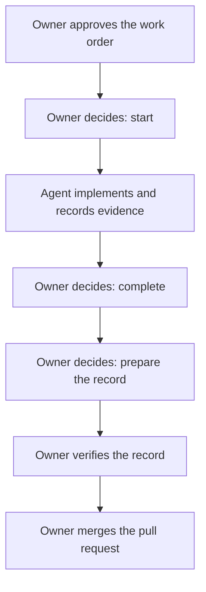
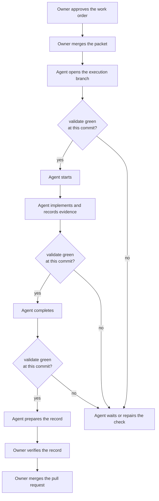

# Assessment of the delegated route, 2026-09-07

<!-- Target expertise: 3/10. The score describes the knowledge expected from the reader, not the quality or complexity of the document. -->

> Point-in-time. Measured on `main` at `1fa0610b` under the 0.16.0 root.
> This note is an operator analysis. It has no authority and changes no
> rule. The rules are `SPEC-ECP-006` and `DR-015`; the feature itself is
> explained in [The delegation class](delegation-class.md).

## Summary

A work order normally needs six human decisions between its approval and
its merge. The delegated route lets a non-human actor take three of them,
start, complete and prepare the verification record, while the pull
request's required check is green. This note compares the two routes as
they run today, measures how the repository has used the delegated one
since it shipped on 2026-08-29, and gives a verdict.

The verdict in three sentences. The route is worth keeping: it removes
three owner interruptions per work order without widening what the actor
may decide, and it leaves better evidence than the human route does. It is
opt-in and used in a minority of work orders. Its two real weaknesses are a
CI round-trip before every delegated step and a boundary that, until two
open corrective actions land, the tool enforces but GitHub does not.

## The two routes

Both routes start the same way: an owner approves the work order. Both end
the same way: an owner verifies the record and merges. The difference is
who takes the three steps in between, and what must be true first.

### Without the class

Every decision is the owner's. The agent proposes each command; the owner
says the word; the agent runs it. Approval and execution may sit on one
branch, so one pull request is enough.

### With the class

The work order carries `[delegation] class = "execution"`. The class is
read at the base of the pull request, so the packet that approves it must
be merged to `main` first. Then, before each delegated step, the actor
pushes and waits for the `validate` check to read `success` at the exact
commit it stands on.

When the check is not green, `harnessctl check` says so and names the
commit and the conclusion it read. Nothing is written and no human is
asked. When the class is present only on the branch, or the gate is not
configured, `check` names the human role as before.

### Side by side

| Step | Without the class | With the class |
| --- | --- | --- |
| Approval | Owner. May share the execution branch. | Owner. Must be merged to `main` before execution starts. |
| `check` on an approved work order | Surfaces no decision; points at the six-step start procedure, whose decide step is the owner's. | Names `delegated-executor` and emits the `transition --apply` command. |
| Start, complete, prepare | Owner decides each, without waiting for CI. | Actor runs each after a green `validate` at its head. |
| Lifecycle reason | Prose quoting the owner's word. | The class, the check name, the check-run id and the commit, then optional prose. |
| Verify, merge | Owner. | Owner. |
| Human decisions per work order | 6 | 3 |
| Pull requests per work order | 1 is possible | 2, always |

## What the repository has done with it

The template offers the table under a comment that says to delete it
unless the owner delegates. Nothing adds it by default.

| Work orders created since 2026-08-29 | 52 |
| --- | --- |
| Carrying the class | 11 |
| Of those, executed on the delegated route | 10 |
| Domains that used it | technical communication (7), execution control plane (2), CI pipeline (1), decision management (1) |
| Domains that never did | release, adoption, distribution, documentation, Pages |

Every start and completion on the ten delegated work orders is recorded by
`delegated-executor` with the check-run id and the commit. The two most
recent human-route work orders, `WO-ECP-021` and `WO-ECP-026`, were
approved and started on the same branch minutes apart, which the class
would have forbidden.

One delegated work order as a timeline, `WO-TCM-009` on 2026-09-06, local
time:

| Event | Time | Who |
| --- | --- | --- |
| Packet pull request merged | 13:10 | owner |
| Branch opened, start | 13:11 to 13:13 | actor |
| Implementation and evidence pushed | 13:30 to 13:43 | actor |
| Complete | 13:49 | actor |
| Prepare the record | 13:57 | actor |
| Verify the record | 15:26 | owner |
| Execution pull request merged | 15:42 | owner |

The actor ran 46 minutes with no owner touch. The 89 minutes before
verification are human latency, which the route does not address and
should not.

## Value

**It earns its place.**

- **Fewer interruptions, same authority.** The three delegated rights are
  the mechanical ones. Approval and verification, where judgment lives,
  stay human. Tests pin that a class on the branch only, a red or pending
  gate, a gate asserted by the caller, or any fourth right is refused.
- **Better evidence.** A delegated event names a check-run anyone can
  resolve. A human event names a quoted word.
- **Discipline as a side effect.** Because the class is read at the base,
  definition review and code review are forced into separate pull
  requests.
- **Cheap to project.** The live GitHub read added about a third of a
  second to `check` and worked without a token on this public repository.

**It costs.**

- **One CI round-trip per step.** The `validate` check takes about half a
  minute, but the observed gap between a push and the delegated step was
  2 to 8 minutes, three times per work order. The branch-opening commit on
  `WO-TCM-009` exists only to give the actor a commit with a check to read.
- **The boundary is procedural today.** The evaluator refuses; GitHub does
  not. The ruleset on `main` requires `validate` but no approving review,
  and the actor runs on the owner's credentials. Issues #354 and #355 are
  the corrective actions; until they land, an actor that ignores the
  restitution can still merge, as the incident of 2026-09-04 showed.
- **A shorter procedure.** The delegated start command jumps past the
  preflight and preview steps of the human start procedure. The transition
  still runs the governed checkpoint, so nothing unsafe is written, but the
  actor never sees the preflight reading manifest the owner would.
- **Recipe outside the chain.** Merge the packet first, export a token,
  the three commands: this lives in the `WO-ECP-024` evidence packet and
  in this note, not in the operating card. Two things bite in practice: a
  stale local `origin/main` makes the base read fail with a misleading
  refusal, and unauthenticated reads are capped at 60 per hour.
- **Silent fallback.** A misconfigured gate source makes `check` name the
  human role without saying why. This keeps `check` from blocking, but
  hides the misconfiguration.

## Recommendation

Keep the class. Make it the stated default for routine execution work
orders, and keep the human route for single-pull-request fixes where the
owner is present anyway, and for release and adoption work where the
owner's presence at each step is the point. Three follow-ups, in order:

1. Close #354 so the delegated principal cannot merge. This is the one step
   that turns the boundary from reporting into prevention.
2. Put the recipe in the operating card: packet merged first, a token in
   the environment, the three commands, and what a red reading means.
3. Either have the delegated start command emit the preflight step first,
   or state in the specification that the delegated route skips it on
   purpose, so both routes surface the same reading manifest.
