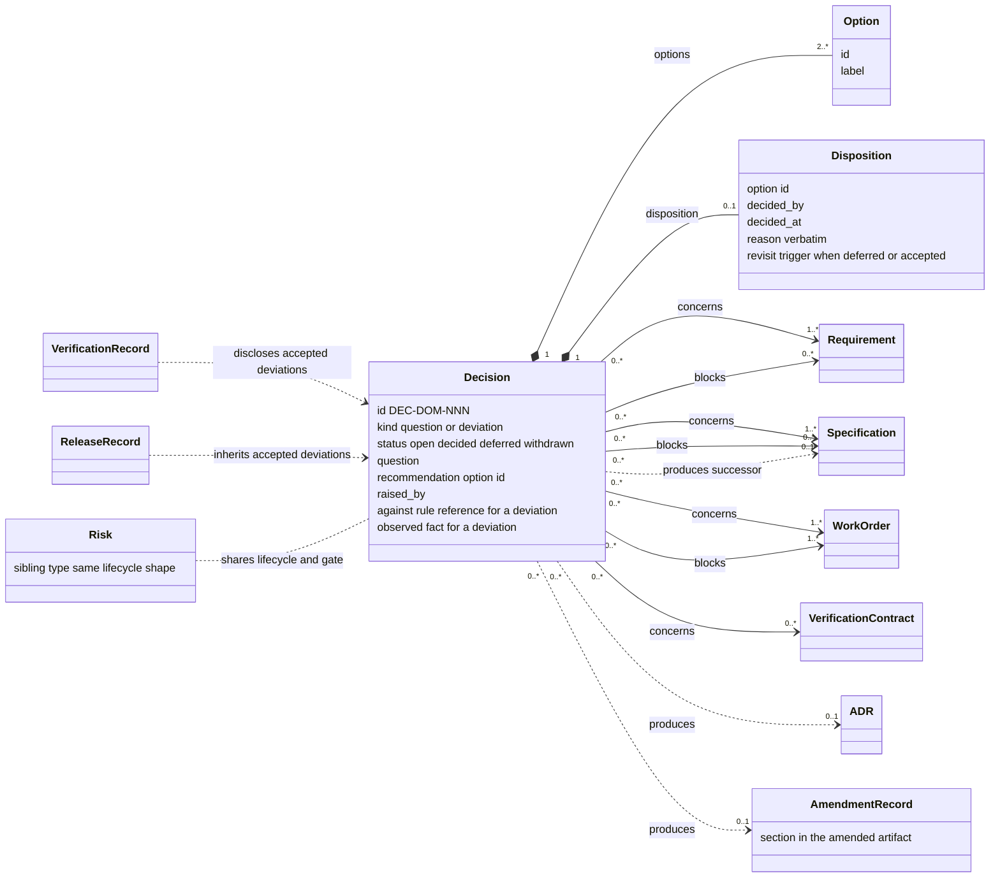
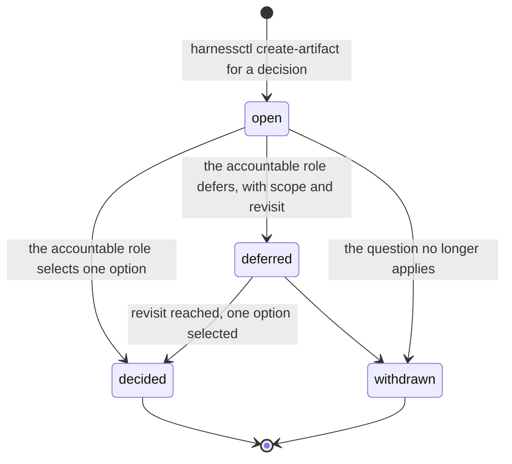
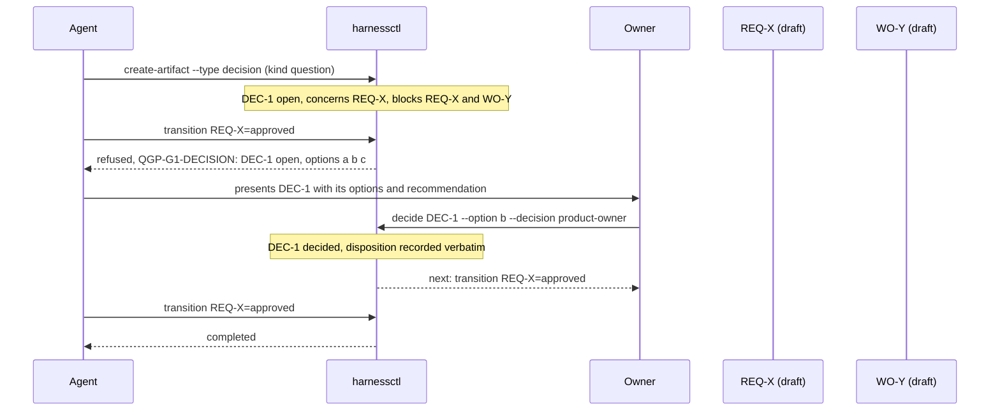
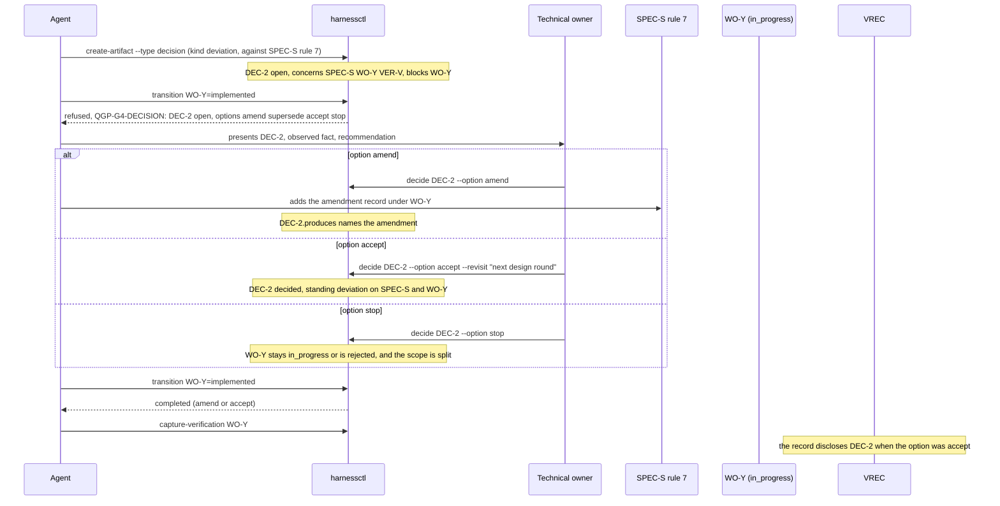

# Proposal: the decision artifact

<!-- Target expertise: 4/10. The score describes the knowledge expected from the reader, not the quality or complexity of the document. -->

> Proposal, written 2026-09-03. This note has no authority. It changes no
> rule, gate or decision right. Nothing in it exists until an approved work
> order creates it.

## Summary

Today an open decision is prose. It lives in the `## Open decisions` section
of the artifact that has the question. It has no identifier, no owner, no
state and no relation to the other artifacts it affects. The tool checks it
once, at approval, and only asks that the section reads `None`. A decision
that appears during execution has no home at all.

This note proposes one new artifact type: the **decision** (`DEC-`). A decision has a question, a closed set of options and a recommendation. It
names the role that must answer. It has typed relations to the artifacts it
concerns and blocks. While it is `open`, the artifacts it blocks cannot change state. A
human answer moves it to `decided`, and the answer is recorded verbatim. A
`deferred` state exists, but only with a scope and a revisit trigger.

The same artifact has two kinds:

- **question**: an ambiguity met while authoring or planning;
- **deviation**: an implementation cannot meet one rule of one
  specification under one work order.

Section 2 gives the model as a class diagram. Section 3 gives the states.
Section 4 shows, step by step, how a decision changes what happens to the
other artifacts: a requirement, a specification, a work order, a
verification contract and a record. Section 5 lists the guards. Section 6 lists the cost.

## Contents

1. [Why an artifact](#1-why-an-artifact)
2. [The model](#2-the-model)
3. [States](#3-states)
4. [How a decision influences other artifacts](#4-how-a-decision-influences-other-artifacts)
5. [Guards](#5-guards)
6. [What it costs](#6-what-it-costs)
7. [What is authoritative](#7-what-is-authoritative)

## 1. Why an artifact

An artifact gives a decision five things prose cannot give it:

| Need | Prose today | Artifact |
| --- | --- | --- |
| Identity | none | `DEC-DST-001` |
| Owner | implied | the role that holds the decision right |
| State | the section reads `None` or not | `open`, `decided`, `deferred`, `withdrawn` |
| Reach | one file | `concerns` and `blocks` any artifact |
| Record | a reason field, if someone copies it | the question, the options and the verbatim answer, kept |

Two facts from this repository argue for it. The RISK packet on pull
requests #156, #158 and #204 has the same shape: raise, dispose by the stage
owner, gate the threatened stage. And the way the owner already decides, by
selecting a presented option, is recorded in every reason field but written
in no rule. A decision artifact makes both formal with one mechanism.

## 2. The model

Read the arrows from the decision. `concerns` says which artifacts the
question is about. `blocks` says which artifacts cannot change state while
the decision is `open`. `produces` says what the answer created: an ADR, an
amendment record, or a successor specification. The dotted arrows from the
records say that an accepted deviation stays visible on every record that
covers the work.

Field rules:

- `kind = "question"` needs `question`, at least two options and a
  `recommendation`.
- `kind = "deviation"` also needs `against` (one artifact and one rule, for
  example `SPEC-DST-014#rule-7`) and `observed` (what cannot be met, in one
  or two sentences). Its options are a closed set: `amend`, `supersede`,
  `accept`, `stop`.
- `disposition` is written by the transition, never by hand. It records the
  option id, the role, the time, and the reason verbatim. When the option is
  `accept` or the state is `deferred`, `revisit` is required.

## 3. States

- `open` blocks every transition of every artifact in `blocks`.
- `deferred` blocks only the transitions its scope names. Example: a work
  order may start but not complete.
- `decided` and `withdrawn` block nothing. Both are kept. A decided
  deviation whose option was `accept` stays visible as a standing deviation
  until its revisit trigger is met and a new decision closes the gap.

Who decides: the role that holds the decision right for the blocked
artifact. For a definition that is `DR-DEFINITION-DECIDE`, the owner named
for that artifact. For a work order that is the engineering owner. For a deviation the decider is always the owner of the specification named
in `against`, not the owner of the work order. An accepted deviation changes
what the specification means.

## 4. How a decision influences other artifacts

### 4.1 A question during authoring

Effects on the other artifacts:

| Artifact | While `DEC-1` is open | After `decided` |
| --- | --- | --- |
| `REQ-X` | cannot leave `draft`; its `## Open decisions` section lists `DEC-1` | may be approved; the section lists `DEC-1 (decided)` or `None` |
| `WO-Y` | cannot be approved | may be approved |
| `ADR` | none | created by the agent under `WO-Y` when the answer is an architectural decision; `DEC-1.produces` names it |
| Explorer | `DEC-1` appears in the "in flight" tile with its age and its decider | `DEC-1` appears in the decision trail of `REQ-X` |

### 4.2 A deviation during execution

Effects on the other artifacts:

| Artifact | While `DEC-2` is open | `amend` | `accept` | `stop` |
| --- | --- | --- | --- | --- |
| `SPEC-S` | unchanged | gains an amendment record under `WO-Y`; the rule now describes the implementation | unchanged text; carries a standing deviation marker that names `DEC-2` and its revisit | unchanged |
| `WO-Y` | cannot reach `implemented` | may complete | may complete; its evidence lists `DEC-2` | stays `in_progress` until the scope is split, or is rejected |
| `VER-V` | unchanged | verifies the amended rule | its evidence must disclose the gap, as `VREC-TCM-002` discloses its reviewer gap today | unchanged |
| `VREC` | cannot be captured for `WO-Y` | ordinary record | ordinary record whose evidence names `DEC-2` | none |
| `RLS` | none | ordinary release | the release inherits the standing deviation; the Explorer shows it on the proof block | none |
| Explorer | `DEC-2` in the in-flight tile; the record panel of `SPEC-S` and `WO-Y` shows it | the amendment in the decision trail | the standing deviation on `SPEC-S`, `WO-Y`, the record and the release, with its revisit | the refusal in the decision trail |

### 4.3 The revisit

When the revisit trigger of an accepted deviation is reached (a release, a
date, or an artifact reaching a state), the validator raises a maintenance
warning on `SPEC-S`: "accepted deviation `DEC-2` past its revisit". The
honest moves are a new decision that amends or supersedes the rule, or a
new acceptance with a new trigger. A second accepted deviation against the
same rule raises a second warning: the rule, not the implementations, is
probably wrong.

## 5. Guards

1. **Fail closed.** An `open` decision blocks; no field unblocks it. A
   priority may order the queue. It never opens a gate.
2. **Deferral is a decision.** `deferred` needs a scope and a revisit
   trigger, and the accountable role. Without both the transition refuses.
3. **Acceptance is time-bounded.** `accept` without `revisit` refuses.
4. **The decider owns the rule.** A deviation is disposed by the owner of
   the specification in `against`, never by the work order alone.
5. **A threshold keeps ceremony down.** A question becomes an artifact when
   it blocks a transition, concerns more than one artifact, or must survive
   approval. Below that, the agent asks and the answer goes in the reason
   field, as today. The `## Open decisions` section lists decision ids or
   `None`, never prose.
6. **Nothing is deleted.** `decided` and `withdrawn` decisions stay. They
   join the refusals on the record, and raise-to-dispose time becomes a
   metric beside lead time.
7. **One lifecycle for RISK and DEC.** Both are gating items: raise,
   dispose, gate. One lifecycle family, one gate, one Explorer panel.

## 6. What it costs

- A template `DECISION.template.md` and a layout registry entry
  (`docs/engineering/<domain>/decisions/DEC-DOM-NNN.md`).
- One lifecycle family in `WORKFLOW.json`, shared with RISK.
- One gate predicate in `QUALITY_GATES.json`, evaluated at every transition
  of a blocked artifact, plus the revisit warning.
- One decision right in `DECISION_RIGHTS.md`: `DR-DECISION-DISPOSE`.
- `concerns`, `blocks` and `produces` in `TRACEABILITY.md`, admitted toward
  any type; two validator error codes.
- `harnessctl decide` so that a disposition is one command, and
  `create-artifact --type decision` with the option table scaffolded.
- Explorer: the in-flight tile reads decisions; the record panel shows the
  decision trail and standing deviations; the release proof block inherits
  them.
- Tests, the notes, and a paragraph in `ARTIFACT_AUTHORING.md` for the
  threshold.

The size is close to the delegation-class work order. The packet is two requirements (raise and block; dispose and defer), one
specification, one verification contract, one ADR and one work order. The
ADR positions the decision against the architecture ADR and the RISK. It should follow, or join, the RISK
packet so that the two share their machinery.

## 7. What is authoritative

`ENGINEERING_HARNESS.md` and the policies it routes to are the managed
contract. The formal artifacts under `docs/engineering/` carry every
decision. This note proposes a model. Nothing here exists until an approved
work order creates it.
