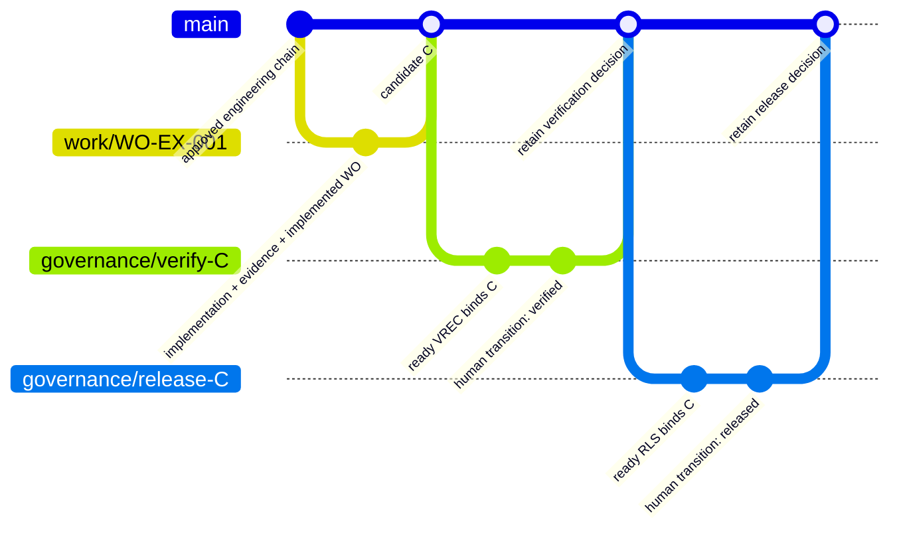
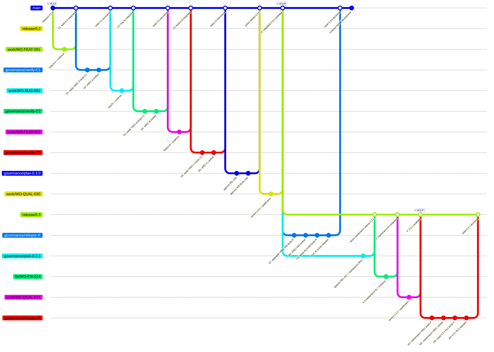

# Illustrative Git branching model

<!-- Target expertise: 6.5/10. The score describes the knowledge expected from the reader, not the quality or complexity of the document. -->

> This is one practical repository-policy example. SE Harness does **not** require this branch model, branch names, merge method, default branch name, release cadence, or hosting configuration.

## Policy boundary

SE Harness governs artifact lineage, bounded work, retained evidence, accountable decisions, and exact commit provenance. Repository owners decide how those controls map to Git and may enforce additional policy through repository configuration and hosting settings.

This example uses a trunk-based model with maintenance branches:

- `main` is the only integration branch for normal development and the source of each new release line;
- approved features and fixes use short-lived work branches;
- completed changes may be integrated and verified without immediately creating a release;
- later governance commits retain VREC and RLS records while those records continue to identify the candidate they assess;
- `release/x.y` branches are created from already released commits only to maintain supported release lines;
- maintenance branches are not used for feature development, stabilization, or pre-release integration.

Maintenance patch releases originate from their supported `release/x.y` branch. New minor or major release lines continue to originate from `main`.

Every pull request subject to the installed GitHub workflow contains exactly one standalone scope declaration, for example:

```text
Harness-Work-Order: WO-FEAT-001
```

The declaration, branch names, and hosting workflow are illustrative repository choices. They do not replace approved artifacts or accountable decisions.

## Example 1: one change from implementation to release

Start with this compact example to understand the essential commit relationship before reading the more realistic multi-change scenario.



The sequence is:

1. An approved work order authorizes the short-lived implementation branch.
2. The implementation, retained evidence, and honest `implemented` work-order state are integrated as candidate C.
3. A later governance commit retains a ready VREC that names C.
4. An accountable assurance decision transitions that VREC to `verified` without changing the commit it names.
5. A later ready RLS also names C, and an accountable release decision may transition it to `released`.
6. Separately authorized release automation may then create an immutable tag at C and publish or deploy the assessed payload.

The tag points back to **candidate C**, not automatically to the most recent governance commit. The later commits retain decisions about C; they are not the payload those decisions assessed.

This first example deliberately omits accumulated changes and maintenance branches. Example 2 applies the same rules to a normal delivery stream.

## Example 2: continuous integration, delayed release, and supported maintenance

<!-- This walkthrough is written for readers at approximately expertise level 5/10. -->

Version `0.2.3` has already been released. The team then integrates a feature, a bug fix, and another feature into `main`. Each change receives an assurance decision, but none forces a release.

Later, the owner selects those accumulated changes for version `0.3.0`. A release contract defines the payload, a qualification work order creates one integrated candidate on `main`, and a new aggregate VREC assesses that exact candidate. After release authorization, the team creates `release/0.3` from the released commit so compatible `0.3.z` fixes can be maintained while normal development continues on `main`.



The asterisks express timing that the topology cannot show directly:

- `v0.3.0` and `release/0.3` are created only after G10, but both point back to candidate R;
- `v0.3.1` is created only after M4, but points back to maintenance candidate P.

The later governance commits retain decisions about R and P. They are not the payload those decisions assessed.

### Phase 1: integrate feature A

`WO-FEAT-001` authorizes a bounded feature change. Its short-lived branch contains the implementation, retained evidence, and honest `implemented` work-order state. After review, the change is integrated into `main` as C1.

C1 is not automatically verified because its tests pass or its pull request is merged.

### Phase 2: retain and approve feature A verification

G1 retains a ready verification record in repository history. When all covered work orders share one domain, the canonical location is `docs/engineering/<domain>/verification-records/`. When they span domains, the canonical location is the repository-level `docs/engineering/verification-records/`:

```text
VREC-A ──> C1
```

C1 cannot contain a record naming C1's own commit ID, so the record necessarily appears in a later governance commit. At G2, an accountable assurance owner transitions the record from `ready` to `verified`. It continues to identify C1.

This assurance checkpoint does not create a release, tag, package, or deployment.

Canonical placement is an organization and diagnostic convention. A record at another valid location produces the nonblocking `W013` advisory, never a validation error, and the harness does not relocate repository-owned artifacts. Paths do not establish authority; stable IDs, typed relations, lifecycle state, exact commit provenance, retained evidence, and accountable decisions do.

### Phase 3: integrate and verify more changes

The bug fix and feature B follow the same pattern:

```text
VREC-A ──> C1
VREC-B ──> C2
VREC-C ──> C3
```

C1, C2, and C3 are independently integrated and verified without creating a new product version. This lets validated work accumulate on the trunk while the release owner retains control over release timing.

Here, **integrated** means present on `main`. It does not necessarily mean published to users or deployed to production.

### Phase 4: select release 0.3.0

After C3, the owner decides to release the accumulated work as `0.3.0`. The planning governance change introduces and approves:

- `REL-030`, the release contract defining the exact `0.3.0` payload and gates;
- `WO-QUAL-030`, the work order authorizing versioning and integrated release qualification.

The contract gates the incremental release-bearing work:

```text
WO-FEAT-001
WO-BUG-001
WO-FEAT-002
WO-QUAL-030
```

Work already released in `0.2.3` forms the baseline and is not repeated. Governance-only work orders used to retain or transition records are not release payload.

### Phase 5: create integrated candidate R

`WO-QUAL-030` may authorize:

- changing the version to `0.3.0`;
- confirming the selected payload;
- running integrated tests and compatibility checks;
- building and inspecting distributions;
- checking reproducibility;
- retaining release-qualification evidence and stop conditions.

After that work is integrated into `main`, commit R becomes the exact release candidate. `WO-QUAL-030` does not contain either the aggregate VREC or the release record; both must be retained later because they identify R.

### Phase 6: verify the aggregate at R

The earlier records remain useful assurance history, but they identify different commits. Git ancestry alone does not prove that their combined behavior remains correct at R.

G7 therefore retains a new aggregate VREC:

```toml
commit = "R"

[relations]
verifies_work_order = [
  "WO-FEAT-001",
  "WO-BUG-001",
  "WO-FEAT-002",
  "WO-QUAL-030",
]
conforms_to = [
  "VER-FEAT-001",
  "VER-BUG-001",
  "VER-FEAT-002",
  "VER-QUAL-030",
]
```

The record also identifies the retained evidence applicable to every selected work order. G8 records the accountable assurance decision that transitions `VREC-030` from `ready` to `verified`. The record still points to R.

The aggregate VREC re-evaluates the release-bearing work at R. It does not combine `VREC-A`, `VREC-B`, and `VREC-C`, because those records identify C1, C2, and C3.

In this example the selected work orders span domains, so the canonical aggregate-record location is repository-level:

```text
docs/engineering/verification-records/VREC-030.md
```

Keeping the record elsewhere would produce `W013`, not invalidate the record or grant authority to move it.

### Phase 7: make the release decision

After `VREC-030` is verified, G9 retains the ready release record:

```toml
version = "0.3.0"
commit = "R"
tag = "v0.3.0"

[relations]
satisfies = ["REL-030"]
includes_verification = ["VREC-030"]
releases_work = [
  "WO-FEAT-001",
  "WO-BUG-001",
  "WO-FEAT-002",
  "WO-QUAL-030",
]
```

G10 records the accountable release owner's transition of `RLS-030` from `ready` to `released`. The required agreement is:

```text
work gated by REL-030
        =
work verified by VREC-030 at R
        =
work released by RLS-030 at R
```

Previous VRECs and release contracts remain immutable historical records. They are not copied into the new release record.

Release-record placement follows the same domain rule, calculated from `releases_work`. Because this example spans domains, the canonical location is:

```text
docs/engineering/releases/RLS-030.md
```

As with a VREC, a different valid location is a `W013` advisory only. The RLS derives authority from its ID, declared typed relations, exact candidate, lifecycle decision, and accountable owner—not from its directory.

### Phase 8: tag R and create its maintenance branch

After G10, separately authorized automation or humans may tag R, publish artifacts derived from R, and create `release/0.3` from R if the `0.3` line will be supported:

```text
R ── tag v0.3.0
│
├── main ───────── normal development continues
│
└── release/0.3 ── supported 0.3.z maintenance only
```

`release/0.3` is not used for new features, release stabilization, or pre-release integration.

### Phase 9: maintain release 0.3

A compatible fix for the supported line begins with approved maintenance governance. `REL-031` gates the exact `0.3.1` payload, `WO-FIX-014` authorizes the fix and selects `VER-FIX-014`, and `WO-QUAL-031` authorizes the `0.3.1` version change and integrated patch qualification under `VER-QUAL-031`.

The fix is first integrated into `release/0.3` as F. The qualification work then creates exact maintenance candidate P. A later maintenance VREC binds P and declares both the work and verification contracts:

```toml
commit = "P"

[relations]
verifies_work_order = ["WO-FIX-014", "WO-QUAL-031"]
conforms_to = ["VER-FIX-014", "VER-QUAL-031"]
```

After accountable verification, the `0.3.1` RLS satisfies `REL-031`, includes that maintenance VREC, releases both work orders at P, and may be transitioned to `released`. The same three-way agreement applies to a maintenance release even though its VREC is small rather than a large aggregate:

```text
work gated by REL-031
        =
work verified by the maintenance VREC at P
        =
work released by the 0.3.1 RLS at P
```

Only after that decision may separately authorized automation create `v0.3.1` at P.

If the defect also affects `main`, the fix is normally forward-ported through a separate work order and pull request. A cherry-pick or rewritten implementation has a different commit identity, so verification of P does not automatically verify the corresponding `main` commit.

## What this example demonstrates

- Changes may be integrated and verified without immediately creating a release.
- A VREC is retained after the candidate it identifies.
- Verification is an assurance decision, not a release decision.
- Every normal or maintenance release has a release contract selecting its intended incremental payload.
- A qualification work order authorizes versioning and integrated release checks for both new release lines and maintenance patches; it is not the RLS.
- A release needs a new aggregate VREC for one exact integrated candidate.
- Earlier per-change VRECs remain historical assurance but do not replace aggregate verification at the release commit.
- An RLS records release authority but does not itself create a tag or publish a package.
- New release lines originate from `main`.
- Maintenance branches originate from released commits, remain isolated from normal development, and use the same contract/VREC/RLS agreement as releases from `main`.

## What can vary in another repository

A repository may use another default-branch name, squash or rebase integration, no supported maintenance branches, a different review host, or another declared branching policy. It remains compatible when repository policy preserves approved bounded work, explicit review scope, retained evidence, unambiguous candidate identity, and VREC/RLS records that bind the revision actually assessed.

Installation creates a workflow and pull-request template, but it does not configure branch protection, required checks, CODEOWNERS, permissions, merge rules, maintenance policy, or environments on the hosting service. Accountable repository administrators own those controls.

See [operational phasing](harness-operational-phasing.md) for lifecycle timing and the [practical example](harness-lineage-example.md) for commands and artifact relationships.
