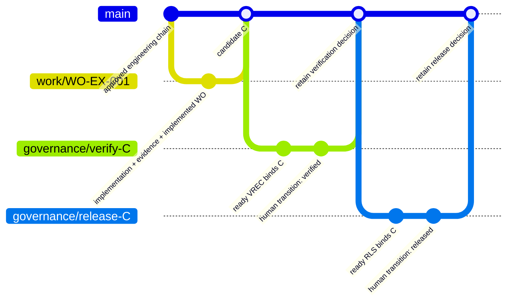

# Illustrative Git branching model

<!-- Target expertise: 6.5/10. The score describes the knowledge expected from the reader, not the quality or complexity of the document. -->

> This is one practical repository-policy example. SE Harness does **not** require this branch model, branch names, merge method, default branch name, release cadence, or hosting configuration.

## Policy boundary

SE Harness governs artifact lineage, bounded work, evidence, and exact commit provenance. A repository owner chooses how those controls map to Git and may enforce additional supported policy through repository configuration and hosting settings.

The single example below uses:

- `main` as the integration branch;
- one short-lived work branch for one approved implementation work order;
- a pull request with exactly one standalone `Harness-Work-Order: WO-...` field;
- later governance commits or pull requests for VREC and RLS decisions;
- an immutable release tag placed on the verified candidate commit C.

These are illustrative choices, not universal harness requirements.

## Example flow



The authorized release tag points back to **candidate C**, not automatically to the most recent governance merge. The later commits retain decisions about C; they are not the payload those decisions assessed.

## Steps

1. Approve the engineering chain and bounded work order before creating implementation changes.
2. Create a short-lived work branch from the repository's current integration branch.
3. Run start preflight, implement inside scope, retain evidence, and update the work order through `in_progress` to `implemented` before selecting the candidate.
4. Open a pull request whose body contains exactly one standalone declaration:

   ```text
   Harness-Work-Order: WO-EX-001
   ```

5. Let review preflight and repository CI produce observations. Human reviewers still decide whether the diff stays semantically within scope.
6. Merge using the repository's selected strategy. Identify the resulting clean integrated revision as candidate C.
7. Prepare and review the ready VREC in later governance history while keeping `commit = C`.
8. After accountable verification, prepare and review the ready RLS, again keeping `commit = C`.
9. After release authorization, create the immutable release tag at C. A GitHub Release, PyPI publication, or deployment is a separately governed external action.

## What can vary in another repository

Another repository may use trunk-based development, long-lived release branches, a different integration-branch name, rebase or squash merges, or a hosted review system other than GitHub. It remains compatible if repository policy preserves the harness invariants: approved bounded work, explicit review scope, retained evidence, an unambiguous candidate commit, and VREC/RLS records that bind the revision actually assessed.

Installation creates a workflow and pull-request template, but it does not claim to configure branch protection, required status checks, CODEOWNERS, permissions, merge rules, or environments on the hosting service. Accountable repository administrators own those controls.

See [operational phasing](harness-operational-phasing.md) for lifecycle timing and the [practical example](harness-lineage-example.md) for commands and artifact relationships.
