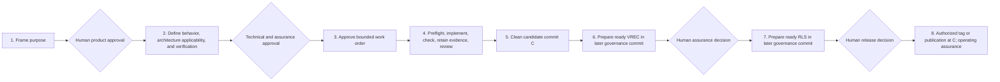

# SE Harness operational phasing

<!-- Target expertise: 6/10. The score describes the knowledge expected from the reader, not the quality or complexity of the document. -->

> This note explains timing. It does not replace `docs/engineering/WORKFLOW.md`, `DECISION_RIGHTS.md`, `QUALITY_GATES.md`, or `TRACEABILITY.md`.

## Lifecycle at a glance



Automation assists between decision points. Blueprints, test results, a clean Git state, validation, and CI are evidence or controls; none substitutes for the human diamonds.

## Phase-by-phase guide

| Phase | What exists or happens | Typical authority boundary |
| --- | --- | --- |
| 1. Purpose | Draft intent, capability, and observable requirements explain why the change exists. | Product or domain owners approve purpose and obligations. |
| 2. Engineering definition | Specifications define behavior. Architecture addresses only significant requirement drivers and conforms to specifications. Its decision assessment either requires deciding ADRs or records why no significant decision exists. Verification contracts define checks. | Technical owners approve specification and architecture decisions; assurance owners approve verification contracts. |
| 3. Work authorization | A work order selects requirements, specifications, applicable architecture/ADRs, and verification contracts; it defines scope, exclusions, delegated decisions, stop conditions, and whether commit-bound verification is explicitly `required` or `not_required`. | An accountable owner records the assurance rationale; an engineering owner approves the bounded work. Approval is permission to start, not proof of completion. |
| 4. Execution and review | The coding agent runs start preflight, reads its manifest, sets the work order `in_progress`, implements within scope, runs repository checks, retains evidence, validates the graph, inspects current attention, generates Explorer, and performs review preflight. | The agent may act only inside approved scope. Reviewers judge semantic fit and evidence quality. |
| 5. Candidate | One clean candidate commit **C** contains implementation, retained evidence, and the honest `implemented` work-order state. | C is the revision later assurance and release records must name. |
| 6. Verification | For work classified `required`, inspection can expose missing follow-up. From clean C, automation may prepare a `ready` VREC. It is retained in a later governance commit. An assurance owner reviews its evidence and may transition it to `verified`. When the same accountable owner takes the preparation and verification decisions in one session, both may land in one governance commit: `capture-verification` writes the record, `transition --apply` accepts it before it is tracked, and neither contains the hash of its own commit, so the record still binds the earlier C (issue #280). | `ready` is a proposal; `verified` is a human assurance decision about C. A `not_required` classification removes the obligation but never prohibits a later explicitly scoped VREC. |
| 7. Release decision | After eligible verification and release-contract checks, automation may prepare a `ready` RLS, again in a later governance commit. The release owner may transition it to `released`. | The RLS and all included VRECs bind the same C. `released` records authorization; it does not prove that an external action succeeded. |
| 8. Promotion and operation | Authorized automation or humans may tag C, create a GitHub Release, publish the already verified distribution, or deploy it. Operational evidence is evaluated against operating contracts. | Tags, publication, deployment, hosting controls, and service operation are external actions governed by repository policy and accountable owners. |

## When verification is refused

An assurance owner refuses verification by explicitly applying the `ready -> rejected` VREC transition with a non-empty rationale. The decision changes only the selected VREC and appends its event. The work order honestly remains `implemented`: that status records completed work and retained evidence, not correctness.

Release is then blocked by formal checks. A work order cannot claim `verified` or `released` without eligible direct coverage. `prepare-release` accepts only verified VRECs, their commit identities must match the RLS, and released-work coverage must be exact. A ready RLS may be explicitly released or rejected; either decision changes only that RLS and appends its lifecycle event.

If the generated ready VREC was never committed, no formal VREC enters repository history. If it was committed, refusal is retained as `rejected_at`, `rejected_by`, `rejection_reason`, and the matching lifecycle event; it is never deleted or rewritten. A distinct ready record may instead become `superseded` only after one verified or released successor covers all of its work. The [conceptual model](harness-uml-model.md#important-multiplicities-and-invariants) shows that successor relation. Explorer warning `W-REV-004` is emitted only when such covering verified or released records already exist; it is a derived prompt and never chooses or performs the transition.

A defective payload is corrected in a new clean candidate with its own bounded work and evidence; the old commit is not repaired retroactively. The [illustrative branching model](harness-branching-model.md#when-assurance-refuses-a-candidate) explains the Git consequence. If a requirement, specification, ADR, work order, or another definition artifact is itself wrong, an accountable owner may use `rejected` for that artifact rather than for the VREC. Rejected artifacts leave active coverage, so any still-active dependants must also be reconciled until the graph validates again.

## Why the records come later

A Git commit cannot contain its own hash. Therefore the record that names candidate C cannot be part of C:

```text
C    implementation + evidence + implemented work-order state
G1   ready VREC -------------------------------> C
G2   VREC transitioned to verified -----------> C
G3   ready RLS --------------------------------> C
G4   RLS transitioned to released ------------> C
T    authorized immutable tag ----------------> C
```

G1 through G4 are governance history. They do not become a new release candidate merely because they occur later. If implementation or evidence changes after C, select a new candidate C2 and capture replacement provenance rather than editing the old claim to point somewhere convenient.

## Commands by phase

The coding agent normally operates these commands; the accountable human makes the adjacent decision.

| When | Agent-operated command | What it does not do |
| --- | --- | --- |
| Before editing | `harnessctl doctor .` and `harnessctl preflight . --work-order WO-EX-001 --phase start` | Does not authorize the work order or prove comprehension. |
| During and before review | repository-specific checks, `harnessctl validate .`, `harnessctl inspect .`, `harnessctl dashboard .`, and `harnessctl preflight . --work-order WO-EX-001 --phase review` | `validate` supplies gate-oriented exit behavior; a successfully produced `inspect` report can still show an invalid graph or unresolved attention. Neither judges semantic correctness or approves the pull request. |
| At clean candidate C | `harnessctl capture-verification ...` | Prepares only a `ready` VREC; does not verify, commit, or push. |
| After human verification and release authorization | `harnessctl prepare-release ...` | Prepares only a `ready` RLS; does not release, tag, publish, or deploy. |

## Formal gates versus Explorer readiness

Only the exact `QG-*` IDs in `docs/engineering/QUALITY_GATES.md` identify
normative gates. The G0-G5 portions group related gates for reporting and do not
replace those IDs.

Harness Explorer uses G0-G5 labels for a differently grouped, derived
per-work-order readiness view. Use Explorer to navigate traceability and
anomalies; use the exact managed `QG-*` predicate for a workflow decision. An
Explorer label is not a gate result and cannot change selected scope.

For one possible mapping onto Git branches and pull requests, continue to the [illustrative branching model](harness-branching-model.md).
