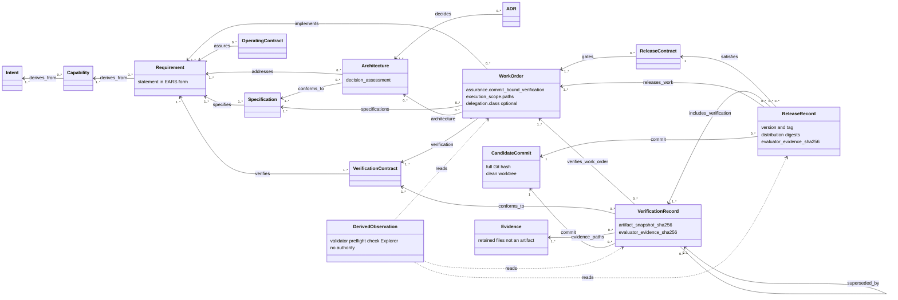

# Simplified SE Harness data model

<!-- Target expertise: 6/10. The score describes the knowledge expected from the reader, not the quality or complexity of the document. -->

> This model explains authoring as of SE Harness 0.14.0. It is a conceptual
> model, not an implementation class diagram and not a policy source. The
> rules live in `ENGINEERING_HARNESS.md` and the managed policies it routes
> to. Where this note and a policy differ, the policy is right.

## Summary

SE Harness stores engineering authority as Markdown files with TOML front
matter under `docs/engineering/`. Each file is one **artifact**. Each
artifact has a type, a lifecycle state, and typed **relations** to other
artifacts. The relations form a graph. The validator checks the graph. The
tool computes the next legal step from it.

This note shows the graph at a glance, then walks it in three parts:

1. **Definition**: intent, capability, requirement, specification,
   architecture, decision record, verification contract. These say what
   must be true and how it will be checked.
2. **Authorized work**: the work order. It grants bounded permission to
   change the repository.
3. **Records**: the verification record and the release record. Each binds
   work, evidence and one exact commit. A human decision moves each one from
   `ready` to `verified` or `released`.

Two things sit beside the graph. **Evidence** is retained files, not an
artifact. **Derived observations** (validator, preflight, `check`, the
Explorer) read the graph and have no authority.

## Model at a glance



Read each arrow from the artifact that declares the relation. A
specification says which requirements it `specifies`. An architecture says
which requirements it `addresses` and which specifications it
`conforms_to`. A release record says which contract it `satisfies`.

Every artifact also carries a list of **lifecycle events**. Each event
records `from`, `to`, `decided_at`, `decided_by` and a verbatim `reason`.
The events are the audit trail of every decision.

## 1. Definition

```text
Intent -> Capability -> Requirement <- Specification.specifies
                                  <- Architecture.addresses
                                  <- VerificationContract.verifies
                            Specification <- Architecture.conforms_to
                            Architecture  <- ADR.decides
```

- An **intent** explains the approved outcome.
- A **capability** describes what an actor can do when the intent is real.
- A **requirement** states one observable obligation. Its `statement` uses
  the EARS form: `WHEN <event>, THE SYSTEM SHALL <response>.`
- A **specification** defines the exact behaviour for one or more
  requirements.
- An **architecture** is not a wrapper around every requirement. It
  addresses only the requirements that drive boundaries, interfaces, data
  ownership, trust, deployment, technology or quality tactics.
- Every architecture carries a `decision_assessment`. The outcome is either
  `adr_required` or `no_significant_decision`. `adr_required` needs at least
  one active **ADR** whose `decides` relation names the architecture.
  `no_significant_decision` needs an accountable rationale and no active
  trigger. This rule records the important decisions without producing one
  ADR per requirement.
- A **verification contract** defines how requirements are checked
  independently of the implementation.

Older completed artifacts may still carry the compatibility-era
`constrains` relation. New authoring uses `addresses` and `conforms_to`.
Historical records are not rewritten to modernize their words.

Definitions move `draft -> approved`. An approved definition may later move
to `implemented`. A definition that is replaced moves to `superseded` and
names its successor in a `## Supersession` section. A definition can be
`rejected`. A replaced definition and its successor must not leave a
requirement without active specification and verification coverage; the
validator refuses the gap (`E007`, `E008`).

## 2. Authorized work

A **work order** selects a bounded slice of the graph:

```text
WorkOrder.implements      -> Requirement(s)
WorkOrder.specifications  -> Specification(s)
WorkOrder.architecture    -> applicable Architecture(s) and required ADR(s)
WorkOrder.verification    -> VerificationContract(s)
```

A work order omits its `architecture` relation when no active architecture
addresses any implemented requirement. When architecture applies, the work
order selects every applicable architecture and each ADR its decision
assessment requires. The authoritative
[artifact applicability catalog](../engineering/TRACEABILITY.md#artifact-applicability-catalog)
defines the complete required, omission and reuse rules for every type.

Since the 0.4.1 version of this note, a work order gained three tables:

| Table | What it says | Who reads it |
| --- | --- | --- |
| `[assurance]` | `commit_bound_verification = "required"` or `"not_required"`, with a rationale and the deciding role. `required` means a later decision will rely on the changed state, so a verification record must follow. | the gates at approval and completion |
| `[execution_scope]` | the exact paths and directory prefixes the work may change | the handoff checkpoint, which compares them with the changed paths |
| `[delegation]` (optional) | `class = "execution"`: a non-human `delegated-executor` may start the work, complete it and prepare its record, only while the required pull-request check is green for the exact head | the delegation gate; the class is read at the pull request's base |

The work order grants permission. It is not proof that the work is correct.
Its lifecycle is:

```text
draft -> approved -> in_progress -> implemented -> verified -> released
                 \-> rejected
```

`implemented` is the honest end of the work itself. `verified` and
`released` follow only when a record covers the work order. The commit that
holds the implemented work and its retained evidence is the **candidate
commit**, written **C** below.

## 3. Records

### Evidence

Evidence is shown in the diagram to explain its role. It is not a typed
artifact. It is a set of retained files. Examples: a verification report, an
analysis result, a review record, or the evidence packet that
`harnessctl evidence` writes for a checkpoint
(`evidence/WO-xxx/WO-xxx-handoff.md` and `handoff.json`). Every evidence
file lives in the repository at commit C.

### Verification record

A **verification record** (`VREC`) binds:

- one or more work orders, through `verifies_work_order`;
- every verification contract those work orders require, through
  `conforms_to`;
- retained `evidence_paths` for each work order;
- one full Git commit hash (`commit`), a `worktree_state` of `clean`, the
  digest of the formal artifact tree at that commit
  (`artifact_snapshot_sha256`), and the digest of the released evaluator's
  identity that measured it (`evaluator_evidence_sha256`).

`harnessctl capture-verification` prepares the record in state `ready`.
Only an accountable assurance decision moves it to `verified`. A green
validator, a passing preflight, a green CI run or a dashboard is a derived
observation. None of them can make that transition.

```text
ready -> verified
      -> rejected
      -> superseded   (names exactly one verified or released successor)
```

A superseded record keeps its facts unchanged and names its successor
through `superseded_by`. The successor must cover every original work
order. A superseded record never qualifies a release.

### Release record

A **release record** (`RLS`) binds:

- exactly one eligible **release contract**, through `satisfies`; the
  contract `gates` the work orders a release may include;
- one or more verified records, through `includes_verification`;
- the released-work set, through `releases_work`; it equals the union of
  the work covered by the included records;
- the same candidate commit as every included record, plus the `version`,
  the `tag`, the evaluator evidence digest, and a `[distribution]` table
  with the names and digests of the built wheel and sdist.

`harnessctl prepare-release` prepares the record in state `ready`. Only a
release owner moves it to `released`, or to `rejected`.

### Why records live in later commits

A record contains the hash of commit C. A commit cannot contain its own
hash. The record therefore lives in a later governance commit that points
back to C. The work order's own transitions to `verified` and `released`
follow the record's decision.

## 4. Operating contract

An **operating contract** (`OPS`) states a continuing obligation: service,
support, observability or operational assurance. It `assures` one or more
requirements. An active claim needs an active requirement and at least one
completed work order that implements it. Where verified provenance is
required, that work must be covered by a verified or released record. The
claim does not approve the contract and does not prove continuing
conformance.

## 5. Derived observations

The validator, `preflight`, `check` and the Explorer read the graph. They
report errors, warnings, gate states, readiness and next steps. They hold
no authority. A passing observation is a precondition for a decision, never
the decision.

## Important multiplicities and invariants

| Rule | Why it matters |
| --- | --- |
| Every active requirement has active specification and verification coverage. | Behaviour and its check are defined before assurance. |
| A work order selects one or more requirements, their specifications, their verification contracts, and every applicable architecture with its required ADRs. | Authorization is bounded and reviewable. |
| ADR selection depends on the architecture's decision assessment. | Significant decisions are recorded without one ADR per requirement. |
| Every approved or in-progress work order declares `commit_bound_verification`. | The need for a record is decided before the work, not inferred after it. |
| A changed path outside `execution_scope` fails the handoff checkpoint. | The permission and the change match. |
| A VREC covers one or more work orders at exactly one clean candidate commit. | Assurance has exact scope and provenance. |
| An RLS binds one contract, one or more eligible VRECs, and their same candidate commit. | A release cannot select a different revision. |
| `releases_work` equals the union of work covered by the included VRECs. | A release cannot add unverified work or omit declared verification. |
| A release contract `gates` every work order the release includes. | Ungated work cannot ship. |
| A superseded VREC keeps its facts and names exactly one covering successor. | Abandoned attempts stay visible and never qualify a release. |
| A verification contract that verified records bind stays active. | History keeps the contract its records were checked against. |
| A delegated act needs a green required check for the exact head, and the class read at the pull request's base. | A branch cannot delegate to itself. |

## Authority is outside cardinality

A complete graph proves that the required relations are declared. It does
not prove that the statements are good, that the evidence is persuasive, or
that a human approved a transition. Those judgments belong to the
accountable roles in `docs/engineering/DECISION_RIGHTS.md`.

If a policy and an executable check disagree, stop and report the
difference. Neither this diagram nor an implementation detail resolves
authority on its own.

For timing, continue to [operational phasing](harness-operational-phasing.md).
For one concrete chain, see the [practical example](harness-lineage-example.md).
