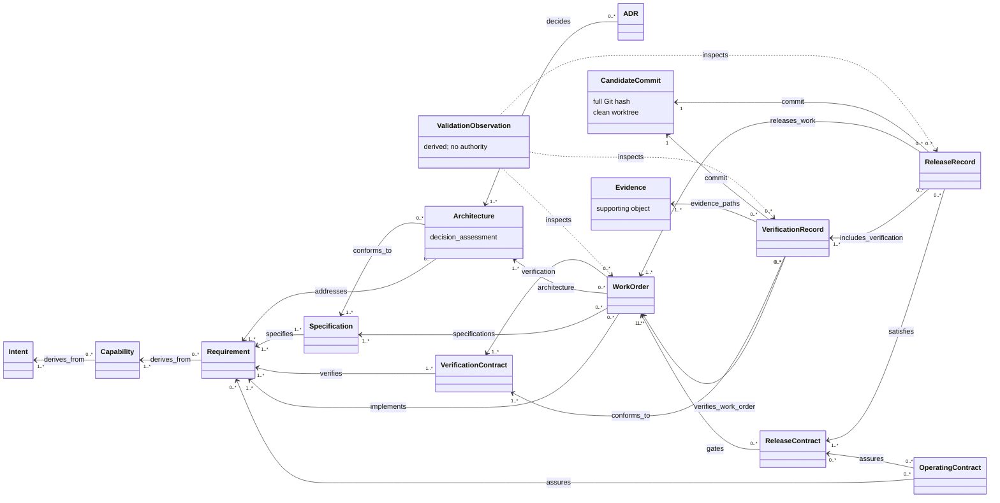

# Simplified SE Harness data model

<!-- Target expertise: 6/10. The score describes the knowledge expected from the reader, not the quality or complexity of the document. -->

> This conceptual model explains current 0.4.1 authoring. It is not an implementation class diagram or a policy source. Follow `ENGINEERING_HARNESS.md` and the managed policies for authoritative rules.

## Model at a glance



The arrows use the direction of declared metadata. For example, a specification says which requirements it `specifies`; an architecture says which significant requirements it `addresses` and which specifications it `conforms_to`.

## Upstream definition

```text
Intent -> Capability -> Requirement <- Specification.specifies
                                  <- Architecture.addresses
                            Specification <- Architecture.conforms_to
                            Architecture <- ADR.decides
                            Requirement <- VerificationContract.verifies
```

- An intent explains the approved outcome.
- A capability describes what an actor can do when that intent is realized.
- A requirement states one observable obligation.
- A specification defines detailed behavior for one or more requirements.
- Architecture is not a mandatory wrapper around every requirement. It addresses only requirements that materially drive boundaries, interfaces, data ownership, trust, deployment, technology, or quality-attribute tactics.
- Every new or ongoing architecture completes a `decision_assessment`. `adr_required` needs at least one active ADR whose `decides` relation targets the architecture. `no_significant_decision` needs an accountable rationale and no active trigger. This avoids both missing important decisions and producing ceremonial ADRs.
- A verification contract defines how requirements must be checked independently.

Historical completed artifacts may retain the compatibility-era `constrains` relation. New authoring uses `addresses` and `conforms_to`; historical records are not rewritten merely to modernize their vocabulary.

A work order omits its `architecture` relation when no active architecture addresses any implemented requirement. When architecture does apply, the work order selects every applicable architecture and each ADR required by its decision assessment. The authoritative [artifact applicability catalog](../engineering/TRACEABILITY.md#artifact-applicability-catalog) defines the complete required, omission, and reuse rules for every standard formal type.

## Authorized work

A work order selects a bounded slice of the graph:

```text
WorkOrder.implements      -> Requirement(s)
WorkOrder.specifications -> Specification(s)
WorkOrder.architecture   -> applicable Architecture(s) and required ADR(s)
WorkOrder.verification   -> VerificationContract(s)
```

The work order grants permission to implement that scope. It is not itself proof that the implementation is correct. Its normal lifecycle is:

```text
draft -> approved -> in_progress -> implemented
```

An honest `implemented` state and retained evidence belong in the clean candidate commit **C** that will be assessed.

## Evidence, commits, and decisions

Evidence is shown in the diagram to explain its role, but it is not a formal typed artifact. It can be a retained test report, analysis result, review record, or another repository path allowed by policy.

A verification record combines:

- one or more work orders through `verifies_work_order`;
- the exact union of their verification contracts through `conforms_to`;
- retained `evidence_paths` for every selected work order;
- one full Git commit hash and a clean-worktree assertion.

`harnessctl capture-verification` prepares a `ready` record. Only an accountable assurance decision can transition it to `verified`. A green validator, preflight, CI run, or dashboard remains a `ValidationObservation`; it cannot make that transition.

A release record combines:

- an eligible release contract through `satisfies`;
- one or more verified records through `includes_verification`;
- the exact work-coverage union through `releases_work`;
- the same candidate commit used by every included verification record.

`harnessctl prepare-release` prepares a `ready` record. Only a release owner authorizes `released`. The later governance commits containing VREC and RLS decisions point back to C because a commit cannot contain its own hash.

## Important multiplicities and invariants

| Rule | Why it matters |
| --- | --- |
| Every active requirement has active specification and verification coverage. | Behavior and its verification are defined before assurance. |
| A work order selects one or more requirements, specifications, architectures, and verification contracts. | Authorization is bounded and reviewable. |
| ADR selection is conditional on the architecture's decision assessment. | Significant decisions are recorded without requiring one ADR per requirement. |
| A VREC covers one or more work orders at exactly one candidate commit. | Assurance has exact scope and provenance. |
| An RLS includes one or more eligible VRECs and binds their same candidate commit. | Release cannot silently select a different revision. |
| `releases_work` equals the union of work covered by included VRECs. | A release cannot add unverified payload or omit part of its declared verification. |
| A superseded VREC remains retained and points to one covering verified or released successor. | Abandoned ready attempts stay visible without qualifying a release. |

## Authority is outside cardinality

A complete graph proves that required relationships are declared. It does not prove that the statements are good, that evidence is persuasive, or that a human approved a transition. Those judgments belong to the accountable roles in `docs/engineering/DECISION_RIGHTS.md`.

If policy and executable checks disagree, stop and report the discrepancy. Neither this diagram nor an implementation detail silently resolves governance authority.

For timing, continue to [operational phasing](harness-operational-phasing.md). For a concrete chain, see the [practical example](harness-lineage-example.md).
