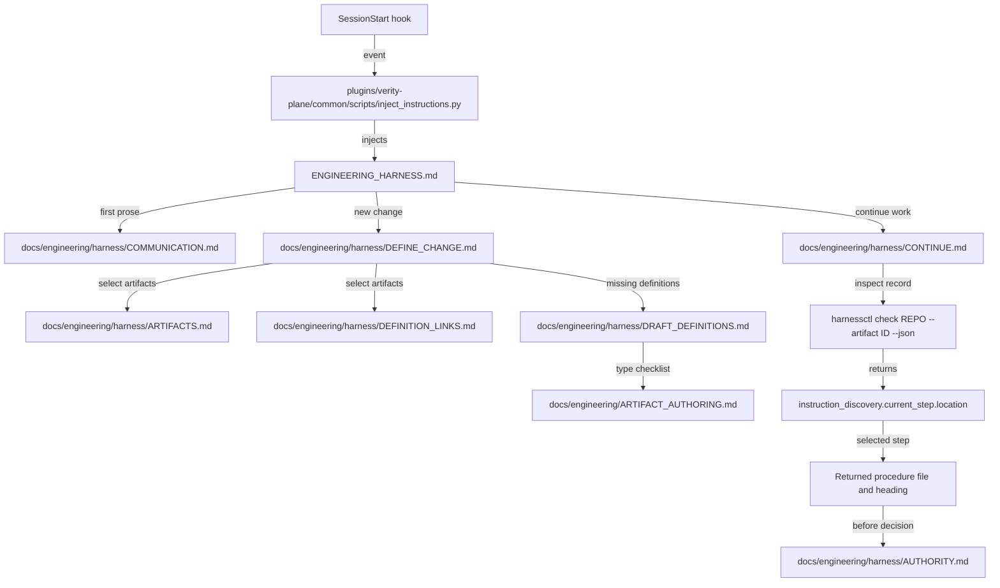

# Instruction rearchitecture — reassessment

**Date:** 28 September 2026

**Assessed commit:** `fd05dc9f28452c906e764a37570342acbabd09b9`

**Selected evaluator:** 0.19.0

This is the GitHub-readable version of the [HTML report](report.html). The assessment was read-only. This publication adds the report and its supporting observations; it does not implement its recommendations or change harness policy.

The split substantially reduces initial reading. Six former instruction guides contain only compatibility pointers and can be retired after their consumers and installation state are handled.

## Scores

These are editorial ratings for the current end-to-end experience, including the older plugin cache exposed to the assessment session. They are not agent success-rate measurements or formal assurance verdicts. On this scale, 5 means usable with manual correction, 8 means dependable for routine work, and 10 means consistently precise with little avoidable effort.

| Area | Score / 10 | Assessment |
| --- | ---: | --- |
| Efficiency | 6.5 | The agent reaches the right procedure with fewer initial reads, but repeated checks, broad file reads and the older installed adapters still add work. |
| Clarity | 7.0 | The procedural format and authority boundaries are clear. Stale template references, a release-version label and provider-specific wording still require interpretation. |
| Discoverability | 7.5 | The root router and evaluator return precise reading destinations. The exposed plugin cache and references outside the main collection do not yet consistently follow that route. |
| Context management | 7.5 | Startup content is much smaller and conditional reading is explicit. Whole-file reading, repeated result fields and limited root-delivery headroom remain concerns. |

Mean: **7.1/10**. Each dimension has four equally weighted criteria worth 2.5 points each; [scores.json](scores.json) records them. The earlier report used different criteria, so no numerical improvement in scores is claimed.

## Context cost

| Reading surface | Words |
| --- | ---: |
| Accepted consolidated draft | 21,888 |
| Injected root | 1,191 |
| Root plus communication guidance | 1,466 |
| Entire root and harness guide collection, 26 files | 23,935 |

The root meets the proposed 1,000–1,300-word target. Root plus communication guidance is **93.3% less text** than the accepted consolidated draft. Total guide volume grew by about 9.4%, but the purpose of progressive discovery is to load only the relevant route. This is a document-size comparison, not a measured token or latency saving.

| Example route | Whole-file word envelope | Named files |
| --- | ---: | --- |
| startup | 1466 | `ENGINEERING_HARNESS.md`, `COMMUNICATION.md` |
| new outcome | 2630 | `ENGINEERING_HARNESS.md`, `COMMUNICATION.md`, `DEFINE_CHANGE.md` |
| select existing artifacts | 4092 | `ENGINEERING_HARNESS.md`, `COMMUNICATION.md`, `DEFINE_CHANGE.md`, `ARTIFACTS.md`, `DEFINITION_LINKS.md` |
| resume implementation | 5656 | `ENGINEERING_HARNESS.md`, `COMMUNICATION.md`, `CONTINUE.md`, `EXECUTE_WORK.md`, `AUTHORITY.md`, `RESULTS.md` |
| verification decision | 6210 | `ENGINEERING_HARNESS.md`, `COMMUNICATION.md`, `CONTINUE.md`, `VERIFY_OUTCOME.md`, `AUTHORITY.md`, `RESULTS.md` |

Whole-file envelopes for these named guides only; not measured agent consumption. Selected sections cost less; skills, owner instructions, formal artifacts, code and tool results add context. No recursive link loading assumed.

The hook protocol probe measured **8,913 UTF-16 units out of a 10,000-unit script limit**, including the current repository path and envelope. Headroom is 1,087 units. This is not a native-host delivery test. Other overhead includes 4,920 table-alignment characters and long navigation lists. An observed delivery-selection check occupied 8,424 characters, or 6,164 with compact JSON serialization.

## Progressive discovery

Nodes name files, commands or returned data. Edge labels describe reading triggers; these routes do not select lifecycle legality.

The older installed skills still add a detour through `docs/engineering/OPERATING_CARD.md`, which then points to `harness/CONTINUE.md`. The file is small; inconsistent routing is the larger concern.

## Findings

P1: active misrouting or adoption gap. P2: consistency or context cost. P3: refinement.

### P1 · F1 — The exposed plugin cache still follows the old reading model

The installed change, evidence and harness-orient skills unconditionally request the operating card. Their repository counterparts use instruction_discovery and restrict old references to legacy installations. The cache inspected for this session also has neither hooks/hooks.json nor scripts/inject_instructions.py.

**Proposal:** Treat this as a local adoption gap, not proof that the merged hook implementation is broken. Establish which plugin copy each host actually loads, adopt the compatible distribution, and repeat startup/compaction traces there. Do this before retiring a file that the exposed skills still demand.

**Evidence:** [plugins/verity-plane/common/skills/change/SKILL.md](https://github.com/mmzen/se_harness/blob/fd05dc9f28452c906e764a37570342acbabd09b9/plugins/verity-plane/common/skills/change/SKILL.md#L13); local observation in [audit-data.json](audit-data.json) and [delivery-size.json](delivery-size.json). The inspected cache is C:/Users/mathi/.codex/plugins/cache/se-harness/verity-plane/0.1.0.

### P1 · F2 — New work-order drafts still receive an obsolete authority reference

WORK_ORDER.template.md names docs/engineering/DECISION_RIGHTS.md#approved-execution. The file is now a seven-line pointer and has no approved-execution heading. Its assurance placeholder also says accountable role, while AUTHORITY.md asks for the actual decision-maker.

**Proposal:** Point the template directly to harness/AUTHORITY.md#authority-from-work-approval. Align the identity placeholder with the supported decision procedure. Change the source template and adopt the released result; do not rewrite historical work orders.

**Evidence:** [templates/repository/standard/docs/engineering/templates/WORK_ORDER.template.md](https://github.com/mmzen/se_harness/blob/fd05dc9f28452c906e764a37570342acbabd09b9/templates/repository/standard/docs/engineering/templates/WORK_ORDER.template.md#L45); [docs/engineering/DECISION_RIGHTS.md](https://github.com/mmzen/se_harness/blob/fd05dc9f28452c906e764a37570342acbabd09b9/docs/engineering/DECISION_RIGHTS.md#L1); [docs/engineering/harness/AUTHORITY.md](https://github.com/mmzen/se_harness/blob/fd05dc9f28452c906e764a37570342acbabd09b9/docs/engineering/harness/AUTHORITY.md#L64)

### P2 · F3 — Peripheral descriptions still assign authority to pointer files

The README seed calls WORKFLOW.md and QUALITY_GATES.md bound human explanations. Explorer says QUALITY_GATES.md owns gate meaning. Those files now explicitly contain no additional policy. PULL_REQUEST.md still says selected 0.18.0 and refers to a Shared policy section that is no longer in that file.

**Proposal:** Update active templates and Explorer text to describe the current router, RESULTS.md and evaluator-owned gate semantics. Replace the stale version label and link the exception statement directly to EXCEPTIONS.md. Preserve versioned historical evidence.

**Evidence:** [templates/repository/standard/docs/engineering/README.md.seed](https://github.com/mmzen/se_harness/blob/fd05dc9f28452c906e764a37570342acbabd09b9/templates/repository/standard/docs/engineering/README.md.seed#L6); [repository_tools/explorer_design/sources/shell/explorer.js](https://github.com/mmzen/se_harness/blob/fd05dc9f28452c906e764a37570342acbabd09b9/repository_tools/explorer_design/sources/shell/explorer.js#L354); [se_harness/engine/harness_explorer/index.template.html](https://github.com/mmzen/se_harness/blob/fd05dc9f28452c906e764a37570342acbabd09b9/se_harness/engine/harness_explorer/index.template.html#L718); [docs/engineering/harness/PULL_REQUEST.md](https://github.com/mmzen/se_harness/blob/fd05dc9f28452c906e764a37570342acbabd09b9/docs/engineering/harness/PULL_REQUEST.md#L33)

### P2 · F4 — Whole-file instructions weaken the benefit of heading-level discovery

EXECUTE_WORK.md says to read every file in context.reading_manifest. The root and current plugin source say to read the current heading and applicable prerequisites. The instructions do not consistently say when an unchanged file already held in context can be reused.

**Proposal:** Specify reuse for content still present and unchanged, and reread material lost after compaction or changed since review. Keep required formal artifacts and checks intact. Use the returned file and heading for procedural reading rather than expanding every linked file.

**Evidence:** [docs/engineering/harness/EXECUTE_WORK.md](https://github.com/mmzen/se_harness/blob/fd05dc9f28452c906e764a37570342acbabd09b9/docs/engineering/harness/EXECUTE_WORK.md#L45); [ENGINEERING_HARNESS.md](https://github.com/mmzen/se_harness/blob/fd05dc9f28452c906e764a37570342acbabd09b9/ENGINEERING_HARNESS.md#L136); [plugins/verity-plane/common/skills/change/SKILL.md](https://github.com/mmzen/se_harness/blob/fd05dc9f28452c906e764a37570342acbabd09b9/plugins/verity-plane/common/skills/change/SKILL.md#L15)

### P2 · F5 — The root is within its budget but has modest delivery headroom

The hook protocol probe produces 8,913 UTF-16 units, including the path and delivery envelope, against the script limit of 10,000. That leaves 1,087 units. Longer paths or more policy text can consume this margin. This is a script-size measurement, not a native host delivery test.

**Proposal:** Keep the nine agreed invariants and the small router. Measure the complete envelope in content checks, including a representative long path. Put new conditional guidance in its procedure. Do not infer host truncation from the Codex additionalContextLimit value; its unit was not evaluated in this audit.

**Evidence:** [plugins/verity-plane/common/scripts/inject_instructions.py](https://github.com/mmzen/se_harness/blob/fd05dc9f28452c906e764a37570342acbabd09b9/plugins/verity-plane/common/scripts/inject_instructions.py#L17); [protocol measurement](delivery-size.json)

### P2 · F6 — The external-action instruction has an unclear provider dependency

DELIVER_RESULT.md attributes an independent-enforcement requirement to change/references/authority.md. The new change skill makes that reference a legacy route, while the evidence skill still points to it for decision reuse. Readers have to resolve the provider relationship themselves.

**Proposal:** Name the applicable action and provider prerequisite at one canonical location, then route both skills and the procedure to it. Preserve the intended control; do not use this editorial assessment to weaken an external-action requirement.

**Evidence:** [docs/engineering/harness/DELIVER_RESULT.md](https://github.com/mmzen/se_harness/blob/fd05dc9f28452c906e764a37570342acbabd09b9/docs/engineering/harness/DELIVER_RESULT.md#L122); [plugins/verity-plane/common/skills/change/SKILL.md](https://github.com/mmzen/se_harness/blob/fd05dc9f28452c906e764a37570342acbabd09b9/plugins/verity-plane/common/skills/change/SKILL.md#L41); [plugins/verity-plane/common/skills/evidence/SKILL.md](https://github.com/mmzen/se_harness/blob/fd05dc9f28452c906e764a37570342acbabd09b9/plugins/verity-plane/common/skills/evidence/SKILL.md#L36)

### P3 · F7 — Some repetition is useful; some repeats navigation instead of policy

Only one exact paragraph of at least 25 words repeats across core files, excluding headings, tables and code blocks: the preparation-actor reminder in RELEASE.md and VERIFY_OUTCOME.md. Semantic reminders repeat more widely. CONTINUE.md also reproduces the full procedure and step indexes that the evaluator already returns.

**Proposal:** Keep short reminders where an action could cross an authority boundary. Consider collapsing the full indexes into an optional reference and make file-and-heading use prominent. Simplify long Later use link lists and table padding without removing their conditions.

**Evidence:** [docs/engineering/harness/CONTINUE.md](https://github.com/mmzen/se_harness/blob/fd05dc9f28452c906e764a37570342acbabd09b9/docs/engineering/harness/CONTINUE.md#L54); [exact-paragraph scan](audit-data.json)

### P3 · F8 — Outcome and scope confirmation can produce extra discussion turns

DEFINE_CHANGE.md asks for confirmation of the outcome and then confirmation of the limits. It already permits reuse of existing confirmations; these are intentional preparation discussions rather than work-order approvals.

**Proposal:** Allow the agent to present outcome and scope together when both are clear. Keep clarification for material ambiguity. Do not remove the user-agreed confirmation boundary merely to reduce the number of turns.

**Evidence:** [docs/engineering/harness/DEFINE_CHANGE.md](https://github.com/mmzen/se_harness/blob/fd05dc9f28452c906e764a37570342acbabd09b9/docs/engineering/harness/DEFINE_CHANGE.md#L48); [docs/engineering/harness/DEFINE_CHANGE.md](https://github.com/mmzen/se_harness/blob/fd05dc9f28452c906e764a37570342acbabd09b9/docs/engineering/harness/DEFINE_CHANGE.md#L86)

## Retirement decisions

All six files below are compatibility pointers, with **210 words combined** and no unique current policy. Paths are relative to `docs/engineering/`; replacements are under `harness/`.

| File | Replacement | Decision | Conditions |
| --- | --- | --- | --- |
| `OPERATING_CARD.md` | CONTINUE.md | Yes, conditionally | The exposed installed skills still request it. The package exports it, compatibility tests assert it, and workflow_contract.py still provides a renderer. The current root and reading manifest do not need it. |
| `DECISION_RIGHTS.md` | AUTHORITY.md | Yes, conditionally | Repair the active work-order template first. Older plugin references still name this path. Preserve legacy-release adapters and recorded decisions. |
| `QUALITY_GATES.md` | RESULTS.md; evaluator results | Yes, conditionally | Repair Explorer and README seed descriptions. Keep QUALITY_GATES.json: it is executable policy, not a redundant human guide. |
| `WORKFLOW.md` | CONTINUE.md; RECORD_STATE.md; RESULTS.md | Yes, conditionally | Update README seed and old adapter routes. Keep WORKFLOW.json and supported old-release compatibility. |
| `TRACEABILITY.md` | ARTIFACTS.md; DEFINITION_LINKS.md; WORK_AND_EVIDENCE.md | Yes, conditionally | No unique policy remains in this pointer. Packaging, seed-state reconciliation and legacy consumer checks still apply. |
| `TECHNICAL_COMMUNICATION.md` | COMMUNICATION.md | Yes, conditionally | The current operator-brief skill already distinguishes new and legacy roots. Preserve its old-release branch; remove only the new-installation pointer after consumer checks. |

### Repository-only retirement

The six paths are seeds recorded as present, not hash-managed policy. A temporary-copy probe using released evaluator 0.19.0 passed before deletion and reported six seed-state mismatches after deletion. The supported upgrade preview and apply then recorded all six as removed and restored installation consistency. This establishes a reconciliation route; it does not establish that older skills or external links no longer require the files. Do not hand-edit the lock.

### Product-wide retirement

Stopping their creation in new repositories also requires source-template and packaging changes, compatibility tests, and an upgrade policy. Preserve customized owner seed content. Retire known stock pointers explicitly. Keep historical fixtures, migration fingerprints and version-conditioned adapters while their old-release upgrade paths remain supported.

`POLICY_PATHS` still lists these names, but no consumer of that tuple was found in the searched source. The demonstrated deletion blocker is the seed-state check. The migration catalogue identifies old 0.18.0 input files and is not simply a current reading list.

Evidence: [deletion probe](retirement-probe.json), [supported reconciliation probe](retirement-reconciliation-probe.json).

### Files to keep

- `ARTIFACT_AUTHORING.md`: unique design/review guidance and type checklists. `create-artifact` reads this exact file programmatically.
- `WORKFLOW.json` and `QUALITY_GATES.json`: executable policy. Keep them as evaluator inputs rather than ordinary agent reading.
- `AGENTS.md` and `docs/engineering/README.md`: repository-owned facts, commands and index. `CLAUDE.md` is absent in the assessed checkout.
- `harness/migration/REFERENCE_MAP.md`: preserves old rule meanings. `IMPLEMENTATION_PLAN.md` remains conditional upgrade guidance.

## File-by-file disposition

| File | Words | Disposition | Assessment |
| --- | ---: | --- | --- |
| [ENGINEERING_HARNESS.md](https://github.com/mmzen/se_harness/blob/fd05dc9f28452c906e764a37570342acbabd09b9/ENGINEERING_HARNESS.md) | 1191 | Keep | Root: 1,191 words; within the agreed target. Preserve invariants and conditional router; watch the delivery envelope. |
| [docs/engineering/harness/AMEND_DEFINITIONS.md](https://github.com/mmzen/se_harness/blob/fd05dc9f28452c906e764a37570342acbabd09b9/docs/engineering/harness/AMEND_DEFINITIONS.md) | 503 | Keep | Procedure: Correctly distinguishes proposed drafts from the unsupported accepted-revision capability. |
| [docs/engineering/harness/ARTIFACTS.md](https://github.com/mmzen/se_harness/blob/fd05dc9f28452c906e764a37570342acbabd09b9/docs/engineering/harness/ARTIFACTS.md) | 1053 | Keep | Reference: Useful model and type/location tables. Keep its full table out of ordinary explanation paths. |
| [docs/engineering/harness/AUTHORITY.md](https://github.com/mmzen/se_harness/blob/fd05dc9f28452c906e764a37570342acbabd09b9/docs/engineering/harness/AUTHORITY.md) | 1352 | Keep | Decision reference: Human decisions and agent execution are explicit. Read the selected right or grant; simplify table padding without changing authority. |
| [docs/engineering/harness/AUTHORIZE_WORK.md](https://github.com/mmzen/se_harness/blob/fd05dc9f28452c906e764a37570342acbabd09b9/docs/engineering/harness/AUTHORIZE_WORK.md) | 1611 | Keep | Procedure: Review, actual decision, preview/apply and readback are separate. Preserve that boundary. |
| [docs/engineering/harness/COMMUNICATION.md](https://github.com/mmzen/se_harness/blob/fd05dc9f28452c906e764a37570342acbabd09b9/docs/engineering/harness/COMMUNICATION.md) | 275 | Keep | Shared prerequisite: 275 words before first eligible English prose. This is baseline context even though it is not injected. |
| [docs/engineering/harness/CONTINUE.md](https://github.com/mmzen/se_harness/blob/fd05dc9f28452c906e764a37570342acbabd09b9/docs/engineering/harness/CONTINUE.md) | 683 | Refine | Router: Clear recovery and evaluator authority. Full procedure and step tables are optional navigation overhead. |
| [docs/engineering/harness/DEFINE_CHANGE.md](https://github.com/mmzen/se_harness/blob/fd05dc9f28452c906e764a37570342acbabd09b9/docs/engineering/harness/DEFINE_CHANGE.md) | 1164 | Refine | Procedure: Clear transient outputs. Batch compatible clarifications; keep material confirmation boundaries. |
| [docs/engineering/harness/DEFINITION_LINKS.md](https://github.com/mmzen/se_harness/blob/fd05dc9f28452c906e764a37570342acbabd09b9/docs/engineering/harness/DEFINITION_LINKS.md) | 409 | Keep | Reference: Small graph and typed-link rules; graph describes relationships, not execution order. |
| [docs/engineering/harness/DELIVER_RESULT.md](https://github.com/mmzen/se_harness/blob/fd05dc9f28452c906e764a37570342acbabd09b9/docs/engineering/harness/DELIVER_RESULT.md) | 1328 | Refine | Procedure: Preparation, authority, execution and readback are separate; clarify the provider-control dependency. |
| [docs/engineering/harness/DRAFT_DEFINITIONS.md](https://github.com/mmzen/se_harness/blob/fd05dc9f28452c906e764a37570342acbabd09b9/docs/engineering/harness/DRAFT_DEFINITIONS.md) | 1501 | Keep | Procedure: Type-specific authoring and dry-run allocation are explicit. Read the selected step and checklist. |
| [docs/engineering/harness/DRAFT_WORK_ORDERS.md](https://github.com/mmzen/se_harness/blob/fd05dc9f28452c906e764a37570342acbabd09b9/docs/engineering/harness/DRAFT_WORK_ORDERS.md) | 832 | Keep | Procedure: Explicit outputs and validation handoff. Fix its generated template dependency separately. |
| [docs/engineering/harness/EXCEPTIONS.md](https://github.com/mmzen/se_harness/blob/fd05dc9f28452c906e764a37570342acbabd09b9/docs/engineering/harness/EXCEPTIONS.md) | 197 | Keep | Capability boundary: Short explicit unsupported-capability fallback. It does not introduce a repository-specific exception. |
| [docs/engineering/harness/EXECUTE_WORK.md](https://github.com/mmzen/se_harness/blob/fd05dc9f28452c906e764a37570342acbabd09b9/docs/engineering/harness/EXECUTE_WORK.md) | 1384 | Refine | Procedure: Clear scope and evidence steps; clarify reuse versus unconditional reading of every manifest file. |
| [docs/engineering/harness/migration/IMPLEMENTATION_PLAN.md](https://github.com/mmzen/se_harness/blob/fd05dc9f28452c906e764a37570342acbabd09b9/docs/engineering/harness/migration/IMPLEMENTATION_PLAN.md) | 501 | Keep as reference | Migration: Still needed for repositories adopting the architecture; label migration context clearly and keep off default route. |
| [docs/engineering/harness/migration/REFERENCE_MAP.md](https://github.com/mmzen/se_harness/blob/fd05dc9f28452c906e764a37570342acbabd09b9/docs/engineering/harness/migration/REFERENCE_MAP.md) | 889 | Keep as reference | Migration: Preserves old rule meanings, including renumbered HRN IDs. Removing it could confuse historical evidence. |
| [docs/engineering/harness/PULL_REQUEST.md](https://github.com/mmzen/se_harness/blob/fd05dc9f28452c906e764a37570342acbabd09b9/docs/engineering/harness/PULL_REQUEST.md) | 691 | Refine | Procedure: Good separation from release. Fix 0.18.0 wording and the stale Shared policy reference. |
| [docs/engineering/harness/RECORD_STATE.md](https://github.com/mmzen/se_harness/blob/fd05dc9f28452c906e764a37570342acbabd09b9/docs/engineering/harness/RECORD_STATE.md) | 552 | Keep | Procedure: Explicitly selected transitions; useful separation from merely linked record states. |
| [docs/engineering/harness/RELEASE.md](https://github.com/mmzen/se_harness/blob/fd05dc9f28452c906e764a37570342acbabd09b9/docs/engineering/harness/RELEASE.md) | 825 | Keep | Procedure: Loaded only for release. Small repeated preparation reminder is useful at this decision boundary. |
| [docs/engineering/harness/RESULTS.md](https://github.com/mmzen/se_harness/blob/fd05dc9f28452c906e764a37570342acbabd09b9/docs/engineering/harness/RESULTS.md) | 771 | Keep | Shared prerequisite: Useful blocker/recovery rules and gate-result meaning. Keep required findings, reduce unnecessary narration around them. |
| [docs/engineering/harness/RISKS_AND_DECISIONS.md](https://github.com/mmzen/se_harness/blob/fd05dc9f28452c906e764a37570342acbabd09b9/docs/engineering/harness/RISKS_AND_DECISIONS.md) | 1531 | Keep | Procedure/reference: Risk and blocking decision are distinct. Select the needed heading instead of loading all record types. |
| [docs/engineering/harness/SETUP.md](https://github.com/mmzen/se_harness/blob/fd05dc9f28452c906e764a37570342acbabd09b9/docs/engineering/harness/SETUP.md) | 624 | Keep | Maintenance: Precise released-evaluator identity and isolated invocation. Correctly conditional on setup or repair. |
| [docs/engineering/harness/SKILL_PROVIDER.md](https://github.com/mmzen/se_harness/blob/fd05dc9f28452c906e764a37570342acbabd09b9/docs/engineering/harness/SKILL_PROVIDER.md) | 332 | Keep | Maintenance: Still needed for provider selection; recording provider ownership is not proof that a host loads current skills. |
| [docs/engineering/harness/UPGRADE.md](https://github.com/mmzen/se_harness/blob/fd05dc9f28452c906e764a37570342acbabd09b9/docs/engineering/harness/UPGRADE.md) | 771 | Keep | Maintenance: Needed for preview/apply, ownership and native-delivery evidence; not routine startup context. |
| [docs/engineering/harness/VERIFY_OUTCOME.md](https://github.com/mmzen/se_harness/blob/fd05dc9f28452c906e764a37570342acbabd09b9/docs/engineering/harness/VERIFY_OUTCOME.md) | 1938 | Refine | Procedure: Largest core guide at 1,938 words. Heading-level reading avoids loading refresh and supersession for ordinary acceptance. |
| [docs/engineering/harness/WORK_AND_EVIDENCE.md](https://github.com/mmzen/se_harness/blob/fd05dc9f28452c906e764a37570342acbabd09b9/docs/engineering/harness/WORK_AND_EVIDENCE.md) | 1027 | Keep | Reference: Owns scope, assurance and evidence links. Read only applicable coverage sections. |
| [docs/engineering/OPERATING_CARD.md](https://github.com/mmzen/se_harness/blob/fd05dc9f28452c906e764a37570342acbabd09b9/docs/engineering/OPERATING_CARD.md) | 34 | Retire conditionally | Compatibility pointer: No unique policy; apply the conditions above. |
| [docs/engineering/DECISION_RIGHTS.md](https://github.com/mmzen/se_harness/blob/fd05dc9f28452c906e764a37570342acbabd09b9/docs/engineering/DECISION_RIGHTS.md) | 34 | Retire conditionally | Compatibility pointer: No unique policy; apply the conditions above. |
| [docs/engineering/QUALITY_GATES.md](https://github.com/mmzen/se_harness/blob/fd05dc9f28452c906e764a37570342acbabd09b9/docs/engineering/QUALITY_GATES.md) | 34 | Retire conditionally | Compatibility pointer: No unique policy; apply the conditions above. |
| [docs/engineering/TRACEABILITY.md](https://github.com/mmzen/se_harness/blob/fd05dc9f28452c906e764a37570342acbabd09b9/docs/engineering/TRACEABILITY.md) | 37 | Retire conditionally | Compatibility pointer: No unique policy; apply the conditions above. |
| [docs/engineering/WORKFLOW.md](https://github.com/mmzen/se_harness/blob/fd05dc9f28452c906e764a37570342acbabd09b9/docs/engineering/WORKFLOW.md) | 37 | Retire conditionally | Compatibility pointer: No unique policy; apply the conditions above. |
| [docs/engineering/TECHNICAL_COMMUNICATION.md](https://github.com/mmzen/se_harness/blob/fd05dc9f28452c906e764a37570342acbabd09b9/docs/engineering/TECHNICAL_COMMUNICATION.md) | 34 | Retire conditionally | Compatibility pointer: No unique policy; apply the conditions above. |
| [docs/engineering/ARTIFACT_AUTHORING.md](https://github.com/mmzen/se_harness/blob/fd05dc9f28452c906e764a37570342acbabd09b9/docs/engineering/ARTIFACT_AUTHORING.md) | 1559 | Keep | Authoring: Unique checklists and design guidance; create-artifact extracts checklists from this exact file. |
| [docs/engineering/README.md](https://github.com/mmzen/se_harness/blob/fd05dc9f28452c906e764a37570342acbabd09b9/docs/engineering/README.md) | 939 | Keep | Owner index: Repository-owned domain index; not a duplicate instruction authority. Fix the distribution seed separately. |

## Proposed order

1. Confirm actual plugin adoption. Resolve the exposed-cache mismatch and verify full-root delivery at startup and compaction on each supported host.
2. Repair active references: work-order template, README seed, Explorer attribution and PR guide. Clarify provider prerequisites and reuse of unchanged reading.
3. Retire the six compatibility pointers deliberately, choosing repository-only or product-wide scope. Preview file and lock effects and preserve owner content and history.
4. Keep focused regression checks for the full delivery envelope, links including code-formatted document anchors, catalogue mappings and task reading paths. Extend coverage to templates and generated surfaces.

## Evidence and limitations

- 34 files inventoried: root and 25 harness guides, six compatibility pointers, authoring guide and owner index.
- 364 Markdown link occurrences checked; none had a missing file or heading. Inline-code paths are outside this scan; manual inspection found the obsolete template anchor.
- 18 procedures, 23 typed-step mappings, 87 location references and 26 distinct destinations checked; all resolved.
- Existing conformance tests: 26 run, 25 passed, one symlink-dependent test skipped. These are candidate-source content/discovery/protocol checks, not native-host demonstrations or lifecycle authorization.
- Temporary-copy deletion and reconciliation probes used the released 0.19.0 evaluator. No source repository or installed plugin was modified by the assessment.
- No fresh native-host startup or compaction demonstration was performed. The cache observations are specific to the assessment session; other installations were not inventoried.
- HTML structure, unique anchors and local report links were checked. Visual browser inspection was unavailable because browser policy blocked file URLs.
- This report is an editorial and structural assessment, not a formal assurance verdict. The publication does not approve any proposed correction.

### Supporting files

- [HTML report](report.html)
- [Audit inventory, references and measurements](audit-data.json)
- [Scores and scoring criteria](scores.json)
- [Context measurements](context-metrics.json)
- [Hook protocol size and cache observation](delivery-size.json)
- [Conformance result](conformance.json) and [test output](conformance.stderr.txt)
- [Deletion probe](retirement-probe.json) and [reconciliation probe](retirement-reconciliation-probe.json)
- [HTML structure validation](report-validation.json)
