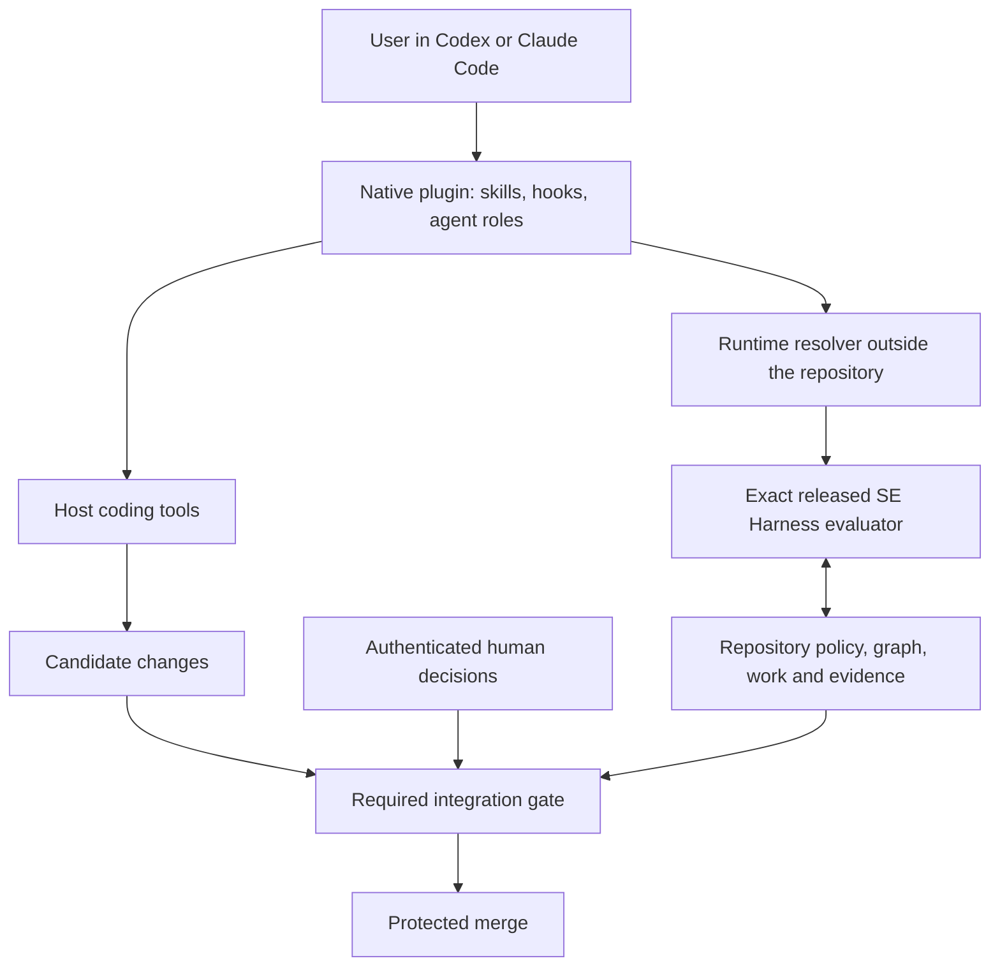

# Proposal: install Verity Plane as a Codex or Claude Code plugin

<!-- Target expertise: 4/10. The score describes the knowledge expected from the reader, not the quality or complexity of the document. -->

> Proposal, 2026-09-06. This note approves no implementation or lifecycle decision.
> Repository analysis uses [`aad82a9`](https://github.com/mmzen/se_harness/tree/aad82a9d03e142b27cb3dc3d0a1ecc38d2d7e055).
> Host capabilities were checked against official documentation on that date; they have not been integration-tested here.
> This replaces the [earlier plugin exploration](agentic-execution-plugin-distribution.md) as the current planning reference.

## Recommendation

**Make the plugin the normal way to start using Verity Plane. Keep SE Harness as its trusted engine.**

The user should install a plugin, connect a repository, and ask for a change. They should not have to create a Python environment, activate it, choose a launcher, or remember `harnessctl init`.

Ship two native packages, for Codex and Claude Code, from one shared integration codebase. Each supplies skills, supported hooks, and host-appropriate agent roles. A small runtime manager obtains and selects the exact released evaluator outside the project. Repository setup continues to use the existing installer underneath.

The product promise is **“Delegate the work. Keep the authority.”** A plugin makes that promise easier to use. Enforcing it also requires controls where effects occur, especially at GitHub's merge boundary. Installing hooks alone would not have reliably prevented [incident #347](https://github.com/mmzen/se_harness/issues/347).

| Decision proposed | Reason |
| --- | --- |
| Plugin as the primary interactive entry point | Installation and daily work happen in the coding agent the user already uses. |
| Preserve `harnessctl` and its Python engine | Reuse the existing rules, transaction safety, diagnostics, and headless CI path. |
| Manage an isolated runtime automatically | Remove manual environment setup while preserving evaluator identity. |
| Two host adapters, one set of harness semantics | Native host features differ; lifecycle rules must not diverge with them. |
| Introduce narrowly scoped agents | Parallel investigation and evidence review are useful; agent titles confer no decision rights. |
| Keep external authorization enforcement a distinct delivery track | A disabled or bypassed plugin must not unlock a protected merge. |

## What exists today, and what is missing

The current installation has two parts: install the Python package, then install managed content into a repository. Python 3.11 or later remains a runtime requirement. The candidate source is **0.16.0**; this repository's installed governing evaluator is **0.15.0**. They are different identities, not interchangeable versions of the running tool. See the [package inventory](https://github.com/mmzen/se_harness/blob/aad82a9d03e142b27cb3dc3d0a1ecc38d2d7e055/pyproject.toml#L5-L23), [root lock](https://github.com/mmzen/se_harness/blob/aad82a9d03e142b27cb3dc3d0a1ecc38d2d7e055/.engineering-harness.lock#L2-L8), and [managed CI](https://github.com/mmzen/se_harness/blob/aad82a9d03e142b27cb3dc3d0a1ecc38d2d7e055/.github/workflows/engineering-harness.yml#L26-L80).

| Area | Current implementation | Change needed |
| --- | --- | --- |
| Installation | User obtains Python and installs `se-harness` in an environment. | Native plugin distribution and automatic, isolated runtime provisioning. |
| Project activation | `init` or `adopt` writes managed files and owner-preserving fragments. | A setup skill presents and applies the same transaction through a simple user flow. |
| Skills | Two portable cores: `harness-orient` and `harness-operator-brief`. Both are read-only and single-agent. | Plugin discovery, integrity, runtime binding, and separate procedures for setup and governed work. |
| Claude integration | One repository-local adapter, for `harness-orient`. | A native package; operator-brief coverage; explicit host compatibility tests. |
| Hooks and agents | No shipped host hooks, subagent configurations, or plugin manifests. | Native components with documented coverage, tool limits, and failure behavior. |
| Runtime trust | External released evaluator; identity and import-isolation checks. | A resolver that supplies that evaluator without asking the user to find it. |
| Upgrades | Package installation and repository upgrade are separate. | Plugin updates, runtime availability, and repository upgrades remain separately controlled. |
| CI and remote effects | CI provisions its own evaluator. The merge-authorization defect is tracked separately. | Preserve headless checks; enforce external actions independently of local plugin participation. |

The [actual shipped skill inventory](https://github.com/mmzen/se_harness/blob/aad82a9d03e142b27cb3dc3d0a1ecc38d2d7e055/pyproject.toml#L71-L87) is smaller than the older plugin note describes. The three writing skills, generic broker, and autonomy-envelope machinery were deliberately retired. This proposal does not assume they still exist or recommend restoring that framework. See [ADR-AEX-008](../engineering/agentic-execution/architecture/adr/ADR-AEX-008.md).

There is also documentation drift to resolve before shipping onboarding. The [installation guide](harness-installation-and-upgrades.md) and [command reference](harnessctl-reference.md) still prescribe a separate evaluator-upgrade packet and mandatory archive proof. [SPEC-REB-012](../engineering/released-evaluator-boundary/specifications/SPEC-REB-012.md) and [current CLI arguments](https://github.com/mmzen/se_harness/blob/aad82a9d03e142b27cb3dc3d0a1ecc38d2d7e055/se_harness/cli.py#L992-L999) removed that packet and `--work-order` option. Identity uses version and installed payload; archive identity is checked when recorded. Ordinary repository authorization still applies. This analysis inspected current source and contracts, not the installed 0.15.0 wheel; compatibility tests must verify each supported released evaluator's actual interface.

## The experience to build

These are proposed interactions, not commands available today.

1. **Install Verity Plane in the host's plugin interface.** Installation makes the integration available. It does not alter every repository or grant approval rights.
2. **Connect this repository.** Setup detects a new project, an existing harness, or conflicting content. It shows the target, runtime download, files to add or change, and any missing protection. An authorized setup applies that concrete plan.
3. **Ask for work.** The integration reads the harness result, identifies the active work order and allowed next step, and runs the appropriate procedure. Missing definitions or decisions become a clear handoff.
4. **Review the result.** Show the change, evidence, verification status, and the decision still required. A successful test run must not be presented as approval to merge.

In an unrelated repository, automatic activation should stay quiet and write nothing. On an already configured machine, status should work without a network connection. A missing runtime should produce a setup action, not an opaque Python error or an automatic download during inspection.

For Claude Code, an illustrative path is:

```text
/plugin marketplace add <published-Verity-Plane-marketplace>
/plugin install verity-plane@<marketplace-name>
/verity-plane:setup
/verity-plane:status
```

For Codex, use the documented plugin browser in the desktop app or CLI, then the installed setup skill. Confirm exact invocation names in the compatibility spike; do not promise identical slash commands across hosts.

## Native capabilities and their limits

For concrete sequences covering initialization, artifact packages, work-order start, evidence, verification, integration, release, and upgrades, see [Plugin operation workflows](plugin-operation-workflows-2026-09-06.md). It explains what runs as a skill, hook, script, agent, or existing evaluator operation, with command examples and a source-to-component map.

The [16 detailed scenarios](plugin-scenarios/README.md) expand that map into reusable workflow sections with example results, decision boundaries, recovery paths, and implementation details.

Codex plugins are documented for the desktop app and CLI; the IDE extension does not currently support them. Treat the IDE extension as a separate future adapter, not a supported plugin installation target. CLI installation requires a new session. [Codex plugin surfaces](https://learn.chatgpt.com/docs/plugins)

| Component | Codex | Claude Code |
| --- | --- | --- |
| Manifest | `.codex-plugin/plugin.json` | `.claude-plugin/plugin.json` |
| Skills | Bundled skill directories | Bundled, namespaced skills |
| Hooks | Plugin hooks; trust is separate from installation | Plugin hooks with event-specific decisions |
| Agent roles | Custom TOML agents documented separately under `.codex/agents/` or the user agent directory; native plugin-agent loading is not established by the manifest documentation | Native plugin `agents/` directory |
| Optional local API | Bundled stdio MCP configuration | Bundled stdio MCP configuration |

Codex documents plugin-relative paths, `PLUGIN_ROOT`, persistent `PLUGIN_DATA`, and repository or personal marketplace catalogs. These provide packaging and discovery, not a ready-made Python installer. Its manifest lists skills, hooks, and MCP; this proposal does not assume an undocumented `agents` field. [Codex packaging](https://developers.openai.com/plugins/build/plugins)

For Codex's first version, ship agent definitions as adapter resources. Setup may register them at the documented project location after checking ownership and conflicts. That makes the plugin responsible for the setup experience while remaining honest about the extra project configuration. If supported plugin-native loading is demonstrated, prefer it. [Codex custom agents](https://learn.chatgpt.com/docs/agent-configuration/subagents)

Claude's plugin root `CLAUDE.md` is not loaded. Carry operating context through skills and session hooks. Cache paths can change on updates; use `CLAUDE_PLUGIN_ROOT` for bundled files and `CLAUDE_PLUGIN_DATA` for persistent runtime data. Plugin caching does not install Python dependencies. [Claude plugin components and storage](https://code.claude.com/docs/en/plugins-reference)

Claude plugin agents ignore `hooks`, `mcpServers`, and `permissionMode` frontmatter; configure relevant components at plugin level. Skill `allowed-tools` preapproves tools rather than restricting the entire available toolset. Neither setting is a substitute for an authorization boundary. [Claude subagents](https://code.claude.com/docs/en/sub-agents#plugin-subagents), [Claude skill permissions](https://code.claude.com/docs/en/skills#control-who-invokes-a-skill)

Publish a tested support matrix with host version, host surface, operating system, hook coverage, and agent-loading method. “Both hosts support plugins” is insufficient evidence of behavioral parity. Native Windows must be included: Claude supports PowerShell without Git Bash, so a Bash-only integration is incomplete. [Claude Windows setup](https://code.claude.com/docs/en/setup#set-up-on-windows)

## Architecture: one engine, two adapters



The diagram is a target design. In particular, the required integration gate is an unresolved dependency, not something plugin packaging supplies.

### Keep the existing engine and installer

Reuse ownership-aware `init`/`adopt`, upgrade planning, conflict detection, and rollback. Reuse the evaluator's lifecycle, scope, and identity checks. Host adapters should translate calls and display results; they must not calculate a competing answer to “what is allowed next?” The [installer](https://github.com/mmzen/se_harness/blob/aad82a9d03e142b27cb3dc3d0a1ecc38d2d7e055/se_harness/installer.py) and [runtime identity checks](https://github.com/mmzen/se_harness/blob/aad82a9d03e142b27cb3dc3d0a1ecc38d2d7e055/se_harness/runtime_identity.py) are reusable foundations.

Start with a small launcher using structured arguments and machine-readable evaluator results. Consider a local MCP facade only if the prototype demonstrates a usability or tool-coverage benefit. It must call the same engine, accept no caller-invented approval, and add no independent policy store. A hosted service is not necessary for the initial local product.

### Make runtime provisioning a product feature

| Option | Tradeoff | Recommendation |
| --- | --- | --- |
| Require users to install Python or `uv` first | Cheap packaging, but retains a prerequisite installation problem. | Developer fallback, not the promised normal experience. |
| Plugin-managed isolated Python and released package | Reuses today's evaluator; needs platform bootstrap, caching, and update support. | Preferred direction. |
| Ship a self-contained engine binary for each platform | Potentially simpler launch; larger release matrix and identity compatibility work. | Test against managed Python in the bootstrap spike. |
| Rewrite the engine in the host's preferred language | Duplicates mature semantics and creates a migration project. | Reject as a prerequisite for plugins. |

Select the smallest supported bootstrap that works on a clean machine. It must obtain a pinned interpreter and released package without depending on Python already being installed. The interpreter's source, redistribution terms, platform support, and update ownership must be resolved before selecting its provider.

The resolver should:

- Read the repository's evaluator identity, then select a compatible external environment. Treat repository paths and metadata as untrusted input; a project must not supply an arbitrary executable or download URL.
- Resolve versions only through a trusted release catalog. Verify downloaded interpreter/package bytes against authenticated release metadata, then validate installed evaluator identity with the existing engine. Download integrity is a proposed installer control; it does not reinstate mandatory archive fields in repository locks.
- Authenticate cached launcher, interpreter, and package bytes through a trusted bootstrap before executing them; a modified executable cannot establish its own trust. A writable cache is not an OS security boundary against the same principal replacing both runtime and verifier. External authorization must remain independently protected.
- Use an absolute executable and isolated import mode. Never fall back to `PATH`, a candidate checkout, an editable package, inherited `PYTHONPATH`, or a user site.
- Cache by platform and immutable runtime identity outside the repository. Use atomic installation, concurrency locking, and cleanup of incomplete downloads; preserve the previous working environment on failure.
- Support preloaded caches for offline organizations. A session hook must never wait for an installer or fetch a new version silently.

For example, one plugin may serve repository A governed by 0.15.0 and repository B governed by another supported release. Each keeps its own evaluator selection. An incompatible version produces an explicit compatibility error; updating the plugin does not upgrade either repository.

Expose the active plugin version, evaluator version and payload identity, repository lock identity, and hook readiness in status. A cached selection is not authority: mutation must still recheck the repository and evaluator at action time.

### Skills should guide real operations

Use a small catalog with clear purposes. The following names are proposed logical roles; final host identifiers require compatibility testing.

| Skill | Responsibility | Boundary |
| --- | --- | --- |
| Setup | Prepare runtime and present repository activation or upgrade plan. | Separate explicit operation; no implicit adoption. |
| Status / orient | Explain integrity, active work, and next decision. | Reuse current read-only behavior; no repair or installation. |
| Change | Guide definition or implementation according to the actual next step. | Invoke the evaluator; do not recreate lifecycle rules in prose. |
| Evidence | Run permitted checks and prepare the required handoff. | Evidence preparation cannot become human verification. |
| Operator brief | Explain supplied results clearly. | Preserve bounded input, explicit invocation, and no effects. |

Do not simply move today's Claude wrapper into a plugin: it resolves a fixed repository-local core. Likewise, [harness-orient](../../templates/repository/standard/.agents/skills/harness-orient/SKILL.md) expressly forbids installation and worker agents. Setup and worker behavior need their own contracts. Retired writing skills may return only as working evaluator clients, consistent with [REQ-ECP-014](../engineering/execution-control-plane/requirements/REQ-ECP-014.md).

### Use agents for work partition, not approval

Begin with two optional read-only roles: an **investigator** to find relevant definitions and code, and an **evidence reviewer** to assess coverage and inconsistencies. The main coding agent remains the implementer for the initial release. A separate implementation worker can follow when scope propagation and concurrent work have been demonstrated.

Each role receives the repository, selected work, candidate identity where applicable, and a bounded question. Its configured tools should match that role. Reports remain attributed observations. A second model, separate context, or “reviewer” name does not establish independent assurance or authenticate an accountable human.

This keeps agents useful without bringing back the retired broker, envelope, or nonce system prohibited by [REQ-ECP-018](../engineering/execution-control-plane/requirements/REQ-ECP-018.md).

## Hooks: useful intervention, incomplete enforcement

Codex hooks can deny covered tool calls, but hosted tools and some specialized paths are outside coverage. `write_stdin` does not trigger a new pre-tool check. Command and MCP handlers run; prompt/agent handler types are parsed but skipped. Non-managed hook definitions need explicit trust, and matching hooks run concurrently. Unsupported pre-tool responses such as `ask` or `continue: false` do not provide a reliable stop. [Codex hooks](https://learn.chatgpt.com/docs/hooks)

Claude pre-tool hooks can deny via a supported decision or exit code 2. However, timeouts allow the action to continue; ordinary execution errors and malformed responses generally do not block it either. Session-start and post-action hooks cannot provide a pre-effect barrier. User-controlled hooks may be disabled. [Claude hook execution and decisions](https://code.claude.com/docs/en/hooks#hook-input-and-output)

These limits rule out the claim that installing this plugin guarantees all agent effects are governed.

| Hook purpose | Proposed behavior |
| --- | --- |
| Session context | Verify an activated repository with its trusted cached evaluator, then inject the verified managed gate, harness contract, and fresh work context. Reuse the same handler after compaction or resume. No download, repair, or full test suite. |
| Before supported mutations | Ask the evaluator whether the specific governed action is admissible. Return the host's explicit denial on refusal or a caught evaluator failure. |
| After an action | Collect observations and evidence references. Do not describe a post-action check as prevention. |
| Completion | Present actual lifecycle state and required human handoff. Require continuation or correction where supported; already displayed text cannot reliably be withdrawn. |

The action-specific hook request/result contract and host-tool mapping are new work. Existing `check` and preflight results are useful inputs, not a universal tool-authorization API. A green scope check does not prove the effects or legality of an arbitrary shell command. Start with explicitly mapped operations and document all unclassified routes.

Keep checks deterministic, bounded, and idempotent. Pass data with structured arguments; handle Windows paths and both shell tools. Do not run untrusted repository scripts merely because a hook encountered a file. Respect legitimate analysis and repository-defined ungoverned paths rather than requiring a work order for every action.

Even a wrapper that catches errors cannot deny an action if the host never runs it or times it out. Parsing a shell command for `gh pr merge` is also insufficient: aliases, scripts, APIs, and existing interactive sessions can reach the same effect.

### The merge boundary must stand on its own

[Issue #347](https://github.com/mmzen/se_harness/issues/347) was still open when checked for this note. The [RCA](../rca/2026-09-04-merge-authorization-boundary.md) explains how an agent with the owner's GitHub credentials merged despite a required verification handoff.

The target control must evaluate protected integration under trusted policy, require eligible verification and authenticated human decisions where applicable, and prevent the agent's credential from bypassing it. Green implementation CI or an agent-authored role name is insufficient. Direct CLI/API/Git routes must enforce the same decision.

The check must account for evidence records in later governance commits: validate the verified implementation and allowed follow-up changes, rather than requiring a verification record to contain its own commit hash. Candidate edits must not waive their own verification requirement or alter the trusted gate.

A plugin may offer an honest onboarding/read-only pilot before that control lands. It should not claim complete authority enforcement or provide unattended integration until the incident's negative cases pass. Plugin disablement should remove convenience, not remove the merge protection.

## Distribution, updates, and migration

Produce two host packages from shared sources, each with its native manifest, skill entry points, hook configuration, agent resources, and a common runtime launcher. Keep the Python package as the independently released evaluator. Avoid two hand-maintained copies of the workflow.

Plugin publication is a new governed release surface. Extend release-contract, verification, and release-record coverage to the exact plugin content, manifests, runtime catalog, and generated host packages; test generation parity and immutable publication pins. Marketplace publication needs its own authorization: approving an evaluator release does not automatically approve a plugin release, or the reverse.

Use a maintainer-controlled marketplace for the pilot, pinned to immutable plugin content; public directory submission can follow. Claude supports installation scopes and Git source `sha` pinning. Third-party marketplace auto-updates are disabled by default, and running components can require a reload. Make these operational facts visible rather than assuming immediate updates everywhere. [Claude installation and updates](https://code.claude.com/docs/en/discover-plugins), [marketplace pinning and policy](https://code.claude.com/docs/en/plugin-marketplaces)

Define compatibility between **plugin version, host version, evaluator version, and repository policy version**. A host plugin's update mechanism must not silently rewrite the engineering graph or replace the governing evaluator. New bootstrap downloads use a reviewed compatibility catalog; unsupported pins stay unsupported until deliberately added.

The repository continues to own its graph, evidence, policy, and lock. Plugin caches own disposable runtime and integration bytes. Host configuration owns installation and hook trust. Credentials and protection rules belong to the hosting/organization control plane. These are distinct responsibilities.

Migration needs a staged installer change:

1. Introduce opt-in plugin support while keeping repository skills available for existing users and other hosts. In each active session, select one discovery route for a skill; report duplicates instead of running both.
2. Replace reliance on repository-managed skill hashes with explicit verification of the selected plugin build and supported adapter contract. Orient has a private fingerprint helper; there is no shipped general-purpose plugin verifier to reuse unchanged.
3. Once parity is proven, offer removal of unchanged managed skill copies through the ownership-aware upgrade path. Customized copies must stop or be explicitly resolved. Do not delete owner instructions or historical evidence.
4. Provide rollback to a compatible plugin build and the supported repository-local route. A separate ownership-aware disconnect operation removes unchanged project registrations written by setup. Do not assume the host's uninstall runs that cleanup: retain recovery instructions for inactive registrations. Neither disconnect nor uninstall may erase owner content, project governance, or evidence.

Removing managed skill entries does not by itself require a new lock schema: retirement handling already exists. Decide whether schema evolution is needed only after defining how external plugin identity is recorded and verified. Hook-definition changes may require fresh host trust; an update is not proof that new hooks are active.

## Fit with existing contracts

| Existing responsibility | Keep | Evolution needed before implementation |
| --- | --- | --- |
| [ADR-AEX-005](../engineering/agentic-execution/architecture/adr/ADR-AEX-005.md), [REQ-AEX-009](../engineering/agentic-execution/requirements/REQ-AEX-009.md) | Portable behavior and explicit distribution ownership. | Revisit the repository-local distribution choice through an approved decision. Marketplace distribution is outside today's contract. |
| [SPEC-AEX-005](../engineering/agentic-execution/specifications/SPEC-AEX-005.md) | Host adapters do not own lifecycle authority. | Specify native plugin adapters separately; today's discovery-only wrapper contract excludes hooks and agent configuration. |
| Read-only orient and brief contracts | Actual evaluator invocation, bounded input, no effects. | Define relocation/integrity and host naming. Specify setup and agent roles separately. |
| Released-evaluator boundary and installer | Exact external evaluator, owned files, conflict safety, transactional writes. | Add trusted automatic provisioning and a compatibility resolver; preserve simplified upgrade semantics. |
| [ADR-AEX-008](../engineering/agentic-execution/architecture/adr/ADR-AEX-008.md) | Delegation at existing boundaries and a reduced product surface. | Add only exercised integrations, not a new general orchestration or authorization-token framework. |
| Decision rights and verification records | Human authority, candidate binding, retained evidence. | Close external enforcement gaps under #347; plugin metadata cannot grant those rights. |

The note is not an alternative specification. Approved requirements should define outcomes; specifications should define behavior; an architecture decision should select packaging and runtime ownership. Host files should contain only the instructions/configuration needed to use that design. This avoids copying the same authority rules into skills, hooks, agents, and another policy file.

## Delivery plan and proof of success

| Increment | Deliverable | Exit condition |
| --- | --- | --- |
| 1. Compatibility and bootstrap spike | Minimal installable packages for both hosts; runtime prototype; tested host/OS matrix. | On clean supported machines without Python, install and run read-only status. Demonstrate Codex agent registration and hook trust; report unsupported paths. |
| 2. Onboarding pilot | Setup, orient, brief, runtime cache, diagnostics, and rollback. | New and existing repositories activate without manual environment commands; conflicts preserve bytes; offline reuse works. |
| 3. Governed-work integration | Thin change/evidence skills, supported checks, and read-only agent roles. | Real evaluator calls and truthful handoffs; no silent broadening of skill authority; negative hook tests pass within declared coverage. |
| 4. Default distribution | Upgrade/migration path, release automation, support documentation, and independent integration enforcement. | Compatibility, rollback, and #347 regression cases pass before broader enforcement claims and integration automation. |

Measure user-visible setup actions, elapsed time to first successful status/change, setup failures by platform, and recovery effort against the current documented path. Publish measured results; do not select latency promises before the prototype. Runtime downloads and full validation should stay out of routine hook latency.

The acceptance suite should exercise these outcomes:

| Scenario | Required result |
| --- | --- |
| Clean Windows, macOS, Linux; spaces and Unicode in paths | No manual Python or shell activation; correct host-specific calls. Native Windows and WSL are distinct targets. |
| Two projects or worktrees with different evaluator pins | Correct external evaluator for each action; no cross-project cache confusion. |
| Unrelated repository or ungoverned note change | No implicit adoption; ordinary read-only work remains available. |
| Altered cache, malicious runtime location, incompatible pin, interrupted or concurrent install | No execution of untrusted runtime; explicit recovery and unchanged project state. |
| Offline restart and plugin upgrade/downgrade | Cached compatible operation works; repository identity remains unchanged; rollback is demonstrable. |
| Customized managed skill or host agent file; plugin uninstall | Conflict reported, owner content and engineering history preserved. |
| Denial, missing executable, timeout, malformed output, changed/untrusted/disabled hook | Observed host behavior recorded; no unsupported enforcement claim. External authorization still blocks protected effects. |
| PowerShell, Bash, script, interactive-session input, direct API/MCP/hosted tool | Coverage explicitly tested; unsupported routes cannot bypass remote protection. |
| Implemented work requiring verification, green CI, missing or stale VREC | Merge denied independently of the local plugin. |
| Fabricated human approval, self-exemption, changed candidate, valid later governance commit | Fake/invalid authority rejected; a legitimately verified candidate plus permitted governance changes can proceed only with the required integration decision. |

## What to challenge before committing to the design

**“A plugin eliminates installation.”** It eliminates manual steps; runtime provisioning, project activation, and enterprise distribution still need engineering and support. A zipped skill folder would fall short of the requested transformation.

**“More skills and agents make it better.”** Start with a small catalog and measured use. The project already removed unused machinery. Every new component should invoke real behavior or answer a demonstrated user need.

**“The same package can behave identically everywhere.”** Share semantics and tests, but use native adapters. Codex agent registration and host hook behavior are concrete parity risks. Avoid advertising unsupported IDE or Windows coverage.

**“Hooks solve governed authority.”** They improve intervention in supported flows. Trusted checks and restricted credentials must still protect external effects. The original incident is the acceptance test for this claim.

**“Updating the plugin should update every project.”** That would undermine reproducibility and owner control. Make project upgrade simple and explicit, while leaving its governing identity stable until that operation is authorized.

The proposed next decision is to approve a bounded compatibility/bootstrap experiment, with both hosts and native Windows represented. Its evidence should select the runtime packaging and prove a real installation path before expanding into workflow automation.
