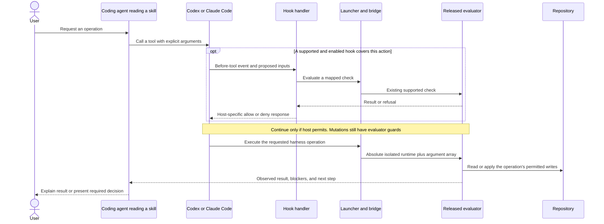
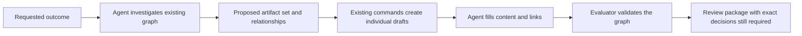
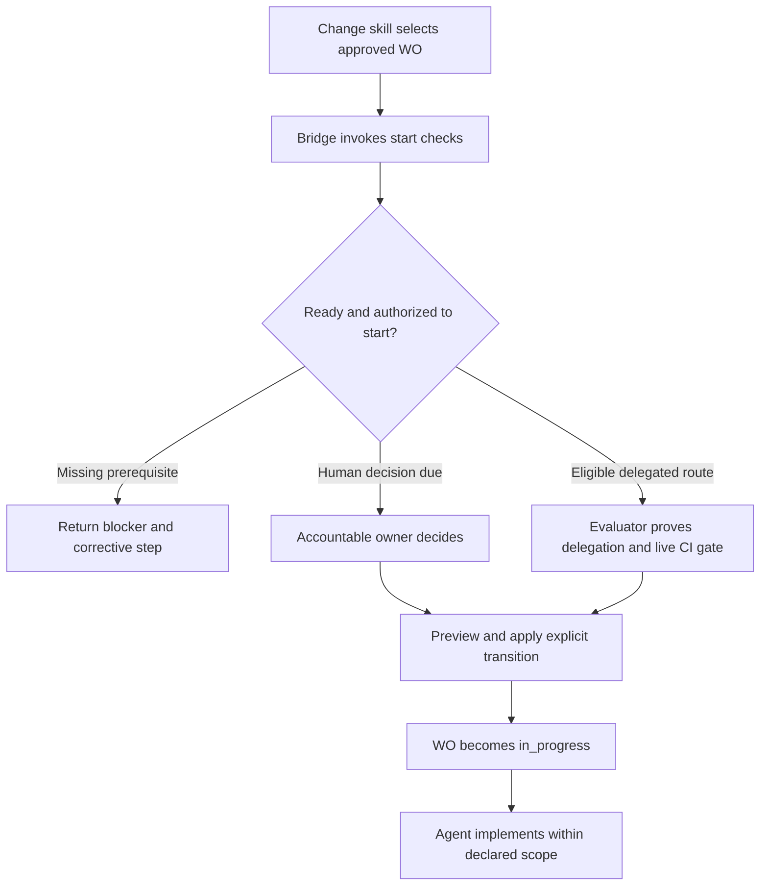

# Plugin workflows: from a user request to a harness operation

<!-- Target expertise: 4/10. The score describes the knowledge expected from the reader, not the quality or complexity of the document. -->

> Design companion to the [plugin installation proposal](plugin-installation-proposal-2026-09-06.md), 2026-09-06.
> This maps the implementation at [`aad82a9`](https://github.com/mmzen/se_harness/tree/aad82a9d03e142b27cb3dc3d0a1ecc38d2d7e055) to proposed plugin components. It authorizes no implementation or lifecycle decision.
> Plugin skills, hooks, launchers, and adapters described as new below do not exist yet. Command examples describe the inspected source interface, not a tested integration with the released 0.15.0 evaluator.

The [16 detailed scenarios](plugin-scenarios/README.md) expand these workflows using the [scenario template](plugin-scenario-template.md). Each includes component responsibilities, current-to-proposed mappings, decision boundaries, and recovery. The session scenarios also develop the proposed installation checks and governance injection at startup and after compaction.

## First, distinguish the components

**A skill tells the agent how to do the work. A script performs a defined operation. A hook tells the host when to run a check. The evaluator applies the harness rules.**

| Component | What it is | Example in this design |
| --- | --- | --- |
| **Skill** | Instructions the model reads. It is not an automatically executed program. | The proposed `change` skill tells the agent how to assemble a definition package and follow the returned next step. |
| **Hook** | A host event registration that invokes a handler. It is not the overall workflow. | Before a covered tool action, the host invokes a handler to inspect the proposed operation. |
| **Script / launcher** | Executable code with explicit inputs and outputs. It can run without an LLM. | A new launcher selects the trusted external runtime; a bridge passes structured arguments to `harnessctl`. |
| **Evaluator** | The released SE Harness program, which evaluates rules and applies supported transactions. | Existing `preflight`, `transition`, and `capture-verification` implementations. |
| **Agent** | The model doing investigation, drafting, implementation, or review through tools. | The main agent edits code; an optional read-only investigator locates existing requirements. |
| **Human decision** | An accountable person's decision over identified work or evidence. | The assurance owner verifies one exact VREC. A tool permission or actor-name argument does not prove this decision. |
| **Repository records** | Persistent policy, artifacts, evidence, and their relationships. | The approved work order and its execution scope. They remain in the project, not in plugin cache. |
| **External control** | Enforcement by the system that can actually perform a protected effect. | GitHub rejects a merge lacking required authorization, even if the local plugin is disabled. |

A hook handler can be a script. A skill can instruct an agent to call that same script. Those are two ways to invoke code, not two copies of the policy.



The hook path is optional because host coverage and trust vary. A missing hook must not make a harness mutation bypass its own evaluator checks. Protection for arbitrary host tools and remote effects needs the separate boundaries described in the [proposal](plugin-installation-proposal-2026-09-06.md#hooks-useful-intervention-incomplete-enforcement).

## Where the pieces would live

This is an illustrative package layout, not a new public interface:

```text
Native host package
  .codex-plugin/plugin.json OR .claude-plugin/plugin.json  [NEW: registration]
  skills/setup/SKILL.md                                   [NEW: onboarding]
  skills/change/SKILL.md                                  [NEW: author/start/implement]
  skills/evidence/SKILL.md                                [NEW: evidence/decision handoffs]
  skills/harness-orient/...                               [ADAPT: existing read-only core]
  skills/harness-operator-brief/...                       [ADAPT: existing communication core]
  hooks/hooks.json                                        [NEW: host event bindings]
  hooks/handler                                           [NEW: event translation and checks]
  bin/launcher                                            [NEW: platform bootstrap/runtime selection]
  scripts/bridge                                         [NEW: structured evaluator invocation]
  agent resources                                        [NEW: investigator/evidence reviewer]

External runtime cache
  exact released Python runtime and se-harness package    [REUSE engine; NEW provisioning]

Consumer repository
  policy, lock, templates, artifacts, evidence             [KEEP existing ownership]
  explicit host registrations where required              [NEW, ownership-aware setup]
```

Claude can discover native plugin agent files. The initial Codex adapter may need setup to register the bundled definitions under `.codex/agents/`; do not assume manifest parity. The launcher must work before Python exists. Python-based handlers can run only after a runtime is available; first-session hooks must report setup availability without downloading or initializing anything.

The bridge executes one supported operation per request. It validates target paths, arguments, runtime identity, exit status, and output schema. It must not reinterpret a refusal, turn a response into approval, or run a free-form command taken from repository prose. Map the canonical `harnessctl` entry point to the selected external interpreter; preserve the remaining argument boundaries.

In the examples below, `harnessctl` is shorthand for that resolved invocation, not a `PATH` lookup. `REPO`, `BASE`, `DOMAIN`, `ACTOR`, and the `*-DEMO-*` IDs are placeholders. The plugin gets actual values from the selected repository, records, decisions, and engine result.

The work-order example follows the `commit_bound_verification = "required"` path. For `not_required`, follow the evaluator's actual next step and trusted policy; do not create a VREC solely to match this illustration. That classification does not remove required implementation evidence or accountable decisions.

## 1. Initialize or adopt a repository

**User request:** “Set up Verity Plane for this project.”

| Step | Component | What happens |
| --- | --- | --- |
| 1 | **Setup skill + agent** | Identify the target and explain the setup plan. An absent/empty directory uses `init`; an existing project uses `adopt`. A directory containing only `.git` is already nonempty. |
| 2 | **Launcher** | For a new root, obtain the supported released runtime from trusted release metadata. For an installed root, resolve its existing lock. No candidate-code or ambient-Python fallback. |
| 3 | **Bridge → existing installer** | Run the dry-run operation. The installer returns the file plan; the new bridge adds the selected target and runtime identity to the presentation. |
| 4 | **User + setup skill** | Review the concrete effects and resolve missing authorization. Reuse an existing authorization only when it covers that exact plan. Conflicting files are not overwritten. |
| 5 | **Bridge → existing installer** | Refresh the plan and stop if its effects differ from the reviewed plan. Apply the authorized operation, preserving owner content. Register host components as a separately reported setup step. |
| 6 | **Bridge + orient skill** | Run `doctor` and inspect the result. Report which steps succeeded and which remain incomplete. |

```text
harnessctl init REPO --project-name example --dry-run --json
harnessctl init REPO --project-name example --json
harnessctl doctor REPO --json
```

For an existing project, use `adopt` in the first two commands. `init` does not initialize Git, create approved product definitions, or configure remote protection. Repository installation and new host registration are not one existing atomic transaction: failed host setup must leave a clear, recoverable partial-setup report.

Today's installer still writes repository-local skills. Setup must select one active discovery route until the proposed migration is implemented. Also, today's separate dry-run/apply calls do not carry a binding to the reviewed plan: drift detection and strict action-time binding of reviewed effects are new integration/engine work, not an existing CLI guarantee.

**Hook role:** a session hook may suggest setup; it never performs adoption itself. **Reuse:** [`installer.py`](../../se_harness/installer.py), `plan_install()` and `apply_changes()`. **New:** runtime provisioning, setup presentation, and host registration/cleanup.

## 2. Create an artifact package

**User request:** “Prepare the artifacts for this change.” Here, a *package* means a related set of engineering artifacts, not a Python wheel or a new artifact type.



1. **Change skill:** establish the authorized authoring scope and read the installed authoring rules. Reuse existing intent, requirements, and decisions where applicable. Creating drafts must follow repository policy; the command itself does not grant authoring authority.
2. **Main agent, optionally helped by an investigator:** propose the necessary additions. For example, an existing intent and capability may need a new requirement, specification, verification contract, and work order. Architecture or decision artifacts are added when applicable, not automatically for every change.
3. **Bridge → current authoring commands:** scaffold the domain if needed, then create each selected draft. Capture the actual ID and path returned by each call.
4. **Agent using ordinary editing tools:** fill the draft content, relationships, acceptance criteria, owners, and work scope. This semantic writing is model work; a script cannot infer the correct product intent.
5. **Bridge → validator:** check the completed proposed graph. The skill explains errors and remaining decisions and presents the package for review. All new definitions remain drafts until explicitly approved.

```text
harnessctl scaffold-domain REPO --domain DOMAIN --dry-run --json
harnessctl scaffold-domain REPO --domain DOMAIN --json
harnessctl create-artifact REPO --domain DOMAIN --type requirement --id REQ-DEMO-001 --dry-run --json
harnessctl create-artifact REPO --domain DOMAIN --type requirement --id REQ-DEMO-001 --json
harnessctl validate REPO --json
```

**Current limitation:** `create-artifact` writes one incomplete draft. There is no atomic “create package” command. The initial plugin should report partial progress and resume from existing drafts after a failure; it must not claim the whole package rolled back. If atomic package creation becomes necessary, add it to the engine through a separate design.

Decision artifacts are a lifecycle exception: they start `open`, not `draft`. Use each artifact type's actual contract; do not force the entire package into one invented shared status.

Automatic ID allocation examines local refs and the worktree, excluding remote-tracking refs. A new domain needs an explicit first ID. The plugin must check known concurrent work and handle collisions; a displayed dry-run ID is not a global reservation. A command result of `completed` means the file creation completed, not that the artifact is complete or approved.

**Hook role:** check supported authoring scope and trusted invocation. Do not require a fully valid graph after every keystroke: incomplete drafts are an intended intermediate state. Validate at package review and decision checkpoints. **Reuse:** [`artifact_layout.py`](../../se_harness/artifact_layout.py), canonical templates, and [`ARTIFACT_AUTHORING.md`](../engineering/ARTIFACT_AUTHORING.md). **New:** package planning, progress reporting, and a skill that loads the authoring guidance even when JSON output omits the human checklist.

There is no existing package-scope check to wrap: `create-artifact` has no work-order/package argument. Mapping permitted authoring actions to an explicit scope needs design and tests. Do not require a started implementation WO merely to draft that same WO.

## 3. Review and approve the package

**User request:** an accountable owner approves the identified artifacts after review.

| Component | Responsibility |
| --- | --- |
| **Change skill** | Present the selected artifacts, relationships, unresolved decisions, and owners. The work order's approval remains an explicit selection. |
| **Human owners** | Decide for the artifacts within their authority. One artifact's approval does not approve related artifacts. |
| **Bridge → transition engine** | Preview an explicit transition packet; after the applicable decisions, apply exactly that packet. Re-evaluate if inputs changed. |
| **Hook** | Check a supported transition invocation and preserve the decision handoff. It does not manufacture approval from the conversation. |

Unlike creation, **multi-artifact lifecycle transitions already exist**:

```text
harnessctl transition REPO --set REQ-DEMO-001=approved --decision REQ-DEMO-001=OWNER_A --set SPEC-DEMO-001=approved --decision SPEC-DEMO-001=OWNER_B --json
```

Apply the validated packet with `--apply` only after the exact accountable decisions. Real roles replace `OWNER_A` and `OWNER_B`. The existing [`plan_transition()` and `apply_transition()`](../../se_harness/workflow.py) provide staged writes and in-process rollback; this is not a claim of durable crash recovery through `journaled_apply.py`. New work is a trustworthy decision interface and provenance binding: `--decision ID=ACTOR` is a caller assertion, not authentication.

## 4. Start a work order

**User request:** “Start WO-DEMO-001.” The example assumes a valid approved WO; the actual returned procedure remains authoritative.



1. **Change skill → bridge:** project the selected work with `check`, then run the required start preflight. The agent reads the returned operating context and governing documents.
2. **Evaluator:** verify status, graph, integrity, scope, and start prerequisites. Return the actual next decision or corrective action.
3. **Decision route:** obtain the engineering owner's start decision, or follow the evaluator's eligible delegated command. The plugin does not choose the route based on its own preference.
4. **Bridge → transition engine:** preview and apply `approved → in_progress` with the actual actor. Then read the new state.

```text
harnessctl check REPO --artifact WO-DEMO-001 --json
harnessctl preflight REPO --work-order WO-DEMO-001 --phase start --json
harnessctl transition REPO --set WO-DEMO-001=in_progress --decision WO-DEMO-001=ACTOR --json
harnessctl transition REPO --set WO-DEMO-001=in_progress --decision WO-DEMO-001=ACTOR --apply --json
harnessctl check REPO --artifact WO-DEMO-001 --json
```

**Passing preflight does not start work.** The state changes only through the authorized transition. Under [DR-015](../engineering/DECISION_RIGHTS.md#governed-delegated-execution), delegation is limited to WO start, WO completion, and VREC preparation. It requires the class at the PR base and the required check passing for the exact candidate head. A class added only on the working branch or a `delegated-executor` argument cannot grant it. Definition approval, verification, release, and Git actions remain outside this delegation.

**Hook role:** intervene before supported start or implementation actions. **Reuse:** [`preflight.py`](../../se_harness/preflight.py), [`workflow.py`](../../se_harness/workflow.py), and [`WORKFLOW.json`](../engineering/WORKFLOW.json), especially `PROC-WO-START`. **New:** thin skill routing, event mapping, and decision presentation, not another state machine.

## 5. Implement and collect evidence

**User request:** carry out the started work order.

| Step | Component | What happens |
| --- | --- | --- |
| 1 | **Change skill + main agent** | Read the approved scope and acceptance criteria. Investigate and edit through the host's normal tools. The initial plugin does not need a second implementation agent. |
| 2 | **Covered before-tool hook → bridge** | Translate a known action into a supported check. Use the selected procedure and actual paths; do not interpret arbitrary shell text as a proved change set. |
| 3 | **Host tools and project scripts** | Run the authorized build/tests. Preserve observed output and failures as evidence; do not invent results. |
| 4 | **Optional evidence reviewer agent** | Inspect coverage and report gaps without changing records or approving the work. |
| 5 | **Evidence skill → bridge** | Prepare the WO's evidence packet and perform the required handoff check against the selected Git base. |

Existing evaluation surfaces include:

```text
harnessctl check REPO --artifact WO-DEMO-001 --checkpoint pre-action --procedure PROC-WO-IMPLEMENT --changed-path src/example.py --changed-path tests/test_example.py --changes-complete --json
harnessctl check REPO --artifact WO-DEMO-001 --checkpoint scope --from-git BASE --json
harnessctl evidence REPO --artifact WO-DEMO-001 --checkpoint handoff --json
harnessctl preflight REPO --work-order WO-DEMO-001 --phase review --json
harnessctl check REPO --artifact WO-DEMO-001 --checkpoint handoff --from-git BASE --json
```

Use `PROC-WO-IMPLEMENT` only when it is the selected or permitted procedure, and substitute the actual complete declared path set. `--changes-complete` is a caller assertion, not trusted proof of future effects. A scope check evaluates paths; it is not approval of arbitrary tool behavior. The new hook adapter needs an explicit supported action-to-check mapping and a recursion guard so its own diagnostic invocation does not trigger itself indefinitely. Scope changes require the appropriate decision, not automatic expansion by a hook.

`evidence` creates or rebinds a packet; it does not manufacture substantive test evidence. Before review preflight and handoff, the agent must fill its body with actual retained results and references. An empty generated packet is not proof that acceptance criteria passed.

**Important side effect:** the Git-based handoff check can rebind an existing evidence packet and retain `handoff.json`. The plugin must classify that invocation as an evidence-writing operation. Do not run it silently from a read-only status or generic before-tool hook. Other `check` forms must be classified by their actual behavior, not by command name alone.

**Reuse:** project test scripts, [`workflow_compliance.py`](../../se_harness/workflow_compliance.py), and the existing evidence/check commands. **New:** host action mapping and result collection. The engine, rather than a generic plugin evidence store, remains responsible for its formal evidence writes.

## 6. Complete implementation and prepare verification

1. **Evidence skill:** present the passing or blocked handoff result, changed paths, retained evidence, and the completion decision. Follow the authorized human or delegated route to mark only the WO `implemented`.
2. **Bridge:** preview/apply the explicit completion transition, then obtain the next result. `implemented` does not mean verified or eligible to merge.
3. **User/agent according to the returned decision:** settle the exact candidate and authorize any required Git commit separately. Candidate creation is not an implicit side effect of evidence preparation.
4. **Bridge → provenance engine:** once the candidate is eligible and preparation is authorized, create a ready VREC from the selected WO, verification contract, and retained evidence.

```text
harnessctl transition REPO --set WO-DEMO-001=implemented --decision WO-DEMO-001=ACTOR --json
harnessctl capture-verification REPO --id VREC-DEMO-001 --work-order WO-DEMO-001 --verification VER-DEMO-001 --evidence EVIDENCE_PATH --owner PREPARATION_ACTOR --json
```

The first command is a preview; its authorized apply adds `--apply`. The second command **creates** the record: it has no preview flag and must not run before its preparation prerequisites are satisfied. It captures the eligible current candidate rather than accepting an invented candidate hash from the skill. The VREC is recorded later than the commit it binds.

**Hook role:** preserve the preparation boundary and truthful completion handoff. **Reuse:** transition logic and [`provenance.py`](../../se_harness/provenance.py), `capture_verification()`. **New:** a human-readable evidence/decision view. No new “verification agent approval” mechanism is needed.

## 7. Verify the candidate, then choose integration

**User request:** “Review this candidate for verification.”

| Stage | Components and behavior | Result |
| --- | --- | --- |
| Technical review | **Evidence skill + optional reviewer agent** collect the candidate-bound evidence and explain findings. **Bridge** evaluates the relevant VREC checkpoint. | Review material; no human decision yet. |
| Assurance decision | **Assurance owner** verifies, rejects, or supersedes the selected VREC. **Bridge** previews/applies the matching existing transition with the actual decision. | Only the selected VREC changes; referenced WOs are not automatically rewritten. |
| Delivery choice | **Skill** presents the returned delivery decision to the repository/release owner. | Authorization for a named integration or release-preparation path. |
| Integration | **External integration control** verifies eligibility and trusted decision provenance before a separately authorized GitHub operation. | Merge permitted or denied independently of local hook participation. |

```text
harnessctl check REPO --artifact VREC-DEMO-001 --checkpoint transition --target verified --json
harnessctl transition REPO --set VREC-DEMO-001=verified --decision VREC-DEMO-001=assurance-owner --json
```

A successful preview still needs the actual assurance decision before apply. A reviewer agent's output, a host permission dialog, or the text `assurance-owner` cannot supply that proof.

**Reuse:** VREC transitions and `PROC-VREC-DECIDE` / `PROC-REPOSITORY-INTEGRATION`. **New and still required:** trusted approval capture and external enforcement from [#347](https://github.com/mmzen/se_harness/issues/347). There is no existing `harnessctl merge` command to wrap, and a green check must not become an automatic `gh pr merge` instruction. Applicable exceptions must come from trusted repository policy, not a plugin-invented waiver.

## 8. Prepare a release and publish

The **evidence skill** routes the separately selected release path. It collects the approved release contract, eligible VRECs, WOs, version, and candidate. The **bridge** invokes existing `prepare-release`; that operation creates an RLS in `ready` state. The **release owner** decides on that record, using an explicit transition. Finally, an **external-action owner and protected publication mechanism** authorize and perform the specific tag, package upload, or deployment.

```text
harnessctl prepare-release REPO --id RLS-DEMO-001 --release-contract REL-DEMO-001 --verification-record VREC-DEMO-001 --work-order WO-DEMO-001 --version VERSION --owner PREPARATION_ACTOR --json
harnessctl transition REPO --set RLS-DEMO-001=released --decision RLS-DEMO-001=release-owner --json
```

The second command previews a decision, and its authorized apply changes only the selected RLS. An RLS marked `released` does not itself upload or deploy anything. The **hook** can provide a local check/handoff for supported tools; the **remote control** must protect actual publication credentials. Reuse [`prepare_release()`](../../se_harness/provenance.py) and existing project release workflows. Do not replace project-specific publishing scripts with a generic plugin auto-publisher.

## 9. Inspect, resume, or upgrade

| Operation | Skill and script path | Hook behavior | Effect boundary |
| --- | --- | --- | --- |
| Inspect / resume | **Orient skill → launcher → `doctor`, `inspect`, selected `check` without a checkpoint.** Reconstruct context from repository state. | Proposed session handler verifies installation before injecting the managed governance text and fresh state; startup and recovery share that handler. | No implicit installation, repair, lifecycle transition, or claim that projection passed gates. |
| Upgrade | **Setup skill → launcher obtains selected target release → `upgrade` plan → reviewed apply.** | Report missing runtime or hook trust; never upgrade from session startup. | Repository changes only through the authorized installer transaction. No separate upgrade-packet requirement is reintroduced. |
| Explain a result | **Operator-brief skill** reads the bounded supplied result. | No hook required. | Communication only; no lifecycle or file changes. |

```text
harnessctl inspect REPO --json
harnessctl check REPO --artifact WO-DEMO-001 --json
harnessctl upgrade REPO --json
harnessctl upgrade REPO --apply --json
```

The plugin's own update, runtime download, and repository upgrade are separate operations. After any interruption, read the actual state again; a remembered model conversation is not a workflow checkpoint.

See [session startup](plugin-scenarios/setup-and-sessions.md#scenario-3-start-a-session) and [context restoration](plugin-scenarios/setup-and-sessions.md#scenario-4-restore-context-after-compaction-or-interruption) for the ordered verification/injection procedure, host context limits, and the use of `SessionStart` after compaction. Context injection alone does not enforce authority over arbitrary host tools.

## How the new bridge consumes today's results

The CLI does not return one universal JSON shape. General commands use `se-harness-command-result-v1`; workflow operations use [`se-harness-workflow-result-v2`](../../se_harness/workflow_result.py); other read-only commands have their own outputs. The bridge must recognize the expected schema for each supported command and refuse unsupported versions.

For a workflow result, preserve `mutation.writes`, `compliance`, and `restitution`: what happened, what did not happen, blockers, current lifecycle state, the decision required, and one typed next step. A `command_or_response` containing an argument array is different from a response asking an owner to decide. An operation outcome of `completed` does not imply that the whole work order is complete, all checks passed, or delivery is authorized.

Do not execute returned command strings through a shell. Use validated argument arrays, bind them to the selected repository/runtime, and respect the returned decision boundary. The skill explains the result; the bridge preserves its meaning; the engine owns the rules.

## Implementation map and remaining work

| Current implementation | Place in the proposed architecture | Work to add |
| --- | --- | --- |
| [`cli.py`](../../se_harness/cli.py), released `harnessctl` | Stable command entry point behind the bridge. | Per-version command/schema compatibility tests and trusted runtime selection. |
| [`installer.py`](../../se_harness/installer.py) | Setup and upgrade engine. | Bootstrap without preinstalled Python; concrete plan UI; recoverable host registration. |
| [`artifact_layout.py`](../../se_harness/artifact_layout.py), installed templates | Individual artifact/domain creation. | Package planning/resume in the change skill; do not promise atomic package creation. |
| [`preflight.py`](../../se_harness/preflight.py), [`workflow_compliance.py`](../../se_harness/workflow_compliance.py) | Readiness, scope, evidence, and checkpoint evaluation. | Exact host action mapping, side-effect classification, and bounded hook execution. |
| [`workflow.py`](../../se_harness/workflow.py), [`workflow_procedures.py`](../../se_harness/workflow_procedures.py), installed workflow/gate contracts | Lifecycle transitions and canonical next steps. | Human decision presentation and authenticated provenance; no copied plugin state machine. |
| [`provenance.py`](../../se_harness/provenance.py) | Candidate-bound VREC/RLS preparation. | Evidence skill and review view preserving preparation/decision/publication boundaries. |
| [`journaled_apply.py`](../../se_harness/journaled_apply.py), [`mutation_guard.py`](../../se_harness/mutation_guard.py) | Existing supported transactions and evaluator boundary. | Keep these in the engine; do not claim they sandbox arbitrary host edits. |
| Repository skill cores and Claude orient wrapper | Reusable read-only behavior. | Native discovery, integrity binding, host agent resources, and duplicate-route handling. |
| Current CI and host credentials | Independent checks and actual remote effect path. | Required merge/publication authorization that agents cannot bypass; #347 remains separate implementation work. |

Before implementing these workflows, test one end-to-end path per host: **setup → draft package → explicit approval → start → implementation/evidence → completion → ready VREC → human verification → separately authorized integration**. Include refusal and interruption at each boundary. This proves how the components cooperate rather than merely proving that the host can load their files.
