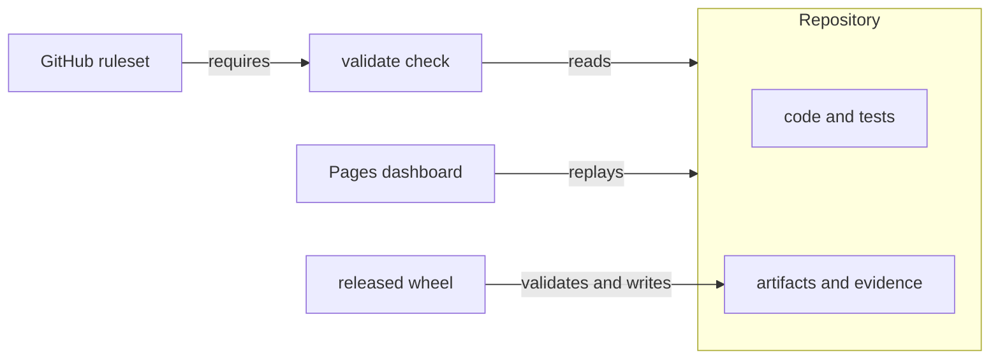
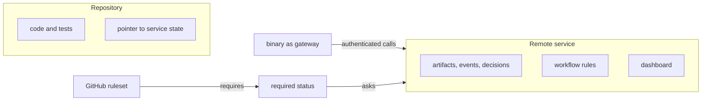
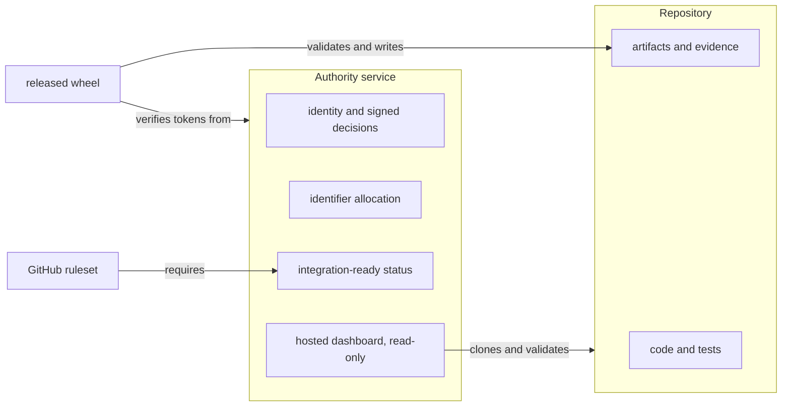

# Proposal: a remote governance service, 2026-09-07

<!-- Target expertise: 3/10. The score describes the knowledge expected from the reader, not the quality or complexity of the document. -->

> Point-in-time. Written against `main` at `711fe39c` under the 0.16.0
> root. This note is an operator analysis of an architecture change the
> owner asked to have proposed and challenged. It has no authority and
> changes no rule. Any decision it names is the owner's, to be recorded as
> a `DEC-` artifact.

## Summary

Today every governance artifact, the work orders, specifications, records
and evidence, lives inside the repository it governs, and the released
`se_harness` wheel enforces the workflow on that tree. The owner asked to
consider moving the artifacts and the workflow logic to a remote service
reached through a web API, with the binary as a gateway and the dashboard
hosted by the service.

The verdict in three sentences. The change trades away the one property
the system is built on, evidence in the same commit as the code, to gain
the one property it lacks, a real authority boundary. The second can be had
without giving up the first. This note recommends moving the authority to
a service and leaving the artifacts in the repository, in four steps that
each pay for themselves.

## The three shapes

### Today

The repository is the ledger. A clone carries the code, the artifacts and
the evidence. The wheel validates the tree and writes transitions into it.
The pull request is where a human reads both the code and the governance
change, and merges once. GitHub's ruleset requires the `validate` check.

### As requested

The service is the ledger. The repository keeps the code and a pointer to
the service state it claims to satisfy. The binary forwards commands. The
rules live and are versioned server-side. CI asks the service whether a
commit is ready.

### Recommended

The repository stays the ledger. A thin service holds what a repository
cannot: identities, signed decisions, global identifiers, and a status
GitHub can require. The wheel keeps evaluating the tree, and verifies the
service's signatures before it writes.

## What the requested change would gain

- **Decisions get an identity.** Today a decision is the free-text
  `--decision ID=ROLE` argument; the specification for authenticated
  records, `SPEC-ECP-004`, is still a draft. A service must authenticate,
  so forgery ends.
- **Identifiers become unique across clones.** Issue #80 closes fully.
- **A deterministic merge control.** A required status backed by the
  service is what the 2026-09-04 incident review asked for (#354 to #356).
- **A live dashboard** instead of a replayed Pages build, and views across
  more than one repository.

## Why the change should be challenged

- **Commit binding is the guarantee, not a feature.** A verification
  record binds a commit. The formal snapshot digest covers the artifact
  tree. The scope gate diffs the pull request against `main`, artifacts
  included. Evidence packets are hash-bound in the domain that owns them.
  Each says: this commit contains its own proof. With remote artifacts a
  commit contains a claim about a proof held elsewhere, and two systems
  must agree on what happened when. That is the drift the harness exists
  to remove.
- **Review leaves the pull request.** The owner reads the approval, the
  scope amendment and the record in the diff, then merges once. Split the
  state and the merge no longer witnesses both halves.
- **A clone stops being complete.** A clone or fork carries all governance
  state, works offline, and is reproducible by anyone with the wheel. This
  is what lets the harness govern other repositories. With a service, every
  consumer becomes a tenant, every CI needs credentials, and one outage
  blocks every merge everywhere.
- **The authority model does not exist yet.** Roles, identities, signing
  and refusal of forgeries are a product in themselves. They are also the
  part worth building, and they do not require moving the artifacts.
- **The merge lever is unchanged.** Whatever the service decides, GitHub
  merges unless a ruleset requires the service's status. The chain ends in
  a required check either way, the lever the delegation class already uses.
- **Version skew becomes client and server.** The released-evaluator
  identity, the hash-locked managed files and the mutation guard exist so
  that one known evaluator is the only writer. Across a wire, every rule
  about which version governs becomes a compatibility matrix.
- **Migration.** The corpus that would move:

| Artifact files | Evidence files | Domains | Package lines |
| --- | --- | --- | --- |
| 1,682 | 213 | 50 | 20,787 |

Every one of those files carries commit-bound references that would need
a mapping into the new store.

## The recommended path

Keep the ledger in Git. Add a thin authority service. Take the steps in
this order; each one is useful on its own and none forecloses the next.

1. **Hosted dashboard as a read-only indexer.** It clones, validates with
   the released wheel and serves the Explorer for one or many
   repositories. No write path and no rule changes. The Pages replay
   retires.
2. **Identity and signed decisions.** Implement `SPEC-ECP-004` with the
   service as the identity source. A decision becomes a signed token the
   wheel verifies and writes into the lifecycle event. The record still
   lives in the commit; the forgery path closes.
3. **Global identifier allocation.** One endpoint; the wheel refuses an
   unallocated identifier. Issue #80 closes.
4. **Integration-ready status.** The service runs the delivery-select
   checkpoint on a head and posts a required status. Issue #356 gets a
   home.
5. **Then decide** whether any state should move. By that point real use
   will show whether the remaining pain is where artifacts live or where
   decisions are made. The expectation here is the latter.

## If the full move is chosen anyway

Four conditions make it survivable.

- Every service write returns a signed receipt that is committed into the
  repository, so a commit still binds its state.
- The rules engine ships as the same versioned code in the wheel and in
  the service, so offline evaluation stays exact.
- The store is append-only with per-repository export, so a clone can be
  made complete again.
- The human decision rights stay exactly the current set. The move changes
  where a decision is recorded, never who takes it.

## Decisions for the owner

1. Ledger location: artifacts stay in Git, or move to the service.
2. First increment: the read-only hosted dashboard, or identity and signed
   decisions.
3. Whether `SPEC-ECP-004` is revived as the contract for step 2, or
   superseded by a new specification that names the service.
4. Whether the service is single-tenant for this repository first, or
   multi-tenant from the start.

## Where this sits

`ADR-ECP-002` chose to enforce at the Git boundary and removed the Phase 4
broker. The plugin proposal of PR #360 and its review in issue #367 found
that the approve and verify flows already assume an authenticated decision
service that does not exist. This note names that service, keeps it thin,
and keeps the ledger where `ADR-ECP-002` put it.
