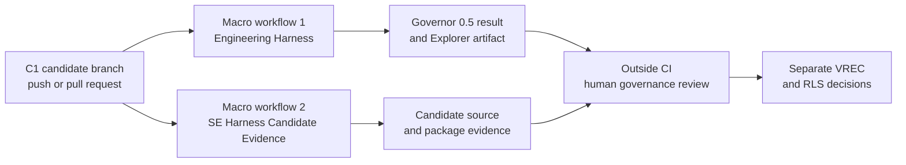
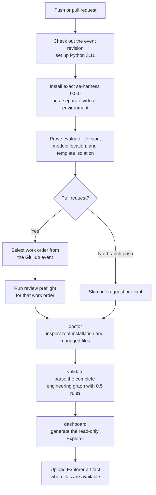
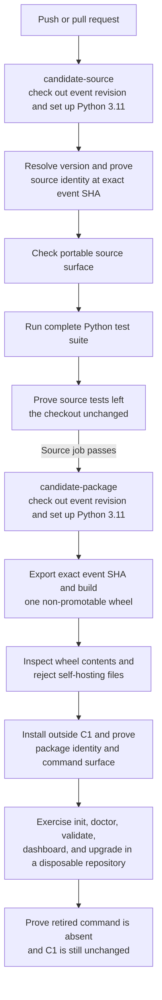
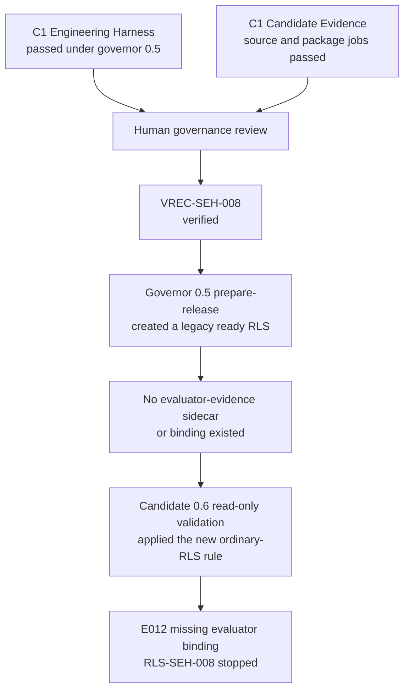
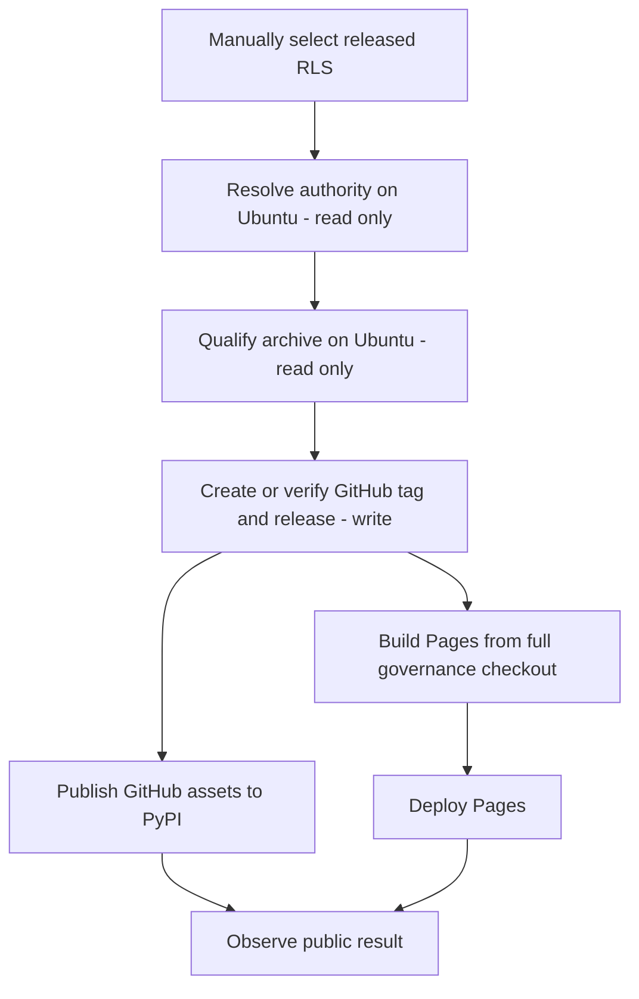
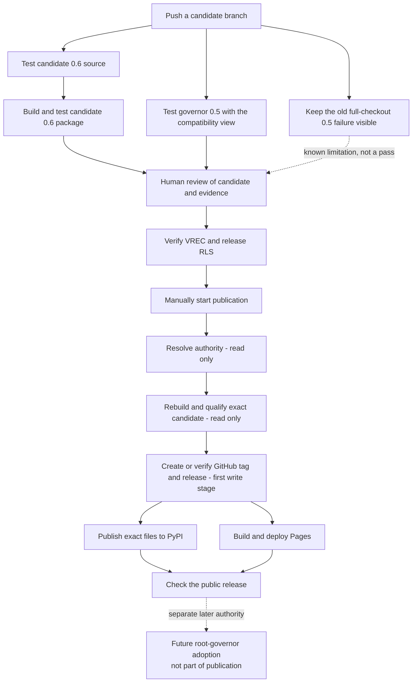

# RCA: 0.6.0 release and publication recovery

| Field | Value |
| --- | --- |
| Status | Release recovered; follow-up GitHub issues still need to be created |
| Incident window | 2026-08-21 to 2026-08-23 |
| Scope | `se_harness` 0.6.0 integration, testing, governance, publication, and public checks |
| Severity | P0 release-process incident; no consumer outage or known integrity loss |
| Final candidate | `3b339e9fc70cc634e6dc6bda07ea6a9b1a465798` (C6) |
| Final release record | `RLS-SEH-012` |
| Release governance commit | `c37ec5af43234ce66c518aa58355ec05c7b8aa21` |
| Final reconciliation commit | `cccbaa70a6c5a33e19decec0d78f26afd87d5f9e` |
| Public result | GitHub Release, PyPI, maintenance branch, Pages, and GitHub “Latest” state all reconciled |

## Executive summary

Release 0.6.0 ended in a correct and reproducible state. Its tag, packages, release record, and public pages all agree. Getting there was much harder than it should have been. We needed six product candidates, several replacement release contracts and verification records, many hosted runs, repeated publication fixes, and a separate Pages recovery.

The main problem was a version-compatibility gap in the governance system. This repository was still controlled by the released 0.5.0 evaluator while it was preparing 0.6.0. We call that controlling evaluator the **governor**. Version 0.6.0 introduced release-record fields and lifecycle states that 0.5.0 did not understand. The release design described the new 0.6.0 rules, but it did not fully describe how governor 0.5.0 could safely prepare and release the first version using those rules.

We fixed that gap one step at a time. First we added a narrow bootstrap. Then we handled line endings, rejected history, successor records, hosted assessment, publication, and Pages. Each fix was valid, but each one revealed another place that still used the old assumptions.

The second major problem was testing. Before the release decision, we did not run the complete publication flow in the same hosted environment used by the real release. Important details were different between local tests and GitHub Actions: operating system, shell, Python patch version, virtual-environment links, Git history, temporary paths, job boundaries, and build tools. As a result, publication became the first true end-to-end test for several behaviors.

The third problem was process overhead. Immutable candidates and fail-closed checks kept the release safe. “Fail closed” means the process stopped before credentials or irreversible changes when it found a mismatch. That was good. However, almost every new problem required a separate packet, approval, commit, hosted run, evidence update, and verification decision. The controls protected the release, but the recovery path was too slow and too fragmented.

The blunt but accurate maintainer summary is: "we shat in the glue real hard". This is a blameless RCA. The sentence describes the combined system and process failure, not a person.

## Terms used in this RCA

| Term | Simple meaning |
| --- | --- |
| Governor or predecessor evaluator | The already released 0.5.0 package installed outside the checkout. It controlled repository lifecycle actions during this release. |
| Candidate evaluator | The 0.6.0 code under test. It could validate its new format but was not allowed to govern its own release. |
| Evaluator evidence | A canonical JSON identity receipt created by bounded repository tooling after observing the exact external evaluator. It records the evaluator version, wheel and installed-payload hashes, executable/module/template origins, and isolation facts. It is not a validation result, approval, or release decision. |
| Root validator | The managed validator under `scripts/` and the equivalent validator supplied by the installed governor. During this release it remained the 0.5.0 validator and therefore did not understand 0.6.0-only lifecycle history. |
| Candidate validator | The validator packaged in candidate 0.6.0 and represented in the 0.6.0 standard template. It understood the new 0.6.0 format, including valid rejected history, but had no authority to approve its own release. |
| N-minus-one or N-1 | The previous released version. Here, 0.5.0 is N-1 and 0.6.0 is N. |
| Compatibility view | A temporary, read-only checkout that hides only the exact historical files 0.5.0 cannot parse. The hidden paths and hashes are recorded and checked. |
| Exact candidate | One immutable Git commit used as the product being tested. Any product change creates a new candidate. |
| Governor adoption | A separate post-publication root-upgrade transaction that replaces the operational governor only after the new version is published and independently verified. Publishing 0.6.0 did not itself adopt it as this repository's governor. |
| Reconciliation | Checking that Git, GitHub, PyPI, Pages, maintenance refs, hashes, and release metadata all agree. |

## Authority boundary

This RCA is retrospective documentation. It does not approve code changes, change lifecycle status, move a tag, publish, deploy, use credentials, or upgrade the root evaluator. The actions below are written so they can become GitHub issues, but each issue and implementation still needs normal approval.

## Impact

- Release 0.6.0 was blocked or only partly public for about 32 hours, from the first operational candidate to final Pages reconciliation.
- We created six immutable product candidates: C1 `827b270`, C2 `b033827`, C3 `2ab1c1f`, C4 `b099a27`, C5 `5653cb5`, and final C6 `3b339e9`.
- The release scope grew from eight work orders to nine, then twelve, and finally fourteen after release work had started.
- We had to preserve failed history: stopped `RLS-SEH-008`, rejected `RLS-SEH-009`, rejected contracts `REL-SEH-008`, `REL-SEH-009`, and `REL-SEH-010`, plus failed C4 and C5 hosted runs.
- Several hosted runs stopped safely before privileged work. One later run published the GitHub Release, PyPI files, and maintenance branch but failed Pages, so the public release was incomplete until recovery finished.
- Most maintainer time went into serial approvals, exact-candidate replays, hosted diagnosis, evidence retention, and replacement governance records.
- There was no consumer outage, moved tag, replaced distribution, credential leak, or known break in provenance.
- The final files remained the exact C6 files recorded by `RLS-SEH-012`:
  - wheel SHA-256 `2a952eb6ff4ea137d0904c3c9a6f19c88482bfbaa18a9766e5ad4d4a6fef62f7`;
  - sdist SHA-256 `9493aa40ffbaf021edd205d6c302d67d11975bc057f73ba09b91043a9a51bbe4`.

## Priority definitions

| Priority | Meaning |
| --- | --- |
| P0 | Fix before the next production release. This can block release, weaken provenance, or recreate the same deadlock. |
| P1 | Fix before or during the next minor-release cycle. This can seriously delay recovery, hide evidence, or make hosted behavior unreliable. |
| P2 | Important cleanup or maintenance. It did not threaten the released files but caused confusion or future risk. |

## CI and release workflow at the start of 0.6.0

**CI** means the automated checks run by GitHub Actions after a pull request or branch push. CI tests the code and the engineering records, but it does not make human release decisions.

For this release, the difficult part was that two versions of `se_harness` had different jobs:

- released 0.5.0 was the governor and had authority over the repository;
- candidate 0.6.0 was the product being tested and understood the new format;
- candidate 0.6.0 could prove that its own code and records worked, but it could not approve or release itself.

Two validator copies therefore coexisted by design. The root file `scripts/validate_engineering_artifacts.py` remained the managed 0.5.0 copy. The candidate file `templates/repository/standard/scripts/validate_engineering_artifacts.py` was the 0.6.0 copy that would be installed only through a later governor-adoption transaction. Comparing those files shows a version boundary, not two contradictory contracts inside 0.6.0. In particular, 0.6.0 accepts properly formed rejected VREC and RLS history and excludes rejected RLS records from active-version uniqueness; 0.5.0 does neither.

The files under `docs/engineering/` are part of these checks. They are not passive notes. The validators read their IDs, statuses, links, candidate commits, work-order lists, evidence paths, and release records as structured input.

### The two historical starting points

There are two useful starting points because the first candidate never reached public publication:

| Starting point | Exact Git commit | What it represents |
| --- | --- | --- |
| First operational candidate, C1 | `827b2709292abaa3458bb3b4cac37b582378c585` | The candidate-branch CI and release workflow code when the 0.6.0 release effort began. |
| First actual publication attempt | `c37ec5af43234ce66c518aa58355ec05c7b8aa21` | The trusted `main` workflow used by publication run `32587383130`, after C6 had been accepted and `RLS-SEH-012` released. |
| Recovered workflow | `cccbaa70a6c5a33e19decec0d78f26afd87d5f9e` | The workflow after the publication and Pages recovery fixes. It is documented in the change map below. |

At C1, release governance failed before publication could start. The publication workflow already existed in the repository, but its hidden problems were not exercised by a real release until the later `c37ec5a` dispatch. The RCA therefore uses C1 for the original candidate CI and `c37ec5a` for the first real publication behavior.

### Original candidate-branch CI at C1

#### Tier 0: the two macro workflows

This first chart deliberately hides command-level detail. It shows the two automated workflows that started from the same candidate commit and the manual governance boundary after them.

The objectives of the Tier‑0 blocks were:

| Tier‑0 block | Objective | Output |
| --- | --- | --- |
| **Engineering Harness** | Ask the currently released governor, exact version 0.5.0, whether it accepted the complete candidate checkout as an engineering-governance repository. | A pass/fail result from 0.5 and, when available, a read-only Harness Explorer artifact. |
| **SE Harness Candidate Evidence** | Test the candidate's own source and a temporary installed package without treating either one as the released governor. | Source-test evidence, package-test evidence, and proof that testing did not modify C1. |
| **Human governance review** | Review both bodies of evidence and decide separately whether verification and release records may move forward. | Human decisions recorded later in VREC and RLS records. This block was outside GitHub Actions and did not happen automatically. |

Only the first two blocks were GitHub Actions workflows. **Engineering Harness** had one `validate` job. **SE Harness Candidate Evidence** had two jobs: `candidate-source`, followed by `candidate-package` only when the source job passed.

#### Original Engineering Harness workflow

The label **Engineering Harness with governor 0.5** meant: "Ask the currently released governor whether it can accept this repository." It did not mean that 0.5 tested the implementation of 0.6.0.

The workflow installed exact `se-harness==0.5.0` in a temporary virtual environment outside the candidate checkout. It then proved that the loaded Python module and template directory came from that environment, not from C1. This isolation prevented the candidate from silently replacing the governor that was judging it.

##### Engineering Harness step flow

Each step had a narrower purpose than the name "Engineering Harness" suggests:

| Step | Objective | What it did | What it did **not** prove |
| --- | --- | --- | --- |
| Trigger, checkout, and Python setup | Give the workflow the revision named by the GitHub event and a known Python runtime. | On every push or pull request, `actions/checkout@v4` checked out the event revision—C1 for the candidate-branch run—and `actions/setup-python@v5` selected Python 3.11 on Ubuntu. | It did not prove full Git history was present; the checkout was shallow by default. |
| Install the released evaluator | Obtain the governor that already had release authority. | Created `$RUNNER_TEMP/se-harness-env` and installed the binary wheel `se-harness==0.5.0` with no dependencies. | It did not install or test candidate 0.6.0. |
| Prove evaluator identity and isolation | Prevent C1 from judging itself by replacing the imported governor or templates. | An isolated Python command checked version `0.5.0` and required both the `se_harness` module and template directory to be inside the evaluator virtual environment and outside the candidate checkout. | It did not say whether C1's code worked. |
| Select the pull-request work order | Identify exactly which work order a pull request claimed to implement. | `select-work-order --event "$GITHUB_EVENT_PATH"` read the GitHub event and returned one work-order ID. This step did not run on a branch push. | It did not approve or validate the selected work order. |
| Review preflight | Decide whether the selected work order was ready for review under 0.5 rules. | Ran `preflight . --work-order <ID> --phase review` and inspected that work order and its linked records. This step also ran only for pull requests. | It did not approve the work order or test product code. |
| Inspect the installed harness | Check that the repository root was still a valid installation of the released harness. | `doctor .` checked Python, root configuration and lock files, required paths, managed fragments/files, lock entries, hashes, and agreement with the released 0.5 templates. | It did not run candidate unit tests or apply 0.6 rules. |
| Validate the engineering graph | Check the complete structured governance history using the rules known to 0.5. | `validate .` parsed records under `docs/engineering`, checking IDs, record types, required fields, statuses, links, uniqueness, and lifecycle relationships understood by schema 0.5. | It could not understand statuses or record shapes introduced after 0.5. |
| Generate the Explorer | Produce a human-readable view of the graph that 0.5 had just read. | `dashboard .` generated the read-only site under `target/harness-dashboard`. | It did not grant approval or prove candidate-package behavior. |
| Upload the Explorer | Preserve generated dashboard files for reviewers. | `actions/upload-artifact@v4` ran with `if: always()` and uploaded `target/harness-dashboard` when that directory existed. | It could not create a dashboard if an earlier failure prevented `dashboard` from running. |

At C1, the rejected 0.6.0 history did not yet exist, so the full-checkout 0.5 validator could still pass. Once rejected history was added, the same unchanged workflow began reporting E009 because 0.5 did not understand that status.

The workflow had read-only repository permission. It did not publish or change lifecycle records.

#### Original Candidate Evidence workflow

This workflow answered a different question: "Does candidate C1 work from its source tree and after installation from a wheel?" It did not decide whether the released governor accepted C1's governance history.

##### Candidate Evidence step flow

Here, **check** meant one of the following executable operations, not a general review:

| Job and step | Objective | What it did | What it did **not** prove |
| --- | --- | --- | --- |
| `candidate-source`: checkout and setup | Start from the event revision on Ubuntu with a known Python family. | Checked out the event revision—C1 for the candidate-branch run—selected Python 3.11, disabled the user site, and cleared `PYTHONPATH`. | The checkout was still shallow and did not explicitly disable persisted checkout credentials. |
| `candidate-source`: resolve and prove identity | Make sure the tests imported the checked-out revision rather than another installed copy. | Imported `se_harness` to resolve its version, then `identity --role candidate-source` checked the version, source and template locations, repository root, checkout boundary, and exact `GITHUB_SHA`. | It did not establish acceptance by governor 0.5. |
| `candidate-source`: portable surface | Ensure source exposed the intended standard user-facing surface and not the retired self-hosting surface. | Ran `scripts/check_portable_release_surface.py --repository .`. | It did not build or install a package. |
| `candidate-source`: regression suite | Exercise all candidate test files from source. | Ran `python -m unittest discover -s tests -p test_*.py`. | Candidate-written tests could not by themselves prove predecessor compatibility. |
| `candidate-source`: no-change proof | Ensure the tests did not rewrite the candidate. | Required an empty Git diff and an empty porcelain status, including untracked files. | It did not prove reproducible distribution bytes. |
| `candidate-package`: checkout and setup | Start the package job independently after the source job passed. | Performed a fresh checkout of the event revision and selected Python 3.11 with the same import-isolation environment. | It did not reuse or promote an artifact from the source job. |
| `candidate-package`: export and build | Build only content committed at the exact event SHA. | Used `git archive "$GITHUB_SHA"`, extracted it under the runner temporary directory, built one wheel with `pip wheel --no-deps`, and required exactly one `.whl` file. | The wheel was explicitly non-promotable and was not the release file. |
| `candidate-package`: inspect wheel | Ensure the package contained the intended portable surface. | Ran the portable-surface script on the wheel and rejected `share/se-harness/self-hosting/` plus the retired reconciliation and self-hosting Python modules. | It did not yet prove that the wheel could run after installation. |
| `candidate-package`: install and prove identity | Exercise the built package without accidentally importing source from C1. | Installed the wheel in a separate virtual environment, then verified version, root, entry point, exact candidate commit, isolated Python use, checkout separation, and the installed `harnessctl` surface. | It did not grant lifecycle or publication authority. |
| `candidate-package`: disposable repository | Test basic operations from the installed user command. | Created a temporary repository with `init`, then ran `doctor`, `validate`, `dashboard`, and `upgrade --apply`. | It tested a fresh standard repository, not the real 0.6.0 governance history. |
| `candidate-package`: retired-command and no-change proof | Confirm removal of the old command and preserve candidate immutability. | Failed if `harnessctl --help` exposed `reconcile-governor`, then required an empty Git diff and status in C1. | It did not test tagging, PyPI publication, or Pages. |

The package job waited for the source job. The test wheel was non-promotable and could not become the release file.

The original checkout used GitHub's default shallow history and did not explicitly disable stored checkout credentials. The workflow itself had read-only permission, but full-history and credential-free checkout were not yet stated requirements.

#### Where C1 actually stopped

Both C1 candidate-branch workflows passed. The first release attempt failed later, after `VREC-SEH-008` had been verified, when the process tried to prepare and validate `RLS-SEH-008`.

Governor 0.5 did **not** produce malformed evaluator evidence. It produced legacy ready-RLS metadata and did not know how to create or bind the new sidecar at all. Candidate 0.6 then reported that the proposed post-release graph would be invalid under its ordinary schema-3 rule. That candidate result was a read-only compatibility gate; it did not change the RLS status, approve or reject the release, or give candidate code authority.

The eventual bootstrap preserved this trust direction. Governor 0.5 still prepared the RLS. Separately bounded repository tooling observed the exact external 0.5 installation, created the canonical identity sidecar, bound its path and hash to one specifically authorized RLS, and allowed candidate 0.6 to verify that exact handover tuple.

#### What was missing from candidate CI

There was no **Predecessor Evaluator Assessment** workflow at C1. Nothing separately proved all of the following in one hosted lane:

- the complete repository passed current 0.6 rules;
- exact governor 0.5 produced only the expected failure on the complete new history;
- exact governor 0.5 passed on a precisely defined compatibility view;
- the view omitted only the approved historical pair and changed no source file.

This missing bridge became important only after rejected history appeared.

### Original publication workflow

The publication workflow was manually started on trusted `main` with a release-record ID. Its high-level safety design was already good: read-only checks came first, and write permission appeared only after qualification.

The original stages were:

| Stage | Original behavior | Important limitation later exposed |
| --- | --- | --- |
| Resolve authority | On Ubuntu, read trusted `main`, validate the RLS input, install exact governor 0.5, validate the full checkout directly, and create a release plan. | Governor 0.5 could not parse the rejected post-C2 history. No publication compatibility view was used. |
| Qualify candidate | On `ubuntu-latest` with the current Python 3.11 patch, export C6 twice as tar trees, run validation/tests/help/doctor inside one extracted tree, build twice, compare files, and assemble a verified bundle. | The extracted tree had no Git metadata. It used the locked root validator, ran candidate `doctor` against the 0.5 root, pinned only `build==1.3.0`, and did not reproduce the retained Windows build environment. |
| GitHub tag and release | Recheck the plan and bundle, then create or verify the annotated tag, GitHub Release, and maintenance branch. | This was correctly the first repository-write stage. Its basic permission boundary did not cause the incident. |
| PyPI | Download the final GitHub assets, verify hashes, check existing PyPI state, and publish with Trusted Publishing. | The basic design was sound and already used a short-lived identity token. |
| Pages build | Check out governance, install governor 0.5, validate the full governance checkout directly, generate the Explorer, and upload it. | It did not retain or use a compatibility view for generation. |
| Pages deploy | Deploy the uploaded Pages artifact. | It could run only if Pages build passed. |
| Observe | Run after the other stages, inspect public installation and Pages, and retain a machine-readable result. | It could report a failure but could not prevent a late Pages defect that earlier testing had not exercised. |

The separate Pages recovery workflow had the same full-checkout assumption. It resolved the released record, checked the GitHub Release, installed governor 0.5, validated the full governance snapshot directly, generated the Explorer, and deployed it. It also compared an output inside the same step that produced it, which GitHub Actions does not support.

### What happened before the first real publication dispatch

By the time `c37ec5a` started publication run `32587383130`, C2 through C6 had already added bootstrap, rejected-history, preparation-view, hosted-assessment, and POSIX fixes. A separate predecessor-assessment workflow now existed.

However, the publication workflow did not yet use that proven view in its authority-resolution or Pages steps. Its candidate qualification job still used Ubuntu archives, incomplete build inputs, the wrong validator role, and candidate `doctor`. The first actual publication run therefore stopped during authority resolution before later stages could reveal their own problems.

This distinction matters:

- the **candidate CI problems** began with the C1 design;
- the **publication problems** were first observed later, when the accepted C6 release finally exercised the live publication pipeline.

## Annex A: Current recovered workflow and change map

This annex is placed before the incident timeline so readers can compare the two flows while reading the RCA. It describes the workflow on final reconciliation commit `cccbaa70a6c5a33e19decec0d78f26afd87d5f9e`.

| Marker | Meaning |
| --- | --- |
| **UNCHANGED** | The step already existed and kept the same main responsibility. |
| **CHANGED** | The step existed, but its runner, input, command, or safety rule changed. |
| **ADDED** | The step or complete workflow did not exist at C1. |
| **REMOVED** | The old step was found to make an invalid claim and was deleted. |
| **STILL MANUAL** | Recovery completed the action manually, but automation still needs a follow-up issue. |

### Exact changes from the original workflow

| Workflow or step | Change | Recovery evidence |
| --- | --- | --- |
| Released-governor lane: exact 0.5 identity, `doctor`, `validate`, and `dashboard` | **UNCHANGED.** It still applies governor 0.5 to the complete checkout and therefore shows that governor's limit honestly. | Retained C6 expected-red observation |
| Candidate `identity`, portable-surface, test-suite, wheel, installed-package, and disposable-repository operations | **UNCHANGED responsibility.** They still prove the candidate source and temporary package behaviors described in the C1 table. | Candidate C6 hosted evidence |
| Candidate checkouts | **CHANGED.** Both jobs now request full Git history and explicitly avoid persisted checkout credentials. | `WO-REB-008` hosted correction |
| Predecessor Evaluator Assessment workflow | **ADDED.** It was introduced after C4 to test exact 0.5 against the approved view while keeping the full-checkout failure visible. | [`WO-REB-007`](../engineering/released-evaluator-boundary/evidence/WO-REB-007-corrective-proposal.md) |
| Predecessor assessment after release | **CHANGED.** It now selects released `RLS-SEH-012` and the publication-view adapter instead of the earlier C5 release-contract assessment command. | [`WO-REB-008`](../engineering/released-evaluator-boundary/evidence/WO-REB-008-publication-view.md) |
| Assessment failure evidence | **ADDED.** Result printing, no-change proof, and uploads run even when assessment fails. | `WO-REB-007` |
| Publication authority resolution | **CHANGED.** Direct full-checkout 0.5 validation was replaced by the exact predecessor publication view; its view and result are retained with the plan or refusal. | `WO-REB-008` |
| Candidate archive validator | **CHANGED.** Qualification now uses current C6 validation for the complete C6 graph instead of the locked 0.5 root validator. | [`WO-REB-009`](../engineering/released-evaluator-boundary/evidence/WO-REB-009-candidate-validator.md) |
| Exact Git context for tests | **ADDED.** Tests run in a detached exact-C6 worktree with Git history; the two tar exports remain build inputs only. | [`WO-REB-010`](../engineering/released-evaluator-boundary/evidence/WO-REB-010-git-aware-candidate.md) |
| Candidate `doctor` against the 0.5 root | **REMOVED.** It tested an intentionally invalid role/target pair and added no useful release claim. | [`WO-REB-011`](../engineering/released-evaluator-boundary/evidence/WO-REB-011-candidate-doctor-boundary.md) |
| Build tools | **CHANGED.** Qualification installs exact `build==1.3.0`, setuptools `84.0.0`, and wheel `0.48.0`. | [`WO-REB-012`](../engineering/released-evaluator-boundary/evidence/WO-REB-012-build-toolchain.md) |
| Qualification runner | **CHANGED.** It moved from `ubuntu-latest`/current Python 3.11 to `windows-2022`/exact Python 3.11.9 to replay the retained producer environment. | [`WO-REB-013`](../engineering/released-evaluator-boundary/evidence/WO-REB-013-retained-build-platform.md) |
| Git Bash paths | **ADDED.** Runner temporary paths are converted with `cygpath` before POSIX shell tools use them. | [`WO-REB-014`](../engineering/released-evaluator-boundary/evidence/WO-REB-014-windows-bash-path.md) |
| Candidate-test temporary directory | **ADDED.** `TEMP` and `TMP` point to one long, normalized Windows path. | [`WO-REB-015`](../engineering/released-evaluator-boundary/evidence/WO-REB-015-windows-test-temp.md) |
| GitHub tag/release and maintenance stage | **UNCHANGED responsibility.** It remains the first contents-write stage and consumes only the verified plan and bundle. | Final publication reconciliation |
| PyPI stage | **UNCHANGED responsibility.** It still promotes exact verified GitHub assets through Trusted Publishing. | Final publication reconciliation |
| Release-bound Pages validation and generation | **CHANGED.** It retains an exact predecessor view and generates the Explorer from that proven view instead of the full incompatible checkout. | [`WO-REB-016`](../engineering/released-evaluator-boundary/evidence/WO-REB-016-pages-generation-view.md) |
| Standalone Pages output check | **CHANGED.** The governance-output comparison is now a later step that can read the completed producer's outputs. | [`WO-REB-017`](../engineering/released-evaluator-boundary/evidence/WO-REB-017-pages-step-output.md) |
| Pages view directory | **ADDED in the consuming job.** Each job creates its own required directory instead of assuming files survive from another job. | `WO-REB-017` |
| Public observation job | **UNCHANGED responsibility.** It still runs after the main stages and retains the public result. | Successful release result |
| GitHub Latest marker | **STILL MANUAL.** The release was marked Latest during final reconciliation, but automated closeout still needs RC-060-16. | [GitHub Release v0.6.0](https://github.com/mmzen/se_harness/releases/tag/v0.6.0) |

### Current overall flow

The dotted final edge is intentionally outside the 0.6.0 publication transaction. Publication made 0.6.0 publicly available; it did not replace the repository's operational 0.5.0 governor. Adopting 0.6.0 at the root remains a separate, explicitly authorized post-publication operation.

### 1. Checks run after a candidate push

Three main workflows run after a pull request or branch push.

#### Engineering Harness

This is the repository's normal governor check. It installs exact released version 0.5.0 outside the checkout and proves that the installed package is independent from candidate source. It then checks the managed root files and engineering graph.

For an ordinary repository governed entirely by one version, this workflow should be green. During the 0.6.0 transition, its full-graph check was deliberately kept red because 0.5.0 could not understand rejected 0.6.0 history. On the final C6 candidate before release, the retained expected diagnostic was E009. After released `RLS-SEH-012` joined the same-version history, unchanged 0.5.0 could additionally report E010 active-version and active-authority consequences. Those post-release E010 diagnostics were another effect of the same predecessor limitation, not a new 0.6.0 validator failure. No red result was called a pass or ignored.

This red workflow did not mean C6 was broken. It meant the old governor had reached a known limit.

#### Candidate Evidence

This workflow asks whether candidate 0.6.0 itself works.

It has two jobs:

1. **Candidate source evidence** checks the candidate's identity and portable file surface, runs the full test suite, and proves that testing did not change the checkout.
2. **Candidate package evidence** runs only after the source job passes. It builds a temporary wheel, checks its contents, installs it outside the checkout, proves its identity, and exercises it in a disposable standard repository.

The temporary wheel is test evidence only. It is not the final release file.

#### Predecessor Evaluator Assessment

This is the bridge between the two versions. It first validates the complete repository with the current 0.6 rules. It then installs exact released 0.5.0, checks its wheel hash and identity, and performs two 0.5 observations:

- it confirms that the recorded 0.5.0 failure on the complete new history matches the diagnostic set expected for that exact governance snapshot, without calling that result a pass;
- it runs 0.5.0 against the compatibility view, where only the exact rejected historical pair is absent.

The view records the hidden file paths and hashes and proves that the real checkout did not change. The complete graph is still tested separately by candidate 0.6.0.

The expected result for final C6 was therefore:

| Check | Expected result | What it proves |
| --- | --- | --- |
| Candidate source | Green | The 0.6 source, portable surface, and full regression suite work. |
| Candidate package | Green | The built 0.6 package works outside the checkout. |
| Complete candidate graph | Green | The complete engineering history passes the current 0.6 rules. |
| Predecessor compatibility view | Green | Exact 0.5 can safely perform its part of the transition. |
| Legacy 0.5 full-checkout graph | Exact C6 pre-release E009 | The old governor's limit remains visible and has not changed into a different failure at the candidate snapshot. Post-release snapshots can add the already documented E010 consequences. |

### 2. Human governance between CI and publication

Green CI is evidence, not approval. After hosted results are available, people still make the controlled decisions:

1. mark the implementation work orders complete;
2. prepare and independently accept the aggregate verification record, or VREC;
3. prepare and independently accept the release record, or RLS;
4. create the immutable tag only for the exact candidate named by the RLS;
5. separately authorize publication.

This separation is why candidate code cannot approve itself. Automation reports facts; named owners make lifecycle and release decisions.

### 3. The publication workflow

Publication does not start automatically from an ordinary push. A maintainer manually starts it on trusted `main` and supplies the release-record ID. The workflow then moves through jobs in a fixed order.

#### Resolve released authority

This Ubuntu job is read-only. It checks out full trusted `main` history, validates the selected released RLS, finds the exact candidate, verifies governor 0.5, runs the predecessor publication view, and creates one release plan.

The plan contains the version, tag, candidate commit, governance commit, filenames, hashes, and build timestamp. Later jobs download this plan instead of deciding those facts again.

#### Rebuild and qualify the exact candidate

This job runs on Windows 2022 with exact Python 3.11.9 because those are part of the retained 0.6.0 build recipe. It still has read-only repository permission and does not receive publication credentials.

It:

1. exports the exact candidate twice;
2. tests the candidate in an exact Git worktree;
3. builds the wheel and sdist twice;
4. proves both builds are byte-for-byte identical;
5. compares them with the hashes in the RLS;
6. packages only the verified files into an inert bundle for the next job.

If any check fails, publication stops before a tag, GitHub Release, PyPI upload, or Pages deployment.

#### Create or verify the GitHub tag and release

This is the first job with repository write permission. It runs only after authority resolution and qualification pass. It rechecks the plan and bundle, creates or verifies the annotated tag, creates or verifies the GitHub Release, and reconciles the `release/0.6` maintenance branch.

It does not rebuild the package. It can use only the files passed from the read-only qualification job.

#### Publish to PyPI

This job starts only after the GitHub Release succeeds. It downloads the final GitHub assets, verifies their hashes again, checks whether PyPI already has the version, and publishes through GitHub Trusted Publishing.

Trusted Publishing uses a short-lived identity token. There is no long-lived PyPI password stored in the workflow.

#### Build and deploy Pages

Pages build also starts only after the GitHub Release succeeds. It checks the released record and GitHub Release, resolves the exact governance snapshot, installs exact governor 0.5, validates through the retained compatibility view, and builds the Harness Explorer files.

A separate deployment job receives the Pages artifact and publishes it. Files are passed explicitly because GitHub jobs do not share a filesystem.

#### Observe the public release

The final observation job runs after all publication jobs, including when one fails. It checks public installation and Pages provenance, reports which stage failed, and retains a machine-readable result.

### 4. The separate Pages recovery workflow

Pages can fail after GitHub and PyPI have already succeeded. A separate manually started workflow can rebuild only the public Explorer without changing the candidate, tag, packages, release record, or maintenance branch.

It starts from the released RLS, verifies the existing GitHub Release, checks out the exact governance commit, runs governor 0.5 through the compatibility view, builds and attests the Explorer payload, and then deploys it. This was the workflow that finally succeeded in run `32601701154`.

### Why the release failed one step at a time

The workflow is deliberately staged. A later job cannot run until the earlier job passes. This protects credentials and public systems, but it also means one hidden problem can cover the next one.

During 0.6.0, fixing one stage allowed the workflow to reach the next stage for the first time. That is why the release exposed validator roles, missing Git history, build-tool versions, operating-system differences, Windows paths, temporary directories, compatibility-view lifetime, and Pages job wiring in sequence instead of all at once.

The main prevention is to run this same staged flow as a no-credential rehearsal before the release is accepted and tagged.

## What happened

### Candidate and governance sequence

| Stage | What worked | What failed next |
| --- | --- | --- |
| C1 `827b270` | Eight-work-order candidate passed local and hosted testing; `VREC-SEH-008` was verified. | Governor 0.5 prepared a legacy ready RLS, but it could not create or bind the canonical evaluator-evidence sidecar required by candidate 0.6's ordinary schema-3 rule. Proposed `RLS-SEH-008` was stopped; no malformed sidecar had been produced. |
| C2 `b033827` | Added a one-release bootstrap for governor 0.5 and passed hosted tests. | Windows changed LF evidence to CRLF. Also, rejecting the bootstrap contract made its rejected release record invalid. `RLS-SEH-009` was rejected. |
| C3 `2ab1c1f` | Added LF-stable evidence and valid rejected-history rules. It also integrated new work from `main`. | Rejected 0.6.0 still counted as an active version. Governor 0.5 also could not parse rejected history while preparing a successor. |
| C4 `b099a27` | Added a compatibility view for release-record preparation. | Hosted governor assessment still used the full checkout. Linux also showed that a test mock of `os.open` leaked into temporary-directory cleanup. |
| C5 `5653cb5` | Added hosted compatibility-view assessment and local-only fault injection. | POSIX virtual environments use a symlink for `bin/python`. The code followed that link to `/usr` and rejected a valid evaluator. Failure details were also poorly retained. |
| C6 `3b339e9` | Corrected POSIX interpreter handling and passed Windows/Linux local tests plus hosted candidate and compatibility-view lanes. | C6 became the final immutable candidate. The old full-checkout 0.5 lane remained intentionally red on its exact known limitation. |

The final aggregate record was `VREC-SEH-012`. It covered fourteen work orders, fifteen evidence paths, and thirteen verification contracts. Governor 0.5 prepared `RLS-SEH-012` through the exact compatibility view. The release owner then accepted and released it without changing C6.

### Publication and Pages sequence

| Run or stage | Result | Problem found |
| --- | --- | --- |
| [Publication run 32587383130](https://github.com/mmzen/se_harness/actions/runs/32587383130) | Stopped before privileged jobs | Initial authority resolution ran governor 0.5 against the full post-release checkout instead of the compatibility view. |
| Corrective runs starting with [32590627652](https://github.com/mmzen/se_harness/actions/runs/32590627652) | Stopped safely | One workflow selected an old contract. Another used a depth-1 checkout without required history. After release, the old evaluator reported E009 plus two E010 errors instead of only E009. |
| Publication-fix commit `397a7e5` | Candidate and replacement predecessor lanes passed | It established the correct publication-view behavior without changing C6 or the tag. |
| [Publication run 32594814369](https://github.com/mmzen/se_harness/actions/runs/32594814369) | Failed while testing the archive | The workflow used the released 0.5 root validator on the complete C6 archive instead of using the candidate validator. |
| [Publication run 32595552589](https://github.com/mmzen/se_harness/actions/runs/32595552589) | Failed two tests | Tests ran in an extracted archive with no Git metadata, but two tests needed the exact commit and tree. |
| [Publication run 32596026852](https://github.com/mmzen/se_harness/actions/runs/32596026852) | Failed after tests | Candidate 0.6 `doctor` was run against the intentionally unchanged 0.5 root. It correctly reported root/template drift. |
| [Publication run 32596492345](https://github.com/mmzen/se_harness/actions/runs/32596492345) | Built repeatable but wrong files | `build==1.3.0` was pinned, but setuptools and wheel still came from the runner environment. |
| [Publication run 32597819730](https://github.com/mmzen/se_harness/actions/runs/32597819730) | Still produced different hashes | The original files came from Windows Python 3.11.9. The hosted rebuild used Ubuntu Python 3.11.16. OS and exact Python patch were real build inputs but were not recorded as such. |
| [Publication run 32598292643](https://github.com/mmzen/se_harness/actions/runs/32598292643) | Failed before testing or build | Git Bash passed native `D:\a\_temp\...` paths to POSIX `tar`. |
| [Publication run 32598732033](https://github.com/mmzen/se_harness/actions/runs/32598732033) | Failed seven tests | Windows temporary paths used both short `C:\Users\RUNNER~1` and long `C:\Users\runneradmin` forms. |
| [Publication run 32599307612](https://github.com/mmzen/se_harness/actions/runs/32599307612) | GitHub Release, PyPI, and maintenance branch succeeded; Pages failed | The proven compatibility view had been deleted. Pages then ran governor 0.5 against the full checkout. |
| [Pages recovery run 32601295455](https://github.com/mmzen/se_harness/actions/runs/32601295455) | Failed before build/deploy | A step tried to read an output that it had not finished producing. Review also found a directory was expected to survive from one job to another, but GitHub job filesystems are separate. |
| [Pages recovery run 32601701154](https://github.com/mmzen/se_harness/actions/runs/32601701154) | Passed | The retained view, separate output check, job-local setup, Explorer build, upload, deployment, and public checks all passed. |
| Final public check | Manual correction succeeded | GitHub's `/releases/latest` still pointed to 0.5.0. The 0.6.0 release had not been explicitly marked Latest. |

## Complete problem list

Each row links the visible problem to a deeper root cause. The priority is for preventing the problem from happening again.

| ID | Priority | Problem | Direct cause | Root cause |
| --- | --- | --- | --- | --- |
| I-01 | P0 | Candidate 0.6 validation blocked the first release record prepared by governor 0.5. | Version 0.5 prepared legacy schema-2 RLS metadata but could not create or bind the evaluator-evidence sidecar required by 0.6's ordinary schema-3 rule. | RC-060-01: no complete previous-version migration plan. |
| I-02 | P0 | A normal Windows checkout invalidated evaluator evidence with E012. | Git changed LF JSON to CRLF after its raw hash was recorded. | RC-060-02: hash-bound text depended on local Git settings. |
| I-03 | P0 | Rejecting a failed bootstrap contract made its rejected release record invalid. | Validation still required an approved contract for rejected history. | RC-060-03: stored history and active authority used the same rules. |
| I-04 | P0 | Rejected 0.6.0 blocked a corrected 0.6.0 successor. | Version uniqueness counted rejected records as active. | RC-060-03: rejected history was not separated from active release state. |
| I-05 | P0 | Governor 0.5 could not prepare, assess, publish, or render a repository containing rejected history. | It did not understand `rejected`, and compatibility views were added to only one place at first. | RC-060-04: the compatibility view was not one shared end-to-end service. |
| I-06 | P1 | Linux C4 tests failed inside `shutil.rmtree`, outside the code being tested. | A test replaced the shared process-wide `os.open`. | RC-060-05: fault injection used a global system function and lacked early Linux coverage. |
| I-07 | P0 | C5 rejected a valid POSIX virtual environment. | Resolving `venv/bin/python` followed its symlink to `/usr/bin/python`. | RC-060-06: runtime identity did not separate the safe venv path from the final binary target. |
| I-08 | P1 | The hosted C5 failure showed only exit code 1 and skipped evidence upload. | Diagnostic steps only ran after success. | RC-060-07: failure evidence was optional instead of guaranteed. |
| I-09 | P1 | Corrective workflows lacked history or selected old contracts. | Depth-1 checkout and repeated contract-selection logic drifted from the real release graph. | RC-060-08: Git and provenance needs were not declared in one place. |
| I-10 | P0 | Publication used 0.5 rules to validate the full C6 archive. | The workflow called a validator by path without stating its role. | RC-060-09: evaluator roles were implicit. |
| I-11 | P1 | Candidate tests failed because Git was missing. | The workflow used a tar archive for tests that require Git objects. | RC-060-08: checks did not declare whether they need files only or a full Git repository. |
| I-12 | P0 | Candidate `doctor` blocked publication on expected 0.5-root/0.6-template differences. | Candidate root health was treated as a release-payload check. | RC-060-09: candidate validation and released-root health were mixed. |
| I-13 | P0 | Hosted builds were repeatable but did not match release hashes. | Setuptools and wheel were not pinned. | RC-060-10: the build recipe did not include every build tool. |
| I-14 | P0 | Pinned Ubuntu builds still differed from the Windows-produced release files. | OS and Python patch version were not part of the declared build identity. | RC-060-10: the full producer environment was not recorded. |
| I-15 | P1 | Windows publication could not open export paths. | Native Windows paths crossed into Git Bash without conversion. | RC-060-11: real shell/path boundaries were not tested before publication. |
| I-16 | P1 | Seven Windows tests failed on two spellings of the same path. | `TEMP` and `TMP` used an 8.3 short alias while Python used the long path. | RC-060-11: temporary-path identity was not normalized. |
| I-17 | P0 | Pages failed after packages were already public. | The checked compatibility view ended before Pages used it. | RC-060-04: the view had no defined lifetime across all release jobs. |
| I-18 | P1 | Pages recovery failed even though it found the correct release plan. | Same-step outputs are not readable until the step ends, and job filesystems are separate. | RC-060-12: workflow data lifetime was not modeled or tested. |
| I-19 | P1 | Local runs failed because of an unrelated editable install, CRLF files, missing Git data, or stopped untracked `RLS-SEH-008`. | Some first attempts used a developer worktree or non-isolated Python. | RC-060-13: there was no single clean-room test command. |
| I-20 | P1 | Release counts and contracts changed several times. | Work from `main` entered after release work started, and corrective work joined the release. | RC-060-14: there was no scope freeze or late-change policy. |
| I-21 | P1 | Every small fix required another long governance cycle. | Normal work governance was the only recovery method. | RC-060-15: there was no bounded release-incident recovery process. |
| I-22 | P1 | GitHub Release 0.6.0 was not marked Latest. | The release checklist did not include GitHub's Latest metadata. | RC-060-16: public checks did not cover every discovery surface. |
| I-23 | P2 | The release README still describes C2, the released RLS body still says “ready,” and a stopped local RLS affected tests. | Closeout did not update narrative status or quarantine abandoned local files. | RC-060-17: repository cleanup was not part of release completion. |
| I-24 | P2 | Hosted runs showed Node.js action-runtime deprecation warnings. | Workflow action versions still used the older runtime generation. | RC-060-18: release readiness did not track dependency deprecations. |

## Root causes

### RC-060-01: no complete plan for governor 0.5 releasing candidate 0.6 (P0)

Version 0.6.0 introduced evidence and lifecycle rules that 0.5.0 could not create or read. In the first failure, 0.5.0 could prepare an authoritative legacy ready RLS, but it could not emit or bind the evaluator-evidence sidecar required by the ordinary 0.6.0 schema-3 rule. The sidecar is an identity receipt for the external evaluator, not a validation verdict. The trust model correctly kept 0.5.0 in control, but the release design described only the final 0.6.0 format. It did not describe the complete transition from old preparation, through a mutually verifiable handover, to later governor adoption.

We discovered the missing pieces separately: bootstrap evidence, rejected-history handling, successor preparation, hosted assessment, publication, and Pages. The exact 0.6.0 fixes are safe, but they are narrow. A future format change can repeat the problem unless we define and test how version N-1 governs version N.

### RC-060-02: Git could rewrite hash-bound text (P0)

The evidence used SHA-256 correctly, but Git was allowed to change line endings after the hash was recorded. Saying a file is canonical does not make its checked-out bytes canonical.

Every text file whose raw bytes are hashed needs an explicit line-ending rule, matching `.gitattributes`, a check when the file is created, and tests across LF and CRLF checkout settings.

### RC-060-03: rejected history still behaved like active authority (P0)

Two rules were wrong for rejected records. One required the old contract to stay approved. The other treated the rejected version as still active. Both rules make sense for a ready or released record, but not for final history.

Candidate 0.6.0 corrected both behaviors: its packaged validator accepts properly formed rejected VREC and RLS records, requires their rejection metadata, and counts only ready or released RLS records for active-version uniqueness. The still-managed root validator is the unchanged 0.5.0 implementation; it does not gain those semantics until a separately authorized governor adoption. Patching only that root script, or making it import the candidate contract, would create an unaudited hybrid governor and would not change the exact external 0.5.0 wheel used by CI.

The lifecycle model still needs one authoritative state table that drives transition planning and same-version validation. For every status it must define whether a record grants authority, reserves a version, can change, must remain visible, and requires a predecessor adapter. This is future drift prevention; it must not rewrite rejected history or disguise the current 0.5-to-0.6 boundary as an internal 0.6 contradiction.

### RC-060-04: the compatibility view was not one shared release service (P0)

The same compatibility view was needed for preparation, hosted assessment, publication, archive qualification, and Pages. We added it to those places over time. Some jobs still used the full checkout, and one job deleted the view before a later job needed it.

The view should have one implementation and one owner. Its inputs, hashes, allowed users, lifetime, cleanup, and transfer between jobs should be part of the release contract.

### RC-060-05: tests changed a global operating-system function (P1)

The C4 failure was not a production rollback bug. A test replaced the shared `os.open` function. Linux cleanup also uses that function, with different arguments, so the test affected unrelated standard-library work.

Failure injection should replace only a function owned by the adapter being tested. The test must run on real Linux and Windows cleanup paths.

### RC-060-06: POSIX virtual-environment identity was modeled incorrectly (P0)

On POSIX, `venv/bin/python` is normally a symlink. Following it gives the system Python path, but the safe execution boundary is still the virtual environment path used to start Python. The code treated the system target as the environment root and rejected the valid evaluator.

Identity checks need to record and verify both facts: the lexical path used to enter the venv and, where needed, the resolved binary. Linked parent directories, unsafe aliases, checkout targets, and junction attacks must still fail.

### RC-060-07: failure evidence depended on success (P1)

The C5 workflow redirected useful JSON to a file, then skipped later proof and upload steps after the command failed. The result was only exit code 1. Diagnosis then needed extra log access.

Critical workflows must print bounded failure details, prove checkout state, and upload diagnostics even when the main step fails.

### RC-060-08: Git and history requirements were hidden (P1)

Some checks needed only source files. Others needed commit history, a tree object, or a previous evidence commit. The workflows did not state those differences. This caused depth-1 checkout failures and tests in archives without Git.

Each check should declare whether it needs files, a worktree, the object database, or full history. The workflow should verify that requirement before running the check.

### RC-060-09: evaluator roles were not enforced by the commands (P0)

Three commands were valid on their own but wrong for their target:

- governor 0.5 validating the full candidate graph;
- candidate 0.6 running root `doctor` against a 0.5-managed root;
- a root validator path being used inside a candidate archive.

The release tools should expose role-specific operations: released-root health, compatibility-view validation, full candidate validation, candidate-package acceptance, and public-install validation. Workflows should not choose a role just by selecting a Python executable or script path.

### RC-060-10: the build recipe did not include the full environment (P0)

`SOURCE_DATE_EPOCH` and `build==1.3.0` were not enough. Setuptools, wheel, OS, exact Python patch, and normalization behavior also affected the output. Two builds can be repeatable in their own environments and still produce different files.

The release record needs a complete, machine-readable build recipe. Rebuild testing must use that recipe before distribution hashes are accepted.

### RC-060-11: real hosted platform details were tested too late (P0)

Local Windows tests missed POSIX symlinks and Linux cleanup behavior. Ubuntu-oriented workflow work then missed Git Bash path conversion, Windows short-name aliases, and temporary-path identity.

Before release approval, a no-credential test should run on the real Linux and Windows runner types used for publication. It should use the same shell, venv setup, path layout, build commands, and cleanup behavior.

### RC-060-12: GitHub step and job lifetime rules were not modeled (P1)

GitHub makes step outputs available only after the producing step finishes. It also gives each job a separate filesystem. The Pages recovery workflow broke both rules.

Workflow tests should cover producer and consumer steps, job boundaries, output timing, and artifact transfer. Checking that a YAML line exists is not enough.

### RC-060-13: there was no single clean-room qualification command (P1)

The final clean clones passed. Several first attempts used a worktree containing a stopped draft, a global editable package, rewritten line endings, or missing Git data. These were environment failures, not product failures, but they cost time and reduced confidence.

One supported command should create an exact detached checkout, use isolated Python, enforce line endings, reject unexpected files, provide required Git data, and record the environment it used.

### RC-060-14: release scope was not frozen (P1)

The release started with eight work orders and ended with fourteen. Two unrelated work orders arrived from `main`, and corrective work also entered the release. Every change forced new counts, contracts, evidence, and review.

A release should freeze its work-order, evidence, and verification set before C1. A late change should be excluded by default and added only through an explicit change decision with automatic recounting.

### RC-060-15: safe recovery was too fragmented (P1)

Immutability and explicit approval prevented an unsafe release. They should stay. The problem was that a related series of low-risk workflow fixes had to use the full normal process one item at a time.

We need a bounded incident-recovery process that can group reviewed, unprivileged corrections. Separate approval must still remain for candidate identity, assurance, credentials, release, publication, and deployment.

### RC-060-16: public reconciliation missed GitHub Latest (P1)

The final checks covered the tag, release, PyPI, Pages, maintenance branch, and hashes. They did not check which release GitHub returned as Latest.

The public release contract must list and verify every public discovery surface, including `/releases/latest`.

### RC-060-17: closeout did not include narrative and local cleanup (P2)

Formal records were correct, but supporting text and local state were not fully closed. The release README still described C2, the body of released `RLS-SEH-012` still used ready-proposal wording, and stopped `RLS-SEH-008` remained able to affect live-worktree commands.

Closeout should update non-authoritative status text and quarantine or explicitly ignore abandoned local drafts without deleting audit history.

### RC-060-18: action deprecations were warning-only debt (P2)

GitHub reported Node.js action-runtime deprecation warnings. They did not fail 0.6.0, but they can become future forced failures.

Release readiness should list action versions and create maintenance work before the hosted platform removes their runtime.

## Five whys

1. **Why did 0.6.0 need six candidates and many publication fixes?** Each fix let the process reach the next step, where another hidden version, platform, workflow, or build assumption failed.
2. **Why were those assumptions not found earlier?** We tested components and local behavior, but not the full hosted publication flow before the release decision.
3. **Why was previous-version compatibility so difficult?** Version 0.6.0 changed the governance format while version 0.5.0 still had to control the release, and there was no complete transition design.
4. **Why did recovery take so many governance cycles?** Product changes correctly required new immutable candidates, but related workflow corrections had no bounded recovery process.
5. **Why did we still avoid a bad release?** Checks stopped before unsafe actions, preserved failed history, recorded exact hashes, and never moved the tag or replaced published files.

## Detection gaps

| Failure type | Where it should have been found | Where it was found | Missing control |
| --- | --- | --- | --- |
| 0.5-to-0.6 schema compatibility | Release design before C1 | RLS preparation and later successor work | N-1 migration test |
| LF/CRLF evidence identity | Evidence creation and checkout tests | Windows validation after C2 | Enforced canonical bytes |
| Rejected history and version rules | Full lifecycle state tests | Rejection and successor preparation | Central state matrix |
| Linux venv and cleanup behavior | Candidate Linux tests | C4/C5 hosted runs | Hosted-platform parity |
| Wrong evaluator role | Workflow contract tests | Publication | Role-specific commands |
| Missing Git/history | Workflow rehearsal | Corrective and publication runs | Declared Git requirements |
| Build environment mismatch | Rebuild check before RLS hashes | Repeated publication runs | Complete build recipe |
| Windows shell and temp paths | Windows no-credential rehearsal | Real publication | Windows hosted dry run |
| Pages view and data lifetime | End-to-end workflow rehearsal | After packages were public | Pre-publication Pages rehearsal |
| GitHub Latest metadata | Public closeout checklist | Manual final query | Complete public-surface checklist |

## What worked well

- Most failures happened before credentials or irreversible work. The partial publication used the exact approved files and left only Pages incomplete.
- Candidate and tag identities stayed immutable. `v0.6.0` still points to C6.
- Failed candidates, runs, rejected contracts, rejected `RLS-SEH-009`, and stopped `RLS-SEH-008` were preserved rather than rewritten.
- Governor 0.5 remained independent. It was not silently upgraded or bypassed.
- The replacement compatibility-view lane clearly separated two facts: 0.5 cannot parse the full new history, but it can safely validate the exact approved view.
- Exact hashes, Git identities, runtime identities, and package evidence made the failures diagnosable and prevented silent file replacement.
- Final tests passed on Windows Python 3.11.9/3.14.6 and Ubuntu Python 3.12.3. Publication correction reached 452 tests.
- Trusted Publishing, GitHub assets, PyPI hashes and attestations, Pages provenance, maintenance state, and public installation were successfully reconciled.

## What did not work well

- The real release flow became the integration test for version migration, runner behavior, build reproduction, and Pages.
- Documentation explained evaluator roles, but commands and workflows did not enforce them.
- The compatibility view was copied into several stages instead of designed once for the whole release.
- Local green results did not match enough details of the hosted Linux and Windows runners.
- The build manifest recorded outputs better than it recorded how to recreate them.
- Workflow tests checked YAML structure but missed runtime rules such as fetch depth, output timing, job-local files, shell path formats, and failure uploads.
- Release scope kept growing during an unstable transaction.
- Governance was safe but lacked an efficient way to handle a related recovery series.
- Final public checks missed the Latest pointer and narrative cleanup.

## Corrections completed during the release

These fixes recovered 0.6.0. They do not replace the broader prevention work that still needs GitHub issues.

| Completed fix | Evidence |
| --- | --- |
| One-release predecessor bootstrap | [`WO-REB-004`](../engineering/released-evaluator-boundary/evidence/WO-REB-004-verification.md) |
| LF-stable evidence and valid rejected history | [`WO-REB-005`](../engineering/released-evaluator-boundary/evidence/WO-REB-005-verification.md) |
| Rejected-version successor and preparation view | [`WO-REB-006`](../engineering/released-evaluator-boundary/evidence/WO-REB-006-local-qualification.md) |
| Hosted view, local fault injection, and POSIX evaluator fix | [`WO-REB-007`](../engineering/released-evaluator-boundary/evidence/WO-REB-007-corrective-proposal.md) |
| Publication compatibility view | [`WO-REB-008`](../engineering/released-evaluator-boundary/evidence/WO-REB-008-publication-view.md) |
| Candidate rules for archive testing | [`WO-REB-009`](../engineering/released-evaluator-boundary/evidence/WO-REB-009-candidate-validator.md) |
| Exact Git worktree for candidate tests | [`WO-REB-010`](../engineering/released-evaluator-boundary/evidence/WO-REB-010-git-aware-candidate.md) |
| Removed the invalid candidate-root doctor gate | [`WO-REB-011`](../engineering/released-evaluator-boundary/evidence/WO-REB-011-candidate-doctor-boundary.md) |
| Pinned build tools and retained the producing platform | [`WO-REB-012`](../engineering/released-evaluator-boundary/evidence/WO-REB-012-build-toolchain.md), [`WO-REB-013`](../engineering/released-evaluator-boundary/evidence/WO-REB-013-retained-build-platform.md) |
| Normalized Windows Git-Bash and temporary paths | [`WO-REB-014`](../engineering/released-evaluator-boundary/evidence/WO-REB-014-windows-bash-path.md), [`WO-REB-015`](../engineering/released-evaluator-boundary/evidence/WO-REB-015-windows-test-temp.md) |
| Retained the Pages view and fixed step/job wiring | [`WO-REB-016`](../engineering/released-evaluator-boundary/evidence/WO-REB-016-pages-generation-view.md), [`WO-REB-017`](../engineering/released-evaluator-boundary/evidence/WO-REB-017-pages-step-output.md) |
| Marked the public release as GitHub Latest | [GitHub Release v0.6.0](https://github.com/mmzen/se_harness/releases/tag/v0.6.0) |

## GitHub issues to create

Create one issue for each row. The titles describe the general fix, not only the exact 0.6.0 failure.

| Root cause | Priority | Suggested issue title | Minimum completion criteria |
| --- | --- | --- | --- |
| RC-060-01 | P0 | Define and test the previous-version governance migration process | A machine-readable 0.5-to-0.6-style test covers prepare, validate, reject, replace, assess, publish, render, and later adoption without an ad hoc bypass. |
| RC-060-02 | P0 | Enforce canonical bytes for hash-bound text files | A declared rule and `.gitattributes` are required; LF/CRLF/CR tests are deterministic; raw and normalized hashes are explicit. |
| RC-060-03 | P0 | Centralize lifecycle rules for active authority and rejected history | One authoritative machine-readable state table drives transition planning and same-version validation; conformance tests preserve the existing 0.6 behavior in which rejected records remain valid history, grant no authority, and reserve no active version. Predecessor incompatibility and root adoption remain explicit separate concerns. |
| RC-060-04 | P0 | Make the compatibility view one release-wide service | One implementation serves preparation, assessment, publication, archive testing, and Pages; hashes, lifetime, allowed users, cleanup, and transfer are tested. |
| RC-060-05 | P1 | Keep failure injection inside adapter-owned functions | Tests do not patch shared `os` functions; write and rollback failures pass on current Linux and Windows runners without affecting cleanup. |
| RC-060-06 | P0 | Support safe lexical POSIX venv identity | Real symlink-based venvs pass; linked parents, checkout targets, unsafe aliases, and Windows junction attacks fail; evidence records the needed path identities. |
| RC-060-07 | P1 | Always retain release failure diagnostics | Critical failures print bounded JSON, run no-change checks, and upload diagnostics even after failure; no privileged log access is needed. |
| RC-060-08 | P1 | Declare Git and history needs for every release check | Every check says whether it needs files, a worktree, Git objects, or full history; shallow and no-Git tests prove enforcement. |
| RC-060-09 | P0 | Replace raw validator calls with role-specific release commands | Invalid evaluator/target combinations cannot be selected; released-root, compatibility-view, candidate, package, and public-install checks are separate. |
| RC-060-10 | P0 | Record and replay a complete release build recipe | The recipe includes OS or container, architecture, exact Python, all build tools, environment, epoch, normalization, and commands; a hosted dry run reproduces exact files. |
| RC-060-11 | P0 | Add Linux and Windows no-credential publication rehearsals | Both hosted paths test real venvs, Git Bash/native paths, long temp paths, build, tests, bundle checks, and cleanup before release approval. |
| RC-060-12 | P1 | Test GitHub Actions output and filesystem lifetime | Tests prove outputs are read only by later steps and files cross jobs only through explicit artifacts. |
| RC-060-13 | P1 | Add one clean-room exact-ref qualification command | It creates a detached checkout and isolated Python, checks line endings and unexpected files, provides Git data, and emits an environment/result report. |
| RC-060-14 | P1 | Freeze release scope and define late-change admission | Scope is frozen before C1; late work is excluded by default; accepted changes require a clear decision and automatic recount. |
| RC-060-15 | P1 | Add a bounded release-incident recovery process | Related unprivileged fixes can share one reviewed recovery packet; candidate, assurance, credentials, release, publication, and deployment stay separately approved. |
| RC-060-16 | P1 | Add GitHub Latest to public release reconciliation | Automation checks `/releases/latest`, release page, PyPI, Pages, maintenance ref, tag target, hashes, attestations, and provenance before closeout. |
| RC-060-17 | P2 | Close narrative status and abandoned local artifacts after release | Indexes name final C6/RLS; stopped drafts are quarantined or ignored without changing history; clean closeout is testable. |
| RC-060-18 | P2 | Track GitHub Action runtime deprecations before release | Action versions are listed and warnings create scheduled maintenance before the hosted platform removes support. |

## Recommended order

1. Do RC-060-01, RC-060-03, RC-060-04, and RC-060-09 together. They define the version-to-version trust and lifecycle model.
2. Then do RC-060-10 and RC-060-11. They make the build and hosted publication flow testable before release.
3. Complete RC-060-02, RC-060-06, RC-060-08, and RC-060-12 before another governance-format change or cross-platform release.
4. Complete the remaining P1 work—diagnostics, isolation, scope freeze, recovery process, and public reconciliation—before the next minor release.
5. Complete the P2 documentation, stopped-artifact, and action-runtime cleanup in the same cycle.

The root evaluator should also move from released 0.5.0 to released 0.6.0 through its own approved adoption process before another incompatible governance format is developed. This RCA records that need but does not authorize the upgrade.

## Remaining risks

- The root is still intentionally governed by 0.5.0. Until a separate 0.6.0 adoption, compatibility views remain important release infrastructure.
- The current compatibility code is strongly tied to the exact rejected 0.6.0 pair. It solves this release but is not yet a general version-migration framework.
- The package build is reproducible with the retained Windows/Python/toolchain recipe. Long-term replay still depends on that environment remaining available unless it is archived or containerized.
- Local stopped `docs/engineering/release-0-6-0/releases/RLS-SEH-008.md` remains untracked and can still affect commands run directly in this worktree.
- `docs/engineering/release-0-6-0/README.md` still presents C2 instead of final C6/RLS-SEH-012. The body of released `RLS-SEH-012` also still uses ready-proposal wording, although its authoritative status and lifecycle event say `released`.
- GitHub runner and action behavior can change. Current hosted evidence proves what happened during this release, not what the platform will do forever.

## Final release evidence

- Release record: [`RLS-SEH-012`](../engineering/release-0-6-0/releases/RLS-SEH-012.md)
- Aggregate verification: [`VREC-SEH-012`](../engineering/release-0-6-0/verification-records/VREC-SEH-012.md)
- Release contract: [`REL-SEH-011`](../engineering/release-0-6-0/release/REL-SEH-011.md)
- GitHub Release: [v0.6.0](https://github.com/mmzen/se_harness/releases/tag/v0.6.0)
- PyPI: [se-harness 0.6.0](https://pypi.org/project/se-harness/0.6.0/)
- Pages: [Harness Explorer](https://mmzen.github.io/se_harness/)
- Successful Pages recovery: [run 32601701154](https://github.com/mmzen/se_harness/actions/runs/32601701154)
- Annotated tag object: `03cae3d30ea1e3933a92c9e87683b0144f8ccc77`
- Tag target / C6: `3b339e9fc70cc634e6dc6bda07ea6a9b1a465798`
- Pages governance commit: `c37ec5af43234ce66c518aa58355ec05c7b8aa21`

## Lessons

1. Changing a governance format is a version-migration project, not just a parser change.
2. The governor, candidate validator, root doctor, package checker, and public-install checker have different jobs even when they share code.
3. Rejected history must stay valid without staying active or permanently reserving a version.
4. Reproducible means recreating the full build environment, not only getting the same result twice on one machine.
5. Git history, symlinks, shell path formats, temporary paths, step outputs, and job filesystems are release inputs.
6. Diagnostic evidence must still exist after the command fails.
7. The exact hosted release flow must be rehearsed without credentials before the irreversible release decision.
8. Immutability and fail-closed checks prevented a bad release. We need a faster bounded recovery path, not weaker controls.
9. Public completion includes discovery metadata such as GitHub Latest, not only immutable files.
10. Recovering successfully does not mean the release process is healthy. The GitHub issue list above is part of the incident outcome.
